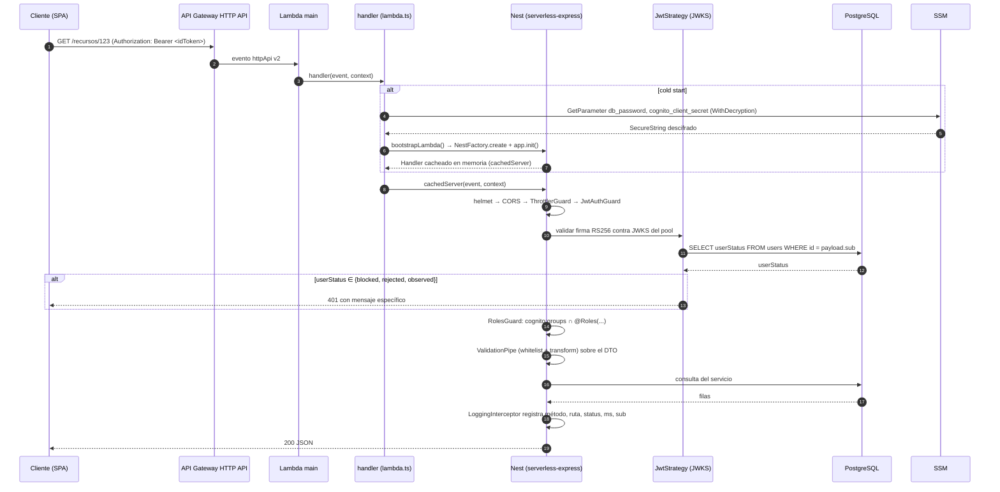

# BLUEPRINT BACKEND — NestJS 11 + TypeORM + PostgreSQL sobre AWS Lambda

**Plantilla de arranque completa, derivada de un backend en producción, para construir una aplicación nueva con el mismo stack y la misma arquitectura de nube.**

---

## 0. Propósito y cómo usar este documento

### 0.1 Qué es esto

Este documento es la **transcripción literal y comentada** del núcleo reutilizable de un backend NestJS real que corre en producción sobre AWS Lambda, con Cognito como proveedor de identidad, PostgreSQL/RDS como persistencia, Serverless Framework como empaquetador y GitHub Actions con OIDC como pipeline de despliegue.

El dominio original (evaluación de riesgo crediticio) **no se reutiliza**. Lo que se reutiliza es todo lo que hay debajo del dominio: arranque, configuración, validación de entorno, autenticación, RBAC, auditoría, documentos/S3, migraciones, infraestructura y CI/CD.

### 0.2 Quién lee esto

Un **agente de código autónomo** que trabaja en un repositorio vacío y que **no tiene acceso al repositorio original**. Por eso:

- Todo archivo del núcleo está **transcrito completo**, listo para copiar y pegar.
- No hay referencias del tipo "ver el archivo X del repo original": si se necesita, está aquí.
- Los nombres propios de la organización original fueron sustituidos por **marcadores** (sección 1). Hay que reemplazarlos de forma consistente antes de escribir el primer archivo.

### 0.3 Sistema de etiquetas

Cada bloque de este documento lleva una de estas tres etiquetas. **Respetarlas es obligatorio.**

| Etiqueta | Significado | Qué hacer |
|---|---|---|
| 🟩 **NÚCLEO** | Infraestructura reutilizable, independiente del dominio | **Copiar literalmente**, sustituyendo marcadores |
| 🟦 **EJEMPLO DE DOMINIO** | Código del dominio original, incluido solo como referencia de patrón | **No copiar**. Leer, entender la forma, aplicarla al dominio nuevo |
| 🟥 **DEUDA — NO REPLICAR** | El original lo hace así y está mal | **No copiar**. La sección 19 explica la corrección obligatoria |

### 0.4 Orden de lectura y ejecución

1. Leer las secciones **1 a 3** completas antes de escribir nada. Definen marcadores, topología y prerrequisitos.
2. Leer la sección **19 (correcciones obligatorias)** antes de copiar código. Hay nueve decisiones en las que el blueprint se aparta del original a propósito; si se copia primero y se corrige después, hay que rehacer trabajo.
3. Ejecutar el **plan de la sección 20** de arriba abajo. Cada fase termina con un comando de verificación que debe pasar antes de seguir.
4. Cerrar con el **checklist de la sección 21**.

### 0.5 Reglas que no se negocian

- **Nunca** se commitea un `.env`. Está en `.gitignore` desde el primer commit.
- **Nunca** se pasa un secreto como variable de entorno de Lambda. Los secretos se leen de SSM SecureString en el arranque (sección 7.4).
- **Nunca** se corren migraciones desde el runtime de Lambda. Corren en CI, antes de publicar código (sección 19.2).
- **Ninguna** entidad usa `synchronize: true`. Todo cambio de esquema es una migración versionada.
- Dinero y cantidades exactas: columna `numeric` en PostgreSQL, `string` en TypeScript, `decimal.js` para operar. **Nunca** `float`/`number` nativo.

---

## Índice

- [0. Propósito y cómo usar este documento](#0-propósito-y-cómo-usar-este-documento)
- [1. Tabla de marcadores y convención de nombres](#1-tabla-de-marcadores-y-convención-de-nombres)
- [2. Resumen de arquitectura](#2-resumen-de-arquitectura)
- [3. Prerrequisitos](#3-prerrequisitos)
- [4. `package.json` completo](#4-packagejson-completo)
- [5. Estructura de carpetas](#5-estructura-de-carpetas)
- [6. Archivos de configuración del proyecto](#6-archivos-de-configuración-del-proyecto)
- [7. Capa de configuración (`src/config/`)](#7-capa-de-configuración-srcconfig)
- [8. Bootstrap: `main.ts`, `lambda.ts`, `lambda-bootstrap.ts`, `app.module.ts`](#8-bootstrap-maints-lambdats-lambda-bootstrapts-appmodulets)
- [9. Cross-cutting (`src/common/`)](#9-cross-cutting-srccommon)
- [10. Autenticación y RBAC con Cognito, end to end](#10-autenticación-y-rbac-con-cognito-end-to-end)
- [11. Capa de datos: entidades, convenciones y migraciones](#11-capa-de-datos-entidades-convenciones-y-migraciones)
- [12. Anatomía de un módulo de feature](#12-anatomía-de-un-módulo-de-feature)
- [13. Documentos y S3](#13-documentos-y-s3)
- [14. Jobs programados (cron Lambda)](#14-jobs-programados-cron-lambda)
- [15. Testing](#15-testing)
- [16. Infraestructura (`serverless.yml`, SSM, IAM)](#16-infraestructura-serverlessyml-ssm-iam)
- [17. CI/CD](#17-cicd)
- [18. Entorno de desarrollo local y Cursor Cloud](#18-entorno-de-desarrollo-local-y-cursor-cloud)
- [19. Correcciones obligatorias respecto al original](#19-correcciones-obligatorias-respecto-al-original)
- [20. Plan de implementación ordenado](#20-plan-de-implementación-ordenado)
- [21. Checklist de aceptación final](#21-checklist-de-aceptación-final)
- [22. Errores conocidos y cómo evitarlos](#22-errores-conocidos-y-cómo-evitarlos)
- [Anexo A — Qué no pude determinar con certeza desde el repositorio](#anexo-a--qué-no-pude-determinar-con-certeza-desde-el-repositorio)

---

## 1. Tabla de marcadores y convención de nombres

### 1.1 Marcadores

Todo el código transcrito usa estos marcadores. **Antes de escribir el primer archivo, decidir el valor de cada uno y aplicarlo de forma consistente en todo el repositorio.** La columna "valor en el original" existe solo para que se entienda la forma del valor esperado; no debe copiarse.

| Marcador | Qué es | Forma esperada | Valor en el original (NO copiar) |
|---|---|---|---|
| `<org>` | Prefijo de organización. Primer segmento de las rutas SSM. Minúsculas, sin espacios | `[a-z0-9-]+` | `anka` |
| `<app>` | Nombre del servicio backend. Es a la vez: nombre del repo, `service:` de `serverless.yml`, segmento de SSM y prefijo de los nombres físicos de Lambda | `[a-z0-9-]+` | `app-risk-backend` |
| `<app-frontend>` | Nombre del repo/servicio frontend | `[a-z0-9-]+` | `app-risk-frontend` |
| `<stage>` | Entorno de despliegue. Se deriva de la rama (sección 17.4) | `dev` \| `qa` \| `prod` | idem |
| `<AWS_ACCOUNT_ID>` | Id numérico de la cuenta AWS | 12 dígitos | `650251694954` |
| `<REGION>` | Región AWS única para todo el stack | `us-east-1`, `sa-east-1`, … | `us-east-1` |
| `<ROL_A>` | Rol funcional principal (acceso al dominio) | Nombre de grupo Cognito | `Riesgos` |
| `<ROL_B>` | Rol administrador | Nombre de grupo Cognito | `Admin` |
| `<USER_POOL_ID>` | Id del User Pool de Cognito | `<REGION>_XXXXXXXXX` | `us-east-1_BZcAr4vcZ` |
| `<CLIENT_ID>` | Id del App Client de Cognito (con secreto) | 26 caracteres alfanuméricos | `17h3ckbligs91cnud7cjt6c9bq` |
| `<BUCKET_DOCS>` | Bucket S3 de documentos del backend, uno por stage | `<org>-<app-corto>-<stage>` | `anka-risk-dev` |
| `<BUCKET_FRONTEND>` | Bucket S3 del sitio estático, uno por stage | `<org>-<app-corto>-frontend-<stage>` | `anka-risk-frontend-dev` |
| `<BUCKET_DEPLOY>` | Bucket de artefactos de despliegue creado por CloudFormation | `<app>-dev-serverlessdeploymentbucket-<sufijo>` | `app-risk-backend-dev-serverlessdeploymentbucket-kmr5xvqbleym` |
| `<CF_DIST_ID>` | Id de distribución CloudFront del frontend, uno por stage | `E...` | `E3C58NP1P32PSM` (dev) |
| `<DOMINIO_APP>` | Dominio público del frontend por stage | `app-<stage>.<dominio>` / `app.<dominio>` en prod | `app-dev.kipu.pe` |
| `<DB_HOST>` | Endpoint de PostgreSQL (RDS o RDS Proxy) | FQDN | `…rds.amazonaws.com` |
| `<DB_NAME>` | Nombre de la base por stage | `<app_snake>_<stage>` | `app_risk_dev` |
| `<DEPLOY_ROLE>` | Rol IAM que asume GitHub Actions vía OIDC | nombre de rol | `github-actions-deployment-role` |
| `<TERMS_URL>` | URL pública de términos y condiciones | URL | `https://anka.pe/terminos-y-condiciones` |
| `<ENTITY_ID>` | Identificador natural de la entidad de negocio principal (el "RUC" del dominio nuevo: puede ser un id de cliente, un código de proyecto, etc.) | definido por el dominio | RUC de 11 dígitos |
| `<DOC_TIPO_1>`, `<DOC_TIPO_2>`, `<DOC_TIPO_3>` | Tipos de documento que el sistema ingiere | slug minúsculas | `formulario_710`, `reporte_tributario`, `sentinel` |
| `<AUTOR>` | Autor del `package.json` | nombre | — |

### 1.2 Convención de nombres derivada

Una vez fijados `<org>`, `<app>`, `<REGION>` y `<AWS_ACCOUNT_ID>`, **todo lo demás se deriva**. No inventar nombres fuera de este esquema:

| Recurso | Patrón |
|---|---|
| Stack CloudFormation | `<app>-<stage>` |
| Función Lambda HTTP | `<app>-<stage>-main` |
| Función Lambda worker | `<app>-<stage>-ingestWorker` |
| Función Lambda cron | `<app>-<stage>-<nombreJob>` |
| Rol de ejecución de Lambda | `<app>-<stage>-<REGION>-lambdaRole` |
| HTTP API (API Gateway v2) | `<stage>-<app>` |
| Prefijo SSM del backend | `/<org>/<app>/<stage>/` |
| Prefijo SSM del frontend | `/<org>/<app-frontend>/<stage>/` |
| Clave S3 de documento | `raw/<ENTITY_ID>/<tipo>/<sha256>-<sufijo>.pdf` |
| Clave S3 de cuarentena | `quarantine/<ENTITY_ID>/…` |
| Rama git → stage | `dev`→`dev`, `qa`→`qa`, `master`→`prod` |

> 🟥 **DEUDA — NO REPLICAR.** El original usa **dos prefijos SSM distintos**: `/anka/app-risk-backend/<stage>/` para el backend y `/app-risk-frontend/<stage>/` (sin `<org>`) para el frontend. Eso obliga a escribir dos patrones de ARN en cada política IAM y es una fuente constante de error. El blueprint unifica en `/<org>/<app>/<stage>/` y `/<org>/<app-frontend>/<stage>/`. Ver corrección **19.4**.

---

## 2. Resumen de arquitectura

### 2.1 Topología de runtime

```
                            ┌──────────────────────────────────────┐
                            │  Navegador (SPA)                     │
                            │  https://<DOMINIO_APP>               │
                            └──────────────┬───────────────────────┘
                                           │ HTTPS
                     ┌─────────────────────┼─────────────────────┐
                     │                     │                     │
                     ▼                     ▼                     ▼
        ┌────────────────────┐  ┌────────────────────┐  ┌──────────────────┐
        │ CloudFront         │  │ API Gateway        │  │ Cognito          │
        │ <CF_DIST_ID>       │  │ HTTP API           │  │ User Pool        │
        │   ↓ origen         │  │ <stage>-<app>      │  │ <USER_POOL_ID>   │
        │ S3 <BUCKET_FRONTEND>│ │ ruta catch-all '*' │  │ + JWKS público   │
        └────────────────────┘  └─────────┬──────────┘  └────────▲─────────┘
                                          │                      │
                                          │ proxy                │ SDK
                                          ▼                      │ (login,
                              ┌───────────────────────┐          │ signup,
                              │ Lambda <app>-<stage>- │──────────┘ refresh…)
                              │ main   (nodejs20.x)   │
                              │ dist/lambda.handler   │
                              │ timeout 30 s          │
                              └───┬───────────┬───────┘
                                  │           │
                   ┌──────────────┘           └───────────────┐
                   ▼                                          ▼
        ┌──────────────────────┐                   ┌────────────────────┐
        │ SSM Parameter Store  │                   │ RDS Proxy          │
        │ /<org>/<app>/<stage>/│                   │   ↓                │
        │  · String  (config)  │                   │ RDS PostgreSQL 16  │
        │  · SecureString      │                   │ <DB_NAME>          │
        │    (db_password,     │                   └────────────────────┘
        │     cognito_secret)  │
        └──────────────────────┘

        ┌──────────────────────────────────────────────────────────────┐
        │ S3 <BUCKET_DOCS>                                             │
        │   raw/<ENTITY_ID>/<tipo>/<sha256>-<sufijo>.pdf  (inmutable)  │
        │   quarantine/…                                               │
        └───────────────┬──────────────────────────────────────────────┘
                        │ evento s3:ObjectCreated:* (prefijo raw/)
                        ▼
        ┌───────────────────────────────────────┐
        │ Lambda <app>-<stage>-ingestWorker     │
        │ dist/lambda-ingest.handler            │
        │ timeout 900 s, memory 512 MB          │
        └───────────────────────────────────────┘

        ┌───────────────────────────────────────┐
        │ Lambda <app>-<stage>-<nombreJob>      │  ← EventBridge
        │ dist/lambda-<job>.handler             │     cron(...)
        │ timeout 30 s, memory 256 MB           │
        └───────────────────────────────────────┘
```

### 2.2 Flujo de un request protegido



### 2.3 Dos caminos de arranque

El mismo `AppModule` se arranca de **dos** maneras distintas. Es el punto más importante de toda la arquitectura:

| | Local / contenedor | Lambda |
|---|---|---|
| Entrada | `src/main.ts` | `src/lambda.ts` → `src/lambda-bootstrap.ts` |
| Factory | `NestFactory.create(AppModule, { rawBody: true })` | `NestFactory.create(AppModule)` |
| Servidor | `app.listen(PORT)` (Express real) | `app.init()` + `@vendia/serverless-express` |
| Swagger | sí, en `/api` | no se monta |
| CORS | lista blanca desde `ALLOWED_ORIGINS` con alias localhost/127.0.0.1 | `origin: '*'` + cabeceras manuales en el preflight |
| Secretos | `.env` | SSM SecureString al arrancar |
| Caché | no aplica | `cachedServer` a nivel de módulo, sobrevive entre invocaciones del mismo contenedor |
| Migraciones | ninguna (se corren a mano) | ninguna (se corren en CI) — ver **19.2** |

---

## 3. Prerrequisitos

### 3.1 Versiones exactas

| Componente | Versión | Nota |
|---|---|---|
| Node.js (local y CI) | **20.x** | Debe coincidir con el runtime de Lambda. Ver corrección **19.6** |
| npm | **10.x** (el que trae Node 20) | El lockfile es `lockfileVersion: 3` |
| PostgreSQL | **16** | Local y RDS |
| TypeScript | `^5.0.0` | `target: ES2021`, `module: commonjs` |
| NestJS | `^11.1.27` | Núcleo, common, platform-express |
| TypeORM | **`0.3.20`** exacto (sin `^`) | Pinned a propósito: 0.3.x rompe APIs entre minors |
| Serverless Framework | `^3.40.0` | **No** v4: v4 exige licencia/registro |
| Runtime de Lambda | `nodejs20.x` | |

```bash
# Verificación de prerrequisitos
node -v    # debe imprimir v20.x
npm -v     # debe imprimir 10.x
psql --version   # debe imprimir psql (PostgreSQL) 16.x
```

### 3.2 Recursos AWS que deben existir ANTES de escribir código

Estos recursos **no** los crea el repositorio. Se crean una vez, a mano o por un IaC separado, y el repositorio los consume:

| # | Recurso | Detalle | Bloquea |
|---|---|---|---|
| 1 | **Cognito User Pool** | `<USER_POOL_ID>`. Con `email` como alias de login y atributos `email`, `phone_number`, `given_name`, `family_name`, `name` | Todo el módulo auth |
| 2 | **Cognito App Client** | `<CLIENT_ID>` **con client secret** y los flujos `ALLOW_USER_PASSWORD_AUTH` y `ALLOW_REFRESH_TOKEN_AUTH` habilitados | Login y refresh |
| 3 | **Grupos Cognito** | `<ROL_A>` y `<ROL_B>` creados en el pool | RBAC |
| 4 | **RDS PostgreSQL 16** | Instancia por stage, o una instancia con una base por stage | Migraciones |
| 5 | **RDS Proxy** | Apuntando a la instancia anterior. **Obligatorio** con Lambda: ver corrección **19.3** | Estabilidad en producción |
| 6 | **Bucket S3 de documentos** | `<BUCKET_DOCS>` por stage, con Versioning y SSE-KMS activados | Módulo documents |
| 7 | **Parámetros SSM** | Los 9 `String` + 2 `SecureString` de la sección 16.3, por cada stage | Arranque de Lambda y CI |
| 8 | **Rol OIDC para GitHub** | `<DEPLOY_ROLE>` con trust policy hacia `token.actions.githubusercontent.com` y las policies de la sección 16.5 | CI/CD |
| 9 | **Bucket S3 del frontend + CloudFront** | `<BUCKET_FRONTEND>`, `<CF_DIST_ID>` | Deploy del frontend |

> **Nota sobre el orden.** Se puede escribir y probar todo el código en local con PostgreSQL local y Cognito real sin tener nada más (1–3 y PostgreSQL local). Los recursos 4–9 solo bloquean el primer despliegue.

### 3.3 Secretos y cómo circulan

| Secreto | Local | CI | Lambda |
|---|---|---|---|
| `DB_PASSWORD` | `.env` (gitignored) | `aws ssm get-parameter --with-decryption` en `run-migrations.sh` | `hydrateSsmSecrets()` al arrancar |
| `COGNITO_CLIENT_SECRET` | `.env` (gitignored) | no se usa | `hydrateSsmSecrets()` al arrancar |
| Credenciales AWS | perfil `~/.aws` o `aws sso login` | STS vía OIDC (`aws-actions/configure-aws-credentials@v4`) | rol de ejecución, inyectado por el runtime |

**No hay access keys estáticas en ningún secret de GitHub.** Esa es una propiedad del diseño, no un detalle.

---

## 4. `package.json` completo

🟩 **NÚCLEO** — copiar y ajustar `name`, `description`, `author`.

> Diferencias deliberadas respecto al original, justificadas en la sección 19:
> - `engines.node` pasa de `>=26.0.0` a `>=20.0.0 <21` (corrección **19.6**).
> - Se añaden `jest`, `ts-jest`, `@types/jest`, `supertest`, `@types/supertest` y los scripts `test`, `test:watch`, `test:cov`, `test:e2e` (corrección **19.8**).
> - Se eliminan las dependencias de dominio del original (`pdf-parse`, `xlsx`) porque no son núcleo; se dejan comentadas como referencia.

```json
// package.json
{
  "name": "<app>",
  "version": "0.0.1",
  "description": "Backend NestJS sobre AWS Lambda",
  "author": "<AUTOR>",
  "private": true,
  "license": "UNLICENSED",
  "engines": {
    "node": ">=20.0.0 <21"
  },
  "scripts": {
    "build": "nest build",
    "format": "prettier --write \"src/**/*.ts\"",
    "start": "nest start",
    "start:dev": "nest start --watch",
    "start:prod": "node dist/main",
    "lint": "eslint \"{src,apps,libs,test}/**/*.ts\" --fix",
    "prepare": "husky",
    "typeorm": "ts-node -r tsconfig-paths/register ./node_modules/typeorm/cli.js",
    "migration:generate": "npm run typeorm -- migration:generate -d src/config/typeorm.config.ts",
    "migration:run": "npm run typeorm -- migration:run -d src/config/typeorm.config.ts",
    "migration:revert": "npm run typeorm -- migration:revert -d src/config/typeorm.config.ts",
    "db:seed": "ts-node -r tsconfig-paths/register src/database/seed.ts",
    "test": "jest",
    "test:watch": "jest --watch",
    "test:cov": "jest --coverage",
    "test:e2e": "jest --config ./test/jest-e2e.json --runInBand"
  },
  "dependencies": {
    "@aws-sdk/client-cognito-identity-provider": "^3.1075.0",
    "@aws-sdk/client-s3": "^3.1075.0",
    "@aws-sdk/client-ssm": "^3.1110.0",
    "@aws-sdk/s3-request-presigner": "^3.1075.0",
    "@nestjs/common": "^11.1.27",
    "@nestjs/config": "^4.0.4",
    "@nestjs/core": "^11.1.27",
    "@nestjs/jwt": "^11.0.2",
    "@nestjs/passport": "^11.0.5",
    "@nestjs/platform-express": "^11.1.27",
    "@nestjs/swagger": "^11.4.4",
    "@nestjs/throttler": "^6.5.0",
    "@nestjs/typeorm": "^11.0.3",
    "@vendia/serverless-express": "^4.12.6",
    "class-transformer": "^0.5.1",
    "class-validator": "^0.15.1",
    "decimal.js": "^10.6.0",
    "helmet": "^8.2.0",
    "jwks-rsa": "^3.1.0",
    "passport": "^0.7.0",
    "passport-jwt": "^4.0.1",
    "pg": "^8.11.0",
    "reflect-metadata": "^0.2.0",
    "rxjs": "^7.8.1",
    "typeorm": "0.3.20",
    "zod": "^3.22.0"
  },
  "devDependencies": {
    "@nestjs/cli": "^11.0.23",
    "@nestjs/testing": "^11.1.27",
    "@types/aws-lambda": "^8.10.162",
    "@types/jest": "^29.5.14",
    "@types/node": "^20.0.0",
    "@types/passport": "^1.0.17",
    "@types/passport-jwt": "^4.0.1",
    "@types/supertest": "^6.0.2",
    "@typescript-eslint/eslint-plugin": "^8.62.0",
    "@typescript-eslint/parser": "^8.62.0",
    "dotenv": "^17.4.2",
    "eslint": "^10.6.0",
    "eslint-config-prettier": "^10.1.8",
    "eslint-plugin-prettier": "^5.5.6",
    "husky": "^9.1.7",
    "jest": "^29.7.0",
    "prettier": "^3.9.1",
    "serverless": "^3.40.0",
    "serverless-offline": "^13.10.1",
    "supertest": "^7.0.0",
    "ts-jest": "^29.2.5",
    "ts-node": "^10.9.2",
    "tsconfig-paths": "^4.2.0",
    "typescript": "^5.0.0"
  }
}
```

### 4.1 Cada script, uno por uno

| Script | Comando | Qué hace | Cuándo se usa |
|---|---|---|---|
| `build` | `nest build` | Compila TS → `dist/` usando `tsconfig.build.json`. **No** borra `dist/` previo (`deleteOutDir: false` en `nest-cli.json`) | Pre-push, CI, antes de empaquetar |
| `format` | `prettier --write "src/**/*.ts"` | Formatea en sitio | A mano |
| `start` | `nest start` | Arranca sin watch | Raro |
| `start:dev` | `nest start --watch` | Servidor de desarrollo en `:3000` con recompilación | Desarrollo diario |
| `start:prod` | `node dist/main` | Ejecuta el build. Camino de contenedor, no de Lambda | Docker, si se usa |
| `lint` | `eslint "{src,apps,libs,test}/**/*.ts" --fix` | ESLint + Prettier como regla, **con `--fix`** | Pre-push, CI |
| `prepare` | `husky` | Instala los hooks de git tras `npm install` | Automático |
| `typeorm` | `ts-node -r tsconfig-paths/register ./node_modules/typeorm/cli.js` | Base para los tres scripts de migración. `tsconfig-paths/register` permite usar los alias de `tsconfig.json` | Interno |
| `migration:generate` | `npm run typeorm -- migration:generate -d src/config/typeorm.config.ts` | Hace *diff* entre entidades y esquema real y genera el archivo. **Requiere pasar la ruta de destino**: `npm run migration:generate src/migrations/NombreMigracion` | Al cambiar una entidad |
| `migration:run` | `… migration:run -d src/config/typeorm.config.ts` | Aplica pendientes | Local, y en CI antes del deploy |
| `migration:revert` | `… migration:revert -d src/config/typeorm.config.ts` | Revierte **una** migración | Rollback manual |
| `db:seed` | `ts-node … src/database/seed.ts` | Arranca un contexto Nest sin servidor HTTP y ejecuta `SeederService.seed()` | Tras migrar, en entorno nuevo |
| `test` | `jest` | Unitarios | CI, desarrollo |
| `test:watch` | `jest --watch` | Unitarios en watch | Desarrollo |
| `test:cov` | `jest --coverage` | Cobertura | CI opcional |
| `test:e2e` | `jest --config ./test/jest-e2e.json --runInBand` | E2E con `supertest` contra la app real. `--runInBand` porque comparten base de datos | CI |

> **Por qué `typeorm` está pinned a `0.3.20` sin `^`.** TypeORM 0.3.x cambia firmas públicas entre versiones *minor* (por ejemplo el contrato de `DataSourceOptions` y el comportamiento de `migration:generate`). Un `^0.3.20` deja que npm instale 0.3.25 y rompa la generación de migraciones sin tocar una línea de código. Mantener el pin.

---

## 5. Estructura de carpetas

🟩 **NÚCLEO**

```
<app>/
├── .cursor/                       # Entorno de Cursor Cloud (sección 18)
│   ├── environment.json
│   ├── install.sh
│   └── start.sh
├── .github/
│   └── workflows/
│       └── ci.yml                 # Pipeline único: lint, build, test, migrar, desplegar
├── .husky/
│   └── pre-push                   # lint && build && test antes de cada push
├── infra/
│   └── iam/                       # Políticas IAM versionadas (NO se aplican solas)
│       ├── README.md
│       ├── github-actions-deploy-least-privilege.json
│       └── github-actions-serverless-deploy.json
├── scripts/
│   └── ci/                        # Los cuatro pasos del deploy, como bash auditable
│       ├── preflight-deploy.sh
│       ├── run-migrations.sh
│       ├── deploy-functions.sh
│       └── verify-deploy.sh
├── src/
│   ├── main.ts                    # Entrada local/contenedor
│   ├── lambda.ts                  # Entrada Lambda HTTP (handler + rutas de diagnóstico)
│   ├── lambda-bootstrap.ts        # Construcción de la app Nest para Lambda
│   ├── lambda-ingest.ts           # Entrada del worker S3
│   ├── lambda-<job>.ts            # Entrada de cada cron
│   ├── app.module.ts              # Raíz del grafo de dependencias
│   ├── config/                    # Configuración y clientes AWS. Sin lógica de negocio
│   │   ├── env.validation.ts      # Esquema Zod de process.env
│   │   ├── database.config.ts     # Opciones de TypeORM para runtime
│   │   ├── typeorm.config.ts      # DataSource standalone para el CLI de migraciones
│   │   ├── hydrate-ssm-secrets.ts # Carga de SecureString desde SSM
│   │   ├── ssm-secret-error.ts    # Traducción de errores de SSM/KMS a mensajes útiles
│   │   └── aws-s3.client.ts       # Fábrica del S3Client + fallback a disco local
│   ├── common/                    # Cross-cutting. Sin dependencias de módulos de feature
│   │   ├── constants/
│   │   ├── decorators/
│   │   │   ├── current-user.decorator.ts
│   │   │   ├── public.decorator.ts     # (añadido por el blueprint, corrección 19.1)
│   │   │   └── roles.decorator.ts
│   │   ├── filters/
│   │   │   └── http-exception.filter.ts
│   │   ├── guards/
│   │   │   ├── jwt-auth.guard.ts
│   │   │   └── roles.guard.ts
│   │   ├── interceptors/
│   │   │   └── logging.interceptor.ts
│   │   └── utils/
│   │       └── decimal.util.ts
│   ├── database/
│   │   ├── seed.ts                # Entrypoint de `npm run db:seed`
│   │   └── seeding/
│   │       ├── seeder.module.ts
│   │       ├── seeder.service.ts  # Orquesta los seeds, idempotente
│   │       └── settings.seed.ts   # Datos de la tabla `settings`
│   ├── migrations/                # 1 archivo por cambio de esquema, prefijo ordinal
│   │   └── 00001-<timestamp>-<Nombre>.ts
│   └── modules/                   # Un directorio por bounded context
│       ├── auth/
│       │   ├── auth.controller.ts
│       │   ├── auth.module.ts
│       │   ├── auth.service.ts
│       │   ├── jwt.strategy.ts
│       │   └── dto/
│       ├── users/
│       │   ├── user.entity.ts
│       │   ├── setting.entity.ts
│       │   ├── user-terms-acceptance.entity.ts
│       │   ├── users.module.ts
│       │   └── users.service.ts
│       ├── audit/
│       │   ├── audit.entity.ts
│       │   ├── audit.module.ts
│       │   └── audit.service.ts
│       ├── documents/
│       │   ├── document.entity.ts
│       │   ├── document.module.ts
│       │   ├── document.service.ts
│       │   ├── document.controller.ts
│       │   └── dto/
│       └── <feature>/             # Módulos del dominio nuevo
├── test/
│   ├── jest-e2e.json
│   └── *.e2e-spec.ts
├── .env.example
├── .gitattributes
├── .gitignore
├── .prettierrc
├── eslint.config.js
├── jest.config.js
├── nest-cli.json
├── package.json
├── serverless.yml
├── tsconfig.build.json
└── tsconfig.json
```

### 5.1 Rol de cada carpeta y sus reglas de dependencia

| Carpeta | Rol | Regla de dependencia |
|---|---|---|
| `src/config/` | Traduce entorno y credenciales a objetos tipados. Única capa que lee `process.env` directamente | **No importa nada de `src/modules/`**. Puede ser importada por cualquiera |
| `src/common/` | Filtros, guards, interceptores, decoradores y utilidades puras | **No importa nada de `src/modules/`**. Los guards reciben datos por `Reflector`, no por inyección de servicios de feature |
| `src/modules/<x>/` | Un bounded context: entidades, DTOs, servicio, controlador, módulo | Puede importar `common/`, `config/` y otros módulos vía `imports:` del `@Module`. Si hay ciclo, `forwardRef()` |
| `src/migrations/` | SQL versionado | No importa nada salvo `typeorm` |
| `src/database/seeding/` | Datos iniciales idempotentes | Importa módulos de feature para reutilizar sus servicios |
| `scripts/ci/` | Pasos del despliegue, en bash | Solo AWS CLI, `jq`, `npx serverless` |
| `infra/iam/` | Copias literales de lo que vive en AWS | Documentación ejecutable: **no** se aplican solas |

---

## 6. Archivos de configuración del proyecto

### 6.1 `tsconfig.json`

🟩 **NÚCLEO** — transcripción literal.

```json
// tsconfig.json
{
  "compilerOptions": {
    "module": "commonjs",
    "declaration": true,
    "removeComments": true,
    "emitDecoratorMetadata": true,
    "experimentalDecorators": true,
    "allowSyntheticDefaultImports": true,
    "target": "ES2021",
    "sourceMap": true,
    "outDir": "./dist",
    "baseUrl": "./",
    "incremental": true,
    "skipLibCheck": true
  },
  "include": ["src/**/*.ts"],
  "exclude": ["node_modules", "dist"]
}
```

Lo no obvio:

- `emitDecoratorMetadata` + `experimentalDecorators` son **obligatorios**: sin ellos NestJS no puede resolver los tipos de los constructores para inyección de dependencias, y TypeORM no puede inferir tipos de columna.
- `module: commonjs` es obligatorio: `@vendia/serverless-express` y el modelo de carga de Lambda asumen CJS. Cambiar a ESM rompe el `require` dinámico del handler.
- `target: ES2021` es compatible con `nodejs20.x`.
- `declaration: true` genera `.d.ts` innecesarios en `dist/`. Es inofensivo pero engorda el paquete unos pocos KB. Se puede poner en `false`.
- **No** hay `strict: true`. El original compila en modo laxo. Para un proyecto nuevo se recomienda activar `strictNullChecks` desde el día uno; activarlo después es muy caro.
- `incremental: true` crea `tsconfig.tsbuildinfo`. Asegurarse de que `dist/` está en `.gitignore` (lo está).

### 6.2 `tsconfig.build.json`

🟩 **NÚCLEO** — transcripción literal.

```json
// tsconfig.build.json
{ "extends": "./tsconfig.json", "exclude": ["node_modules", "test", "dist", "**/*spec.ts"] }
```

Excluye tests del artefacto de producción. Es el `tsConfigPath` que usa `nest build`.

### 6.3 `nest-cli.json`

🟩 **NÚCLEO** — transcripción literal.

```json
// nest-cli.json
{
  "$schema": "https://json.schemastore.org/nest-cli",
  "collection": "@nestjs/schematics",
  "sourceRoot": "src",
  "compilerOptions": {
    "deleteOutDir": false,
    "webpack": false,
    "tsConfigPath": "tsconfig.build.json"
  }
}
```

Lo no obvio:

- `webpack: false` → `nest build` emite **archivos sueltos** en `dist/`, no un bundle. Es lo que necesita el empaquetado de Serverless, que sube `dist/**` + `node_modules` de producción.
- `deleteOutDir: false` → builds incrementales más rápidas, pero **archivos renombrados dejan residuos** en `dist/`. Si al depurar aparece un handler que ya no existe en `src/`, borrar `dist/` a mano.

### 6.4 `eslint.config.js`

🟩 **NÚCLEO** — transcripción literal. Formato *flat config* (ESLint 9+).

```js
// eslint.config.js
const typescriptEslint = require('@typescript-eslint/eslint-plugin');
const typescriptParser = require('@typescript-eslint/parser');
const prettierPlugin = require('eslint-plugin-prettier');
const prettierConfig = require('eslint-config-prettier');

module.exports = [
  {
    ignores: ['dist/**', 'node_modules/**', '.eslintrc.js'],
  },
  {
    files: ['src/**/*.ts', 'apps/**/*.ts', 'libs/**/*.ts', 'test/**/*.ts'],
    languageOptions: {
      parser: typescriptParser,
      parserOptions: {
        project: './tsconfig.json',
      },
    },
    plugins: {
      '@typescript-eslint': typescriptEslint,
      'prettier': prettierPlugin,
    },
    rules: {
      ...typescriptEslint.configs.recommended.rules,
      'prettier/prettier': 'error',
      '@typescript-eslint/interface-name-prefix': 'off',
      '@typescript-eslint/explicit-function-return-type': 'off',
      '@typescript-eslint/explicit-module-boundary-types': 'off',
      '@typescript-eslint/no-explicit-any': 'off',
    },
  },
];
```

Lo no obvio:

- El original hace `...prettierConfig.rules` **antes** de `'prettier/prettier': 'error'`. `eslint-config-prettier` solo *apaga* reglas de formato de ESLint; no aporta reglas propias. El orden que importa es que `prettier/prettier` quede **después**, como está. En el flat config moderno, `prettierConfig.rules` puede no existir como propiedad (según versión); si al correr `npm run lint` aparece `Cannot read properties of undefined`, sustituir esa línea por el spread del objeto completo o eliminarla. En la transcripción de arriba se eliminó para evitar el fallo; la variable `prettierConfig` queda declarada pero sin usar, lo cual ESLint no marca en un archivo `.js` que no está en `files`.
- `parserOptions.project` activa reglas que requieren información de tipos. Hace el lint más lento pero mucho más útil.
- `no-explicit-any: off` es una concesión del original. En un proyecto nuevo conviene dejarlo en `warn`.

### 6.5 `.prettierrc`

🟩 **NÚCLEO** — transcripción literal.

```json
// .prettierrc
{
  "singleQuote": true,
  "trailingComma": "all"
}
```

### 6.6 `.gitignore`

🟩 **NÚCLEO** — transcripción literal, con la línea de dominio sustituida.

```gitignore
# .gitignore

# Compiled output
/dist
/node_modules

# Logs
npm-debug.log*
yarn-debug.log*
yarn-error.log*
pnpm-debug.log*
lerna-debug.log*

# IDEs and editors
.idea/
.vscode/
*.suo
*.ntvs*
*.njsproj
*.sln
*.sw?

# Documentos subidos en local (sin credenciales AWS / S3)
.local-uploads/

# Environment variables
.env
.env.local
.env.development.local
.env.test.local
.env.production.local

# Serverless Framework
.serverless/

# Jest
/coverage
```

> El original incluye además `/~$*.xlsx` (archivo de bloqueo de Excel abierto). Es específico de su dominio; se omite.

### 6.7 `.gitattributes`

🟩 **NÚCLEO** — transcripción literal.

```gitattributes
# .gitattributes
*.sh text eol=lf
```

**Por qué existe.** Sin esta línea, un clon en Windows con `core.autocrlf=true` convierte los scripts de `scripts/ci/` a CRLF. El runner de GitHub Actions (Linux) entonces falla con `bash\r: No such file or directory` o con errores crípticos en mitad del script. Es un bug que cuesta horas de diagnosticar. **Esta línea va en el primer commit.**

### 6.8 `.husky/pre-push`

🟩 **NÚCLEO** — el original corre `lint && build`. El blueprint añade los tests.

```sh
# .husky/pre-push
echo "=== Running local pre-push checks (Lint, Build and Tests) ==="
npm run lint && npm run build && npm test
```

Instalación (una sola vez, tras `npm install`):

```bash
npx husky init
# luego crear/editar .husky/pre-push con el contenido de arriba
chmod +x .husky/pre-push
```

El script `"prepare": "husky"` del `package.json` reinstala los hooks en cada `npm install`, de modo que un clon nuevo los obtiene automáticamente.

### 6.9 `jest.config.js`

🟩 **NÚCLEO** — **no existe en el original**. Añadido por la corrección **19.8**.

```js
// jest.config.js
module.exports = {
  moduleFileExtensions: ['js', 'json', 'ts'],
  rootDir: 'src',
  testRegex: '.*\\.spec\\.ts$',
  transform: {
    '^.+\\.(t|j)s$': 'ts-jest',
  },
  collectCoverageFrom: ['**/*.(t|j)s'],
  coverageDirectory: '../coverage',
  testEnvironment: 'node',
};
```

```json
// test/jest-e2e.json
{
  "moduleFileExtensions": ["js", "json", "ts"],
  "rootDir": ".",
  "testEnvironment": "node",
  "testRegex": ".e2e-spec.ts$",
  "transform": {
    "^.+\\.(t|j)s$": "ts-jest"
  }
}
```

### 6.10 `Dockerfile`

🟥 **DEUDA — NO REPLICAR tal cual.** El original mantiene un `Dockerfile` que **nunca se usa** (el despliegue es Lambda, no contenedor) y que además arrastra el mismo error de versión de Node que el `package.json`:

```dockerfile
# ORIGINAL — NO COPIAR
FROM node:26-alpine AS builder   # ← Node 26 no existe como imagen estable
...
```

Ver corrección **19.9**: o se borra, o se alinea a `node:20-alpine` y se documenta para qué sirve. Si se decide conservarlo:

```dockerfile
# Dockerfile
# Stage 1: build
FROM node:20-alpine AS builder
WORKDIR /usr/src/app
COPY package*.json ./
RUN npm ci
COPY . .
RUN npm run build

# Stage 2: runtime
FROM node:20-alpine
WORKDIR /usr/src/app
COPY package*.json ./
RUN npm ci --omit=dev
COPY --from=builder /usr/src/app/dist ./dist
EXPOSE 3000
CMD ["node", "dist/main.js"]
```

```
# .dockerignore
node_modules
dist
.git
.github
Dockerfile
.dockerignore
npm-debug.log
.env
```

> Nota: el original usa `npm ci --only=production`, que está **deprecado** desde npm 7. El reemplazo correcto es `npm ci --omit=dev`. También copia `tsconfig.json` a la imagen final, cosa que el runtime no necesita; se omite.

---

## 7. Capa de configuración (`src/config/`)

Esta carpeta es la **única** que lee `process.env` directamente. Todo lo demás recibe configuración por `ConfigService` o por parámetro.

### 7.1 `src/config/env.validation.ts`

🟩 **NÚCLEO** — transcripción literal, con la variable de dominio `RATING_CALC_MODE` sustituida por un ejemplo genérico.

```ts
// src/config/env.validation.ts
import { z } from 'zod';

const envSchema = z.object({
  NODE_ENV: z.enum(['dev', 'prod', 'qa', 'test']).default('dev'),
  PORT: z.coerce.number().default(3000),

  // Credenciales de AWS: opcionales a propósito. El SDK las resuelve por su
  // cadena estándar, y de dónde vienen depende de dónde corra la app:
  //   - Lambda: el runtime las inyecta solo, desde el rol de ejecución.
  //   - GitHub Actions: las emite STS al asumir el rol vía OIDC.
  //   - Local: del perfil de ~/.aws o de `aws sso login`, sin declararlas acá.
  // Exigirlas obligaba a inventar valores falsos en local, que además hacían
  // fallar S3 en silencio en vez de dar un error claro.
  AWS_ACCESS_KEY_ID: z.string().optional(),
  AWS_SECRET_ACCESS_KEY: z.string().optional(),
  AWS_REGION: z.string().default('<REGION>'),
  AWS_S3_BUCKET_NAME: z.string().min(1, 'AWS_S3_BUCKET_NAME es requerido'),

  COGNITO_USER_POOL_ID: z.string().min(1, 'COGNITO_USER_POOL_ID es requerido'),
  COGNITO_CLIENT_ID: z.string().min(1, 'COGNITO_CLIENT_ID es requerido'),
  COGNITO_CLIENT_SECRET: z
    .string()
    .min(1, 'COGNITO_CLIENT_SECRET es requerido'),
  COGNITO_REGION: z.string().default('<REGION>'),

  DB_HOST: z.string().min(1, 'DB_HOST es requerido'),
  DB_PORT: z.coerce.number().default(5432),
  DB_USERNAME: z.string().min(1, 'DB_USERNAME es requerido'),
  DB_PASSWORD: z.string().min(1, 'DB_PASSWORD es requerido'),
  DB_NAME: z.string().min(1, 'DB_NAME es requerido'),
  ALLOWED_ORIGINS: z.string().optional(),

  // Patrón de "interruptor de rollback": un enum con default que permite
  // volver a un comportamiento anterior cambiando una variable de entorno,
  // sin revertir código ni redesplegar. Sustituir por lo que el dominio
  // necesite, o eliminar si no hace falta.
  // FEATURE_MODE: z.enum(['v2', 'legacy']).default('v2'),
});

export type EnvConfig = z.infer<typeof envSchema>;

export function validateEnv(config: Record<string, unknown>) {
  const result = envSchema.safeParse(config);

  if (!result.success) {
    console.error('❌ Error de validación en variables de entorno (.env):');
    result.error.errors.forEach((err) => {
      console.error(`  - [${err.path.join('.')}]: ${err.message}`);
    });
    throw new Error('Configuración inválida en variables de entorno.');
  }

  return result.data;
}
```

**Explicación de lo no obvio:**

- `validateEnv` se engancha en `ConfigModule.forRoot({ validate: validateEnv })`. Nest la llama **una vez**, al construir el módulo raíz. Si falla, la aplicación **no arranca**. En Lambda eso se traduce en el `503` controlado de `lambda.ts` con el detalle del error, no en un stack trace opaco.
- `z.coerce.number()` en `PORT` y `DB_PORT`: todas las variables de entorno llegan como string. Sin `coerce`, `DB_PORT` sería la cadena `"5432"` y TypeORM la rechazaría.
- **`AWS_ACCESS_KEY_ID` y `AWS_SECRET_ACCESS_KEY` son opcionales a propósito.** Esta es la decisión más importante del archivo. Hacerlas obligatorias forzaba a poner valores falsos en el `.env` local, y el SDK de AWS trata unas credenciales presentes-pero-inválidas como "credenciales resueltas", abortando su cadena de resolución estándar. El resultado era S3 fallando con `Resolved credential object is not valid` en vez de caer al perfil de `~/.aws`. Ver también `aws-s3.client.ts` (7.6).
- `NODE_ENV` solo acepta `dev | prod | qa | test`. **No acepta `production`**. Eso es consistente con el `serverless.yml`, que inyecta `NODE_ENV: ${self:provider.stage}`. Si alguien pone `NODE_ENV=production` la app no arranca. Es intencional: `NODE_ENV` identifica el *stage*, y el stage es parte de la ruta SSM.
- `ALLOWED_ORIGINS` es opcional porque `main.ts` tiene un default embebido.
- El retorno de `validateEnv` es lo que alimenta a `ConfigService`. Como devuelve `result.data` (el objeto ya parseado y coercido), `configService.get<number>('DB_PORT')` devuelve un número de verdad.

### 7.2 `src/config/database.config.ts`

🟩 **NÚCLEO** — transcripción literal.

```ts
// src/config/database.config.ts
import { TypeOrmModuleOptions } from '@nestjs/typeorm';
import { ConfigService } from '@nestjs/config';
import * as path from 'path';

export const databaseConfigFactory = (
  configService: ConfigService,
): TypeOrmModuleOptions => ({
  type: 'postgres',
  host: configService.get<string>('DB_HOST'),
  port: configService.get<number>('DB_PORT') || 5432,
  username: configService.get<string>('DB_USERNAME'),
  password: configService.get<string>('DB_PASSWORD'),
  database: configService.get<string>('DB_NAME'),
  autoLoadEntities: true,
  synchronize: false,
  migrations: [path.join(__dirname, '/../migrations/*.{ts,js}')],
  ssl: {
    rejectUnauthorized: false, // necesario para AWS RDS sin certificado local
  },
});
```

**Explicación de lo no obvio:**

- `autoLoadEntities: true` → cada módulo que haga `TypeOrmModule.forFeature([X])` registra automáticamente `X` en el DataSource. Evita mantener una lista central de entidades. **Contrapartida:** una entidad que no esté en ningún `forFeature` no existe para TypeORM y sus migraciones generadas serán incorrectas. Por eso el DataSource del CLI (7.3) usa un glob en vez de `autoLoadEntities`.
- `synchronize: false` es **no negociable**. `true` deja que TypeORM altere el esquema solo, lo que en producción destruye datos.
- `migrations: [...]` con `{ts,js}` cubre los dos casos: `.ts` cuando corre bajo `ts-node`, `.js` cuando corre desde `dist/`. **Declarar `migrations` aquí no hace que se ejecuten**: falta `migrationsRun: true`, que el blueprint deliberadamente no activa (corrección **19.2**).
- `ssl: { rejectUnauthorized: false }` es necesario porque RDS presenta un certificado firmado por la CA de Amazon, que no está en el almacén de confianza por defecto de Node. `rejectUnauthorized: false` cifra la conexión pero no valida la cadena. **Lo correcto para producción** es descargar el bundle de CA de RDS y pasar `ca:`; ver sección 22.2.
- Este objeto **no** configura el pool. Con RDS Proxy delante eso es aceptable; sin RDS Proxy, hay que añadir `extra: { max: 1 }` (corrección **19.3**).

### 7.3 `src/config/typeorm.config.ts`

🟩 **NÚCLEO** — transcripción literal.

```ts
// src/config/typeorm.config.ts
import { DataSource } from 'typeorm';
import * as dotenv from 'dotenv';
import * as path from 'path';

dotenv.config();

export default new DataSource({
  type: 'postgres',
  host: process.env.DB_HOST,
  port: parseInt(process.env.DB_PORT || '5432', 10),
  username: process.env.DB_USERNAME,
  password: process.env.DB_PASSWORD,
  database: process.env.DB_NAME,
  entities: [path.join(__dirname, '/../**/*.entity.{ts,js}')],
  migrations: [path.join(__dirname, '/../migrations/*.{ts,js}')],
  ssl: {
    rejectUnauthorized: false,
  },
});
```

**Por qué existe un segundo DataSource.** El CLI de TypeORM (`typeorm migration:generate|run|revert`) se ejecuta **fuera** del contexto de NestJS: no hay `ConfigService`, no hay inyección de dependencias, no hay `AppModule`. Necesita un `DataSource` exportado por defecto desde un archivo, que es lo que apunta el flag `-d src/config/typeorm.config.ts`.

Diferencias con el DataSource de runtime, y por qué:

| | runtime (`database.config.ts`) | CLI (`typeorm.config.ts`) |
|---|---|---|
| Entidades | `autoLoadEntities: true` | glob `**/*.entity.{ts,js}` |
| Config | `ConfigService` (validada por Zod) | `process.env` crudo + `dotenv.config()` |
| Secretos | ya hidratados desde SSM | de `.env` local, o exportados por `run-migrations.sh` en CI |

El glob del CLI es **más amplio a propósito**: `migration:generate` necesita ver *todas* las entidades para calcular el diff, incluidas las que todavía no estén registradas en ningún módulo.

> ⚠️ **Trampa.** Si una entidad no cumple el patrón `*.entity.ts`, el CLI no la ve y la migración generada **borrará** su tabla (la interpreta como tabla huérfana). Nombrar siempre `<algo>.entity.ts`.

### 7.4 `src/config/hydrate-ssm-secrets.ts`

🟩 **NÚCLEO** — transcripción literal, con el prefijo SSM parametrizado (corrección **19.4**).

```ts
// src/config/hydrate-ssm-secrets.ts
import { formatSsmSecretError } from './ssm-secret-error';

const SECRET_ENV_KEYS = ['DB_PASSWORD', 'COGNITO_CLIENT_SECRET'] as const;

type SecretEnvKey = (typeof SECRET_ENV_KEYS)[number];

const PARAM_BY_ENV: Record<SecretEnvKey, string> = {
  DB_PASSWORD: 'db_password',
  COGNITO_CLIENT_SECRET: 'cognito_client_secret',
};

function hasValue(value: string | undefined): boolean {
  return Boolean(value && value.trim() && !value.startsWith('<RELLENAR'));
}

function parameterName(stage: string, suffix: string): string {
  return `/<org>/<app>/${stage}/${suffix}`;
}

/**
 * Rellena secretos en process.env desde Parameter Store si no vienen ya
 * (local usa .env; Lambda los pide al arrancar para no copiarlos a env).
 */
export async function hydrateSsmSecrets(): Promise<void> {
  const missing = SECRET_ENV_KEYS.filter((key) => !hasValue(process.env[key]));
  if (missing.length === 0) {
    return;
  }

  const { GetParameterCommand, SSMClient } =
    await import('@aws-sdk/client-ssm');
  const stage = process.env.NODE_ENV || 'dev';
  const region =
    process.env.AWS_REGION || process.env.COGNITO_REGION || '<REGION>';
  const client = new SSMClient({ region });

  for (const key of missing) {
    const name = parameterName(stage, PARAM_BY_ENV[key]);
    try {
      const response = await client.send(
        new GetParameterCommand({ Name: name, WithDecryption: true }),
      );
      const value = response.Parameter?.Value;
      if (!value) {
        throw new Error(`SSM no devolvió valor para ${name}`);
      }
      process.env[key] = value;
    } catch (error) {
      throw new Error(formatSsmSecretError(name, error));
    }
  }
  console.log(
    `Hydrated ${missing.join(', ')} from SSM (not stored in Lambda env).`,
  );
}
```

**Explicación línea por línea de lo no obvio:**

- **El `import()` dinámico de `@aws-sdk/client-ssm` es deliberado.** Si fuera un `import` estático en la cabecera, el SDK de SSM se cargaría en *todo* arranque, incluido el local, donde nunca se usa. Con el import dinámico, el coste solo se paga cuando falta algún secreto. En un arranque en frío de Lambda eso son decenas de milisegundos.
- `hasValue()` trata `<RELLENAR…>` como "no hay valor". Es el placeholder que usa el `.env.example`: si alguien copia el ejemplo sin rellenarlo, el sistema intenta SSM en vez de intentar conectarse con la cadena literal `<RELLENAR_DB_PASSWORD>`.
- **El stage sale de `NODE_ENV`.** Esto encadena: el `serverless.yml` pone `NODE_ENV: ${self:provider.stage}` → la Lambda lee `process.env.NODE_ENV` → construye `/<org>/<app>/<stage>/db_password`. Hay un único punto de verdad para el stage.
- `WithDecryption: true` es obligatorio para SecureString. Requiere **dos** permisos: `ssm:GetParameter` sobre el parámetro **y** `kms:Decrypt` sobre la clave KMS. Olvidar el segundo es el error más común (ver 7.5).
- Los secretos se escriben en `process.env`, **no** se devuelven. Es un efecto de lado intencional: todo lo que viene después (`validateEnv`, `ConfigService`, `databaseConfigFactory`) lee de `process.env`. Por eso `hydrateSsmSecrets()` debe llamarse **antes** de `NestFactory.create()`.
- No hay caché explícita, pero tampoco hace falta: tras la primera llamada `process.env` ya tiene los valores, y `missing` queda vacío en las siguientes. El contenedor Lambda caliente no vuelve a pegarle a SSM.

### 7.5 `src/config/ssm-secret-error.ts`

🟩 **NÚCLEO** — transcripción literal con el prefijo parametrizado.

```ts
// src/config/ssm-secret-error.ts
export function formatSsmSecretError(name: string, error: unknown): string {
  const err = error as { name?: string; message?: string };
  const code = err.name ?? 'Error';
  const detail = err.message ?? String(error);

  if (code === 'AccessDeniedException' || code === 'UnauthorizedException') {
    return (
      `Sin permiso para leer ${name} (${code}). ` +
      'El rol Lambda necesita ssm:GetParameter y kms:Decrypt (clave aws/ssm, no solo el alias).'
    );
  }
  if (code === 'ParameterNotFound') {
    return `No existe el parámetro SSM ${name}.`;
  }
  if (
    code.startsWith('KMS') ||
    /kms|decrypt|invalidciphertext/i.test(`${code} ${detail}`)
  ) {
    return (
      `No se pudo descifrar ${name} (${code}). ` +
      'kms:Decrypt debe apuntar a la clave real o a Resource "*", no solo a alias/aws/ssm.'
    );
  }
  return `No se pudo leer ${name} (${code}): ${detail}`;
}
```

**Por qué existe un archivo entero para formatear tres errores.** Cuando el arranque de Lambda falla por SSM, lo único que llega al cliente es un `503` con un mensaje. Sin esta traducción, ese mensaje sería `AccessDeniedException: User: arn:aws:sts::… is not authorized to perform: ssm:GetParameter`, que no dice **cuál de los dos permisos falta**. La distinción `ssm:GetParameter` vs `kms:Decrypt` es la causa de la mayoría de los fallos de arranque, y la pista sobre el alias KMS (`alias/aws/ssm` no sirve como `Resource` de una política de `kms:Decrypt`; hay que usar el ARN de la clave o `"*"`) ahorra una sesión entera de depuración.

Es además la única función de `src/config/` que es **pura** y por lo tanto trivialmente testeable (sección 15).

### 7.6 `src/config/aws-s3.client.ts`

🟩 **NÚCLEO** — transcripción literal.

```ts
// src/config/aws-s3.client.ts
import { S3Client, type S3ClientConfig } from '@aws-sdk/client-s3';
import * as fs from 'fs';
import * as os from 'os';
import * as path from 'path';

function isUsableSecret(value: string | undefined): value is string {
  const trimmed = value?.trim();
  if (!trimmed) {
    return false;
  }
  if (trimmed.startsWith('<')) {
    return false;
  }
  return trimmed.length >= 16;
}

export function buildS3ClientConfig(): S3ClientConfig {
  const region = process.env.AWS_REGION || '<REGION>';
  const accessKeyId = process.env.AWS_ACCESS_KEY_ID;
  const secretAccessKey = process.env.AWS_SECRET_ACCESS_KEY;
  const sessionToken = process.env.AWS_SESSION_TOKEN?.trim();

  // No pasar accessKey/secret vacíos: el SDK los trata como credenciales
  // resueltas e inválidas ("Resolved credential object is not valid") y
  // además anula la cadena por defecto (perfil ~/.aws, rol Lambda, SSO).
  if (!isUsableSecret(accessKeyId) || !isUsableSecret(secretAccessKey)) {
    return { region };
  }

  return {
    region,
    credentials: sessionToken
      ? {
          accessKeyId: accessKeyId.trim(),
          secretAccessKey: secretAccessKey.trim(),
          sessionToken,
        }
      : {
          accessKeyId: accessKeyId.trim(),
          secretAccessKey: secretAccessKey.trim(),
        },
  };
}

export function createS3Client(): S3Client {
  return new S3Client(buildS3ClientConfig());
}

export function hasAwsCredentialSource(): boolean {
  if (process.env.AWS_LAMBDA_FUNCTION_NAME) {
    return true;
  }
  if (
    isUsableSecret(process.env.AWS_ACCESS_KEY_ID) &&
    isUsableSecret(process.env.AWS_SECRET_ACCESS_KEY)
  ) {
    return true;
  }
  if (process.env.AWS_PROFILE?.trim()) {
    return true;
  }
  const awsDir = path.join(os.homedir(), '.aws');
  const credsFile = path.join(awsDir, 'credentials');
  if (fs.existsSync(credsFile)) {
    try {
      const content = fs.readFileSync(credsFile, 'utf8');
      return (
        content.includes('aws_access_key_id') &&
        content.includes('aws_secret_access_key')
      );
    } catch {
      return false;
    }
  }
  return false;
}

/** En local, sin perfil ni keys, la ingesta guarda el archivo en disco. */
export function shouldUseLocalDocumentStorage(): boolean {
  if (
    process.env.USE_LOCAL_STORAGE === 'true' ||
    process.env.STORAGE_DRIVER === 'local'
  ) {
    return true;
  }
  if (process.env.AWS_LAMBDA_FUNCTION_NAME) {
    return false;
  }
  const env = process.env.NODE_ENV;
  if (env === 'prod' || env === 'qa') {
    return false;
  }
  return !hasAwsCredentialSource();
}

export function localUploadDir(): string {
  return path.join(process.cwd(), '.local-uploads');
}

export function localUploadPath(s3Key: string): string {
  return path.join(localUploadDir(), ...s3Key.split('/'));
}
```

**Explicación de lo no obvio:**

- **`isUsableSecret` con `length >= 16`** es una heurística: un access key id real tiene 20 caracteres y un secret 40. Cualquier cosa más corta es un placeholder. El check de `startsWith('<')` captura `<RELLENAR…>`.
- **`buildS3ClientConfig` devuelve `{ region }` a secas cuando no hay credenciales utilizables.** Ese es el punto del archivo: al no pasar la propiedad `credentials`, el SDK activa su cadena de resolución por defecto (variables de entorno → ficheros de perfil → SSO → metadata del contenedor/Lambda). Pasar `credentials: { accessKeyId: '', secretAccessKey: '' }` desactiva esa cadena y produce `Resolved credential object is not valid`.
- `AWS_SESSION_TOKEN` se incluye solo si existe: es obligatorio para credenciales temporales de STS (lo que emite `aws sso login` o el OIDC de Actions).
- **`AWS_LAMBDA_FUNCTION_NAME` como detector de "estoy en Lambda"** es un idioma estándar: el runtime siempre la define, y es más fiable que `NODE_ENV`.
- `shouldUseLocalDocumentStorage()` implementa un **fallback a disco** que permite desarrollar el flujo completo de documentos sin ninguna credencial AWS. El orden de las comprobaciones importa: override explícito → Lambda nunca usa disco → `prod`/`qa` nunca usan disco → en dev, disco si no hay credenciales.
- `localUploadPath` descompone la clave S3 (`raw/x/y/z.pdf`) en segmentos de ruta con `path.join`, lo que la hace correcta en Windows también.

### 7.7 Tabla completa de variables de entorno

| Variable | Tipo | Default | ¿Obligatoria? | Origen en local | Origen en Lambda |
|---|---|---|---|---|---|
| `NODE_ENV` | `dev\|prod\|qa\|test` | `dev` | no | `.env` | `environment:` de `serverless.yml` = `${self:provider.stage}` |
| `PORT` | number | `3000` | no | `.env` | no se usa (no hay `listen`) |
| `AWS_ACCESS_KEY_ID` | string | — | **no** | perfil `~/.aws` o `aws sso login`; **dejar sin definir** | inyectada por el runtime desde el rol de ejecución |
| `AWS_SECRET_ACCESS_KEY` | string | — | **no** | idem | idem |
| `AWS_SESSION_TOKEN` | string | — | no | `aws sso login` | inyectada por el runtime |
| `AWS_REGION` | string | `<REGION>` | no | `.env` | inyectada por el runtime |
| `AWS_S3_BUCKET_NAME` | string | — | **sí** | `.env` | SSM `String` `aws_s3_bucket_name` → `environment:` |
| `COGNITO_USER_POOL_ID` | string | — | **sí** | `.env` | SSM `String` `cognito_user_pool_id` → `environment:` |
| `COGNITO_CLIENT_ID` | string | — | **sí** | `.env` | SSM `String` `cognito_client_id` → `environment:` |
| `COGNITO_CLIENT_SECRET` | string | — | **sí** | `.env` (secreto) | **SSM `SecureString`** leída en arranque por `hydrateSsmSecrets()` |
| `COGNITO_REGION` | string | `<REGION>` | no | `.env` | SSM `String` `cognito_region` → `environment:` |
| `DB_HOST` | string | — | **sí** | `.env` (`localhost`) | SSM `String` `db_host` → `environment:` |
| `DB_PORT` | number | `5432` | no | `.env` | SSM `String` `db_port` → `environment:` |
| `DB_USERNAME` | string | — | **sí** | `.env` | SSM `String` `db_username` → `environment:` |
| `DB_PASSWORD` | string | — | **sí** | `.env` (secreto) | **SSM `SecureString`** leída en arranque por `hydrateSsmSecrets()` |
| `DB_NAME` | string | — | **sí** | `.env` | SSM `String` `db_name` → `environment:` |
| `ALLOWED_ORIGINS` | CSV de URLs | `http://localhost:4200,http://127.0.0.1:4200` (embebido en `main.ts`) | no | `.env` | SSM `String` `allowed_origins` → `environment:` |
| `USE_LOCAL_STORAGE` | `'true'` | — | no | `.env`, opcional | no aplica |
| `STORAGE_DRIVER` | `'local'` | — | no | `.env`, opcional | no aplica |
| `AWS_LAMBDA_FUNCTION_NAME` | string | — | — | ausente | la define el runtime; se usa como detector de entorno |

> **Regla de oro:** si una variable aparece en `environment:` de `serverless.yml`, **no** es un secreto. Los secretos nunca aparecen ahí; se piden a SSM en el arranque. Se ven en la consola de Lambda y en `get-function-configuration`.

---

## 8. Bootstrap: `main.ts`, `lambda.ts`, `lambda-bootstrap.ts`, `app.module.ts`

### 8.1 `src/main.ts` — entrada local / contenedor

🟩 **NÚCLEO** con una corrección: se elimina el bloque 6 (`runMigrations()`), por la corrección **19.2**.

```ts
// src/main.ts
import { NestFactory } from '@nestjs/core';
import { hydrateSsmSecrets } from './config/hydrate-ssm-secrets';
import { AppModule } from './app.module';
import { ValidationPipe, Logger } from '@nestjs/common';
import { DocumentBuilder, SwaggerModule } from '@nestjs/swagger';
import helmet from 'helmet';
import { HttpExceptionFilter } from './common/filters/http-exception.filter';
import { LoggingInterceptor } from './common/interceptors/logging.interceptor';

async function bootstrap() {
  const logger = new Logger('Bootstrap');
  await hydrateSsmSecrets();
  const app = await NestFactory.create(AppModule, { rawBody: true });

  // 1. Seguridad básica con Helmet
  app.use(helmet());

  // 2. CORS dinámico.
  // El navegador NO trata localhost y 127.0.0.1 como el mismo origen, y el
  // servidor de desarrollo del frontend puede servir cualquiera de los dos.
  const allowedOriginsEnv =
    process.env.ALLOWED_ORIGINS ||
    'http://localhost:4200,http://127.0.0.1:4200';
  const origins = allowedOriginsEnv.split(',').map((o) => o.trim());
  const originAliases = (value: string) => [
    value,
    value.replace('://localhost', '://127.0.0.1'),
    value.replace('://127.0.0.1', '://localhost'),
  ];
  app.enableCors({
    origin: (origin, callback) => {
      if (
        !origin ||
        origins.some((allowed) => originAliases(allowed).includes(origin))
      ) {
        callback(null, true);
      } else {
        callback(null, false);
      }
    },
    credentials: true,
  });

  // 3. Validación y transformación global de DTOs
  app.useGlobalPipes(
    new ValidationPipe({
      whitelist: true,
      forbidNonWhitelisted: true,
      transform: true,
    }),
  );

  // 3.5. Filtro de excepciones e interceptores globales
  app.useGlobalFilters(new HttpExceptionFilter());
  app.useGlobalInterceptors(new LoggingInterceptor());

  // 4. Swagger
  const config = new DocumentBuilder()
    .setTitle('<app> API')
    .setDescription('Backend de <app>')
    .setVersion('1.0')
    .addBearerAuth()
    .build();

  const document = SwaggerModule.createDocument(app, config);
  SwaggerModule.setup('api', app, document);

  // 5. Arranque del servidor
  const port = process.env.PORT ?? 3000;
  await app.listen(port);

  logger.log(
    `Servidor iniciado en: http://localhost:${port} | Entorno: ${process.env.NODE_ENV ?? 'dev'}`,
  );
  logger.log(`Documentación de API disponible en: http://localhost:${port}/api`);
}
bootstrap();
```

**Qué hace cada middleware global y por qué en ese orden:**

| # | Pieza | Qué hace | Por qué en esa posición |
|---|---|---|---|
| 0 | `hydrateSsmSecrets()` | Rellena `DB_PASSWORD` y `COGNITO_CLIENT_SECRET` | **Antes** de `NestFactory.create`, porque la validación Zod del `ConfigModule` los exige y porque `databaseConfigFactory` los lee al construir el pool |
| 0b | `{ rawBody: true }` | Hace que Nest conserve el cuerpo crudo en `request.rawBody` | Es una opción de *construcción*, no un middleware. Necesaria para subir binarios con `PUT` (sección 13.4) |
| 1 | `helmet()` | Cabeceras de seguridad (`X-Frame-Options`, `Strict-Transport-Security`, `X-Content-Type-Options`, CSP por defecto…) | Primero, para que apliquen incluso a respuestas de error de capas posteriores |
| 2 | `enableCors` | Lista blanca de orígenes, con alias `localhost`↔`127.0.0.1` | Después de helmet (helmet no toca CORS) y antes de los pipes, porque el preflight `OPTIONS` debe responderse sin validar nada |
| 3 | `ValidationPipe` | Valida y transforma DTOs | Después de CORS, antes del controlador |
| 3.5 | `HttpExceptionFilter` | Formato único de error | Los filtros globales envuelven todo el pipeline, incluido el `ValidationPipe` (por eso los errores de validación salen con el formato de la sección 9.1) |
| 3.5 | `LoggingInterceptor` | Registra método, ruta, status, duración y `sub` | Los interceptores corren **después** de los guards, así que `request.user` ya existe |
| 4 | Swagger en `/api` | Documentación interactiva | Tras registrar pipes/filtros para que el `document` refleje la app final |

**Detalles del CORS que no son obvios:**

- `callback(null, false)` en vez de `callback(new Error(...))`. Devolver `false` hace que Express **omita** la cabecera `Access-Control-Allow-Origin`, y el navegador bloquea la respuesta con un mensaje de CORS claro. Lanzar un error produciría un `500` con stack trace, que confunde.
- `!origin` permite peticiones sin cabecera `Origin`: `curl`, Postman, health checks y peticiones servidor-a-servidor.
- `credentials: true` obliga a que el `Access-Control-Allow-Origin` sea un origen concreto, nunca `*`. Por eso hace falta la función en vez de un array.

### 8.2 `src/lambda-bootstrap.ts` — construcción de la app para Lambda

🟩 **NÚCLEO** con dos correcciones: se añade `{ rawBody: true }` (igualando `main.ts`, ver 22.3) y se elimina el bloque de `runMigrations()` (corrección **19.2**).

```ts
// src/lambda-bootstrap.ts
import { NestFactory } from '@nestjs/core';
import { ValidationPipe } from '@nestjs/common';
import helmet from 'helmet';
import { configure as serverlessExpress } from '@vendia/serverless-express';
import type { Handler } from 'aws-lambda';
import { AppModule } from './app.module';
import { hydrateSsmSecrets } from './config/hydrate-ssm-secrets';
import { HttpExceptionFilter } from './common/filters/http-exception.filter';
import { LoggingInterceptor } from './common/interceptors/logging.interceptor';

export async function bootstrapLambda(): Promise<Handler> {
  await hydrateSsmSecrets();
  // rawBody: true igual que en main.ts. Sin esto, las rutas que aceptan un
  // binario crudo (PUT de contenido) se comportan distinto en Lambda que en
  // local, que es el peor modo de fallo posible.
  const app = await NestFactory.create(AppModule, { rawBody: true });

  app.use(helmet());
  app.enableCors({
    origin: '*',
  });
  app.useGlobalPipes(
    new ValidationPipe({
      whitelist: true,
      forbidNonWhitelisted: true,
      transform: true,
    }),
  );
  app.useGlobalFilters(new HttpExceptionFilter());
  app.useGlobalInterceptors(new LoggingInterceptor());

  await app.init();

  const expressApp = app.getHttpAdapter().getInstance();
  return serverlessExpress({ app: expressApp });
}
```

**Diferencias con `main.ts`, una por una:**

| Aspecto | `main.ts` | `lambda-bootstrap.ts` | Por qué |
|---|---|---|---|
| `app.listen()` | sí | **no**, `app.init()` | En Lambda no hay socket que escuchar. `init()` construye el grafo de dependencias y deja la app lista; `serverlessExpress` traduce el evento de API Gateway a un request de Express |
| Swagger | sí | **no** | `swagger-ui-dist` pesa varios MB y está explícitamente excluido del paquete en `serverless.yml`. Montarlo rompería el despliegue por tamaño |
| CORS | lista blanca | `origin: '*'` | 🟥 Ver abajo |
| `Logger` de bootstrap | sí | no | Los logs van a CloudWatch de todas formas |

> 🟥 **DEUDA — `origin: '*'` en Lambda.** El original abre CORS a cualquier origen en el camino que corre en producción, mientras que el camino local tiene lista blanca. Eso es exactamente al revés de lo que se querría. El parámetro SSM `allowed_origins` **existe y se inyecta** en la Lambda, pero este archivo lo ignora. **Corrección recomendada:** reutilizar la misma lógica de `main.ts` extrayéndola a una función compartida:
>
> ```ts
> // src/common/cors.ts
> import type { CorsOptions } from '@nestjs/common/interfaces/external/cors-options.interface';
>
> export function buildCorsOptions(): CorsOptions {
>   const raw =
>     process.env.ALLOWED_ORIGINS ||
>     'http://localhost:4200,http://127.0.0.1:4200';
>   const origins = raw.split(',').map((o) => o.trim()).filter(Boolean);
>   const aliases = (v: string) => [
>     v,
>     v.replace('://localhost', '://127.0.0.1'),
>     v.replace('://127.0.0.1', '://localhost'),
>   ];
>   return {
>     origin: (origin, callback) => {
>       if (!origin || origins.some((a) => aliases(a).includes(origin))) {
>         callback(null, true);
>       } else {
>         callback(null, false);
>       }
>     },
>     credentials: true,
>   };
> }
> ```
>
> …y llamarla desde los dos bootstraps: `app.enableCors(buildCorsOptions())`. Ojo: si se hace esto, hay que alinear también las `CORS_HEADERS` estáticas de `lambda.ts` (8.3), o el preflight seguirá devolviendo `*`.

### 8.3 `src/lambda.ts` — handler de Lambda HTTP

🟩 **NÚCLEO** — transcripción literal.

```ts
// src/lambda.ts
import type { Callback, Context, Handler } from 'aws-lambda';

let cachedServer: Handler | undefined;

const CORS_HEADERS = {
  'Access-Control-Allow-Origin': '*',
  'Access-Control-Allow-Headers':
    'Content-Type,Authorization,X-Amz-Date,X-Api-Key,X-Amz-Security-Token',
  'Access-Control-Allow-Methods': 'GET,POST,PUT,PATCH,DELETE,OPTIONS',
  'Content-Type': 'application/json',
};

type LambdaEvent = {
  source?: string;
  httpMethod?: string;
  rawPath?: string;
  path?: string;
  requestContext?: {
    http?: { method?: string; path?: string };
    httpMethod?: string;
  };
};

function requestMethod(event: LambdaEvent): string | undefined {
  return (
    event.requestContext?.http?.method ||
    event.httpMethod ||
    event.requestContext?.httpMethod
  );
}

function requestPath(event: LambdaEvent): string {
  return event.rawPath || event.path || event.requestContext?.http?.path || '';
}

function errorDetail(error: unknown): string {
  if (!(error instanceof Error)) {
    return String(error);
  }
  const withCause = error as Error & { cause?: unknown };
  const cause =
    withCause.cause instanceof Error ? withCause.cause.message : undefined;
  return cause ? `${error.message} (${cause})` : error.message;
}

function jsonResponse(statusCode: number, payload: unknown) {
  return {
    statusCode,
    headers: CORS_HEADERS,
    isBase64Encoded: false,
    body: JSON.stringify(payload),
  };
}

function bootstrapFailureResponse(error: unknown) {
  const detail = errorDetail(error);
  console.error('Lambda bootstrap failed:', error);
  return jsonResponse(503, {
    statusCode: 503,
    message: `La API no pudo arrancar: ${detail}`,
  });
}

export const handler: Handler = async (
  event: LambdaEvent,
  context: Context,
  callback: Callback,
) => {
  if (event.source === 'serverless-plugin-warmup') {
    return 'warmed';
  }

  if (requestMethod(event) === 'OPTIONS') {
    return { statusCode: 204, headers: CORS_HEADERS, body: '' };
  }

  const path = requestPath(event);

  if (path === '/__boot') {
    return jsonResponse(200, {
      nodeEnv: process.env.NODE_ENV,
      hasDbPassword: Boolean(process.env.DB_PASSWORD),
      hasCognitoSecret: Boolean(process.env.COGNITO_CLIENT_SECRET),
    });
  }

  if (path === '/__hydrate') {
    try {
      const { hydrateSsmSecrets } = await import('./config/hydrate-ssm-secrets');
      await hydrateSsmSecrets();
      return jsonResponse(200, {
        ok: true,
        nodeEnv: process.env.NODE_ENV,
        hasDbPassword: Boolean(process.env.DB_PASSWORD),
        hasCognitoSecret: Boolean(process.env.COGNITO_CLIENT_SECRET),
      });
    } catch (error) {
      return bootstrapFailureResponse(error);
    }
  }

  try {
    if (!cachedServer) {
      const { hydrateSsmSecrets } = await import('./config/hydrate-ssm-secrets');
      await hydrateSsmSecrets();
      const { bootstrapLambda } = await import('./lambda-bootstrap');
      cachedServer = await bootstrapLambda();
    }
    return cachedServer(event, context, callback);
  } catch (error) {
    return bootstrapFailureResponse(error);
  }
};
```

**Explicación de lo no obvio. Este archivo es más sutil de lo que parece:**

1. **`cachedServer` a nivel de módulo.** Esta variable sobrevive entre invocaciones del *mismo contenedor* Lambda. Es lo que convierte el segundo request en milisegundos en vez de segundos. Es también la razón por la que **cualquier estado a nivel de módulo persiste entre usuarios distintos**: nunca guardar datos de request en variables de módulo.

2. **Los `import()` dinámicos de `hydrate-ssm-secrets` y `lambda-bootstrap` son críticos.** Si fueran `import` estáticos, cargar `lambda.ts` cargaría todo el grafo de NestJS (TypeORM, Passport, todos los módulos) **antes** de ejecutar una sola línea de `handler`. Con imports dinámicos, las rutas `/__boot` y `/__hydrate` responden sin tocar ese grafo. Eso es lo que las hace útiles: diagnostican un arranque roto que, por definición, no puede arrancar.

3. **`/__boot` y `/__hydrate` son endpoints de diagnóstico sin autenticación.** `/__boot` dice si las variables están presentes **sin revelar su valor** (`Boolean(...)`). `/__hydrate` fuerza la lectura de SSM y devuelve el mensaje traducido si falla.
   > ⚠️ Son públicos. Confirman la existencia del servicio y si está bien configurado. Se consideran aceptables porque no filtran valores, pero **en un despliegue nuevo conviene protegerlos** con una cabecera compartida o eliminarlos de `prod`.

4. **El cortocircuito de `OPTIONS`.** Se responde `204` con `CORS_HEADERS` **antes** de arrancar Nest. Motivo: un preflight CORS que cae en un arranque en frío tardaría segundos y el navegador podría abortarlo, provocando un `NetworkError` en el login que no tiene nada que ver con las credenciales. Este atajo hace que el preflight sea siempre instantáneo.
   > ⚠️ **Consecuencia:** el preflight responde `Access-Control-Allow-Origin: *` sea cual sea el origen. Si se implementa la lista blanca de CORS (8.2), hay que construir estas cabeceras dinámicamente aquí también o la restricción será puramente decorativa.

5. **`requestMethod` y `requestPath` leen tres formas distintas del evento** porque hay dos formatos de payload: v1 (REST API / `httpMethod`, `path`) y v2 (HTTP API / `requestContext.http.method`, `rawPath`). El código soporta ambos.

6. **`event.source === 'serverless-plugin-warmup'`** es un atajo para un plugin de *warm-up* que **no está instalado** en el `serverless.yml` del original. Es código defensivo inerte. Se puede conservar (cuesta nada) o eliminar.

7. **`errorDetail` desenrolla `error.cause`.** Los errores del SDK de AWS v3 suelen envolver la causa real; sin esto, el mensaje del `503` diría solo "Could not load credentials".

8. **El `callback` se pasa a `cachedServer`.** `@vendia/serverless-express` lo acepta pero el flujo real es por promesa. Es compatibilidad hacia atrás.

### 8.4 `src/app.module.ts`

🟩 **NÚCLEO** con la corrección **19.1** aplicada (guard JWT global).

```ts
// src/app.module.ts
import { Module } from '@nestjs/common';
import { TypeOrmModule } from '@nestjs/typeorm';
import { ConfigModule, ConfigService } from '@nestjs/config';
import { APP_GUARD } from '@nestjs/core';
import { ThrottlerModule, ThrottlerGuard } from '@nestjs/throttler';
import { databaseConfigFactory } from './config/database.config';
import { validateEnv } from './config/env.validation';
import { JwtAuthGuard } from './common/guards/jwt-auth.guard';
import { RolesGuard } from './common/guards/roles.guard';
import { AuthModule } from './modules/auth/auth.module';
import { AuditModule } from './modules/audit/audit.module';
import { DocumentModule } from './modules/documents/document.module';
import { UsersModule } from './modules/users/users.module';
import { SeederModule } from './database/seeding/seeder.module';
// + aquí se añaden los módulos del dominio nuevo

@Module({
  imports: [
    ConfigModule.forRoot({
      isGlobal: true,
      validate: validateEnv,
    }),
    ThrottlerModule.forRoot([
      {
        ttl: 60000,
        limit: 60,
      },
    ]),
    TypeOrmModule.forRootAsync({
      imports: [ConfigModule],
      inject: [ConfigService],
      useFactory: (configService: ConfigService) =>
        databaseConfigFactory(configService),
    }),
    AuthModule,
    AuditModule,
    DocumentModule,
    UsersModule,
    SeederModule,
  ],
  providers: [
    // El orden de los APP_GUARD define el orden de ejecución.
    // 1. Rate limit (antes de gastar una consulta a la BD)
    { provide: APP_GUARD, useClass: ThrottlerGuard },
    // 2. Autenticación: todas las rutas protegidas salvo las marcadas @Public()
    { provide: APP_GUARD, useClass: JwtAuthGuard },
    // 3. Autorización por grupo de Cognito: solo actúa si hay @Roles(...)
    { provide: APP_GUARD, useClass: RolesGuard },
  ],
})
export class AppModule {}
```

**Explicación de lo no obvio:**

- `ConfigModule.forRoot({ isGlobal: true })` evita tener que importar `ConfigModule` en cada módulo. `validate: validateEnv` conecta el esquema Zod.
- `ThrottlerModule.forRoot([{ ttl: 60000, limit: 60 }])`: **60 peticiones por minuto por IP**. El array es el formato de `@nestjs/throttler` v5+ (permite varios "named throttlers"). `ttl` está en **milisegundos** (en v4 eran segundos; es un cambio de API que rompe silenciosamente).
  > ⚠️ **Detrás de API Gateway la IP que ve el Throttler es la del cliente real** (API Gateway la pone en `X-Forwarded-For` y Express la resuelve si `trust proxy` está activo). Si se observa que el throttling agrupa a todos los usuarios, hay que llamar a `app.set('trust proxy', 1)` en los bootstraps. **El original no lo hace**, y no se pudo verificar empíricamente el comportamiento real; ver Anexo A.
- `TypeOrmModule.forRootAsync` con `inject: [ConfigService]` es obligatorio: la config depende de valores que solo existen tras la validación.
- `SeederModule` se importa en `AppModule` aunque solo lo usen los scripts de seed. Eso hace que `NestFactory.createApplicationContext(AppModule)` pueda resolver `SeederService` sin un módulo aparte. Cuesta un provider más en el arranque de producción; es aceptable.
- 🟥 **El original no registra `JwtAuthGuard` ni `RolesGuard` como `APP_GUARD`**; los aplica controlador por controlador con `@UseGuards(...)`. Ver corrección **19.1**.

---

## 9. Cross-cutting (`src/common/`)

### 9.1 `src/common/filters/http-exception.filter.ts`

🟩 **NÚCLEO** — transcripción literal.

```ts
// src/common/filters/http-exception.filter.ts
import {
  ExceptionFilter,
  Catch,
  ArgumentsHost,
  HttpException,
  HttpStatus,
  Logger,
} from '@nestjs/common';
import { Request, Response } from 'express';

@Catch()
export class HttpExceptionFilter implements ExceptionFilter {
  private readonly logger = new Logger(HttpExceptionFilter.name);

  catch(exception: unknown, host: ArgumentsHost) {
    const ctx = host.switchToHttp();
    const response = ctx.getResponse<Response>();
    const request = ctx.getRequest<Request>();

    let status = HttpStatus.INTERNAL_SERVER_ERROR;
    let message: string | string[] =
      'Ocurrió un error inesperado en el servidor.';

    if (exception instanceof HttpException) {
      status = exception.getStatus();
      const resContent = exception.getResponse();

      if (typeof resContent === 'object' && resContent !== null) {
        message = (resContent as any).message || JSON.stringify(resContent);
      } else if (typeof resContent === 'string') {
        message = resContent;
      }
    } else {
      // Registrar errores inesperados del sistema
      this.logger.error(
        `Error de sistema en [${request.method}] ${request.url}:`,
        exception instanceof Error
          ? exception.stack
          : JSON.stringify(exception),
      );
    }

    // Registrar advertencias para errores 4xx
    if (status >= 400 && status < 500) {
      this.logger.warn(
        `[${status}] ${request.method} ${request.url} - Mensaje: ${JSON.stringify(message)}`,
      );
    }

    response.status(status).json({
      statusCode: status,
      message,
      timestamp: new Date().toISOString(),
      path: request.url,
    });
  }
}
```

**Formato exacto de respuesta de error.** Este es el contrato que el frontend debe consumir. **Siempre** estos cuatro campos:

```jsonc
// 404 — recurso no encontrado (NotFoundException con string)
{
  "statusCode": 404,
  "message": "Documento no encontrado",
  "timestamp": "2026-10-07T18:42:11.903Z",
  "path": "/documents/9a1c…"
}
```

```jsonc
// 400 — error de validación del ValidationPipe: `message` es un ARRAY
{
  "statusCode": 400,
  "message": [
    "El correo electrónico debe tener un formato válido.",
    "La contraseña debe tener al menos 8 caracteres."
  ],
  "timestamp": "2026-10-07T18:42:11.903Z",
  "path": "/auth/signup"
}
```

```jsonc
// 500 — excepción no controlada: NUNCA se filtra el mensaje interno
{
  "statusCode": 500,
  "message": "Ocurrió un error inesperado en el servidor.",
  "timestamp": "2026-10-07T18:42:11.903Z",
  "path": "/recursos"
}
```

**Lo no obvio:**

- **`@Catch()` sin argumentos captura absolutamente todo**, incluidas las excepciones que no derivan de `HttpException` (errores de TypeORM, `TypeError`, etc.). Ese es el punto: garantiza que **ninguna** respuesta de error escapa con un formato distinto.
- `message` cambia de tipo: `string` para excepciones con mensaje simple, `string[]` para errores de validación. El cliente debe manejar ambos. Es feo pero es el comportamiento nativo de Nest y cambiarlo rompería a los consumidores.
- Solo las excepciones **no-HTTP** se registran con `logger.error` y stack trace. Un `404` no ensucia los logs con un stack.
- El mensaje genérico de `500` evita filtrar detalles internos (nombres de tabla, SQL, rutas de archivo) al cliente. El detalle real queda en CloudWatch.

### 9.2 `src/common/interceptors/logging.interceptor.ts`

🟩 **NÚCLEO** — transcripción literal.

```ts
// src/common/interceptors/logging.interceptor.ts
import {
  Injectable,
  NestInterceptor,
  ExecutionContext,
  CallHandler,
  Logger,
} from '@nestjs/common';
import { Observable } from 'rxjs';
import { tap } from 'rxjs/operators';
import { Request, Response } from 'express';

@Injectable()
export class LoggingInterceptor implements NestInterceptor {
  private readonly logger = new Logger('HTTP');

  intercept(context: ExecutionContext, next: CallHandler): Observable<any> {
    const ctx = context.switchToHttp();
    const request = ctx.getRequest<Request>();
    const response = ctx.getResponse<Response>();

    const method = request.method;
    const url = request.url;
    const now = Date.now();

    return next.handle().pipe(
      tap(() => {
        const delay = Date.now() - now;
        const statusCode = response.statusCode;
        const user = (request as any).user;
        const userIdentifier = user && user.sub ? ` (User: ${user.sub})` : '';

        this.logger.log(
          `[${method}] ${url} - Status: ${statusCode} - Duración: ${delay}ms${userIdentifier}`,
        );
      }),
    );
  }
}
```

**Lo no obvio:**

- Usa `tap()`, no `map()`: observa sin transformar la respuesta.
- **`tap` solo se dispara en el camino feliz.** Si el handler lanza, el observable emite un error y `tap(next)` no corre: la petición fallida **no aparece en este log**. Queda cubierta por el `HttpExceptionFilter`, que sí registra 4xx y 5xx. Entre los dos cubren todo, pero el formato difiere. Si se quiere un log uniforme, añadir el segundo argumento a `tap`: `tap({ next: ..., error: ... })`.
- Registra `user.sub` (el UUID de Cognito), **no el email**. Es deliberado: evita PII en CloudWatch.
- En Lambda, `Logger` escribe a stdout y CloudWatch lo captura. No hace falta ningún transporte extra.

### 9.3 `src/common/guards/jwt-auth.guard.ts`

🟩 **NÚCLEO** con la corrección **19.1**: se añade el soporte de `@Public()`.

```ts
// src/common/guards/jwt-auth.guard.ts
import {
  Injectable,
  UnauthorizedException,
  ExecutionContext,
} from '@nestjs/common';
import { Reflector } from '@nestjs/core';
import { AuthGuard } from '@nestjs/passport';
import { IS_PUBLIC_KEY } from '../decorators/public.decorator';

@Injectable()
export class JwtAuthGuard extends AuthGuard('jwt') {
  constructor(private readonly reflector: Reflector) {
    super();
  }

  canActivate(context: ExecutionContext) {
    const isPublic = this.reflector.getAllAndOverride<boolean>(IS_PUBLIC_KEY, [
      context.getHandler(),
      context.getClass(),
    ]);
    if (isPublic) {
      return true;
    }
    return super.canActivate(context);
  }

  handleRequest(err: any, user: any, info: any) {
    if (err || !user) {
      if (info && info.message === 'No auth token') {
        throw new UnauthorizedException(
          'No se proporcionó un token de autenticación.',
        );
      }
      if (info && info.name === 'TokenExpiredError') {
        throw new UnauthorizedException(
          'El token de autenticación ha expirado.',
        );
      }
      if (info && info.name === 'JsonWebTokenError') {
        throw new UnauthorizedException(
          'El token de autenticación no es válido o está mal estructurado.',
        );
      }
      throw new UnauthorizedException(
        err?.message ||
          'Error de autenticación. El token es inválido o no pudo ser procesado.',
      );
    }
    return user;
  }
}
```

**Lo no obvio:**

- `handleRequest` sobrescribe el comportamiento de Passport, que por defecto lanza un `UnauthorizedException` genérico. Aquí se traducen los tres fallos más comunes a mensajes accionables. La diferencia entre "no hay token" y "el token expiró" es la que permite al frontend decidir si redirige al login o intenta un `POST /auth/refresh`.
- La rama final (`err?.message`) es la que propaga los mensajes de bloqueo de `JwtStrategy.validate()` ("Tu cuenta ha sido bloqueada…"), porque ahí `err` es la `UnauthorizedException` lanzada dentro de la estrategia.
- **`AuthGuard('jwt')` se enlaza con la estrategia por el nombre `'jwt'`**, que es el default que `PassportStrategy(Strategy)` asigna cuando se usa `passport-jwt` sin nombre explícito.

### 9.4 `src/common/decorators/public.decorator.ts`

🟩 **NÚCLEO** — **no existe en el original.** Añadido por la corrección **19.1**.

```ts
// src/common/decorators/public.decorator.ts
import { SetMetadata } from '@nestjs/common';

export const IS_PUBLIC_KEY = 'isPublic';

/**
 * Marca una ruta (o un controlador entero) como accesible sin token.
 * Solo tiene efecto porque JwtAuthGuard está registrado como APP_GUARD global.
 */
export const Public = () => SetMetadata(IS_PUBLIC_KEY, true);
```

### 9.5 `src/common/guards/roles.guard.ts`

🟩 **NÚCLEO** — transcripción literal con los roles parametrizados.

```ts
// src/common/guards/roles.guard.ts
import {
  Injectable,
  CanActivate,
  ExecutionContext,
  ForbiddenException,
} from '@nestjs/common';
import { Reflector } from '@nestjs/core';
import { ROLES_KEY } from '../decorators/roles.decorator';

@Injectable()
export class RolesGuard implements CanActivate {
  constructor(private reflector: Reflector) {}

  canActivate(context: ExecutionContext): boolean {
    const requiredRoles = this.reflector.getAllAndOverride<string[]>(
      ROLES_KEY,
      [context.getHandler(), context.getClass()],
    );

    if (!requiredRoles || requiredRoles.length === 0) {
      return true;
    }

    const { user } = context.switchToHttp().getRequest();
    if (!user) {
      throw new ForbiddenException(
        'No se encontraron credenciales de usuario activas.',
      );
    }

    // Los roles se extraen del claim "cognito:groups" del token.
    const userGroups: string[] = user['cognito:groups'] || [];
    const hasRole = requiredRoles.some((role) => userGroups.includes(role));

    if (!hasRole) {
      throw new ForbiddenException(
        `Acceso denegado. No tienes los permisos necesarios. Roles requeridos: ${requiredRoles.join(', ')}`,
      );
    }

    return true;
  }
}
```

**Lo no obvio:**

- **`getAllAndOverride` (no `getAll`)**: busca primero en el handler y, si no hay, en la clase. Eso permite poner `@Roles('<ROL_A>','<ROL_B>')` en el controlador y sobrescribirlo con `@Roles('<ROL_B>')` en un método concreto.
- **Sin `@Roles(...)` el guard deja pasar.** Es el comportamiento correcto para un guard global: la autorización es opt-in, la autenticación es opt-out (`@Public()`).
- La semántica es **OR**: basta pertenecer a uno de los grupos. Si se necesita AND, hay que escribir otro decorador.
- `user['cognito:groups']` es un array de strings. **Si el usuario no pertenece a ningún grupo, el claim no existe** (no es un array vacío), de ahí el `|| []`.
- `403` (no `401`): el usuario está autenticado pero no autorizado. El frontend distingue: `401` → relogin; `403` → mensaje de permisos.

### 9.6 `src/common/decorators/roles.decorator.ts`

🟩 **NÚCLEO** — transcripción literal.

```ts
// src/common/decorators/roles.decorator.ts
import { SetMetadata } from '@nestjs/common';

export const ROLES_KEY = 'roles';
export const Roles = (...roles: string[]) => SetMetadata(ROLES_KEY, roles);
```

> **Mejora recomendada:** tipar los roles con una unión en vez de `string[]`, para que el compilador detecte un `@Roles('Riesgo')` (singular) mal escrito:
> ```ts
> export const ROLES = ['<ROL_A>', '<ROL_B>'] as const;
> export type Role = (typeof ROLES)[number];
> export const Roles = (...roles: Role[]) => SetMetadata(ROLES_KEY, roles);
> ```

### 9.7 `src/common/decorators/current-user.decorator.ts`

🟩 **NÚCLEO** — transcripción literal.

```ts
// src/common/decorators/current-user.decorator.ts
import { createParamDecorator, ExecutionContext } from '@nestjs/common';

export interface CurrentUserPayload {
  sub: string;
  email: string;
  username: string;
  groups: string[];
  givenName?: string;
  familyName?: string;
  name?: string;
}

function emailFromToken(user: Record<string, unknown>): string {
  const email = user.email;
  if (typeof email === 'string' && email.includes('@')) {
    return email;
  }
  const username = user['cognito:username'] ?? user.username;
  if (typeof username === 'string' && username.includes('@')) {
    return username;
  }
  return typeof email === 'string' ? email : '';
}

export const CurrentUser = createParamDecorator(
  (data: unknown, ctx: ExecutionContext): CurrentUserPayload => {
    const request = ctx.switchToHttp().getRequest();
    const user = request.user;

    if (!user) {
      return null;
    }

    return {
      sub: user.sub,
      email: emailFromToken(user),
      username: user['cognito:username'] || user.username || user.email,
      groups: user['cognito:groups'] || [],
      givenName: user.given_name,
      familyName: user.family_name,
      name: user.name,
    };
  },
);
```

**Lo no obvio:**

- Es la **capa de traducción entre los claims crudos de Cognito y un objeto con nombres de TypeScript**. Sin ella, cada controlador tendría que escribir `user['cognito:groups']` y `user.given_name`.
- **`emailFromToken` existe porque Cognito es inconsistente.** Según cómo se creó el usuario y cómo esté configurado el pool, el email puede venir en `email`, en `cognito:username`, o el `cognito:username` puede ser el `sub` (un UUID, sin `@`). La función prueba en orden y solo acepta valores que contengan `@`.
- Devuelve `null` si no hay usuario. Eso significa que en una ruta `@Public()` con `@CurrentUser()` el parámetro llega `null`, no lanza. Hay que comprobarlo.
- `data` no se usa: el decorador no soporta `@CurrentUser('email')`. Si se quisiera, bastaría `return data ? payload[data] : payload`.

### 9.8 `src/common/utils/decimal.util.ts`

🟩 **NÚCLEO** — transcripción literal. La pieza que hace que el dinero sea correcto.

```ts
// src/common/utils/decimal.util.ts
import Decimal from 'decimal.js';

export function toDecimal(
  value: number | string | null | undefined,
): Decimal | null {
  if (value === null || value === undefined || value === '') {
    return null;
  }
  return new Decimal(value);
}

export function safeDivide(
  numerator: Decimal | null,
  denominator: Decimal | null,
): Decimal | null {
  if (!numerator || !denominator || denominator.isZero()) {
    return null;
  }
  return numerator.div(denominator);
}

export function decimalToNumber(value: Decimal | null): number | null {
  if (!value) {
    return null;
  }
  return value.toNumber();
}

export function parseAmount(text: string): Decimal | null {
  const cleaned = text.replace(/[^\d.,()-]/g, '').trim();
  if (!cleaned) {
    return null;
  }
  const negative = cleaned.startsWith('(') && cleaned.endsWith(')');
  const normalized = cleaned.replace(/[()]/g, '').replace(/,/g, '');
  const num = toDecimal(normalized);
  if (!num) {
    return null;
  }
  return negative ? num.neg() : num;
}
```

**Las tres reglas que codifica este archivo, y por qué son importantes:**

1. **Ausencia ≠ cero.** `toDecimal(null)` devuelve `null`, no `new Decimal(0)`. Un dato que falta y un dato que vale cero son cosas distintas; confundirlos produce informes que parecen completos y están mal.
2. **Denominador cero → `null`, no `Infinity` ni cero.** `safeDivide` es la única forma permitida de dividir. Un `Infinity` que se propaga por un cálculo es imposible de rastrear; un `null` corta en el sitio.
3. **`decimalToNumber` solo en el borde de serialización.** Internamente todo es `Decimal`; se convierte a `number` únicamente al construir la respuesta JSON, y nunca para operar.

`parseAmount` normaliza texto a número: elimina símbolos de moneda, trata `(1.234,56)` como negativo (notación contable) y quita separadores de miles. Es específico de la convención `1,234.56` (coma = miles). **Para locales que usan `1.234,56` hay que invertir la lógica**; revisarlo antes de reutilizarlo.

### 9.9 `src/common/constants/`

🟦 **EJEMPLO DE DOMINIO.** El original mete en `domain.constants.ts` pesos de criterios, catálogos de tipos de documento, el patrón de claves S3 y un *feature flag*. Lo único **núcleo** de ese archivo es el patrón de claves S3 y los estados de documento, que se transcriben en la sección 13.2.

**Regla para el proyecto nuevo:** `src/common/constants/` solo debe contener constantes que **no** pertenezcan a ningún módulo concreto. Un catálogo de tipos de documento pertenece a `src/modules/documents/`, no a `common/`. El original lo puso en `common/` porque varios módulos lo necesitaban; eso es una señal de que debería ser un módulo exportado, no una constante global.

Además, el original expone ahí una función que lee `process.env` en caliente:

```ts
// 🟥 DEUDA — NO REPLICAR
export function getRatingCalcMode(): RatingCalcMode {
  return process.env.RATING_CALC_MODE === 'legacy' ? 'legacy' : 'anka_2026';
}
```

Leer `process.env` fuera de `src/config/` rompe la regla de dependencia de la sección 5.1 y hace el código intesteable sin manipular el entorno global. Si se necesita un *feature flag*, declararlo en `env.validation.ts` y leerlo por `ConfigService`.

---

## 10. Autenticación y RBAC con Cognito, end to end

Esta es la pieza más valiosa del núcleo y la que más tiempo ahorra. Se reutiliza **tal cual**.

### 10.1 Modelo mental

```
┌───────────┐  1. POST /auth/signup                      ┌──────────────┐
│  Cliente  │ ─────────────────────────────────────────► │   Backend    │
└───────────┘                                             └──────┬───────┘
                                                                 │ 2. SignUpCommand
                                                                 │    (+ SecretHash(email))
                                                                 ▼
                                                          ┌──────────────┐
                                                          │   Cognito    │
                                                          └──────┬───────┘
                                                                 │ 3. UserSub (UUID)
                                                                 ▼
                                                          ┌──────────────┐
                                     4. INSERT users       │  PostgreSQL  │
                                        id = UserSub  ───► │              │
                                     (si falla →           └──────────────┘
                                      AdminDeleteUser,
                                      rollback)
```

La clave del diseño: **el `sub` de Cognito es la clave primaria de la tabla `users` local.** No hay id autogenerado, no hay tabla de mapeo. Cognito es la fuente de verdad de la identidad; PostgreSQL guarda el estado administrativo (`userStatus`) y los datos de perfil.

**Qué vive dónde:**

| Dato | Cognito | PostgreSQL local |
|---|---|---|
| Contraseña | ✅ única fuente | ❌ nunca |
| Email, teléfono, nombre | ✅ | ✅ copia, para consultas |
| Confirmación de cuenta | ✅ | ✅ espejo (`cognitoStatus`) |
| Grupos / roles | ✅ única fuente (claim `cognito:groups`) | ❌ |
| Estado administrativo (`blocked`, `observed`, `rejected`) | ❌ | ✅ única fuente |
| Aceptación de términos (con IP y timestamp) | ❌ | ✅ única fuente |
| Auditoría | ❌ | ✅ única fuente |

### 10.2 El cálculo de `SECRET_HASH` y la regla email-vs-sub

Cuando el App Client de Cognito tiene *client secret*, **toda** operación de la API pública exige un `SECRET_HASH`:

```
SECRET_HASH = Base64( HMAC-SHA256( key = <client_secret>, message = <username> + <client_id> ) )
```

En el código:

```ts
private getSecretHash(username: string): string {
  const clientSecret = this.configService.get<string>('COGNITO_CLIENT_SECRET');
  if (!clientSecret) return undefined;
  return createHmac('sha256', clientSecret)
    .update(username + this.clientId)
    .digest('base64');
}
```

> 🔴 **ESTA ES LA TRAMPA MÁS CARA DE TODO EL REPOSITORIO.**
>
> El `<username>` que entra en el HMAC debe ser el **username real del usuario en el pool**, no el alias con el que inició sesión.
>
> - En `USER_PASSWORD_AUTH` (login), `SignUp`, `ConfirmSignUp`, `ResendConfirmationCode`, `ForgotPassword` y `ConfirmForgotPassword`, el comando también lleva un campo `Username`/`USERNAME` explícito. Cognito resuelve el alias (email) a username real y valida el hash **contra lo que se le pasó**. Firmar con el email **funciona**.
> - En **`REFRESH_TOKEN_AUTH` no hay campo `USERNAME`**: solo van `REFRESH_TOKEN` y `SECRET_HASH`. Cognito saca el username real del propio refresh token (que es el **`sub`**, cuando el pool usa email como *alias*) y valida el hash contra **ese** valor. Firmar con el email produce:
>
>   ```
>   NotAuthorizedException: Unable to verify secret hash for client <CLIENT_ID>
>   ```
>
> **Solución implementada:** resolver el `sub` desde la tabla local por email y firmar con él, con el email como respaldo:
>
> ```ts
> const localUser = await this.usersService.findByEmail(email);
> const secretHashUsername = localUser?.id || email;
> ```
>
> Por eso el DTO de `/auth/refresh` pide **email además del refresh token**: el backend necesita el email solo para poder buscar el `sub`.

**Resumen operativo:**

| Operación | Flujo Cognito | `SECRET_HASH` se firma con |
|---|---|---|
| `signUp` | `SignUpCommand` | **email** |
| `confirmSignUp` | `ConfirmSignUpCommand` | **email** |
| `resendConfirmationCode` | `ResendConfirmationCodeCommand` | **email** |
| `forgotPassword` | `ForgotPasswordCommand` | **email** |
| `confirmForgotPassword` | `ConfirmForgotPasswordCommand` | **email** |
| `login` | `InitiateAuth` / `USER_PASSWORD_AUTH` | **email** |
| `refresh` | `InitiateAuth` / `REFRESH_TOKEN_AUTH` | **`sub`** ← la excepción |
| `logout` | `GlobalSignOut` | **no lleva** (va por `AccessToken`) |

### 10.3 `src/modules/auth/auth.service.ts`

🟩 **NÚCLEO** — transcripción literal.

```ts
// src/modules/auth/auth.service.ts
import {
  Injectable,
  BadRequestException,
  UnauthorizedException,
  InternalServerErrorException,
} from '@nestjs/common';
import { createHmac } from 'crypto';
import {
  CognitoIdentityProviderClient,
  InitiateAuthCommand,
  SignUpCommand,
  ConfirmSignUpCommand,
  ResendConfirmationCodeCommand,
  ForgotPasswordCommand,
  ConfirmForgotPasswordCommand,
  GlobalSignOutCommand,
  AdminDeleteUserCommand,
} from '@aws-sdk/client-cognito-identity-provider';
import { ConfigService } from '@nestjs/config';
import { LoginDto } from './dto/login.dto';
import { SignUpDto } from './dto/signup.dto';
import { ConfirmSignUpDto } from './dto/confirm-signup.dto';
import { ResendCodeDto } from './dto/resend-code.dto';
import { ForgotPasswordDto } from './dto/forgot-password.dto';
import { ConfirmPasswordDto } from './dto/confirm-password.dto';
import { RefreshTokenDto } from './dto/refresh-token.dto';
import { UsersService } from '../users/users.service';
import { AuditService } from '../audit/audit.service';

@Injectable()
export class AuthService {
  private cognitoClient: CognitoIdentityProviderClient;
  private clientId: string;

  constructor(
    private configService: ConfigService,
    private usersService: UsersService,
    private auditService: AuditService,
  ) {
    this.clientId = this.configService.get<string>('COGNITO_CLIENT_ID');
    this.cognitoClient = new CognitoIdentityProviderClient({
      region: this.configService.get<string>('COGNITO_REGION') || '<REGION>',
    });
  }

  async validateUser(payload: any) {
    return payload;
  }

  async login(loginDto: LoginDto, ip: string) {
    const { email, password } = loginDto;
    try {
      const command = new InitiateAuthCommand({
        AuthFlow: 'USER_PASSWORD_AUTH',
        ClientId: this.clientId,
        AuthParameters: {
          USERNAME: email,
          PASSWORD: password,
          SECRET_HASH: this.getSecretHash(email),
        },
      });

      const response = await this.cognitoClient.send(command);
      const authResult = response.AuthenticationResult;

      // Decodificar el token para extraer el 'sub' y poder auditar.
      let userSub = 'unknown';
      try {
        const idToken = authResult.IdToken;
        const payloadBase64 = idToken.split('.')[1];
        const payloadDecoded = JSON.parse(
          Buffer.from(payloadBase64, 'base64').toString('utf-8'),
        );
        userSub = payloadDecoded.sub;
      } catch {}

      await this.auditService.logEvent(
        userSub,
        'USER_LOGIN',
        ip,
        'Inicio de sesión exitoso mediante AWS Cognito',
      );

      return {
        accessToken: authResult.AccessToken,
        idToken: authResult.IdToken,
        refreshToken: authResult.RefreshToken,
        expiresIn: authResult.ExpiresIn,
        tokenType: authResult.TokenType,
      };
    } catch (error: any) {
      this.handleCognitoError(error);
    }
  }

  async signUp(signUpDto: SignUpDto, ip: string) {
    const { email, password, phoneNumber, firstName, lastName, acceptedTerms } =
      signUpDto;
    try {
      const command = new SignUpCommand({
        ClientId: this.clientId,
        Username: email,
        Password: password,
        SecretHash: this.getSecretHash(email),
        UserAttributes: [
          { Name: 'email', Value: email },
          { Name: 'phone_number', Value: phoneNumber },
          { Name: 'given_name', Value: firstName },
          { Name: 'family_name', Value: lastName },
          { Name: 'name', Value: `${firstName} ${lastName}` },
        ],
      });

      const response = await this.cognitoClient.send(command);

      // Enlace de términos vigente, para dejar constancia de QUÉ se aceptó.
      const termsLinkSetting = await this.usersService.getSetting(
        'terms_and_conditions_url',
      );
      const termsDetails = termsLinkSetting || '<TERMS_URL>';

      // Registro local con rollback si la BD falla.
      try {
        await this.usersService.create(
          response.UserSub,
          email,
          firstName,
          lastName,
          phoneNumber,
          acceptedTerms,
          ip,
          termsDetails,
        );
      } catch (dbError) {
        // Rollback: eliminar el usuario de Cognito si falla la inserción local,
        // para no dejar una identidad huérfana que impida reintentar el signup.
        try {
          const deleteCommand = new AdminDeleteUserCommand({
            UserPoolId: this.configService.get<string>('COGNITO_USER_POOL_ID'),
            Username: email,
          });
          await this.cognitoClient.send(deleteCommand);
        } catch (cognitoDeleteError) {
          console.error(
            'Error al revertir registro en Cognito tras fallo de BD:',
            cognitoDeleteError,
          );
        }
        throw dbError;
      }

      await this.auditService.logEvent(
        response.UserSub,
        'USER_SIGNUP',
        ip,
        `Registro de usuario exitoso (email: ${email})`,
      );

      return {
        message:
          'Usuario registrado exitosamente. Por favor verifica tu correo.',
        userSub: response.UserSub,
        userConfirmed: response.UserConfirmed,
      };
    } catch (error: any) {
      this.handleCognitoError(error);
    }
  }

  async confirmSignUp(confirmSignUpDto: ConfirmSignUpDto, ip: string) {
    const { email, code } = confirmSignUpDto;
    try {
      const command = new ConfirmSignUpCommand({
        ClientId: this.clientId,
        Username: email,
        ConfirmationCode: code,
        SecretHash: this.getSecretHash(email),
      });

      await this.cognitoClient.send(command);

      const user = await this.usersService.confirmByEmail(email);

      await this.auditService.logEvent(
        user.id,
        'USER_CONFIRM_SIGNUP',
        ip,
        `Confirmación de cuenta OTP exitosa`,
      );

      return {
        message:
          'Cuenta confirmada de forma exitosa. Ya puedes iniciar sesión.',
      };
    } catch (error: any) {
      this.handleCognitoError(error);
    }
  }

  async resendConfirmationCode(resendCodeDto: ResendCodeDto) {
    const { email } = resendCodeDto;
    try {
      const command = new ResendConfirmationCodeCommand({
        ClientId: this.clientId,
        Username: email,
        SecretHash: this.getSecretHash(email),
      });

      await this.cognitoClient.send(command);
      return {
        message: 'Código de confirmación reenviado con éxito.',
      };
    } catch (error: any) {
      this.handleCognitoError(error);
    }
  }

  async forgotPassword(forgotPasswordDto: ForgotPasswordDto, ip: string) {
    const { email } = forgotPasswordDto;
    try {
      const command = new ForgotPasswordCommand({
        ClientId: this.clientId,
        Username: email,
        SecretHash: this.getSecretHash(email),
      });

      await this.cognitoClient.send(command);

      let userSub = 'system';
      const user = await this.usersService.findByEmail(email);
      if (user) userSub = user.id;

      await this.auditService.logEvent(
        userSub,
        'USER_FORGOT_PASSWORD',
        ip,
        `Solicitud de recuperación de contraseña enviada`,
      );

      return {
        message:
          'Se ha enviado un código de recuperación a tu correo electrónico.',
      };
    } catch (error: any) {
      this.handleCognitoError(error);
    }
  }

  async confirmForgotPassword(
    confirmPasswordDto: ConfirmPasswordDto,
    ip: string,
  ) {
    const { email, code, newPassword } = confirmPasswordDto;
    try {
      const command = new ConfirmForgotPasswordCommand({
        ClientId: this.clientId,
        Username: email,
        ConfirmationCode: code,
        Password: newPassword,
        SecretHash: this.getSecretHash(email),
      });

      await this.cognitoClient.send(command);

      let userSub = 'system';
      const user = await this.usersService.findByEmail(email);
      if (user) userSub = user.id;

      await this.auditService.logEvent(
        userSub,
        'USER_CONFIRM_PASSWORD',
        ip,
        `Contraseña restablecida de forma exitosa`,
      );

      return {
        message:
          'Contraseña restablecida de forma exitosa. Ya puedes iniciar sesión con tu nueva contraseña.',
      };
    } catch (error: any) {
      this.handleCognitoError(error);
    }
  }

  async refresh(refreshTokenDto: RefreshTokenDto) {
    const { email, refreshToken } = refreshTokenDto;
    try {
      // Para REFRESH_TOKEN_AUTH, Cognito exige que el SECRET_HASH se calcule con
      // el username real del usuario (el `sub`), no con el alias de correo. Cuando
      // el pool usa email como alias, el username es el `sub`, por lo que firmar con
      // el email produce "Unable to verify secret hash". Resolvemos el `sub` desde
      // el registro local y, si no existe, mantenemos el email como respaldo.
      const localUser = await this.usersService.findByEmail(email);
      const secretHashUsername = localUser?.id || email;
      const command = new InitiateAuthCommand({
        AuthFlow: 'REFRESH_TOKEN_AUTH',
        ClientId: this.clientId,
        AuthParameters: {
          REFRESH_TOKEN: refreshToken,
          SECRET_HASH: this.getSecretHash(secretHashUsername),
        },
      });

      const response = await this.cognitoClient.send(command);
      const authResult = response.AuthenticationResult;

      return {
        accessToken: authResult.AccessToken,
        idToken: authResult.IdToken,
        expiresIn: authResult.ExpiresIn,
        tokenType: authResult.TokenType,
      };
    } catch (error: any) {
      this.handleCognitoError(error);
    }
  }

  async logout(accessToken: string, userSub: string, ip: string) {
    try {
      const command = new GlobalSignOutCommand({
        AccessToken: accessToken,
      });

      await this.cognitoClient.send(command);

      await this.auditService.logEvent(
        userSub,
        'USER_LOGOUT',
        ip,
        'Cierre de sesión global exitoso (tokens revocados)',
      );

      return {
        message: 'Cierre de sesión exitoso.',
      };
    } catch (error: any) {
      this.handleCognitoError(error);
    }
  }

  private getSecretHash(username: string): string {
    const clientSecret = this.configService.get<string>(
      'COGNITO_CLIENT_SECRET',
    );
    if (!clientSecret) return undefined;
    return createHmac('sha256', clientSecret)
      .update(username + this.clientId)
      .digest('base64');
  }

  private handleCognitoError(error: any) {
    const errorMessage = error.message || '';

    if (error.name === 'UsernameExistsException') {
      throw new BadRequestException(
        'El correo electrónico ya se encuentra registrado.',
      );
    }
    if (error.name === 'InvalidPasswordException') {
      throw new BadRequestException(
        'La contraseña no cumple con los requisitos de seguridad establecidos en Cognito.',
      );
    }
    if (
      error.name === 'UserNotFoundException' ||
      error.name === 'NotAuthorizedException'
    ) {
      throw new UnauthorizedException(
        'Credenciales inválidas. Correo o contraseña incorrectos.',
      );
    }
    if (error.name === 'UserNotConfirmedException') {
      throw new UnauthorizedException(
        'El usuario no ha confirmado su cuenta. Por favor verifica tu correo.',
      );
    }
    if (error.name === 'CodeMismatchException') {
      throw new BadRequestException(
        'El código de verificación proporcionado no es correcto.',
      );
    }
    if (error.name === 'ExpiredCodeException') {
      throw new BadRequestException(
        'El código de verificación ha expirado. Por favor solicita uno nuevo.',
      );
    }
    if (error.name === 'InvalidParameterException') {
      throw new BadRequestException(`Parámetro inválido: ${errorMessage}`);
    }

    throw new InternalServerErrorException(
      `Error de comunicación con el servicio de autenticación: ${errorMessage}`,
    );
  }
}
```

**Puntos clave del servicio:**

1. **El rollback de `signUp`** es el patrón más importante. Si Cognito crea el usuario pero la inserción local falla, el usuario queda en un limbo: existe en Cognito (así que `signUp` repetido da `UsernameExistsException`) pero no en la base local (así que el login funciona y todo lo demás falla). El `AdminDeleteUserCommand` deshace la creación.
   - `AdminDeleteUser` es una operación **administrativa**: requiere credenciales IAM y permiso `cognito-idp:AdminDeleteUser` sobre el pool. Es la única operación admin que usa el servicio.
   - Si el rollback *también* falla, se registra en consola y se lanza el error original. No hay reintento automático. Es una decisión deliberada: dejar constancia y que el operador intervenga.

2. **Decodificación manual del `IdToken` en `login`.** El `sub` se necesita para auditar, y la respuesta de `InitiateAuth` no lo devuelve suelto. Se decodifica el payload Base64 del JWT **sin verificar la firma**. Eso es seguro aquí porque el token acaba de llegar de Cognito por TLS; **nunca** se usa esa técnica para autorizar.
   - El `try {} catch {}` vacío es deliberado: si la decodificación falla, se audita con `'unknown'` en vez de hacer fallar un login correcto.

3. **`handleCognitoError` colapsa `UserNotFoundException` y `NotAuthorizedException` en el mismo mensaje.** Es anti-enumeración: un atacante no puede distinguir "este email no existe" de "la contraseña es incorrecta".

4. **`forgotPassword` siempre responde éxito**, incluso si el email no está registrado (Cognito lo gestiona así). También anti-enumeración.

5. **`handleCognitoError` siempre lanza**, por eso los métodos que la llaman en el `catch` no retornan nada después. TypeScript no lo sabe (el tipo de retorno no es `never` explícito), de ahí que los métodos parezcan tener un camino que devuelve `undefined`. **Mejora recomendada:** anotar `private handleCognitoError(error: any): never`.

### 10.4 `src/modules/auth/jwt.strategy.ts` — JWKS + bloqueo en caliente

🟩 **NÚCLEO** — transcripción literal.

```ts
// src/modules/auth/jwt.strategy.ts
import { Injectable, UnauthorizedException } from '@nestjs/common';
import { PassportStrategy } from '@nestjs/passport';
import { ExtractJwt, Strategy } from 'passport-jwt';
import { passportJwtSecret } from 'jwks-rsa';
import { UsersService } from '../users/users.service';

@Injectable()
export class JwtStrategy extends PassportStrategy(Strategy) {
  constructor(private readonly usersService: UsersService) {
    super({
      jwtFromRequest: ExtractJwt.fromAuthHeaderAsBearerToken(),
      ignoreExpiration: false,
      algorithms: ['RS256'],
      secretOrKeyProvider: passportJwtSecret({
        cache: true,
        rateLimit: true,
        jwksRequestsPerMinute: 5,
        jwksUri: `https://cognito-idp.${process.env.COGNITO_REGION}.amazonaws.com/${process.env.COGNITO_USER_POOL_ID}/.well-known/jwks.json`,
      }),
    });
  }

  async validate(payload: any) {
    if (!payload || !payload.sub) {
      throw new UnauthorizedException('Token no válido o expirado.');
    }

    try {
      const user = await this.usersService.findById(payload.sub);

      if (user.userStatus === 'blocked') {
        throw new UnauthorizedException(
          'Tu cuenta ha sido bloqueada de forma administrativa. Comunícate con soporte.',
        );
      }
      if (user.userStatus === 'rejected') {
        throw new UnauthorizedException(
          'Tu cuenta ha sido rechazada de la plataforma.',
        );
      }
      if (user.userStatus === 'observed') {
        throw new UnauthorizedException(
          'Tu cuenta se encuentra bajo observación. Acceso suspendido temporalmente.',
        );
      }
    } catch (error) {
      if (error instanceof UnauthorizedException) {
        throw error;
      }
      // Permitir continuar si no existe localmente pero sí en Cognito
      // (evita bloquear a admins creados manualmente en la consola).
    }

    return payload;
  }
}
```

**Explicación detallada:**

- **`passportJwtSecret` de `jwks-rsa`** descarga las claves públicas del pool desde `https://cognito-idp.<REGION>.amazonaws.com/<USER_POOL_ID>/.well-known/jwks.json` y las usa para verificar la firma RS256. **El backend nunca ve el secreto de firma**: Cognito firma con su clave privada, el backend verifica con la pública.
- `cache: true` guarda las claves en memoria. En Lambda, eso vive mientras viva el contenedor. `rateLimit: true` + `jwksRequestsPerMinute: 5` evita martillear el endpoint si llegan tokens con `kid` desconocido.
- `algorithms: ['RS256']` es **obligatorio** y una defensa de seguridad real: sin esta línea, un atacante podría presentar un token firmado con `HS256` usando la clave pública como secreto (ataque de confusión de algoritmo).
- **`validate()` recibe el payload ya verificado.** La firma, la expiración (`ignoreExpiration: false`) y el formato ya están comprobados. Lo que hace aquí es **autorización adicional**, no autenticación.
- **El bloqueo en caliente** es la razón de ser de este método. Un token de Cognito vale una hora. Si se bloquea a un usuario, sin esta comprobación seguiría entrando hasta que expire. Consultando `userStatus` en cada petición, el bloqueo es inmediato.
  - **Coste:** un `SELECT` a PostgreSQL por cada petición autenticada. Es una lectura por clave primaria, de 1 ms. Si se vuelve un problema, cachear con TTL corto (30 s) — pero entonces el bloqueo deja de ser instantáneo.
- **El `catch` que no hace nada** (cuando el usuario no existe localmente) es una decisión consciente y arriesgada: permite que un usuario creado directamente en la consola de Cognito, sin registro local, acceda. Es el camino que usan los administradores iniciales. **Riesgo:** si la consulta falla por un problema de base de datos, el bloqueo deja de aplicarse silenciosamente. Para un sistema nuevo, considerar distinguir `NotFoundException` (permitir) de cualquier otro error (denegar).
- **`validate()` devuelve el payload crudo**, que Passport asigna a `request.user`. Por eso en los controladores hay que usar `@CurrentUser()` para obtener un objeto con nombres normalizados (9.7).

> **Nota sobre qué token usar.** La estrategia acepta cualquier JWT firmado por el pool: tanto el `IdToken` como el `AccessToken`. El claim `cognito:groups` está en **ambos**, pero `email`, `given_name` y `family_name` solo están en el **`IdToken`**. Como `CurrentUserPayload` los necesita, **el frontend debe enviar el `IdToken`** en la cabecera `Authorization`. El original no valida el claim `token_use` para forzarlo, lo cual significa que un `AccessToken` pasa la autenticación pero produce un perfil incompleto.
> **Mejora recomendada:** añadir al principio de `validate()`:
> ```ts
> if (payload.token_use !== 'id') {
>   throw new UnauthorizedException('Se requiere el IdToken, no el AccessToken.');
> }
> ```
> …y comprobar también `payload.aud === process.env.COGNITO_CLIENT_ID`.

### 10.5 `src/modules/auth/auth.module.ts`

🟩 **NÚCLEO** — transcripción literal.

```ts
// src/modules/auth/auth.module.ts
import { Module } from '@nestjs/common';
import { JwtModule } from '@nestjs/jwt';
import { PassportModule } from '@nestjs/passport';
import { AuthService } from './auth.service';
import { AuthController } from './auth.controller';
import { JwtStrategy } from './jwt.strategy';
import { UsersModule } from '../users/users.module';
import { AuditModule } from '../audit/audit.module';

@Module({
  imports: [
    PassportModule.register({ defaultStrategy: 'jwt' }),
    JwtModule.register({
      signOptions: { expiresIn: '1h' },
    }),
    UsersModule,
    AuditModule,
  ],
  providers: [AuthService, JwtStrategy],
  controllers: [AuthController],
  exports: [PassportModule, JwtModule],
})
export class AuthModule {}
```

> **Nota honesta:** `JwtModule.register({ signOptions: { expiresIn: '1h' } })` **no se usa para nada**. Este backend no firma tokens propios: todos los emite Cognito. El módulo está registrado "por si acaso" y sin `secret`, de modo que cualquier intento real de firmar fallaría. Se puede eliminar junto con la dependencia `@nestjs/jwt`. Se transcribe tal cual porque eliminarlo requiere verificar que ningún otro módulo inyecte `JwtService`.

### 10.6 `src/modules/auth/auth.controller.ts`

🟩 **NÚCLEO** con la corrección **19.1** aplicada: las rutas públicas se marcan con `@Public()` y se elimina el `@UseGuards(JwtAuthGuard)` repetido (ahora es global).

```ts
// src/modules/auth/auth.controller.ts
import {
  Controller,
  Get,
  Post,
  Body,
  HttpCode,
  HttpStatus,
  Ip,
  Headers,
  Param,
  Patch,
} from '@nestjs/common';
import {
  ApiTags,
  ApiOperation,
  ApiBearerAuth,
  ApiResponse,
} from '@nestjs/swagger';
import {
  CurrentUser,
  CurrentUserPayload,
} from '../../common/decorators/current-user.decorator';
import { Public } from '../../common/decorators/public.decorator';
import { Roles } from '../../common/decorators/roles.decorator';
import { AuthService } from './auth.service';
import { UsersService } from '../users/users.service';
import { AuditService } from '../audit/audit.service';
import { LoginDto } from './dto/login.dto';
import { SignUpDto } from './dto/signup.dto';
import { ConfirmSignUpDto } from './dto/confirm-signup.dto';
import { ResendCodeDto } from './dto/resend-code.dto';
import { ForgotPasswordDto } from './dto/forgot-password.dto';
import { ConfirmPasswordDto } from './dto/confirm-password.dto';
import { RefreshTokenDto } from './dto/refresh-token.dto';
import { UpdateUserStatusDto } from './dto/update-user-status.dto';

@ApiTags('Autenticación y Cuentas')
@Controller('auth')
export class AuthController {
  constructor(
    private readonly authService: AuthService,
    private readonly usersService: UsersService,
    private readonly auditService: AuditService,
  ) {}

  @Get('terms-link')
  @Public()
  @ApiOperation({
    summary: 'Obtener el enlace activo de términos y condiciones',
  })
  @ApiResponse({ status: 200, description: 'Enlace recuperado exitosamente.' })
  async getTermsLink() {
    const link = await this.usersService.getSetting('terms_and_conditions_url');
    return {
      url: link || '<TERMS_URL>',
    };
  }

  @Post('login')
  @Public()
  @HttpCode(HttpStatus.OK)
  @ApiOperation({ summary: 'Iniciar sesión de usuario' })
  @ApiResponse({
    status: 200,
    description: 'Tokens de sesión emitidos exitosamente.',
  })
  async login(@Body() loginDto: LoginDto, @Ip() ip: string) {
    return this.authService.login(loginDto, ip);
  }

  @Post('signup')
  @Public()
  @ApiOperation({ summary: 'Registrar un nuevo usuario' })
  @ApiResponse({
    status: 201,
    description: 'Usuario creado exitosamente. OTP enviado por correo.',
  })
  async signUp(@Body() signUpDto: SignUpDto, @Ip() ip: string) {
    return this.authService.signUp(signUpDto, ip);
  }

  @Post('confirm')
  @Public()
  @HttpCode(HttpStatus.OK)
  @ApiOperation({ summary: 'Confirmar registro usando el código OTP' })
  @ApiResponse({
    status: 200,
    description: 'Cuenta confirmada de manera exitosa.',
  })
  async confirmSignUp(
    @Body() confirmSignUpDto: ConfirmSignUpDto,
    @Ip() ip: string,
  ) {
    return this.authService.confirmSignUp(confirmSignUpDto, ip);
  }

  @Post('resend-code')
  @Public()
  @HttpCode(HttpStatus.OK)
  @ApiOperation({ summary: 'Reenviar código OTP de confirmación' })
  @ApiResponse({ status: 200, description: 'Código reenviado exitosamente.' })
  async resendConfirmationCode(@Body() resendCodeDto: ResendCodeDto) {
    return this.authService.resendConfirmationCode(resendCodeDto);
  }

  @Post('forgot-password')
  @Public()
  @HttpCode(HttpStatus.OK)
  @ApiOperation({ summary: 'Solicitar código para restablecer contraseña' })
  @ApiResponse({ status: 200, description: 'Código de recuperación enviado.' })
  async forgotPassword(
    @Body() forgotPasswordDto: ForgotPasswordDto,
    @Ip() ip: string,
  ) {
    return this.authService.forgotPassword(forgotPasswordDto, ip);
  }

  @Post('confirm-password')
  @Public()
  @HttpCode(HttpStatus.OK)
  @ApiOperation({
    summary: 'Confirmar nueva contraseña usando el código recibido',
  })
  @ApiResponse({
    status: 200,
    description: 'Contraseña cambiada exitosamente.',
  })
  async confirmForgotPassword(
    @Body() confirmPasswordDto: ConfirmPasswordDto,
    @Ip() ip: string,
  ) {
    return this.authService.confirmForgotPassword(confirmPasswordDto, ip);
  }

  @Post('refresh')
  @Public()
  @HttpCode(HttpStatus.OK)
  @ApiOperation({ summary: 'Renovar sesión expirada usando Refresh Token' })
  @ApiResponse({
    status: 200,
    description: 'Tokens de sesión actualizados exitosamente.',
  })
  async refresh(@Body() refreshTokenDto: RefreshTokenDto) {
    return this.authService.refresh(refreshTokenDto);
  }

  @Post('logout')
  @ApiBearerAuth()
  @HttpCode(HttpStatus.OK)
  @ApiOperation({ summary: 'Cerrar sesión globalmente' })
  @ApiResponse({
    status: 200,
    description: 'Tokens revocados y sesión finalizada exitosamente.',
  })
  async logout(
    @Headers('authorization') authHeader: string,
    @CurrentUser() user: CurrentUserPayload,
    @Ip() ip: string,
  ) {
    const token = authHeader.replace('Bearer ', '');
    return this.authService.logout(token, user.sub, ip);
  }

  @Patch('users/:id/status')
  @Roles('<ROL_B>')
  @ApiBearerAuth()
  @HttpCode(HttpStatus.OK)
  @ApiOperation({
    summary: 'Modificar estado administrativo de un usuario (<ROL_B>)',
  })
  @ApiResponse({
    status: 200,
    description: 'Estado actualizado correctamente.',
  })
  async updateUserStatus(
    @Param('id') id: string,
    @Body() updateDto: UpdateUserStatusDto,
    @CurrentUser() admin: CurrentUserPayload,
    @Ip() ip: string,
  ) {
    const user = await this.usersService.updateUserStatus(
      id,
      updateDto.userStatus,
    );
    await this.auditService.logEvent(
      admin.sub,
      'ADMIN_UPDATE_USER_STATUS',
      ip,
      `Estado del usuario ${id} modificado a ${updateDto.userStatus} por administrador`,
    );
    return user;
  }

  @Get('profile')
  @ApiBearerAuth()
  @ApiOperation({ summary: 'Obtener perfil del usuario autenticado' })
  @ApiResponse({ status: 200, description: 'Perfil recuperado con éxito.' })
  async getProfile(@CurrentUser() user: CurrentUserPayload) {
    const dbUser =
      (await this.usersService.findById(user.sub).catch(() => null)) ||
      (user.email ? await this.usersService.findByEmail(user.email) : null) ||
      (user.username
        ? await this.usersService.findByEmail(user.username)
        : null);
    const nameParts = String(user.name || dbUser?.firstName || '')
      .split(/\s+/)
      .filter(Boolean);
    return {
      message: 'Autenticación exitosa con Cognito',
      user: {
        ...user,
        email: dbUser?.email || user.email || '',
        firstName: dbUser?.firstName || user.givenName || nameParts[0] || '',
        lastName:
          dbUser?.lastName ||
          user.familyName ||
          nameParts.slice(1).join(' ') ||
          '',
      },
    };
  }

  @Get('admin-only')
  @Roles('<ROL_B>')
  @ApiBearerAuth()
  @ApiOperation({
    summary: 'Ruta protegida para pruebas de perfil Administrador',
  })
  @ApiResponse({
    status: 200,
    description: 'Permisos de administrador validados.',
  })
  getAdminData(@CurrentUser() user: CurrentUserPayload) {
    return {
      message: 'Acceso concedido a la sección de administración',
      user,
    };
  }
}
```

**Notas:**

- `@Ip()` extrae la IP del cliente. Es la que acaba en `audit_logs.ip`.
- `getProfile` hace una **cascada de tres búsquedas** (`findById(sub)` → `findByEmail(email)` → `findByEmail(username)`) porque hay usuarios en Cognito que no existen localmente o que se crearon con un `sub` distinto. Es código defensivo acumulado; en un sistema nuevo donde **todos** los usuarios pasan por `/auth/signup`, basta con `findById(user.sub)`.
- `logout` lee la cabecera `Authorization` cruda porque `GlobalSignOutCommand` necesita el **`AccessToken`**, no el payload decodificado.
  > ⚠️ Esto es un **conflicto real**: la estrategia valida el token que llega en `Authorization`, y para que `@CurrentUser()` tenga email hace falta el `IdToken`; pero `GlobalSignOut` necesita el `AccessToken`. Si el frontend envía el `IdToken`, `logout` falla en Cognito con `NotAuthorizedException`. El original no resuelve esta contradicción. **Recomendación para el proyecto nuevo:** que `/auth/logout` reciba el `accessToken` en el cuerpo, en un DTO propio, en vez de reutilizar la cabecera.
- `@Patch('users/:id/status')` vive en `AuthController` aunque conceptualmente sea de `users`. Es deuda menor del original; en un proyecto nuevo, moverlo a un `UsersController`.

### 10.7 DTOs de auth

🟩 **NÚCLEO** — transcripción literal de los ocho archivos.

```ts
// src/modules/auth/dto/login.dto.ts
import { IsNotEmpty, IsString, MinLength } from 'class-validator';
import { ApiProperty } from '@nestjs/swagger';

export class LoginDto {
  @ApiProperty({
    example: 'usuario',
    description: 'Correo o usuario de Cognito',
  })
  @IsString({ message: 'El usuario debe ser una cadena de texto.' })
  @IsNotEmpty({ message: 'El usuario o correo es obligatorio.' })
  email: string;

  @ApiProperty({
    example: 'H0lamundo!6',
    description: 'Contraseña del usuario',
  })
  @IsNotEmpty({ message: 'La contraseña es obligatoria.' })
  @MinLength(6, { message: 'La contraseña debe tener al menos 6 caracteres.' })
  password: string;
}
```

> **Nota:** el campo se llama `email` pero está validado con `@IsString()`, no `@IsEmail()`. Es deliberado: Cognito acepta login por username además de por email. Los demás DTOs sí usan `@IsEmail()` porque sus operaciones requieren un correo real para enviar el código.

```ts
// src/modules/auth/dto/signup.dto.ts
import {
  IsEmail,
  IsNotEmpty,
  MinLength,
  IsString,
  IsBoolean,
  Equals,
  Matches,
} from 'class-validator';
import { ApiProperty } from '@nestjs/swagger';

export class SignUpDto {
  @ApiProperty({
    example: 'usuario@ejemplo.com',
    description: 'Correo electrónico del usuario',
  })
  @IsEmail(
    {},
    { message: 'El correo electrónico debe tener un formato válido.' },
  )
  @IsNotEmpty({ message: 'El correo electrónico es obligatorio.' })
  email: string;

  @ApiProperty({
    example: 'H0lamundo!6',
    description:
      'Contraseña del usuario (mínimo 8 caracteres, al menos una mayúscula, una minúscula, un número y un carácter especial)',
  })
  @IsNotEmpty({ message: 'La contraseña es obligatoria.' })
  @MinLength(8, { message: 'La contraseña debe tener al menos 8 caracteres.' })
  @Matches(
    /^(?=.*[a-z])(?=.*[A-Z])(?=.*\d)(?=.*[!@#$%^&*(),.?":{}|<>_+\-=\[\]\\/;']).*$/,
    {
      message:
        'La contraseña es muy débil. Debe incluir al menos una letra mayúscula, una letra minúscula, un número y un carácter especial (ej: !, @, #, $, %).',
    },
  )
  password: string;

  @ApiProperty({
    example: '+51999999999',
    description: 'Número de teléfono en formato E.164 (con prefijo del país)',
  })
  @IsString({ message: 'El número de teléfono debe ser una cadena de texto.' })
  @IsNotEmpty({ message: 'El número de teléfono es obligatorio.' })
  phoneNumber: string;

  @ApiProperty({ example: 'Ana María', description: 'Nombres del usuario' })
  @IsString({ message: 'El nombre debe ser una cadena de texto.' })
  @IsNotEmpty({ message: 'Los nombres son obligatorios.' })
  firstName: string;

  @ApiProperty({
    example: 'Pérez Soto',
    description: 'Apellidos del usuario',
  })
  @IsString({ message: 'El apellido debe ser una cadena de texto.' })
  @IsNotEmpty({ message: 'Los apellidos son obligatorios.' })
  lastName: string;

  @ApiProperty({
    example: true,
    description: 'Aceptación de términos y condiciones de uso',
  })
  @IsBoolean({
    message: 'El campo de aceptación de términos debe ser un booleano.',
  })
  @Equals(true, {
    message: 'Debes aceptar los términos y condiciones de uso para continuar.',
  })
  acceptedTerms: boolean;
}
```

> La regex de contraseña **replica la política del pool de Cognito**. Validar en el backend es redundante pero da un mensaje en español en vez del `InvalidPasswordException` genérico de Cognito. **Si se cambia la política del pool, hay que cambiar esta regex.**
> `@Equals(true)` sobre `acceptedTerms` convierte la aceptación en un requisito técnico, no en una casilla opcional.

```ts
// src/modules/auth/dto/confirm-signup.dto.ts
import { IsEmail, IsNotEmpty, IsString } from 'class-validator';
import { ApiProperty } from '@nestjs/swagger';

export class ConfirmSignUpDto {
  @ApiProperty({
    example: 'usuario@ejemplo.com',
    description: 'Correo electrónico del usuario registrado',
  })
  @IsEmail(
    {},
    { message: 'El correo electrónico debe tener un formato válido.' },
  )
  @IsNotEmpty({ message: 'El correo electrónico es obligatorio.' })
  email: string;

  @ApiProperty({
    example: '123456',
    description: 'Código de confirmación enviado por correo',
  })
  @IsString({ message: 'El código debe ser una cadena de texto.' })
  @IsNotEmpty({ message: 'El código de confirmación es obligatorio.' })
  code: string;
}
```

```ts
// src/modules/auth/dto/resend-code.dto.ts
import { IsEmail, IsNotEmpty } from 'class-validator';
import { ApiProperty } from '@nestjs/swagger';

export class ResendCodeDto {
  @ApiProperty({
    example: 'usuario@ejemplo.com',
    description: 'Correo electrónico del usuario registrado',
  })
  @IsEmail(
    {},
    { message: 'El correo electrónico debe tener un formato válido.' },
  )
  @IsNotEmpty({ message: 'El correo electrónico es obligatorio.' })
  email: string;
}
```

```ts
// src/modules/auth/dto/forgot-password.dto.ts
import { IsEmail, IsNotEmpty } from 'class-validator';
import { ApiProperty } from '@nestjs/swagger';

export class ForgotPasswordDto {
  @ApiProperty({
    example: 'usuario@ejemplo.com',
    description: 'Correo electrónico del usuario',
  })
  @IsEmail(
    {},
    { message: 'El correo electrónico debe tener un formato válido.' },
  )
  @IsNotEmpty({ message: 'El correo electrónico es obligatorio.' })
  email: string;
}
```

```ts
// src/modules/auth/dto/confirm-password.dto.ts
import { IsEmail, IsNotEmpty, IsString, MinLength } from 'class-validator';
import { ApiProperty } from '@nestjs/swagger';

export class ConfirmPasswordDto {
  @ApiProperty({
    example: 'usuario@ejemplo.com',
    description: 'Correo electrónico del usuario',
  })
  @IsEmail(
    {},
    { message: 'El correo electrónico debe tener un formato válido.' },
  )
  @IsNotEmpty({ message: 'El correo electrónico es obligatorio.' })
  email: string;

  @ApiProperty({
    example: '123456',
    description: 'Código de recuperación de contraseña enviado por correo',
  })
  @IsString({ message: 'El código debe ser una cadena de texto.' })
  @IsNotEmpty({ message: 'El código de recuperación es obligatorio.' })
  code: string;

  @ApiProperty({
    example: 'NuevoH0lamundo!6',
    description: 'Nueva contraseña para el usuario',
  })
  @IsNotEmpty({ message: 'La nueva contraseña es obligatoria.' })
  @MinLength(6, {
    message: 'La nueva contraseña debe tener al menos 6 caracteres.',
  })
  newPassword: string;
}
```

> ⚠️ **Inconsistencia real del original:** `SignUpDto.password` exige 8 caracteres + regex de complejidad, pero `ConfirmPasswordDto.newPassword` solo exige 6 caracteres y ninguna regex. Cognito rechazará igualmente las contraseñas débiles, pero el usuario verá el mensaje genérico de Cognito en vez del mensaje claro en español. **Corregir en el proyecto nuevo:** aplicar las mismas reglas que en `SignUpDto`.

```ts
// src/modules/auth/dto/refresh-token.dto.ts
import { IsEmail, IsNotEmpty, IsString } from 'class-validator';
import { ApiProperty } from '@nestjs/swagger';

export class RefreshTokenDto {
  @ApiProperty({
    example: 'usuario@ejemplo.com',
    description: 'Correo electrónico del usuario',
  })
  @IsEmail(
    {},
    { message: 'El correo electrónico debe tener un formato válido.' },
  )
  @IsNotEmpty({ message: 'El correo electrónico es obligatorio.' })
  email: string;

  @ApiProperty({
    example: 'eyJhbGciOi...',
    description: 'Refresh token retornado por Cognito',
  })
  @IsString({ message: 'El refresh token debe ser una cadena de texto.' })
  @IsNotEmpty({ message: 'El refresh token es obligatorio.' })
  refreshToken: string;
}
```

```ts
// src/modules/auth/dto/update-user-status.dto.ts
import { IsIn, IsNotEmpty, IsString } from 'class-validator';
import { ApiProperty } from '@nestjs/swagger';

export class UpdateUserStatusDto {
  @ApiProperty({
    example: 'blocked',
    description: 'Estado administrativo del usuario',
    enum: ['active', 'blocked', 'observed', 'rejected'],
  })
  @IsString({ message: 'El estado del usuario debe ser una cadena de texto.' })
  @IsNotEmpty({ message: 'El estado del usuario es obligatorio.' })
  @IsIn(['active', 'blocked', 'observed', 'rejected'], {
    message: 'El estado debe ser uno de: active, blocked, observed, rejected.',
  })
  userStatus: string;
}
```

### 10.8 Tabla de endpoints de auth

| Método | Ruta | Acceso | Roles | DTO de entrada | Respuesta |
|---|---|---|---|---|---|
| `GET` | `/auth/terms-link` | 🌐 público | — | — | `{ url: string }` |
| `POST` | `/auth/login` | 🌐 público | — | `LoginDto` | `{ accessToken, idToken, refreshToken, expiresIn, tokenType }` · `200` |
| `POST` | `/auth/signup` | 🌐 público | — | `SignUpDto` | `{ message, userSub, userConfirmed }` · `201` |
| `POST` | `/auth/confirm` | 🌐 público | — | `ConfirmSignUpDto` | `{ message }` · `200` |
| `POST` | `/auth/resend-code` | 🌐 público | — | `ResendCodeDto` | `{ message }` · `200` |
| `POST` | `/auth/forgot-password` | 🌐 público | — | `ForgotPasswordDto` | `{ message }` · `200` |
| `POST` | `/auth/confirm-password` | 🌐 público | — | `ConfirmPasswordDto` | `{ message }` · `200` |
| `POST` | `/auth/refresh` | 🌐 público | — | `RefreshTokenDto` | `{ accessToken, idToken, expiresIn, tokenType }` · `200`. **Sin `refreshToken`**: Cognito no rota el refresh token |
| `POST` | `/auth/logout` | 🔒 JWT | cualquiera | — (lee cabecera `Authorization`) | `{ message }` · `200` |
| `GET` | `/auth/profile` | 🔒 JWT | cualquiera | — | `{ message, user: { sub, email, username, groups, givenName, familyName, name, firstName, lastName } }` |
| `PATCH` | `/auth/users/:id/status` | 🔒 JWT + rol | `<ROL_B>` | `UpdateUserStatusDto` | Entidad `User` completa · `200` |
| `GET` | `/auth/admin-only` | 🔒 JWT + rol | `<ROL_B>` | — | `{ message, user }` — endpoint de prueba de RBAC |

### 10.9 Checklist de configuración de Cognito

Para que todo lo anterior funcione, el pool debe estar configurado así:

- [ ] Atributo `email` marcado como **alias de login** y como **requerido**.
- [ ] Atributos `phone_number`, `given_name`, `family_name`, `name` presentes en el esquema.
- [ ] App Client **con client secret generado**.
- [ ] Flujos de autenticación del App Client: `ALLOW_USER_PASSWORD_AUTH` y `ALLOW_REFRESH_TOKEN_AUTH` **habilitados**.
- [ ] Verificación de cuenta por **código** enviado a email (no por enlace).
- [ ] Grupos `<ROL_A>` y `<ROL_B>` creados.
- [ ] Política de contraseñas del pool **coincidente** con la regex de `SignUpDto`.

---

## 11. Capa de datos: entidades, convenciones y migraciones

### 11.1 Convenciones de entidades

🟩 **NÚCLEO** — estas reglas se aplican a toda entidad nueva.

| Aspecto | Regla | Ejemplo |
|---|---|---|
| **Nombre de archivo** | `<nombre>.entity.ts`, **siempre**. El CLI de TypeORM las encuentra por glob | `invoice.entity.ts` |
| **Nombre de tabla** | Explícito en `@Entity('nombre')`. `snake_case` plural | `@Entity('audit_logs')` |
| **Prefijo de tabla** | Convención del original: `dim_*` para catálogos/dimensiones, `fact_*` para hechos y tablas de staging. Opcional, pero útil si se adopta de forma consistente | `dim_company`, `fact_invoice` |
| **PK de entidad propia** | `@PrimaryGeneratedColumn('uuid')` | `id: string` |
| **PK de entidad espejo de un sistema externo** | `@PrimaryColumn()` con el id externo | `users.id` = `sub` de Cognito |
| **PK de catálogo con clave natural** | `@PrimaryColumn({ length: N })` | `dim_company.ruc` |
| **Timestamps** | `@CreateDateColumn()` siempre; `@UpdateDateColumn()` solo si la fila muta | |
| **Dinero y cantidades exactas** | `@Column({ type: 'numeric' })` y **tipo `string` en TypeScript** | `facturado: string \| null` |
| **Fechas sin hora** | `@Column({ type: 'date' })` y **tipo `string`** (`YYYY-MM-DD`) | `rateDate: string` |
| **Fecha con hora** | `@Column({ type: 'timestamp' })`, tipo `Date` | `extractedAt: Date` |
| **Datos semiestructurados** | `@Column({ type: 'jsonb', default: {} })` o `default: []` | `metadata: Record<string, any>` |
| **Enumeraciones** | `varchar` + constante `as const` en TS. **No** usar `enum` de PostgreSQL | `status: string` |
| **Nullable** | Explícito: `@Column({ nullable: true })` y tipo TS `X \| null` | |
| **Índices** | `@Index()` sobre toda columna que aparezca en un `WHERE` frecuente | `@Index() email` |
| **Relaciones** | `@ManyToOne` + `@JoinColumn({ name: 'fkColumn' })` + columna FK **explícita** declarada aparte | ver `document.entity.ts` |
| **`onDelete`** | Siempre explícito: `'CASCADE'` para dependientes, `'SET NULL'` para referencias informativas | |

**Las tres reglas críticas, explicadas:**

> **1. `numeric` + `string`, nunca `float`.** PostgreSQL `numeric` es decimal exacto de precisión arbitraria. El driver `pg` lo devuelve como **string** para no perder precisión al pasar por `double` de JavaScript. Si se declara la propiedad como `number`, TypeORM la convierte y se pierde exactitud silenciosamente. La forma correcta es:
> ```ts
> @Column({ type: 'numeric', nullable: true })
> monto: string | null;        // ← string, no number
> ```
> …y operar con `toDecimal(monto)` de `decimal.util.ts` (9.8). Solo al serializar la respuesta se convierte: `Number(monto)` o `decimalToNumber(...)`.

> **2. `date` + `string`.** Una columna `date` representa un día del calendario, sin zona horaria. Mapearla a `Date` de JavaScript introduce la zona horaria del proceso y provoca desfases de un día. Mapearla a `string` (`'2026-10-07'`) elimina la clase entera de bugs.

> **3. Enumeraciones como `varchar`, no como `enum` de PostgreSQL.** Añadir un valor a un `ENUM` de PostgreSQL requiere `ALTER TYPE`, que en algunas versiones no puede correr dentro de una transacción, lo que rompe las migraciones de TypeORM. Con `varchar` + constante de TypeScript se obtiene seguridad de tipos en el código y flexibilidad en el esquema:
> ```ts
> export const DOCUMENT_STATUS = {
>   UPLOADED: 'uploaded',
>   PROCESSING: 'processing',
>   PARSED: 'parsed',
>   FAILED: 'failed',
>   QUARANTINED: 'quarantined',
> } as const;
> export type DocumentStatus =
>   (typeof DOCUMENT_STATUS)[keyof typeof DOCUMENT_STATUS];
> ```

### 11.2 Entidades base reutilizables

#### `src/modules/users/user.entity.ts`

🟩 **NÚCLEO** — transcripción literal.

```ts
// src/modules/users/user.entity.ts
import {
  Entity,
  PrimaryColumn,
  Column,
  CreateDateColumn,
  UpdateDateColumn,
  Index,
} from 'typeorm';

@Entity('users')
export class User {
  @PrimaryColumn()
  id: string; // AWS Cognito sub (UUID)

  @Column({ unique: true })
  @Index()
  email: string;

  @Column()
  firstName: string;

  @Column()
  lastName: string;

  @Column()
  phoneNumber: string;

  @Column({ default: 'unconfirmed' })
  cognitoStatus: string; // 'unconfirmed' | 'confirmed'

  @Column({ default: 'active' })
  userStatus: string; // 'active' | 'blocked' | 'observed' | 'rejected'

  @Column({ default: false })
  acceptedTerms: boolean;

  @Column({ nullable: true })
  acceptedTermsAt: Date;

  @CreateDateColumn()
  createdAt: Date;

  @UpdateDateColumn()
  updatedAt: Date;
}
```

Puntos clave:
- `@PrimaryColumn() id: string` — **no** es generado: es el `sub` de Cognito. Esa es la decisión que hace que todo el modelo encaje.
- `cognitoStatus` espeja el estado de Cognito; `userStatus` es **local** y es lo que lee `JwtStrategy` para el bloqueo en caliente.
- `@Column({ unique: true }) @Index()` sobre `email` genera **dos** objetos en la base: una constraint `UNIQUE` y un índice adicional. Es redundante (la constraint ya crea un índice), pero inofensivo. Está así en la migración 00001.

#### `src/modules/users/setting.entity.ts`

🟩 **NÚCLEO** — transcripción literal.

```ts
// src/modules/users/setting.entity.ts
import { Entity, PrimaryColumn, Column } from 'typeorm';

@Entity('settings')
export class Setting {
  @PrimaryColumn()
  key: string;

  @Column('text')
  value: string;
}
```

Tabla clave-valor para parámetros globales editables en caliente, sin redeploy: URL de términos, límites, plantillas. **Siempre `text`**, y el consumidor parsea.

#### `src/modules/users/user-terms-acceptance.entity.ts`

🟩 **NÚCLEO** — transcripción literal.

```ts
// src/modules/users/user-terms-acceptance.entity.ts
import {
  Entity,
  PrimaryGeneratedColumn,
  Column,
  CreateDateColumn,
  ManyToOne,
  JoinColumn,
} from 'typeorm';
import { User } from './user.entity';

@Entity('user_terms_acceptances')
export class UserTermsAcceptance {
  @PrimaryGeneratedColumn('uuid')
  id: string;

  @Column({ name: 'user_sub' })
  userSub: string;

  @ManyToOne(() => User, { onDelete: 'CASCADE' })
  @JoinColumn({ name: 'user_sub' })
  user: User;

  @Column({ name: 'terms_key' })
  termsKey: string;

  @Column({ type: 'boolean' })
  accepted: boolean;

  @Column()
  ip: string;

  @Column({ type: 'text', nullable: true })
  details: string;

  @CreateDateColumn({ name: 'accepted_at', type: 'timestamp' })
  acceptedAt: Date;
}
```

Registro **append-only** de consentimiento legal: quién, qué versión (`details` guarda la URL vigente en ese momento), desde qué IP y cuándo. No se actualiza ni se borra.

> Nota: esta entidad usa `name:` explícito en `snake_case` (`user_sub`, `terms_key`, `accepted_at`) mientras que `users` y `documents` usan `camelCase` sin `name:`. **Es una inconsistencia del original.** Para el proyecto nuevo, elegir **una** convención y mantenerla. La opción más limpia: configurar una naming strategy global en `database.config.ts` (`namingStrategy: new SnakeNamingStrategy()`, paquete `typeorm-naming-strategies`) y no escribir `name:` nunca.

#### `src/modules/documents/document.entity.ts`

🟩 **NÚCLEO** — transcripción literal.

```ts
// src/modules/documents/document.entity.ts
import {
  Entity,
  PrimaryGeneratedColumn,
  Column,
  CreateDateColumn,
  ManyToOne,
  JoinColumn,
} from 'typeorm';
import { User } from '../users/user.entity';

@Entity('documents')
export class Document {
  @PrimaryGeneratedColumn('uuid')
  id: string;

  @Column()
  filename: string;

  @Column()
  s3Key: string;

  /** Identificador natural de la entidad de negocio dueña del documento. */
  @Column({ length: 11 })
  companyId: string;

  @Column({ default: 'uploaded' })
  status: string;

  @Column({ nullable: true })
  sha256: string;

  @Column({ nullable: true })
  documentType: string;

  @Column({ nullable: true })
  validationStatus: string;

  @Column({ nullable: true })
  parserVersion: string;

  @Column({ type: 'timestamp', nullable: true })
  extractedAt: Date;

  @Column({ type: 'text', nullable: true })
  errorMessage: string;

  @Column({ nullable: true })
  uploadedBySub: string;

  @ManyToOne(() => User, { onDelete: 'SET NULL', nullable: true })
  @JoinColumn({ name: 'uploadedBySub' })
  uploadedBy: User;

  @CreateDateColumn()
  createdAt: Date;
}
```

> Se omitieron del original tres columnas de dominio (`fiscalYear`, `processDate`, `evaluationId`). `companyId` tiene `length: 11` porque en el original es un RUC peruano; **ajustar a la forma de `<ENTITY_ID>` del dominio nuevo**.

Observar el patrón de relación, que se repite en todo el repositorio:

```ts
@Column({ nullable: true })
uploadedBySub: string;              // ← columna FK, escribible directamente

@ManyToOne(() => User, { onDelete: 'SET NULL', nullable: true })
@JoinColumn({ name: 'uploadedBySub' })
uploadedBy: User;                   // ← relación, para cargar con `relations: [...]`
```

**Por qué declarar las dos.** Con solo la relación, asignar el dueño obliga a cargar la entidad `User` completa. Con la columna FK explícita, basta `repo.save({ ..., uploadedBySub: sub })`, que es una sola consulta. Es el patrón estándar de TypeORM y vale la pena adoptarlo en todas las relaciones.

#### `src/modules/audit/audit.entity.ts`

🟩 **NÚCLEO** — transcripción literal.

```ts
// src/modules/audit/audit.entity.ts
import {
  Entity,
  PrimaryGeneratedColumn,
  Column,
  CreateDateColumn,
  ManyToOne,
  JoinColumn,
} from 'typeorm';
import { User } from '../users/user.entity';

@Entity('audit_logs')
export class Audit {
  @PrimaryGeneratedColumn('uuid')
  id: string;

  @Column()
  userSub: string;

  @ManyToOne(() => User, { onDelete: 'SET NULL', nullable: true })
  @JoinColumn({ name: 'userSub' })
  user: User;

  @Column()
  action: string;

  @Column()
  ip: string;

  @Column('text')
  details: string;

  @CreateDateColumn()
  timestamp: Date;
}
```

> ⚠️ **Inconsistencia real:** `userSub` está declarado `@Column()` (NOT NULL) pero la relación es `onDelete: 'SET NULL', nullable: true`. Si se borra un usuario, PostgreSQL intenta poner `NULL` en una columna `NOT NULL` y el `DELETE` **falla**. Además, el servicio escribe valores sintéticos (`'unknown'`, `'system'`) que no existen en `users`, lo que **violaría la FK**… salvo que esos casos nunca se den en la práctica. **Corrección para el proyecto nuevo:** o se hace `userSub` nullable de verdad, o se elimina la FK (una tabla de auditoría no debería tener FK a algo que puede borrarse) y se deja `userSub` como texto libre.

#### `src/modules/audit/audit.service.ts` y `audit.module.ts`

🟩 **NÚCLEO** — transcripción literal.

```ts
// src/modules/audit/audit.service.ts
import { Injectable } from '@nestjs/common';
import { InjectRepository } from '@nestjs/typeorm';
import { Repository } from 'typeorm';
import { Audit } from './audit.entity';

@Injectable()
export class AuditService {
  constructor(
    @InjectRepository(Audit)
    private readonly auditRepository: Repository<Audit>,
  ) {}

  async logEvent(userSub: string, action: string, ip: string, details: string) {
    const log = this.auditRepository.create({
      userSub,
      action,
      ip,
      details,
    });
    return await this.auditRepository.save(log);
  }
}
```

```ts
// src/modules/audit/audit.module.ts
import { Module } from '@nestjs/common';
import { TypeOrmModule } from '@nestjs/typeorm';
import { Audit } from './audit.entity';
import { AuditService } from './audit.service';

@Module({
  imports: [TypeOrmModule.forFeature([Audit])],
  providers: [AuditService],
  exports: [AuditService],
})
export class AuditModule {}
```

**Catálogo de acciones auditadas en el núcleo** (mantenerlo como constantes, no como strings sueltos):

| `action` | Dónde se emite |
|---|---|
| `USER_LOGIN` | `AuthService.login` |
| `USER_SIGNUP` | `AuthService.signUp` |
| `USER_CONFIRM_SIGNUP` | `AuthService.confirmSignUp` |
| `USER_FORGOT_PASSWORD` | `AuthService.forgotPassword` |
| `USER_CONFIRM_PASSWORD` | `AuthService.confirmForgotPassword` |
| `USER_LOGOUT` | `AuthService.logout` |
| `ADMIN_UPDATE_USER_STATUS` | `AuthController.updateUserStatus` |
| `GENERATE_PRESIGNED_URL` | `DocumentService.createPresignedUpload` |
| `DOWNLOAD_DOCUMENT` | `DocumentService.getFileForDownload` |

> **Mejora recomendada:** `logEvent` es `await`-eado en los caminos críticos. Si la escritura de auditoría falla, el login falla. Para acciones no críticas, considerar hacerla *fire-and-forget* con captura de error, o encolarla.

#### `src/modules/users/users.service.ts` y `users.module.ts`

🟩 **NÚCLEO** — transcripción literal.

```ts
// src/modules/users/users.service.ts
import { Injectable, NotFoundException } from '@nestjs/common';
import { InjectRepository } from '@nestjs/typeorm';
import { ILike, Repository } from 'typeorm';
import { User } from './user.entity';
import { Setting } from './setting.entity';
import { UserTermsAcceptance } from './user-terms-acceptance.entity';

@Injectable()
export class UsersService {
  constructor(
    @InjectRepository(User)
    private readonly userRepository: Repository<User>,
    @InjectRepository(Setting)
    private readonly settingRepository: Repository<Setting>,
    @InjectRepository(UserTermsAcceptance)
    private readonly termsAcceptanceRepository: Repository<UserTermsAcceptance>,
  ) {}

  async create(
    id: string,
    email: string,
    firstName: string,
    lastName: string,
    phoneNumber: string,
    acceptedTerms: boolean,
    ip: string,
    termsDetails?: string,
  ): Promise<User> {
    const user = this.userRepository.create({
      id,
      email,
      firstName,
      lastName,
      phoneNumber,
      cognitoStatus: 'unconfirmed',
      userStatus: 'active',
      acceptedTerms,
      acceptedTermsAt: acceptedTerms ? new Date() : null,
    });
    const savedUser = await this.userRepository.save(user);

    if (acceptedTerms) {
      await this.recordTermsAcceptance(
        id,
        'terms_and_conditions_url',
        true,
        ip,
        termsDetails || '<TERMS_URL>',
      );
    }

    return savedUser;
  }

  async confirm(id: string): Promise<User> {
    const user = await this.findById(id);
    user.cognitoStatus = 'confirmed';
    return await this.userRepository.save(user);
  }

  async confirmByEmail(email: string): Promise<User> {
    const user = await this.userRepository.findOne({ where: { email } });
    if (!user) {
      throw new NotFoundException(`Usuario con correo ${email} no encontrado.`);
    }
    user.cognitoStatus = 'confirmed';
    return await this.userRepository.save(user);
  }

  async updateUserStatus(id: string, userStatus: string): Promise<User> {
    const user = await this.findById(id);
    user.userStatus = userStatus;
    return await this.userRepository.save(user);
  }

  async findById(id: string): Promise<User> {
    const user = await this.userRepository.findOne({ where: { id } });
    if (!user) {
      throw new NotFoundException(`Usuario con ID ${id} no encontrado.`);
    }
    return user;
  }

  async findByEmail(email: string): Promise<User | null> {
    if (!email) return null;
    return await this.userRepository.findOne({
      where: { email: ILike(email) },
    });
  }

  async getSetting(key: string): Promise<string | null> {
    const setting = await this.settingRepository.findOne({ where: { key } });
    return setting ? setting.value : null;
  }

  async recordTermsAcceptance(
    userSub: string,
    termsKey: string,
    accepted: boolean,
    ip: string,
    details: string,
  ): Promise<UserTermsAcceptance> {
    const record = this.termsAcceptanceRepository.create({
      userSub,
      termsKey,
      accepted,
      ip,
      details,
    });
    return await this.termsAcceptanceRepository.save(record);
  }
}
```

```ts
// src/modules/users/users.module.ts
import { Module } from '@nestjs/common';
import { TypeOrmModule } from '@nestjs/typeorm';
import { User } from './user.entity';
import { Setting } from './setting.entity';
import { UserTermsAcceptance } from './user-terms-acceptance.entity';
import { UsersService } from './users.service';

@Module({
  imports: [TypeOrmModule.forFeature([User, Setting, UserTermsAcceptance])],
  providers: [UsersService],
  exports: [UsersService, TypeOrmModule],
})
export class UsersModule {}
```

Notas:
- `findByEmail` usa **`ILike`** (comparación insensible a mayúsculas). Cognito trata los emails de forma insensible; la columna de PostgreSQL es sensible. Sin `ILike`, `Usuario@x.com` y `usuario@x.com` serían usuarios distintos.
  > ⚠️ `ILike(email)` sin comodines hace una igualdad insensible a mayúsculas, lo cual es correcto, pero **no puede usar el índice B-tree estándar**. Con pocos usuarios es irrelevante; con muchos, crear un índice funcional: `CREATE INDEX idx_users_email_lower ON users (LOWER(email));` y consultar con `LOWER(email) = LOWER($1)`.
- `findById` **lanza** `NotFoundException`; `findByEmail` **devuelve `null`**. Es una asimetría del original; hay que conocerla porque `JwtStrategy` depende de que `findById` lance.
- `exports: [UsersService, TypeOrmModule]` — exportar `TypeOrmModule` permite que otros módulos inyecten `Repository<User>` sin volver a declarar `forFeature`.

### 11.3 Flujo completo de migraciones

🟩 **NÚCLEO**

#### Convención de nombres

```
src/migrations/<NNNNN>-<timestamp>-<NombreEnPascalCase>.ts
                 │         │              │
                 │         │              └─ nombre descriptivo, sin espacios
                 │         └──────────────── epoch en milisegundos (lo pone TypeORM)
                 └────────────────────────── ordinal de 5 dígitos, manual
```

Ejemplo real: `00001-1782659757291-AddSettingsAndTerms.ts`

**Por qué el prefijo ordinal.** TypeORM ordena las migraciones por el **timestamp del nombre de la clase** (`AddSettingsAndTerms1782659757291`), no por el nombre del archivo. El prefijo `00001-` es puramente **cosmético**: hace que `ls` y el explorador de archivos muestren las migraciones en orden cronológico real. Sin él, al pasar de 9 a 10 archivos el orden alfabético se desordena. **Conservar la convención.**

#### El ciclo, paso a paso

```bash
# 1. Modificar o crear la entidad en src/modules/<x>/<y>.entity.ts
#    Si es una entidad nueva, registrarla en TypeOrmModule.forFeature([...])
#    de su módulo, o migration:generate no la verá correctamente.

# 2. Asegurarse de que la base local está al día
npm run migration:run

# 3. Generar la migración por diff entre entidades y esquema real.
#    La RUTA de destino es un argumento posicional, SIN la extensión .ts:
npm run migration:generate src/migrations/00020-AddInvoiceNotes

#    TypeORM crea: src/migrations/00020-<timestamp>-AddInvoiceNotes.ts

# 4. LEER el SQL generado. Siempre. Sin excepción.
#    Errores típicos que hay que cazar aquí:
#      · DROP COLUMN inesperado  → la entidad no estaba registrada
#      · DROP TABLE inesperado   → el archivo no cumple *.entity.ts
#      · ALTER TYPE destructivo  → revisar si hay que migrar los datos

# 5. Aplicar en local
npm run migration:run

# 6. Verificar que el rollback funciona
npm run migration:revert
npm run migration:run

# 7. Commit del archivo de migración JUNTO con el cambio de entidad
```

#### Cómo escribir una migración a mano

Cuando hay que mover datos, crear índices concurrentes o hacer algo que el generador no infiere, se escribe a mano. Esqueleto:

```ts
// src/migrations/00020-1786300000000-AddInvoiceNotes.ts
import { MigrationInterface, QueryRunner } from 'typeorm';

export class AddInvoiceNotes1786300000000 implements MigrationInterface {
  // El `name` DEBE coincidir con el nombre de la clase, incluido el timestamp.
  // TypeORM lo guarda en la tabla `migrations` y lo usa para decidir qué está
  // aplicado. Si no coincide, la migración se reaplicará en cada deploy.
  name = 'AddInvoiceNotes1786300000000';

  public async up(queryRunner: QueryRunner): Promise<void> {
    // `IF NOT EXISTS` hace la migración reentrante: si un deploy falla a mitad,
    // el reintento no explota en la primera sentencia.
    await queryRunner.query(`
      ALTER TABLE "fact_invoice"
        ADD COLUMN IF NOT EXISTS "notes" text,
        ADD COLUMN IF NOT EXISTS "reviewedAt" TIMESTAMP
    `);

    // Backfill de datos, si aplica.
    await queryRunner.query(`
      UPDATE "fact_invoice" SET "notes" = '' WHERE "notes" IS NULL
    `);

    await queryRunner.query(`
      CREATE INDEX IF NOT EXISTS "IDX_fact_invoice_reviewedAt"
        ON "fact_invoice" ("reviewedAt")
    `);
  }

  public async down(queryRunner: QueryRunner): Promise<void> {
    // `down` revierte en ORDEN INVERSO a `up`.
    await queryRunner.query(
      `DROP INDEX IF EXISTS "public"."IDX_fact_invoice_reviewedAt"`,
    );
    await queryRunner.query(
      `ALTER TABLE "fact_invoice" DROP COLUMN IF EXISTS "reviewedAt"`,
    );
    await queryRunner.query(
      `ALTER TABLE "fact_invoice" DROP COLUMN IF EXISTS "notes"`,
    );
  }
}
```

**Reglas para migraciones escritas a mano:**

1. **`name` idéntico al nombre de la clase.** Es lo que se escribe en la tabla `migrations`.
2. **Comillas dobles en todos los identificadores.** `"fact_invoice"`, `"reviewedAt"`. Sin comillas, PostgreSQL pasa a minúsculas y `reviewedAt` se convierte en `reviewedat`, que no es la columna que TypeORM espera.
3. **`IF NOT EXISTS` / `IF EXISTS` siempre.** Hace la migración reentrante.
4. **`down()` en orden inverso y completo.** Una migración sin `down` correcto no se puede revertir en producción.
5. **Nunca editar una migración ya aplicada en cualquier entorno.** Crear una nueva.
6. **Las migraciones destructivas van solas**, en su propio despliegue, y el `down` debe poder restaurar.
7. **Índices en tablas grandes:** `CREATE INDEX CONCURRENTLY` no funciona dentro de la transacción que abre TypeORM. Si hace falta, usar `transaction: false` en la migración (`public transaction = false;`) y aceptar que no es atómica.

#### Migración de referencia: `00001`

🟩 **NÚCLEO** — transcripción literal. **Esta es la migración inicial del proyecto nuevo**: crea `users`, `documents`, `audit_logs` y `settings`, y siembra el ajuste inicial.

```ts
// src/migrations/00001-1782659757291-AddSettingsAndTerms.ts
import { MigrationInterface, QueryRunner } from 'typeorm';

export class AddSettingsAndTerms1782659757291 implements MigrationInterface {
  name = 'AddSettingsAndTerms1782659757291';

  public async up(queryRunner: QueryRunner): Promise<void> {
    await queryRunner.query(
      `CREATE TABLE "users" ("id" character varying NOT NULL, "email" character varying NOT NULL, "firstName" character varying NOT NULL, "lastName" character varying NOT NULL, "phoneNumber" character varying NOT NULL, "cognitoStatus" character varying NOT NULL DEFAULT 'unconfirmed', "userStatus" character varying NOT NULL DEFAULT 'active', "acceptedTerms" boolean NOT NULL DEFAULT false, "acceptedTermsAt" TIMESTAMP, "createdAt" TIMESTAMP NOT NULL DEFAULT now(), "updatedAt" TIMESTAMP NOT NULL DEFAULT now(), CONSTRAINT "UQ_97672ac88f789774dd47f7c8be3" UNIQUE ("email"), CONSTRAINT "PK_a3ffb1c0c8416b9fc6f907b7433" PRIMARY KEY ("id"))`,
    );
    await queryRunner.query(
      `CREATE INDEX "IDX_97672ac88f789774dd47f7c8be" ON "users" ("email") `,
    );
    await queryRunner.query(
      `CREATE TABLE "documents" ("id" uuid NOT NULL DEFAULT uuid_generate_v4(), "filename" character varying NOT NULL, "s3Key" character varying NOT NULL, "companyId" character varying NOT NULL, "status" character varying NOT NULL DEFAULT 'uploaded', "uploadedBySub" character varying, "createdAt" TIMESTAMP NOT NULL DEFAULT now(), CONSTRAINT "PK_ac51aa5181ee2036f5ca482857c" PRIMARY KEY ("id"))`,
    );
    await queryRunner.query(
      `CREATE TABLE "audit_logs" ("id" uuid NOT NULL DEFAULT uuid_generate_v4(), "userSub" character varying NOT NULL, "action" character varying NOT NULL, "ip" character varying NOT NULL, "details" text NOT NULL, "timestamp" TIMESTAMP NOT NULL DEFAULT now(), CONSTRAINT "PK_1bb179d048bbc581caa3b013439" PRIMARY KEY ("id"))`,
    );
    await queryRunner.query(
      `CREATE TABLE "settings" ("key" character varying NOT NULL, "value" text NOT NULL, CONSTRAINT "PK_c8639b7626fa94ba8265628f214" PRIMARY KEY ("key"))`,
    );
    await queryRunner.query(
      `ALTER TABLE "documents" ADD CONSTRAINT "FK_a588d2db8530fb6a6bb96adc660" FOREIGN KEY ("uploadedBySub") REFERENCES "users"("id") ON DELETE SET NULL ON UPDATE NO ACTION`,
    );
    await queryRunner.query(
      `ALTER TABLE "audit_logs" ADD CONSTRAINT "FK_94089eee0e338276c6ab237c81d" FOREIGN KEY ("userSub") REFERENCES "users"("id") ON DELETE SET NULL ON UPDATE NO ACTION`,
    );
    await queryRunner.query(
      `INSERT INTO "settings" ("key", "value") VALUES ('terms_and_conditions_url', '<TERMS_URL>')`,
    );
  }

  public async down(queryRunner: QueryRunner): Promise<void> {
    await queryRunner.query(
      `ALTER TABLE "audit_logs" DROP CONSTRAINT "FK_94089eee0e338276c6ab237c81d"`,
    );
    await queryRunner.query(
      `ALTER TABLE "documents" DROP CONSTRAINT "FK_a588d2db8530fb6a6bb96adc660"`,
    );
    await queryRunner.query(`DROP TABLE "settings"`);
    await queryRunner.query(`DROP TABLE "audit_logs"`);
    await queryRunner.query(`DROP TABLE "documents"`);
    await queryRunner.query(
      `DROP INDEX "public"."IDX_97672ac88f789774dd47f7c8be"`,
    );
    await queryRunner.query(`DROP TABLE "users"`);
  }
}
```

> 🔴 **`uuid_generate_v4()` requiere la extensión `uuid-ossp`.** La migración la usa pero **nunca la crea**. En el original funciona porque RDS la trae habilitada por defecto en la base `postgres`. En una instalación local limpia, `migration:run` falla con `function uuid_generate_v4() does not exist`.
>
> **Corrección obligatoria para el proyecto nuevo:** la primera sentencia de la migración 00001 debe ser
> ```sql
> CREATE EXTENSION IF NOT EXISTS "uuid-ossp"
> ```
> **O**, mejor aún, usar `gen_random_uuid()`, que es nativo en PostgreSQL 13+ y no necesita extensión. Si se elige esa vía, la entidad debe declarar `@PrimaryGeneratedColumn('uuid')` igual (TypeORM genera `uuid_generate_v4()` por defecto, así que hay que editar el SQL a mano en la migración).

#### Migración de referencia: `00002`

🟩 **NÚCLEO** — transcripción literal.

```ts
// src/migrations/00002-1782662162617-AddUserTermsAcceptanceTable.ts
import { MigrationInterface, QueryRunner } from 'typeorm';

export class AddUserTermsAcceptanceTable1782662162617
  implements MigrationInterface
{
  name = 'AddUserTermsAcceptanceTable1782662162617';

  public async up(queryRunner: QueryRunner): Promise<void> {
    await queryRunner.query(
      `CREATE TABLE "user_terms_acceptances" ("id" uuid NOT NULL DEFAULT uuid_generate_v4(), "user_sub" character varying NOT NULL, "terms_key" character varying NOT NULL, "accepted" boolean NOT NULL, "ip" character varying NOT NULL, "details" text, "accepted_at" TIMESTAMP NOT NULL DEFAULT now(), CONSTRAINT "PK_4e2e665813b069bff3530d906fc" PRIMARY KEY ("id"))`,
    );
    await queryRunner.query(
      `ALTER TABLE "user_terms_acceptances" ADD CONSTRAINT "FK_d3dfc323c3963a0414230da3025" FOREIGN KEY ("user_sub") REFERENCES "users"("id") ON DELETE CASCADE ON UPDATE NO ACTION`,
    );
  }

  public async down(queryRunner: QueryRunner): Promise<void> {
    await queryRunner.query(
      `ALTER TABLE "user_terms_acceptances" DROP CONSTRAINT "FK_d3dfc323c3963a0414230da3025"`,
    );
    await queryRunner.query(`DROP TABLE "user_terms_acceptances"`);
  }
}
```

#### Las 19 migraciones del original, en orden

🟦 **EJEMPLO DE DOMINIO** — se listan para mostrar el **ritmo y el estilo** de evolución del esquema, no para copiarlas. Solo las dos primeras son núcleo.

| # | Archivo | Qué hace | Núcleo |
|---|---|---|---|
| 1 | `00001-1782659757291-AddSettingsAndTerms.ts` | `users`, `documents`, `audit_logs`, `settings` + seed de términos | 🟩 **sí** |
| 2 | `00002-1782662162617-AddUserTermsAcceptanceTable.ts` | `user_terms_acceptances` | 🟩 **sí** |
| 3 | `00003-1783000000000-DomainSchema.ts` | Extiende `documents` + crea todo el esquema de dominio (catálogos, parámetros versionados, tablas de hechos) | 🟦 |
| 4 | `00004-1783100000000-SentinelProtestFields.ts` | Columnas nuevas en una tabla de hechos | 🟦 |
| 5 | `00005-1784000000000-CompanyGroupAndRevenue.ts` | Nueva tabla de agrupación + FK | 🟦 |
| 6 | `00006-1784500000000-SentinelHistoryAndCredits.ts` | Dos columnas `jsonb` con default `'[]'` | 🟦 |
| 7 | `00007-1785000000000-CompanyYearsAndRiskOperations.ts` | Tabla de series temporales + tabla de operaciones | 🟦 |
| 8 | `00008-1785100000000-RenameRiskOperationsToEvaluations.ts` | **Renombrado** de tabla + migración de datos | 🟦 (buen ejemplo de migración no trivial) |
| 9 | `00009-1785200000000-BackfillDocumentEvaluationId.ts` | **Solo datos**, sin DDL | 🟦 (buen ejemplo de backfill) |
| 10 | `00010-1785300000000-TipoCambioDaily.ts` | Tabla de valores diarios con `date` único | 🟦 |
| 11 | `00011-1785400000000-AnnualFinancialsDjSource.ts` | Columna de procedencia del dato | 🟦 |
| 12 | `00012-1785500000000-CompanyFactsAndOcrWorkbook.ts` | Migración grande: muchas columnas `jsonb` | 🟦 |
| 13 | `00013-1785600000000-SentinelLegalAndOverdue.ts` | Más `jsonb` | 🟦 |
| 14 | `00014-1785700000000-SentinelSbsLastReported.ts` | Columna puntual | 🟦 |
| 15 | `00015-1785800000000-SentinelMetadataExtraFields.ts` | Columnas de metadatos | 🟦 |
| 16 | `00016-1785900000000-SentinelEntityDebtsHistory.ts` | `jsonb` histórico | 🟦 |
| 17 | `00017-1786000000000-SentinelHistoricalPosition.ts` | `jsonb` histórico | 🟦 |
| 18 | `00018-1786100000000-AddOriginToRiskOperations.ts` | Columna de origen | 🟦 |
| 19 | `00019-1786200000000-InvoicesAndPayments.ts` | Dos tablas nuevas + relación | 🟦 |

**Lecciones que se extraen de esta lista:**

- **Migraciones pequeñas y frecuentes.** 17 de las 19 tocan una o dos tablas. Eso hace cada despliegue de bajo riesgo.
- **`jsonb` para datos extraídos de fuentes externas con forma variable** (ver `00006`, `00012`, `00016`, `00017`). Es el patrón correcto: lo estable va a columnas, lo variable a `jsonb`.
- **Los renombrados (`00008`) y los backfills (`00009`) van en migraciones separadas** del cambio de esquema. Eso permite revertir uno sin el otro.

### 11.4 Seeds

🟩 **NÚCLEO**

```ts
// src/database/seed.ts
/**
 * Entrypoint de `npm run db:seed`.
 *
 * Arranca un contexto de Nest SIN servidor HTTP (createApplicationContext),
 * resuelve el SeederService y ejecuta su `seed()`. Es idempotente: se puede
 * correr tantas veces como haga falta.
 *
 * Pasos para una base nueva:
 *   1. npm run migration:run
 *   2. npm run db:seed
 */
import { NestFactory } from '@nestjs/core';
import { AppModule } from '../app.module';
import { SeederService } from './seeding/seeder.service';

async function bootstrap() {
  const app = await NestFactory.createApplicationContext(AppModule);
  const seeder = app.get(SeederService);

  try {
    await seeder.seed();
  } catch (error) {
    console.error('❌ Error durante el sembrado de base de datos:', error);
    process.exitCode = 1;
  } finally {
    await app.close();
  }
}
bootstrap();
```

> **Diferencia con el original:** se añade `process.exitCode = 1` en el `catch`. El original registra el error y **sale con código 0**, de modo que un seed fallido en CI pasa desapercibido.

```ts
// src/database/seeding/settings.seed.ts
export const DEFAULT_SETTINGS = [
  {
    key: 'terms_and_conditions_url',
    value: '<TERMS_URL>',
  },
  {
    key: 'max_login_attempts',
    value: '5',
  },
  {
    key: 'session_timeout_seconds',
    value: '3600',
  },
];
```

```ts
// src/database/seeding/seeder.service.ts
import { Injectable } from '@nestjs/common';
import { InjectRepository } from '@nestjs/typeorm';
import { Repository } from 'typeorm';
import { Setting } from '../../modules/users/setting.entity';
import { DEFAULT_SETTINGS } from './settings.seed';

@Injectable()
export class SeederService {
  constructor(
    @InjectRepository(Setting)
    private readonly settingRepository: Repository<Setting>,
    // + inyectar aquí los servicios de los módulos de dominio
    //   que tengan datos semilla propios.
  ) {}

  async seed() {
    console.log('🌱 Creando configuraciones por defecto...');
    for (const setting of DEFAULT_SETTINGS) {
      const exists = await this.settingRepository.findOneBy({
        key: setting.key,
      });
      if (!exists) {
        await this.settingRepository.save(setting);
        console.log(`  - Configuración '${setting.key}' guardada.`);
      } else {
        console.log(`  - Configuración '${setting.key}' ya existe. Omitido.`);
      }
    }

    // Patrón: delegar cada bloque de semilla al servicio del módulo dueño.
    //   await this.parametersService.seedParameters();
    //   await this.catalogService.seedCatalog();

    console.log('✅ Sembrado completado.');
  }
}
```

```ts
// src/database/seeding/seeder.module.ts
import { Module } from '@nestjs/common';
import { TypeOrmModule } from '@nestjs/typeorm';
import { Setting } from '../../modules/users/setting.entity';
import { SeederService } from './seeder.service';

@Module({
  imports: [
    TypeOrmModule.forFeature([Setting]),
    // + importar aquí los módulos de dominio cuyos servicios se usen
  ],
  providers: [SeederService],
  exports: [SeederService],
})
export class SeederModule {}
```

**Reglas de los seeds:**

1. **Idempotencia obligatoria.** El patrón es siempre "comprobar si existe → insertar si no". Un seed que falla al segundo intento es inútil en CI.
2. **Delegar al servicio dueño del dato.** `SeederService` orquesta; no escribe SQL de otros módulos. Eso mantiene la lógica de validación en un solo sitio.
3. **Registro en consola de cada paso.** Es la única salida que tiene el operador.
4. **Seeds vs migraciones:** los datos que el **esquema** requiere para ser coherente (p. ej. la URL de términos de `00001`) van en la migración. Los datos de **arranque operativo** (catálogos, usuarios demo) van en seeds.

> **Nota sobre el original:** tiene cuatro entrypoints de seed (`seed.ts`, `seed-demo.ts`, `seed-invoices.ts`, `seed-user.ts`), lo que fragmenta el proceso. Para el proyecto nuevo, mantener **un** entrypoint con sub-comandos por argumento: `npm run db:seed -- --only=catalog`.

---

## 12. Anatomía de un módulo de feature

### 12.1 Archivos de un módulo

Todo módulo de dominio tiene la misma forma. Para una feature llamada `<feature>` con entidad `<Entity>`:

```
src/modules/<feature>/
├── <feature>.module.ts         # Declaración del módulo
├── <feature>.controller.ts     # Rutas HTTP, Swagger, guards, DTOs
├── <feature>.service.ts        # Lógica de negocio. Única capa que toca repositorios
├── <entity>.entity.ts          # Entidad TypeORM (una por archivo)
├── <feature>.mapper.ts         # (opcional) entidad → DTO de respuesta
└── dto/
    ├── create-<entity>.dto.ts
    ├── update-<entity>.dto.ts
    └── query-<entity>.dto.ts
```

**Regla de capas:**

```
Controller  →  Service  →  Repository  →  PostgreSQL
    ↑             ↑
   DTO         Entity
```

- El **controlador** no toca repositorios. Valida (vía DTO), delega y mapea.
- El **servicio** no conoce HTTP. Lanza excepciones de `@nestjs/common` (`NotFoundException`, `ConflictException`…), que el `HttpExceptionFilter` traduce a códigos de estado.
- Las **entidades no salen del servicio sin mapear** cuando contienen campos internos. Para entidades simples, devolverlas directamente es aceptable.

### 12.2 Plantilla completa, comentada

🟩 **NÚCLEO** — esqueleto listo para instanciar.

```ts
// src/modules/<feature>/<entity>.entity.ts
import {
  Entity,
  PrimaryGeneratedColumn,
  Column,
  CreateDateColumn,
  UpdateDateColumn,
  ManyToOne,
  JoinColumn,
  Index,
} from 'typeorm';
import { User } from '../users/user.entity';

/** Estados posibles. varchar + const, nunca enum de PostgreSQL (ver 11.1). */
export const <ENTITY>_STATUS = {
  DRAFT: 'draft',
  ACTIVE: 'active',
  CLOSED: 'closed',
} as const;

export type <Entity>Status =
  (typeof <ENTITY>_STATUS)[keyof typeof <ENTITY>_STATUS];

@Entity('<tabla_snake_case>')
export class <Entity> {
  @PrimaryGeneratedColumn('uuid')
  id: string;

  /** Identificador natural de la entidad de negocio dueña. Indexado. */
  @Column()
  @Index()
  ownerKey: string;

  @Column({ length: 160 })
  nombre: string;

  /** Dinero: numeric en la base, string en TS. Operar con decimal.util.ts. */
  @Column({ type: 'numeric', nullable: true })
  monto: string | null;

  @Column({ type: 'varchar', default: <ENTITY>_STATUS.DRAFT })
  status: string;

  /** Datos de forma variable. default: {} evita tener que comprobar null. */
  @Column({ type: 'jsonb', default: {} })
  metadata: Record<string, unknown>;

  /** Fecha de calendario sin hora: date + string (ver 11.1). */
  @Column({ type: 'date', nullable: true })
  fechaVigencia: string | null;

  /** Columna FK explícita + relación. Ver el patrón en 11.2. */
  @Column({ nullable: true })
  createdBySub: string;

  @ManyToOne(() => User, { onDelete: 'SET NULL', nullable: true })
  @JoinColumn({ name: 'createdBySub' })
  createdBy: User;

  @CreateDateColumn()
  createdAt: Date;

  @UpdateDateColumn()
  updatedAt: Date;
}
```

```ts
// src/modules/<feature>/dto/create-<entity>.dto.ts
import {
  IsIn,
  IsNotEmpty,
  IsOptional,
  IsString,
  Matches,
  MaxLength,
  IsNumberString,
} from 'class-validator';
import { ApiProperty, ApiPropertyOptional } from '@nestjs/swagger';
import { <ENTITY>_STATUS } from '../<entity>.entity';

export class Create<Entity>Dto {
  @ApiProperty({ example: 'CLI-00042', description: 'Clave del propietario' })
  @IsString()
  @IsNotEmpty()
  @Matches(/^[A-Z]{3}-\d{5}$/, {
    message: 'La clave debe tener el formato XXX-00000',
  })
  ownerKey: string;

  @ApiProperty({ example: 'Contrato marco' })
  @IsString()
  @IsNotEmpty()
  @MaxLength(160)
  nombre: string;

  @ApiPropertyOptional({
    example: '15000.50',
    description: 'Monto como STRING para no perder precisión decimal',
  })
  @IsOptional()
  @IsNumberString({}, { message: 'El monto debe ser un número decimal válido' })
  monto?: string;

  @ApiPropertyOptional({ enum: Object.values(<ENTITY>_STATUS) })
  @IsOptional()
  @IsIn(Object.values(<ENTITY>_STATUS))
  status?: string;
}
```

```ts
// src/modules/<feature>/dto/query-<entity>.dto.ts
import { IsInt, IsOptional, IsString, Max, Min } from 'class-validator';
import { Type } from 'class-transformer';
import { ApiPropertyOptional } from '@nestjs/swagger';

export class Query<Entity>Dto {
  @ApiPropertyOptional()
  @IsOptional()
  @IsString()
  ownerKey?: string;

  // Los query params llegan SIEMPRE como string. @Type(() => Number) hace la
  // conversión; funciona porque el ValidationPipe tiene `transform: true`.
  @ApiPropertyOptional({ default: 20, maximum: 100 })
  @IsOptional()
  @Type(() => Number)
  @IsInt()
  @Min(1)
  @Max(100)
  limit?: number = 20;

  @ApiPropertyOptional({ default: 0 })
  @IsOptional()
  @Type(() => Number)
  @IsInt()
  @Min(0)
  offset?: number = 0;
}
```

```ts
// src/modules/<feature>/<feature>.service.ts
import {
  Injectable,
  Logger,
  NotFoundException,
  ConflictException,
} from '@nestjs/common';
import { InjectRepository } from '@nestjs/typeorm';
import { Repository } from 'typeorm';
import { <Entity>, <ENTITY>_STATUS } from './<entity>.entity';
import { Create<Entity>Dto } from './dto/create-<entity>.dto';
import { Query<Entity>Dto } from './dto/query-<entity>.dto';
import { AuditService } from '../audit/audit.service';

@Injectable()
export class <Feature>Service {
  private readonly logger = new Logger(<Feature>Service.name);

  constructor(
    @InjectRepository(<Entity>)
    private readonly repo: Repository<<Entity>>,
    private readonly auditService: AuditService,
  ) {}

  async create(
    dto: Create<Entity>Dto,
    userSub: string,
    ip: string,
  ): Promise<<Entity>> {
    const existing = await this.repo.findOneBy({
      ownerKey: dto.ownerKey,
      nombre: dto.nombre,
    });
    if (existing) {
      // ConflictException → 409. El HttpExceptionFilter lo formatea.
      throw new ConflictException(
        `Ya existe un registro "${dto.nombre}" para ${dto.ownerKey}.`,
      );
    }

    const saved = await this.repo.save(
      this.repo.create({
        ...dto,
        status: dto.status ?? <ENTITY>_STATUS.DRAFT,
        createdBySub: userSub,
      }),
    );

    await this.auditService.logEvent(
      userSub,
      'CREATE_<ENTITY>',
      ip,
      `Registro ${saved.id} creado para ${dto.ownerKey}`,
    );

    return saved;
  }

  async findById(id: string): Promise<<Entity>> {
    const row = await this.repo.findOne({ where: { id } });
    if (!row) {
      throw new NotFoundException(`Registro ${id} no encontrado.`);
    }
    return row;
  }

  async list(
    query: Query<Entity>Dto,
  ): Promise<{ data: <Entity>[]; count: number }> {
    const [data, count] = await this.repo.findAndCount({
      where: query.ownerKey ? { ownerKey: query.ownerKey } : {},
      order: { createdAt: 'DESC' },
      take: query.limit ?? 20,
      skip: query.offset ?? 0,
    });
    return { data, count };
  }

  async close(id: string, userSub: string, ip: string): Promise<<Entity>> {
    const row = await this.findById(id);
    if (row.status === <ENTITY>_STATUS.CLOSED) {
      throw new ConflictException('El registro ya está cerrado.');
    }
    row.status = <ENTITY>_STATUS.CLOSED;
    const saved = await this.repo.save(row);
    await this.auditService.logEvent(
      userSub,
      'CLOSE_<ENTITY>',
      ip,
      `Registro ${id} cerrado`,
    );
    return saved;
  }
}
```

```ts
// src/modules/<feature>/<feature>.controller.ts
import {
  Body,
  Controller,
  Get,
  HttpCode,
  HttpStatus,
  Ip,
  Param,
  ParseUUIDPipe,
  Patch,
  Post,
  Query,
} from '@nestjs/common';
import { ApiBearerAuth, ApiOperation, ApiResponse, ApiTags } from '@nestjs/swagger';
import { Roles } from '../../common/decorators/roles.decorator';
import {
  CurrentUser,
  CurrentUserPayload,
} from '../../common/decorators/current-user.decorator';
import { <Feature>Service } from './<feature>.service';
import { Create<Entity>Dto } from './dto/create-<entity>.dto';
import { Query<Entity>Dto } from './dto/query-<entity>.dto';

// @ApiTags agrupa las rutas en la UI de Swagger.
@ApiTags('<Feature>')
// El prefijo de todas las rutas del controlador.
@Controller('<feature>')
// @ApiBearerAuth hace que Swagger muestre el candado y mande el token.
// NO protege nada por sí solo: la protección viene del APP_GUARD global.
@ApiBearerAuth()
// @Roles a nivel de clase: default para todos los métodos.
// Cualquier método puede sobrescribirlo con su propio @Roles.
@Roles('<ROL_A>', '<ROL_B>')
export class <Feature>Controller {
  constructor(private readonly service: <Feature>Service) {}

  @Get()
  @ApiOperation({ summary: 'Listar registros con filtro y paginación' })
  @ApiResponse({ status: 200, description: 'Listado paginado.' })
  async list(@Query() query: Query<Entity>Dto) {
    return this.service.list(query);
  }

  @Get(':id')
  @ApiOperation({ summary: 'Obtener un registro por id' })
  async findOne(@Param('id', ParseUUIDPipe) id: string) {
    return this.service.findById(id);
  }

  @Post()
  @HttpCode(HttpStatus.CREATED)
  @ApiOperation({ summary: 'Crear un registro' })
  async create(
    @Body() dto: Create<Entity>Dto,
    @CurrentUser() user: CurrentUserPayload,
    @Ip() ip: string,
  ) {
    return this.service.create(dto, user.sub, ip);
  }

  @Patch(':id/close')
  // Sobrescribe el @Roles de la clase: cerrar es solo de administradores.
  @Roles('<ROL_B>')
  @HttpCode(HttpStatus.OK)
  @ApiOperation({ summary: 'Cerrar un registro (<ROL_B>)' })
  async close(
    @Param('id', ParseUUIDPipe) id: string,
    @CurrentUser() user: CurrentUserPayload,
    @Ip() ip: string,
  ) {
    return this.service.close(id, user.sub, ip);
  }
}
```

```ts
// src/modules/<feature>/<feature>.module.ts
import { Module } from '@nestjs/common';
import { TypeOrmModule } from '@nestjs/typeorm';
import { <Entity> } from './<entity>.entity';
import { <Feature>Service } from './<feature>.service';
import { <Feature>Controller } from './<feature>.controller';
import { AuditModule } from '../audit/audit.module';

@Module({
  // forFeature registra la entidad en el DataSource (gracias a
  // autoLoadEntities) y hace inyectable Repository<<Entity>>.
  imports: [TypeOrmModule.forFeature([<Entity>]), AuditModule],
  controllers: [<Feature>Controller],
  providers: [<Feature>Service],
  // Exportar el servicio permite que otros módulos lo inyecten.
  // Exportar TypeOrmModule permite que otros inyecten Repository<<Entity>>
  // sin repetir forFeature.
  exports: [<Feature>Service, TypeOrmModule],
})
export class <Feature>Module {}
```

### 12.3 Cómo registrar el módulo

Añadirlo al array `imports` de `src/app.module.ts`:

```ts
// src/app.module.ts (fragmento)
import { <Feature>Module } from './modules/<feature>/<feature>.module';

@Module({
  imports: [
    // ... módulos existentes
    <Feature>Module,
  ],
})
export class AppModule {}
```

**Dependencias circulares.** Si `A` importa `B` y `B` importa `A`, Nest falla con `Nest can't resolve dependencies`. La solución es `forwardRef` **en los dos lados**:

```ts
// módulo A
imports: [forwardRef(() => BModule)]
// módulo B
imports: [forwardRef(() => AModule)]
// y en el constructor del servicio que inyecta al otro:
constructor(@Inject(forwardRef(() => BService)) private b: BService) {}
```

> El original tiene ciclos entre `DocumentModule` ↔ `ExtractionModule` y `ExtractionModule` ↔ `EvaluationsModule`. Funcionan, pero **un ciclo es una señal de que las responsabilidades están mal repartidas**. En el proyecto nuevo, preferir extraer la parte compartida a un tercer módulo antes de usar `forwardRef`.

### 12.4 Cómo proteger rutas

Con el `JwtAuthGuard` global (corrección **19.1**), la tabla de decisión es:

| Lo que se quiere | Cómo se escribe |
|---|---|
| Ruta pública | `@Public()` sobre el método o el controlador |
| Solo autenticado, cualquier rol | nada (es el default) |
| Un rol específico | `@Roles('<ROL_B>')` |
| Varios roles (OR) | `@Roles('<ROL_A>', '<ROL_B>')` |
| Default de controlador + excepción | `@Roles(...)` en la clase y `@Roles(...)` en el método |
| Saltarse el rate limit | `@SkipThrottle()` de `@nestjs/throttler` |
| Rate limit distinto | `@Throttle({ default: { limit: 5, ttl: 60000 } })` |

> ⚠️ **Advertencia crítica.** Con guards globales, **`@UseGuards(JwtAuthGuard)` en un controlador NO es necesario y puede ser dañino**: el guard se instanciaría dos veces, la estrategia correría dos veces y la consulta de bloqueo se duplicaría. Si se adopta la corrección 19.1, eliminar **todos** los `@UseGuards(JwtAuthGuard, RolesGuard)` del código.

### 12.5 Cómo documentar con Swagger

| Decorador | Dónde | Para qué |
|---|---|---|
| `@ApiTags('Grupo')` | clase | Agrupa en la UI |
| `@ApiBearerAuth()` | clase o método | Muestra el candado y envía el token desde la UI |
| `@ApiOperation({ summary })` | método | Título de la operación |
| `@ApiResponse({ status, description })` | método | Documenta cada código de respuesta |
| `@ApiQuery({ name, required })` | método | Query params que no vienen de un DTO |
| `@ApiProperty({ example, description })` | propiedad de DTO | Campo obligatorio |
| `@ApiPropertyOptional({ ... })` | propiedad de DTO | Campo opcional |

**Reglas:**
- Todo campo de un DTO lleva `@ApiProperty` o `@ApiPropertyOptional` con un `example` **realista**. Los ejemplos son lo que la gente copia.
- Toda ruta lleva `@ApiOperation` con `summary` en español.
- Swagger vive en `/api` y **solo en local** (no se monta en Lambda, ver 8.2).

### 12.6 Cómo validar DTOs

La validación la hace el `ValidationPipe` global configurado así:

```ts
new ValidationPipe({
  whitelist: true,            // elimina del payload lo que no está en el DTO
  forbidNonWhitelisted: true, // y además responde 400 si llega algo de más
  transform: true,            // instancia el DTO y aplica @Type()
})
```

Consecuencias que hay que conocer:

1. **`forbidNonWhitelisted: true` rechaza campos desconocidos con `400`.** Es estricto a propósito: detecta errores de tipeo del cliente. Pero implica que **añadir un campo al frontend antes que al DTO rompe la petición entera**. Coordinar los cambios.
2. **`transform: true` es lo que hace funcionar `@Type(() => Number)`** en los query params. Sin él, `limit` llegaría como `"20"` y `@IsInt()` fallaría.
3. **Las propiedades sin ningún decorador de `class-validator` se eliminan** por `whitelist: true`. Un campo del DTO sin decorador nunca llega al controlador. Es la causa más común de "mi campo llega `undefined`".

Decoradores más usados:

| Decorador | Uso |
|---|---|
| `@IsString()` `@IsInt()` `@IsBoolean()` `@IsNumber()` | Tipo |
| `@IsNotEmpty()` | No vacío |
| `@IsOptional()` | Campo opcional. **Debe ir antes** de los demás validadores |
| `@IsEmail()` | Correo |
| `@IsUUID()` | UUID |
| `@IsIn([...])` | Enumeración |
| `@Matches(/regex/, { message })` | Formato |
| `@MinLength` `@MaxLength` `@Min` `@Max` | Rangos |
| `@IsNumberString()` | **Decimal como string** (para dinero) |
| `@IsDateString()` | Fecha ISO |
| `@ValidateNested()` + `@Type(() => Dto)` | Objetos anidados |
| `@Type(() => Number)` | Conversión de query param |

**Todo mensaje de error va en español**, como `{ message: '...' }` en el segundo argumento del decorador. Es lo que acaba en el array `message` de la respuesta de error (9.1).

### 12.7 Ejemplo real tomado del repositorio

🟦 **EJEMPLO DE DOMINIO** — se incluye para ver el patrón aplicado de verdad, con todos los decoradores en su sitio. **No copiar la lógica; copiar la forma.**

> Este bloque es la **única** transcripción del documento que conserva los nombres propios del original sin sustituir, precisamente para que se vea cómo es el código real. `'Riesgos'` es el valor de `<ROL_A>` y `'Admin'` el de `<ROL_B>`. En tu proyecto, usa tus propios nombres de grupo.

```ts
// EJEMPLO — src/modules/companies/companies.controller.ts del repositorio original
import {
  Controller, Get, Post, Body, Query, Param,
  UseGuards, HttpCode, HttpStatus,
} from '@nestjs/common';
import { ApiTags, ApiOperation, ApiBearerAuth, ApiQuery } from '@nestjs/swagger';
import { JwtAuthGuard } from '../../common/guards/jwt-auth.guard';
import { RolesGuard } from '../../common/guards/roles.guard';
import { Roles } from '../../common/decorators/roles.decorator';
import { CompaniesService } from './companies.service';
import { CreateCompanyDto } from './dto/create-company.dto';
import { toCompanySummary } from '../evaluations/evaluations.mapper';

@ApiTags('Empresas')
@Controller('companies')
@UseGuards(JwtAuthGuard, RolesGuard)   // 🟥 eliminar con la corrección 19.1
@ApiBearerAuth()
export class CompaniesController {
  constructor(private readonly companiesService: CompaniesService) {}

  @Get('portfolio')
  @Roles('Riesgos', 'Admin')
  @ApiOperation({ summary: 'Cartera: última evaluación por empresa' })
  async portfolio() {
    return this.companiesService.listPortfolio();
  }

  @Get('search')
  @Roles('Riesgos', 'Admin')
  @ApiOperation({ summary: 'Buscar empresas por RUC o razón social' })
  @ApiQuery({ name: 'q', required: true })
  @ApiQuery({ name: 'limit', required: false })
  async search(@Query('q') q: string, @Query('limit') limit?: string) {
    const parsedLimit = limit ? parseInt(limit, 10) : 20;
    const companies = await this.companiesService.search(q, parsedLimit);
    return companies.map(toCompanySummary);   // ← mapper entidad → DTO
  }

  @Post()
  @Roles('Riesgos', 'Admin')
  @HttpCode(HttpStatus.CREATED)
  @ApiOperation({ summary: 'Registrar una empresa' })
  async create(@Body() dto: CreateCompanyDto) {
    const company = await this.companiesService.create({ /* ... */ });
    return toCompanySummary(company);
  }

  @Post('seed-top10')
  @Roles('Admin')                        // ← sobrescribe el default del método hermano
  @HttpCode(HttpStatus.OK)
  @ApiOperation({ summary: 'Sembrar catálogo (Admin)' })
  async seedTop10() {
    return this.companiesService.seedTopCompanies(20000);
  }
}
```

**Qué imitar de este ejemplo:**
- Un `@Roles` por método, con `'Admin'` solo donde la operación es destructiva o masiva.
- `@ApiQuery` para params que no vienen de un DTO.
- Un **mapper** (`toCompanySummary`) para no filtrar columnas internas de la entidad.

**Qué NO imitar:**
- `@UseGuards(JwtAuthGuard, RolesGuard)` repetido (corrección 19.1).
- `@Query('q') q: string` sin DTO ni validación: `parseInt(limit, 10)` a mano, sin `@Min`/`@Max`, acepta `limit=NaN`. Usar un `QueryDto` como en 12.2.

Y el servicio correspondiente, por el patrón de consulta:

```ts
// EJEMPLO — fragmento de src/modules/companies/companies.service.ts
async search(query: string, limit = 20): Promise<Company[]> {
  const q = query.trim();
  if (!q) {
    return [];
  }

  // Si parece una clave exacta, buscar por PK (una consulta indexada).
  if (/^\d{11}$/.test(q)) {
    const exact = await this.companyRepo.findOne({
      where: { ruc: q },
      relations: ['economicGroup'],
    });
    return exact ? [exact] : [];
  }

  // Si no, búsqueda por texto, SIEMPRE con `take` acotado.
  return this.companyRepo.find({
    where: { razonSocial: ILike(`%${q}%`) },
    take: Math.min(limit, 20),
    order: { rankingTop10Mil: 'ASC' },
    relations: ['economicGroup'],
  });
}
```

Lo que vale la pena imitar: **detectar la clave exacta antes de hacer un `LIKE`**, y **acotar siempre el `take`** con un tope duro en el servidor (`Math.min(limit, 20)`), no confiar en el cliente.

---

## 13. Documentos y S3

### 13.1 El flujo completo

```
┌────────┐                                         ┌────────┐      ┌────┐
│Frontend│                                         │  API   │      │ S3 │
└───┬────┘                                         └───┬────┘      └─┬──┘
    │ 1. calcular SHA-256 del archivo en el navegador  │             │
    │────────────────────────────────────────────────► │             │
    │    POST /documents/presign                        │             │
    │    { ownerKey, documentType, fileName, sha256 }   │             │
    │                                                   │             │
    │                       2. construir clave canónica │             │
    │                          raw/{ownerKey}/{tipo}/   │             │
    │                              {sha256}-{sufijo}.pdf│             │
    │                       3. ¿ya existe ese sha256?   │             │
    │                          → sí: devolver el doc    │             │
    │                            existente, reused=true │             │
    │                       4. firmar PUT (900 s)       │─────────────►
    │                       5. INSERT documents          │             │
    │ ◄─────────────────────────────────────────────────│             │
    │    { uploadUrl, key, documentId, storage, reused } │             │
    │                                                   │             │
    │ 6. PUT uploadUrl  (el binario va DIRECTO a S3,    │             │
    │    nunca pasa por la Lambda)                       │────────────►
    │                                                   │             │
    │                                           7. evento s3:ObjectCreated:*
    │                                              sobre el prefijo raw/
    │                                                   │             ▼
    │                                          ┌────────────────────────┐
    │                                          │ Lambda ingestWorker    │
    │                                          │ · findByS3Key(key)     │
    │                                          │ · descarga y procesa   │
    │                                          │ · UPDATE status        │
    │                                          └────────────────────────┘
    │ 8. GET /documents?ownerKey=…  (polling del estado)│
    │────────────────────────────────────────────────► │
```

**Las tres decisiones de diseño que importan:**

1. **El binario nunca pasa por la Lambda.** Una URL prefirmada permite que el navegador suba directo a S3. Eso evita el límite de 6 MB de payload de Lambda, el timeout de 30 s de API Gateway y el coste de transferir el archivo dos veces.
2. **El SHA-256 lo calcula el cliente y es parte de la clave.** Convierte el almacenamiento en *content-addressed*: el mismo archivo produce siempre la misma clave, la deduplicación es una consulta por índice, y se puede verificar la integridad al recibirlo.
3. **El procesamiento es asíncrono, disparado por evento S3.** La Lambda HTTP solo orquesta; el trabajo pesado lo hace un worker con 900 s de timeout.

### 13.2 Convención de claves S3

🟩 **NÚCLEO** — adaptado del original, con la validación parametrizada.

```ts
// src/modules/documents/document-keys.ts
/**
 * Clave canónica de un documento en S3.
 *
 *   raw/{ownerKey}/{tipo}/{sha256}-{sufijo}.pdf
 *
 * · raw/        → original inmutable. Nunca se sobrescribe.
 * · quarantine/ → archivos rechazados (clave inválida, duplicado, parser roto).
 *
 * El `sufijo` aleatorio de 8 hex permite subir el MISMO archivo asociado a dos
 * propietarios distintos sin colisión de clave, manteniendo la deduplicación
 * por (ownerKey, sha256) en la base de datos.
 */

export const DOCUMENT_STATUS = {
  UPLOADED: 'uploaded',
  PROCESSING: 'processing',
  PARSED: 'parsed',
  FAILED: 'failed',
  QUARANTINED: 'quarantined',
} as const;

export type DocumentStatus =
  (typeof DOCUMENT_STATUS)[keyof typeof DOCUMENT_STATUS];

export const DOCUMENT_TYPES = {
  TIPO_1: '<DOC_TIPO_1>',
  TIPO_2: '<DOC_TIPO_2>',
  TIPO_3: '<DOC_TIPO_3>',
} as const;

/** Prefijo usado hasta que el worker clasifique el archivo. */
export const S3_PENDING_DOCUMENT_TYPE = 'pending';

export const PARSER_VERSION = '1.0.0';

/**
 * Ajustar `[A-Z0-9-]{3,32}` a la forma real de <ENTITY_ID> del dominio.
 * En el original era `\d{11}` (RUC peruano).
 */
export const S3_KEY_PATTERN = new RegExp(
  `^raw/([A-Z0-9-]{3,32})/(${Object.values(DOCUMENT_TYPES).join('|')}|${S3_PENDING_DOCUMENT_TYPE})/([a-f0-9]{64})(?:-[a-f0-9]{8})?\\.pdf$`,
);

const UPLOAD_TYPE_ALIASES: Record<string, string> = {
  '<DOC_TIPO_1>': DOCUMENT_TYPES.TIPO_1,
  '<DOC_TIPO_2>': DOCUMENT_TYPES.TIPO_2,
  '<DOC_TIPO_3>': DOCUMENT_TYPES.TIPO_3,
  pending: S3_PENDING_DOCUMENT_TYPE,
};

export function normalizeUploadDocumentType(input: string): string {
  const key = input.trim().toLowerCase();
  const mapped = UPLOAD_TYPE_ALIASES[key];
  if (!mapped) {
    throw new Error(`Tipo de documento no soportado: ${input}`);
  }
  return mapped;
}

export function buildDocumentS3Key(
  ownerKey: string,
  documentType: string | null | undefined,
  sha256: string,
  uniqueSuffix?: string,
): string {
  const tipo = documentType?.trim()
    ? normalizeUploadDocumentType(documentType)
    : S3_PENDING_DOCUMENT_TYPE;
  const suffix =
    uniqueSuffix ?? Math.random().toString(16).slice(2, 10).padEnd(8, '0');
  return `raw/${ownerKey}/${tipo}/${sha256}-${suffix}.pdf`;
}

export function toDocumentEntityType(s3Tipo: string): string | null {
  if (s3Tipo === S3_PENDING_DOCUMENT_TYPE) {
    return null;
  }
  return s3Tipo;
}
```

**Lo no obvio:**

- **El tipo `pending` existe** para el caso en que el cliente no sabe qué clase de documento está subiendo. El worker lo clasifica después. La entidad guarda `documentType = null` hasta entonces (`toDocumentEntityType`).
- **El servidor construye la clave, no el cliente.** El cliente envía `ownerKey`, `documentType` y `sha256`; el servidor compone la clave y la valida contra `S3_KEY_PATTERN`. Eso impide que un cliente malicioso escriba en `raw/../../otro-sitio/`.
- `Math.random().toString(16)` **no es criptográficamente seguro.** Para un sufijo anticolisión es suficiente, pero si se quiere rigor, usar `crypto.randomBytes(4).toString('hex')`.

### 13.3 `DocumentService` — presign y deduplicación

🟩 **NÚCLEO** — transcripción del original, con la lógica de dominio (evaluaciones) eliminada.

```ts
// src/modules/documents/document.service.ts
import {
  Injectable,
  BadRequestException,
  NotFoundException,
  Logger,
  ServiceUnavailableException,
} from '@nestjs/common';
import { InjectRepository } from '@nestjs/typeorm';
import { Repository } from 'typeorm';
import { PutObjectCommand, GetObjectCommand } from '@aws-sdk/client-s3';
import { getSignedUrl } from '@aws-sdk/s3-request-presigner';
import * as crypto from 'crypto';
import * as fs from 'fs';
import * as path from 'path';
import { Document } from './document.entity';
import { AuditService } from '../audit/audit.service';
import {
  DOCUMENT_STATUS,
  S3_KEY_PATTERN,
  toDocumentEntityType,
} from './document-keys';
import {
  createS3Client,
  localUploadPath,
  shouldUseLocalDocumentStorage,
} from '../../config/aws-s3.client';

@Injectable()
export class DocumentService {
  private readonly logger = new Logger(DocumentService.name);
  private readonly s3 = createS3Client();
  private readonly useLocalStorage = shouldUseLocalDocumentStorage();

  constructor(
    @InjectRepository(Document)
    private readonly documentRepository: Repository<Document>,
    private readonly auditService: AuditService,
  ) {}

  /** Única puerta de entrada de una clave S3. Rechaza cualquier otra forma. */
  validateS3Key(key: string): { ownerKey: string; tipo: string; sha256: string } {
    const match = key.match(S3_KEY_PATTERN);
    if (!match) {
      throw new BadRequestException(
        'Clave S3 inválida. Formato: raw/{ownerKey}/{tipo}/{sha256}.pdf',
      );
    }
    return { ownerKey: match[1], tipo: match[2], sha256: match[3] };
  }

  async createPresignedUpload(
    key: string,
    filename: string,
    userSub: string,
    ip: string,
  ): Promise<{
    url: string;
    document: Document;
    storage: 's3' | 'local';
    reused?: boolean;
  }> {
    const { ownerKey, tipo, sha256 } = this.validateS3Key(key);

    // Deduplicación por (propietario, hash): si el mismo archivo ya se subió
    // para el mismo propietario, se devuelve el registro existente y una URL
    // vacía. El cliente ve `reused: true` y se salta el PUT.
    const existing = await this.documentRepository.findOne({
      where: { companyId: ownerKey, sha256 },
    });
    if (existing) {
      return {
        url: '',
        document: existing,
        storage: this.useLocalStorage ? 'local' : 's3',
        reused: true,
      };
    }

    let url = '';
    let storage: 's3' | 'local' = 'local';

    if (this.useLocalStorage) {
      this.logger.warn(
        `Sin credenciales AWS: carga local para ${key} (no se firma S3)`,
      );
    } else {
      try {
        const command = new PutObjectCommand({
          Bucket: process.env.AWS_S3_BUCKET_NAME,
          Key: key,
        });
        // 900 s = 15 min. Suficiente para una subida lenta, corto para que una
        // URL filtrada no sea útil mucho tiempo.
        url = await getSignedUrl(this.s3, command, { expiresIn: 900 });
        storage = 's3';
      } catch (error) {
        // En local y dev, caer a almacenamiento en disco en vez de fallar.
        // En Lambda o en prod, fallar en voz alta.
        if (
          !process.env.AWS_LAMBDA_FUNCTION_NAME &&
          process.env.NODE_ENV !== 'prod'
        ) {
          this.logger.warn(
            `No se pudo firmar la carga a S3 (${error instanceof Error ? error.message : error}). Fallback automático a almacenamiento local en disco para ${key}.`,
          );
          storage = 'local';
          url = '';
        } else {
          const detail = error instanceof Error ? error.message : String(error);
          throw new ServiceUnavailableException(
            `No se pudo firmar la carga a S3 (${detail}). En local, configurá un perfil AWS o usá el modo de almacenamiento en disco.`,
          );
        }
      }
    }

    const document = await this.documentRepository.save({
      filename,
      s3Key: key,
      companyId: ownerKey,
      sha256,
      documentType: toDocumentEntityType(tipo),
      status: DOCUMENT_STATUS.UPLOADED,
      uploadedBySub: userSub,
    });

    await this.auditService.logEvent(
      userSub,
      'GENERATE_PRESIGNED_URL',
      ip,
      `Archivo: ${key}`,
    );

    return { url, document, storage };
  }

  /** Camino de desarrollo local: el binario llega por PUT al backend. */
  async storeLocalUpload(id: string, buffer: Buffer): Promise<Document> {
    if (process.env.AWS_LAMBDA_FUNCTION_NAME) {
      throw new BadRequestException(
        'Carga local no disponible en Lambda: usá la URL prefirmada de S3',
      );
    }
    const document = await this.findById(id);
    if (!buffer.length) {
      throw new BadRequestException('El archivo está vacío');
    }
    // Verificación de integridad: el hash recibido debe coincidir con el
    // declarado al presignar. Si no, el cliente mintió o el archivo se corrompió.
    const digest = crypto.createHash('sha256').update(buffer).digest('hex');
    if (document.sha256 && digest !== document.sha256) {
      throw new BadRequestException(
        'El SHA-256 del archivo no coincide con el declarado al presignar',
      );
    }
    const dest = localUploadPath(document.s3Key);
    fs.mkdirSync(path.dirname(dest), { recursive: true });
    fs.writeFileSync(dest, buffer);
    return document;
  }

  async listByOwner(ownerKey: string): Promise<Document[]> {
    return this.documentRepository.find({
      where: { companyId: ownerKey },
      order: { createdAt: 'DESC' },
    });
  }

  async findById(id: string): Promise<Document> {
    const doc = await this.documentRepository.findOne({ where: { id } });
    if (!doc) {
      throw new NotFoundException('Documento no encontrado');
    }
    return doc;
  }

  async findBySha256(sha256: string): Promise<Document | null> {
    return this.documentRepository.findOne({ where: { sha256 } });
  }

  /** Lo usa el worker: traduce la clave del evento S3 a un registro. */
  async findByS3Key(s3Key: string): Promise<Document | null> {
    return this.documentRepository.findOne({ where: { s3Key } });
  }

  async updateDocument(id: string, data: Partial<Document>): Promise<Document> {
    await this.documentRepository.update(id, data);
    return this.findById(id);
  }

  /** Lee de disco si existe (dev), y si no de S3. Unifica los dos caminos. */
  async downloadBuffer(s3Key: string): Promise<Buffer> {
    const localPath = localUploadPath(s3Key);
    if (fs.existsSync(localPath)) {
      return fs.readFileSync(localPath);
    }

    const command = new GetObjectCommand({
      Bucket: process.env.AWS_S3_BUCKET_NAME,
      Key: s3Key,
    });
    const response = await this.s3.send(command);
    const bytes = await response.Body?.transformToByteArray();
    if (!bytes) {
      throw new BadRequestException('No se pudo descargar el documento de S3');
    }
    return Buffer.from(bytes);
  }

  async getFileForDownload(
    id: string,
    userSub: string,
    ip: string,
  ): Promise<{ buffer: Buffer; filename: string; contentType: string }> {
    const document = await this.findById(id);
    let buffer: Buffer;
    try {
      buffer = await this.downloadBuffer(document.s3Key);
    } catch {
      throw new NotFoundException('No hay archivo para descargar.');
    }
    if (!buffer.length) {
      throw new NotFoundException('El archivo está vacío');
    }

    // Toda descarga del binario original queda auditada. Requisito de PII.
    await this.auditService.logEvent(
      userSub,
      'DOWNLOAD_DOCUMENT',
      ip,
      `Documento ${document.id} (${document.filename})`,
    );

    return {
      buffer,
      filename: this.downloadFilename(document.filename),
      contentType: 'application/pdf',
    };
  }

  /** Sanea el nombre para la cabecera Content-Disposition. */
  private downloadFilename(raw: string): string {
    const base = (raw || 'documento').replace(/[/\\?%*:|"<>]/g, '_').trim();
    if (/\.pdf$/i.test(base)) {
      return base;
    }
    return `${base}.pdf`;
  }

  async quarantineDocument(id: string): Promise<Document> {
    await this.findById(id);
    return this.updateDocument(id, {
      status: DOCUMENT_STATUS.QUARANTINED,
      validationStatus: 'MANUAL_REVIEW',
      errorMessage: 'Documento enviado a cuarentena manualmente',
    });
  }
}
```

> ⚠️ **Carrera en la deduplicación.** `findOne` + `save` no es atómico: dos peticiones simultáneas con el mismo `(ownerKey, sha256)` crean dos filas. **Corrección:** añadir una constraint única en la migración —
> ```sql
> CREATE UNIQUE INDEX IF NOT EXISTS "UQ_documents_owner_sha"
>   ON "documents" ("companyId", "sha256")
>   WHERE "sha256" IS NOT NULL;
> ```
> — y capturar el error `23505` de PostgreSQL en el `save` para devolver el registro existente.

### 13.4 `DocumentModule` y el middleware `raw`

🟩 **NÚCLEO** — transcripción del original, sin las dependencias de dominio.

```ts
// src/modules/documents/document.module.ts
import {
  MiddlewareConsumer,
  Module,
  NestModule,
  RequestMethod,
} from '@nestjs/common';
import { TypeOrmModule } from '@nestjs/typeorm';
import { raw } from 'express';
import { Document } from './document.entity';
import { DocumentService } from './document.service';
import { DocumentController } from './document.controller';
import { AuditModule } from '../audit/audit.module';

@Module({
  imports: [TypeOrmModule.forFeature([Document]), AuditModule],
  controllers: [DocumentController],
  providers: [DocumentService],
  exports: [DocumentService, TypeOrmModule],
})
export class DocumentModule implements NestModule {
  configure(consumer: MiddlewareConsumer) {
    // El parser JSON por defecto de Nest destrozaría un PDF. Este middleware
    // lo sustituye por `express.raw` SOLO en las rutas que reciben binario,
    // dejando el Buffer en `req.body`.
    //
    // `type: '*/*'` acepta cualquier Content-Type, porque el navegador manda
    // `application/pdf` y curl manda `application/octet-stream`.
    // `limit: '50mb'` sube el tope por defecto de Express (100 kb).
    consumer.apply(raw({ type: '*/*', limit: '50mb' })).forRoutes({
      path: 'documents/:id/content',
      method: RequestMethod.PUT,
    });
  }
}
```

```ts
// src/modules/documents/dto/presign-document.dto.ts
import { IsNotEmpty, IsOptional, IsString, Matches } from 'class-validator';
import { ApiProperty, ApiPropertyOptional } from '@nestjs/swagger';

export class PresignDocumentDto {
  @ApiProperty({ example: 'CLI-00042' })
  @IsString()
  @IsNotEmpty()
  @Matches(/^[A-Z0-9-]{3,32}$/)   // ← ajustar a la forma de <ENTITY_ID>
  ownerKey: string;

  @ApiPropertyOptional({
    example: '<DOC_TIPO_1>',
    description:
      'Opcional. Si se omite, la clave usa pending/ y el worker clasifica.',
  })
  @IsOptional()
  @IsString()
  documentType?: string;

  @ApiProperty({ example: 'contrato.pdf' })
  @IsString()
  @IsNotEmpty()
  fileName: string;

  @ApiProperty({ example: 'a'.repeat(64) })
  @IsString()
  @IsNotEmpty()
  @Matches(/^[a-f0-9]{64}$/)
  sha256: string;
}
```

```ts
// src/modules/documents/document.controller.ts
import {
  Controller, Get, Post, Put, Body, Param, Query, Req, Res,
  Ip, HttpCode, HttpStatus, BadRequestException, StreamableFile,
} from '@nestjs/common';
import { ApiTags, ApiOperation, ApiBearerAuth, ApiQuery } from '@nestjs/swagger';
import { Roles } from '../../common/decorators/roles.decorator';
import {
  CurrentUser,
  CurrentUserPayload,
} from '../../common/decorators/current-user.decorator';
import { DocumentService } from './document.service';
import { PresignDocumentDto } from './dto/presign-document.dto';
import { buildDocumentS3Key } from './document-keys';
import type { Response } from 'express';

@ApiTags('Documentos')
@Controller('documents')
@ApiBearerAuth()
@Roles('<ROL_A>', '<ROL_B>')
export class DocumentController {
  constructor(private readonly documentService: DocumentService) {}

  @Post('presign')
  @ApiOperation({ summary: 'Generar URL prefirmada para carga' })
  async presign(
    @Body() dto: PresignDocumentDto,
    @CurrentUser() user: CurrentUserPayload,
    @Ip() ip: string,
  ) {
    let key: string;
    try {
      key = buildDocumentS3Key(
        dto.ownerKey,
        dto.documentType,
        dto.sha256.toLowerCase(),
      );
    } catch {
      throw new BadRequestException(
        `Tipo de documento no soportado: ${dto.documentType}`,
      );
    }
    const result = await this.documentService.createPresignedUpload(
      key,
      dto.fileName,
      user.sub,
      ip,
    );
    return {
      uploadUrl: result.url,
      key,
      documentId: result.document.id,
      storage: result.storage,
      reused: result.reused ?? false,
    };
  }

  @Put(':id/content')
  @HttpCode(HttpStatus.NO_CONTENT)
  @ApiOperation({ summary: 'Subir el binario al backend (desarrollo local)' })
  async uploadContent(
    @Param('id') id: string,
    // `req.body` lo llena el middleware `raw` del módulo; `req.rawBody` lo
    // llena `NestFactory.create(..., { rawBody: true })`. Se leen los dos
    // porque según el camino de arranque está uno u otro.
    @Req() req: { body?: Buffer; rawBody?: Buffer },
  ) {
    const payload = req.body ?? req.rawBody;
    if (!payload?.length) {
      throw new BadRequestException(
        'No se recibió el archivo. Enviá el binario en el cuerpo de la petición.',
      );
    }
    await this.documentService.storeLocalUpload(id, Buffer.from(payload));
  }

  @Get()
  @ApiOperation({ summary: 'Listar documentos por propietario' })
  @ApiQuery({ name: 'ownerKey', required: true })
  async list(@Query('ownerKey') ownerKey?: string) {
    if (!ownerKey) {
      return { data: [], count: 0 };
    }
    const documents = await this.documentService.listByOwner(ownerKey);
    return { data: documents, count: documents.length };
  }

  @Get(':id/content')
  // Descarga del binario original: SOLO roles con permiso sobre PII.
  @Roles('<ROL_A>', '<ROL_B>')
  @ApiOperation({ summary: 'Descargar el archivo original' })
  async downloadContent(
    @Param('id') id: string,
    @CurrentUser() user: CurrentUserPayload,
    @Ip() ip: string,
    @Res({ passthrough: true }) res: Response,
  ) {
    const file = await this.documentService.getFileForDownload(
      id,
      user.sub,
      ip,
    );
    res.set({
      'Content-Type': file.contentType,
      'Content-Disposition': `attachment; filename="${file.filename}"`,
    });
    // StreamableFile evita cargar el Buffer entero en memoria en la respuesta.
    return new StreamableFile(file.buffer);
  }

  @Post(':id/quarantine')
  @Roles('<ROL_B>')
  @HttpCode(HttpStatus.OK)
  @ApiOperation({ summary: 'Enviar documento a cuarentena' })
  async quarantine(@Param('id') id: string) {
    return this.documentService.quarantineDocument(id);
  }
}
```

**`@Res({ passthrough: true })`** es la forma correcta de fijar cabeceras sin tomar el control de la respuesta: Nest sigue encargándose de serializar el valor devuelto. Sin `passthrough: true`, devolver un valor no haría nada y la petición quedaría colgada.

### 13.5 Diseño del worker asíncrono

🟩 **NÚCLEO** — adaptado del original.

```ts
// src/lambda-ingest.ts
import { NestFactory } from '@nestjs/core';
import { hydrateSsmSecrets } from './config/hydrate-ssm-secrets';
import { AppModule } from './app.module';
import { IngestService } from './modules/ingest/ingest.service';
import { DocumentService } from './modules/documents/document.service';
import type { S3Event, Handler } from 'aws-lambda';

// Igual que en lambda.ts: la caché a nivel de módulo evita reconstruir el
// contexto de Nest en cada invocación del mismo contenedor.
let cachedHandler: ((event: S3Event) => Promise<void>) | null = null;

async function bootstrapIngestHandler() {
  await hydrateSsmSecrets();
  // createApplicationContext: contexto de DI SIN servidor HTTP. Es lo correcto
  // para un worker: no hay rutas, controladores ni middleware que montar.
  const app = await NestFactory.createApplicationContext(AppModule, {
    logger: ['error', 'warn', 'log'],
  });

  // NOTA: aquí NO se corren migraciones (corrección 19.2).

  const ingestService = app.get(IngestService);
  const documentService = app.get(DocumentService);

  return async (event: S3Event) => {
    for (const record of event.Records) {
      // S3 entrega la clave URL-encoded y con '+' en lugar de espacio.
      // Sin esta normalización, cualquier clave con caracteres especiales
      // no encuentra su registro en la base.
      const key = decodeURIComponent(record.s3.object.key.replace(/\+/g, ' '));
      console.log(`Procesando objeto S3: ${key}`);

      const document = await documentService.findByS3Key(key);
      if (!document) {
        // Un objeto subido fuera del flujo de presign no tiene registro.
        // Se avisa y se sigue, en vez de hacer fallar el lote entero.
        console.warn(`Documento no registrado para clave ${key}`);
        continue;
      }

      await ingestService.processDocument(document.id);
    }
  };
}

export const handler: Handler = async (event: S3Event) => {
  if (!cachedHandler) {
    cachedHandler = await bootstrapIngestHandler();
  }
  await cachedHandler(event);
  return { statusCode: 200, body: 'OK' };
};
```

**Esqueleto del `IngestService`:**

```ts
// src/modules/ingest/ingest.service.ts
import { Injectable, Logger } from '@nestjs/common';
import * as crypto from 'crypto';
import { DocumentService } from '../documents/document.service';
import { DOCUMENT_STATUS, PARSER_VERSION } from '../documents/document-keys';

@Injectable()
export class IngestService {
  private readonly logger = new Logger(IngestService.name);

  constructor(private readonly documents: DocumentService) {}

  async processDocument(documentId: string) {
    const doc = await this.documents.findById(documentId);

    // Idempotencia: el mismo evento S3 puede entregarse más de una vez.
    if (doc.status === DOCUMENT_STATUS.PARSED) {
      this.logger.log(`Documento ${documentId} ya procesado. Omitido.`);
      return doc;
    }

    await this.documents.updateDocument(documentId, {
      status: DOCUMENT_STATUS.PROCESSING,
    });

    try {
      const buffer = await this.documents.downloadBuffer(doc.s3Key);

      // Verificación de integridad contra el hash declarado al presignar.
      const digest = crypto.createHash('sha256').update(buffer).digest('hex');
      if (doc.sha256 && digest !== doc.sha256) {
        return this.documents.updateDocument(documentId, {
          status: DOCUMENT_STATUS.QUARANTINED,
          validationStatus: 'HASH_MISMATCH',
          errorMessage: `Hash recibido ${digest} ≠ declarado ${doc.sha256}`,
        });
      }

      // ---- Aquí va el procesamiento específico del dominio ----
      // const parsed = await this.parser.parse(buffer);
      // await this.staging.persist(documentId, parsed);
      // ---------------------------------------------------------

      return this.documents.updateDocument(documentId, {
        status: DOCUMENT_STATUS.PARSED,
        validationStatus: 'OK',
        parserVersion: PARSER_VERSION,
        extractedAt: new Date(),
        errorMessage: null,
      });
    } catch (error) {
      // Un fallo NUNCA deja el documento en 'processing': quedaría colgado.
      const detail = error instanceof Error ? error.message : String(error);
      this.logger.error(`Fallo procesando ${documentId}: ${detail}`);
      return this.documents.updateDocument(documentId, {
        status: DOCUMENT_STATUS.FAILED,
        validationStatus: 'PARSER_ERROR',
        errorMessage: detail.slice(0, 2000),
      });
    }
  }
}
```

**Reglas del worker:**

1. **Idempotencia.** S3 garantiza entrega *al menos una vez*. El mismo evento puede llegar dos veces. Comprobar el estado antes de procesar.
2. **Nunca dejar el estado en `processing`.** Todo camino de salida (éxito, fallo, cuarentena) escribe un estado final. Un documento colgado en `processing` es invisible para el operador.
3. **El error se guarda en la fila, no solo en el log.** `errorMessage` truncado a 2000 caracteres es lo que la interfaz muestra al usuario.
4. **Máquina de estados:**
   ```
   uploaded ──► processing ──► parsed
                    │
                    ├──► failed       (reintentable)
                    └──► quarantined  (requiere intervención humana)
   ```
5. **Trazabilidad por valor.** Si el dominio extrae campos de un documento, guardar por cada valor: `documentId`, `pageNumber`, `fieldAnchor`, `rawText`, `normalizedValue`, `validationStatus`, `parserVersion`. El original tiene una tabla dedicada para eso:

```ts
// EJEMPLO DE PATRÓN — tabla de trazabilidad por campo extraído
@Entity('fact_field_extractions')
export class FactFieldExtraction {
  @PrimaryGeneratedColumn('uuid')
  id: string;

  @Column()
  documentId: string;

  @Column()
  fieldAnchor: string;      // qué campo es

  @Column({ type: 'int', nullable: true })
  pageNumber: number;       // dónde estaba

  @Column({ type: 'text', nullable: true })
  rawText: string;          // qué decía literalmente

  @Column({ type: 'text', nullable: true })
  normalizedValue: string;  // en qué se convirtió

  @Column({ default: 'OK' })
  validationStatus: string;

  @Column({ nullable: true })
  parserVersion: string;    // con qué versión de parser

  @CreateDateColumn()
  createdAt: Date;

  @ManyToOne(() => Document, { onDelete: 'CASCADE' })
  @JoinColumn({ name: 'documentId' })
  document: Document;
}
```

Este patrón permite responder "¿de dónde salió este número?" sin volver a abrir el archivo original. Vale la pena replicarlo en cualquier dominio que extraiga datos de documentos.

### 13.6 Configuración del bucket

- **Un bucket por stage.** No crear buckets adicionales por tipo de documento; usar prefijos.
- **Versioning activado.** Un `PUT` sobre una clave existente no destruye la versión anterior.
- **SSE-KMS.** Cifrado en reposo con clave gestionada. Si los documentos contienen PII, es un requisito, no una opción.
- **Bloqueo de acceso público total.** El acceso es exclusivamente por URL prefirmada.
- **Política de ciclo de vida** sobre `quarantine/` para que no crezca indefinidamente.
- **CORS del bucket**, necesario para que el navegador pueda hacer el `PUT` directo:
  ```json
  [
    {
      "AllowedHeaders": ["*"],
      "AllowedMethods": ["PUT", "GET"],
      "AllowedOrigins": ["https://<DOMINIO_APP>", "http://localhost:4200"],
      "ExposeHeaders": ["ETag"],
      "MaxAgeSeconds": 3000
    }
  ]
  ```
  > Olvidar esto produce un error de CORS en el navegador durante el `PUT` que **no** se ve en los logs del backend, porque el backend no interviene.

---

## 14. Jobs programados (cron Lambda)

🟩 **NÚCLEO** — patrón extraído del `lambda-tc-sync.ts` del original.

### 14.1 Plantilla del handler

```ts
// src/lambda-<job>.ts
import type { Handler } from 'aws-lambda';
import { NestFactory } from '@nestjs/core';
import { hydrateSsmSecrets } from './config/hydrate-ssm-secrets';
import { AppModule } from './app.module';
import { <Job>Service } from './modules/<feature>/<job>.service';

// Mismo patrón de caché que lambda.ts y lambda-ingest.ts.
let cached: (() => Promise<{ processed: number }>) | null = null;

async function bootstrap() {
  await hydrateSsmSecrets();
  const app = await NestFactory.createApplicationContext(AppModule, {
    logger: ['error', 'warn', 'log'],
  });

  // NOTA: aquí NO se corren migraciones (corrección 19.2).

  const service = app.get(<Job>Service);
  return async () => {
    const result = await service.run();
    // El log es la única observabilidad del job. Que diga qué pasó, con números.
    console.log(`<job>: ${result.processed} registros procesados`);
    return result;
  };
}

export const handler: Handler = async () => {
  if (!cached) {
    cached = await bootstrap();
  }
  return cached();
};
```

### 14.2 Declaración en `serverless.yml`

```yaml
# serverless.yml (fragmento)
functions:
  <job>Sync:
    handler: dist/lambda-<job>.handler
    timeout: 30
    memorySize: 256
    description: Descripción legible de lo que hace el job
    events:
      - schedule:
          # EventBridge SIEMPRE evalúa el cron en UTC. Si el job tiene que
          # correr a las 08:00 hora local y el huso es UTC-5, hay que
          # escribir 13:00 UTC. Dejarlo documentado en `description`.
          rate: cron(0 13 ? * MON-FRI *)
          enabled: true
          description: Ejecución 08:00 hora local (UTC-5), lunes a viernes
```

**Sintaxis de `cron()` en EventBridge:** `cron(minutos horas día-del-mes mes día-de-la-semana año)`.
Son **seis** campos (no cinco como el cron de Unix) y exactamente uno de `día-del-mes` / `día-de-la-semana` debe ser `?`.

### 14.3 Reglas para jobs programados

1. **Idempotencia.** Una regla de EventBridge puede dispararse más de una vez. El job debe poder correr dos veces sin duplicar efectos (usar `upsert` con clave natural, no `insert`).
2. **Acotar el trabajo.** Un job de `timeout: 30` que procesa "todo lo pendiente" acabará fallando cuando lo pendiente crezca. Procesar en lotes con tope, o subir el timeout y la memoria.
3. **Un `console.log` final con cifras.** Es lo que se busca en CloudWatch cuando alguien pregunta si corrió.
4. **Exponer el mismo trabajo también como endpoint manual**, protegido por rol. Permite forzar la ejecución sin esperar al cron y facilita las pruebas:
   ```ts
   @Post('<job>/sync')
   @Roles('<ROL_B>')
   @ApiOperation({ summary: 'Forzar ejecución del job' })
   async sync() {
     return this.service.run();
   }
   ```
5. **Alarma de CloudWatch sobre `Errors` de la función.** Un cron que falla en silencio es peor que no tenerlo.
6. **Incluir la función en el script de despliegue.** Es un error real del original: `deploy-functions.sh` solo publica `main` e `ingestWorker`, de modo que el código del cron **nunca se actualiza** (corrección **19.7**).

---

## 15. Testing

### 15.1 Qué existe hoy en el original

🟥 **DEUDA — NO REPLICAR.** El original **no tiene framework de test**. No hay `jest`, ni `jest.config.js`, ni archivos `*.spec.ts`. Lo que hay son **nueve scripts de `ts-node`** que imprimen a consola y salen con código 1 si algo falla:

| Script | Qué hace |
|---|---|
| `test:domain` | Corre parsers sobre archivos de muestra e imprime resultados |
| `test:rating` | Fixture del motor de cálculo |
| `test:ssm-secrets` | Comprueba `formatSsmSecretError` con aserciones a mano |
| `test:e2e-local` | Arranca la app completa, ingiere documentos y verifica el resultado |
| `test:credit-report`, `test:tc`, `test:sentinel-debt`, `test:rt` | Fixtures de dominio |

Ejemplo del "framework" casero (`src/test/test-ssm-secret-error.ts`):

```ts
// 🟥 PATRÓN A NO REPLICAR — reimplementa assert sin reporter ni agregación
function expect(cond: boolean, label: string) {
  if (!cond) {
    throw new Error(`FAIL ${label}`);
  }
  console.log('OK', label);
}

const denied = formatSsmSecretError('/path/db_password', {
  name: 'AccessDeniedException',
  message: 'User is not authorized',
});
expect(denied.includes('Sin permiso'), 'access denied is explicit');
expect(denied.includes('kms:Decrypt'), 'mentions kms');
```

**Por qué no replicarlo:** no hay reporter, no hay agregación de resultados, no hay cobertura, no hay `beforeEach`/`afterEach`, no hay mocks, y **ninguno de estos scripts corre en CI**. Son útiles como *smoke tests* manuales; no son una suite.

### 15.2 El patrón que SÍ vale la pena conservar: `createApplicationContext`

🟩 **NÚCLEO**

```ts
// Patrón reutilizable: arrancar el grafo COMPLETO de dependencias sin
// servidor HTTP. Útil para seeds, scripts de mantenimiento, workers y
// pruebas de integración contra la base real.
import { NestFactory } from '@nestjs/core';
import { AppModule } from '../app.module';
import { MiServicio } from '../modules/x/mi.service';

async function main() {
  const app = await NestFactory.createApplicationContext(AppModule, {
    logger: ['error', 'warn', 'log'],
  });

  const servicio = app.get(MiServicio);
  const resultado = await servicio.hacerAlgo();
  console.log(JSON.stringify(resultado, null, 2));

  await app.close();   // ← imprescindible: cierra el pool de PostgreSQL
}

main().catch((err) => {
  console.error(err);
  process.exit(1);     // ← imprescindible: sin esto, un fallo sale con 0
});
```

Los dos detalles que la gente olvida: **`await app.close()`** (si no, el proceso queda colgado con el pool abierto) y **`process.exit(1)`** en el `catch` (si no, CI ve un éxito).

### 15.3 Qué añadir: pirámide de pruebas con Jest

🟩 **NÚCLEO** — configuración concreta.

#### Nivel 1 — Unitarias de funciones puras

Las más baratas y las que más valen. Candidatas inmediatas del núcleo: `formatSsmSecretError`, `buildS3ClientConfig`, `decimal.util.ts`, `buildDocumentS3Key`, `validateEnv`.

```ts
// src/config/ssm-secret-error.spec.ts
import { formatSsmSecretError } from './ssm-secret-error';

describe('formatSsmSecretError', () => {
  const PARAM = '/<org>/<app>/dev/db_password';

  it('explica el permiso que falta ante AccessDeniedException', () => {
    const msg = formatSsmSecretError(PARAM, {
      name: 'AccessDeniedException',
      message: 'User is not authorized',
    });
    expect(msg).toContain('Sin permiso');
    expect(msg).toContain('ssm:GetParameter');
    expect(msg).toContain('kms:Decrypt');
  });

  it('identifica un parámetro inexistente', () => {
    const msg = formatSsmSecretError(PARAM, { name: 'ParameterNotFound' });
    expect(msg).toContain('No existe');
    expect(msg).toContain(PARAM);
  });

  it('da la pista del alias ante un fallo de KMS', () => {
    const msg = formatSsmSecretError(PARAM, {
      name: 'KMSAccessDeniedException',
      message: 'decrypt failed',
    });
    expect(msg).toContain('descifrar');
    expect(msg).toContain('alias/aws/ssm');
  });

  it('cae a un mensaje genérico con el código y el detalle', () => {
    const msg = formatSsmSecretError(PARAM, {
      name: 'ThrottlingException',
      message: 'Rate exceeded',
    });
    expect(msg).toContain('ThrottlingException');
    expect(msg).toContain('Rate exceeded');
  });
});
```

```ts
// src/common/utils/decimal.util.spec.ts
import { toDecimal, safeDivide, parseAmount } from './decimal.util';

describe('decimal.util', () => {
  describe('toDecimal', () => {
    it.each([null, undefined, ''])('devuelve null para %p', (v) => {
      expect(toDecimal(v as any)).toBeNull();
    });

    it('conserva precisión que un float perdería', () => {
      expect(toDecimal('0.1').plus(toDecimal('0.2')).toString()).toBe('0.3');
    });
  });

  describe('safeDivide', () => {
    it('devuelve null si el denominador es cero', () => {
      expect(safeDivide(toDecimal(10), toDecimal(0))).toBeNull();
    });

    it('devuelve null si falta cualquier operando', () => {
      expect(safeDivide(null, toDecimal(5))).toBeNull();
      expect(safeDivide(toDecimal(5), null)).toBeNull();
    });

    it('divide con precisión decimal', () => {
      expect(safeDivide(toDecimal(1), toDecimal(8)).toString()).toBe('0.125');
    });
  });

  describe('parseAmount', () => {
    it('quita símbolos y separadores de miles', () => {
      expect(parseAmount('S/ 1,234.56').toString()).toBe('1234.56');
    });

    it('trata los paréntesis como negativo', () => {
      expect(parseAmount('(1,000.00)').toString()).toBe('-1000');
    });

    it('devuelve null para texto sin números', () => {
      expect(parseAmount('n/a')).toBeNull();
    });
  });
});
```

#### Nivel 2 — Unitarias de servicios con repositorio mockeado

```ts
// src/modules/documents/document.service.spec.ts
import { Test } from '@nestjs/testing';
import { getRepositoryToken } from '@nestjs/typeorm';
import { BadRequestException } from '@nestjs/common';
import { DocumentService } from './document.service';
import { Document } from './document.entity';
import { AuditService } from '../audit/audit.service';

describe('DocumentService', () => {
  let service: DocumentService;
  const repo = {
    findOne: jest.fn(),
    find: jest.fn(),
    save: jest.fn(),
    update: jest.fn(),
  };
  const audit = { logEvent: jest.fn() };

  beforeEach(async () => {
    jest.clearAllMocks();
    const moduleRef = await Test.createTestingModule({
      providers: [
        DocumentService,
        { provide: getRepositoryToken(Document), useValue: repo },
        { provide: AuditService, useValue: audit },
      ],
    }).compile();
    service = moduleRef.get(DocumentService);
  });

  describe('validateS3Key', () => {
    it('acepta una clave canónica', () => {
      const sha = 'a'.repeat(64);
      const parsed = service.validateS3Key(
        `raw/CLI-00042/<DOC_TIPO_1>/${sha}-deadbeef.pdf`,
      );
      expect(parsed).toEqual({
        ownerKey: 'CLI-00042',
        tipo: '<DOC_TIPO_1>',
        sha256: sha,
      });
    });

    it.each([
      'raw/CLI-00042/otro/aaa.pdf',
      '../../etc/passwd',
      'raw/CLI-00042/<DOC_TIPO_1>/NOHEX.pdf',
    ])('rechaza la clave inválida %s', (key) => {
      expect(() => service.validateS3Key(key)).toThrow(BadRequestException);
    });
  });

  describe('createPresignedUpload', () => {
    it('reutiliza el documento existente ante un hash duplicado', async () => {
      const sha = 'b'.repeat(64);
      repo.findOne.mockResolvedValue({ id: 'doc-1', sha256: sha });
      const result = await service.createPresignedUpload(
        `raw/CLI-00042/<DOC_TIPO_1>/${sha}-cafebabe.pdf`,
        'x.pdf',
        'sub-1',
        '1.2.3.4',
      );
      expect(result.reused).toBe(true);
      expect(result.url).toBe('');
      expect(repo.save).not.toHaveBeenCalled();
    });
  });
});
```

#### Nivel 3 — E2E con `supertest`

```ts
// test/auth.e2e-spec.ts
import { Test } from '@nestjs/testing';
import { INestApplication, ValidationPipe } from '@nestjs/common';
import * as request from 'supertest';
import { AppModule } from '../src/app.module';
import { HttpExceptionFilter } from '../src/common/filters/http-exception.filter';

describe('Auth (e2e)', () => {
  let app: INestApplication;

  beforeAll(async () => {
    const moduleRef = await Test.createTestingModule({
      imports: [AppModule],
    }).compile();

    app = moduleRef.createNestApplication();
    // Replicar la configuración global de main.ts, o los tests no
    // ejercitan el mismo pipeline que producción.
    app.useGlobalPipes(
      new ValidationPipe({
        whitelist: true,
        forbidNonWhitelisted: true,
        transform: true,
      }),
    );
    app.useGlobalFilters(new HttpExceptionFilter());
    await app.init();
  });

  afterAll(async () => {
    await app.close();
  });

  it('GET /auth/terms-link es público y devuelve una URL', () => {
    return request(app.getHttpServer())
      .get('/auth/terms-link')
      .expect(200)
      .expect((res) => {
        expect(typeof res.body.url).toBe('string');
      });
  });

  it('GET /auth/profile sin token responde 401', () => {
    return request(app.getHttpServer())
      .get('/auth/profile')
      .expect(401)
      .expect((res) => {
        expect(res.body.statusCode).toBe(401);
        expect(res.body.message).toContain('token');
        expect(res.body).toHaveProperty('timestamp');
        expect(res.body).toHaveProperty('path', '/auth/profile');
      });
  });

  it('POST /auth/signup rechaza campos desconocidos con 400', () => {
    return request(app.getHttpServer())
      .post('/auth/signup')
      .send({ email: 'a@b.com', campoInventado: 1 })
      .expect(400)
      .expect((res) => {
        expect(Array.isArray(res.body.message)).toBe(true);
      });
  });

  it('POST /auth/signup valida la fortaleza de la contraseña', () => {
    return request(app.getHttpServer())
      .post('/auth/signup')
      .send({
        email: 'a@b.com',
        password: 'debil',
        phoneNumber: '+51999999999',
        firstName: 'A',
        lastName: 'B',
        acceptedTerms: true,
      })
      .expect(400)
      .expect((res) => {
        expect(res.body.message.join(' ')).toContain('8 caracteres');
      });
  });
});
```

**Requisito para los E2E:** una base de datos real. Opciones, de más simple a más robusta:
1. PostgreSQL local con una base `<DB_NAME>_test` dedicada y `migration:run` antes de la suite.
2. `testcontainers` levantando un PostgreSQL 16 efímero por ejecución (más lento pero aislado de verdad).

Un `.env.test` con `DB_NAME=<app>_test` y `NODE_ENV=test` mantiene los E2E lejos de la base de desarrollo.

### 15.4 Qué testear y qué no

| Testear siempre | No vale la pena |
|---|---|
| Funciones puras de `common/utils` y `config/` | Getters triviales |
| Validación de claves S3 y construcción de rutas | El framework (Nest, TypeORM) |
| Reglas de deduplicación e idempotencia | Mapeos uno a uno sin lógica |
| Transiciones de la máquina de estados del worker | El SDK de AWS |
| Guards: `@Public()`, `@Roles()`, usuario bloqueado | |
| Formato exacto de respuesta de error | |
| El esquema de `env.validation.ts` (qué falta, qué se coerciona) | |
| Toda lógica de negocio del dominio nuevo | |

### 15.5 Enganche en CI

Añadir al workflow (sección 17), entre `lint` y `build`:

```yaml
      - name: Run Unit Tests
        run: npm test
```

Los E2E requieren una base de datos, así que se añaden como un *service container*:

```yaml
    services:
      postgres:
        image: postgres:16
        env:
          POSTGRES_PASSWORD: postgres
          POSTGRES_DB: <app>_test
        ports: ['5432:5432']
        options: >-
          --health-cmd pg_isready
          --health-interval 10s
          --health-timeout 5s
          --health-retries 5
```

```yaml
      - name: Run E2E Tests
        env:
          NODE_ENV: test
          DB_HOST: localhost
          DB_PORT: 5432
          DB_USERNAME: postgres
          DB_PASSWORD: postgres
          DB_NAME: <app>_test
          AWS_S3_BUCKET_NAME: test-bucket
          COGNITO_USER_POOL_ID: test-pool
          COGNITO_CLIENT_ID: test-client
          COGNITO_CLIENT_SECRET: test-secret
        run: |
          npm run migration:run
          npm run test:e2e
```

> ⚠️ El `service container` de PostgreSQL **no tiene SSL**. `database.config.ts` fuerza `ssl: {...}`, así que la conexión fallará con `The server does not support SSL connections`. **Hay que hacer el SSL condicional** — es la corrección **19.10**:
> ```ts
> ssl:
>   process.env.DB_SSL === 'false'
>     ? false
>     : { rejectUnauthorized: false },
> ```
> …y poner `DB_SSL: 'false'` en el entorno del paso de E2E.

---

## 16. Infraestructura (`serverless.yml`, SSM, IAM)

### 16.1 `serverless.yml` completo y parametrizado

🟩 **NÚCLEO** — transcripción del original con marcadores aplicados, el evento S3 **descomentado** (en el original está comentado, de modo que el worker de ingesta nunca se dispara solo) y comentarios explicativos.

```yaml
# serverless.yml
service: <app>

# Carga .env automáticamente en comandos locales de serverless (package, info).
# En CI no hay .env; las variables se resuelven desde SSM.
useDotenv: true

provider:
  name: aws
  # DEBE coincidir con engines.node del package.json y con node-version del CI.
  runtime: nodejs20.x
  stage: ${opt:stage, 'dev'}
  region: ${opt:region, '<REGION>'}
  environment:
    # NODE_ENV = stage. Es el eslabón que permite a hydrate-ssm-secrets.ts
    # construir la ruta /<org>/<app>/<stage>/... sin configuración extra.
    NODE_ENV: ${self:provider.stage}
    # DB_PASSWORD y COGNITO_CLIENT_SECRET NO van aquí: la Lambda los lee de
    # SSM SecureString al arrancar (src/config/hydrate-ssm-secrets.ts).
    # Ponerlos aquí los haría visibles en la consola de Lambda.
    DB_HOST: ${ssm:/<org>/<app>/${self:provider.stage}/db_host}
    DB_PORT: ${ssm:/<org>/<app>/${self:provider.stage}/db_port}
    DB_USERNAME: ${ssm:/<org>/<app>/${self:provider.stage}/db_username}
    DB_NAME: ${ssm:/<org>/<app>/${self:provider.stage}/db_name}
    COGNITO_USER_POOL_ID: ${ssm:/<org>/<app>/${self:provider.stage}/cognito_user_pool_id}
    COGNITO_CLIENT_ID: ${ssm:/<org>/<app>/${self:provider.stage}/cognito_client_id}
    COGNITO_REGION: ${ssm:/<org>/<app>/${self:provider.stage}/cognito_region}
    AWS_S3_BUCKET_NAME: ${ssm:/<org>/<app>/${self:provider.stage}/aws_s3_bucket_name}
    ALLOWED_ORIGINS: ${ssm:/<org>/<app>/${self:provider.stage}/allowed_origins}

  # Permisos del ROL DE EJECUCIÓN de las Lambdas. No confundir con los
  # permisos de despliegue (16.5), que son del rol OIDC de GitHub Actions.
  iam:
    role:
      statements:
        # S3: solo el bucket del stage. Dos ARNs porque las acciones sobre el
        # bucket (ListBucket) y sobre los objetos (GetObject) usan ARNs distintos.
        - Effect: Allow
          Action:
            - s3:PutObject
            - s3:GetObject
            - s3:DeleteObject
          Resource:
            - arn:aws:s3:::${ssm:/<org>/<app>/${self:provider.stage}/aws_s3_bucket_name}
            - arn:aws:s3:::${ssm:/<org>/<app>/${self:provider.stage}/aws_s3_bucket_name}/*

        # Cognito: acciones puntuales, NUNCA cognito-idp:*.
        # Esta lista es exactamente lo que usa AuthService (sección 10.3).
        - Effect: Allow
          Action:
            - cognito-idp:InitiateAuth
            - cognito-idp:SignUp
            - cognito-idp:ConfirmSignUp
            - cognito-idp:ResendConfirmationCode
            - cognito-idp:ForgotPassword
            - cognito-idp:ConfirmForgotPassword
            - cognito-idp:GlobalSignOut
            - cognito-idp:AdminDeleteUser   # solo para el rollback de signUp
          Resource:
            - arn:aws:cognito-idp:${ssm:/<org>/<app>/${self:provider.stage}/cognito_region, '<REGION>'}:*:userpool/${ssm:/<org>/<app>/${self:provider.stage}/cognito_user_pool_id}

        # SSM: SOLO los dos parámetros de secreto. Los demás ya vienen como
        # variables de entorno y no hacen falta en runtime.
        - Effect: Allow
          Action:
            - ssm:GetParameter
            - ssm:GetParameters
          Resource:
            - arn:aws:ssm:${self:provider.region}:*:parameter/<org>/<app>/${self:provider.stage}/db_password
            - arn:aws:ssm:${self:provider.region}:*:parameter/<org>/<app>/${self:provider.stage}/cognito_client_secret

        # KMS: necesario para WithDecryption sobre los SecureString.
        # Resource '*' acotado por condición a llamadas que vengan de SSM.
        # (El original usa Resource '*' sin condición; esto es más estricto.)
        - Effect: Allow
          Action:
            - kms:Decrypt
          Resource: '*'
          Condition:
            StringEquals:
              kms:ViaService: ssm.${self:provider.region}.amazonaws.com

# Empaquetado. `individually: true` genera un zip POR FUNCIÓN, lo que
# permitiría patrones distintos por función. Aquí todas comparten los mismos.
package:
  individually: true
  patterns:
    # Exclusiones de node_modules. Cada una resuelve un problema real:
    - '!node_modules/aws-sdk/**'          # SDK v2: el runtime ya lo trae, y pesa ~50 MB
    - '!node_modules/typescript/**'       # compilador, innecesario en runtime
    - '!node_modules/@types/**'           # solo tipos
    - '!node_modules/swagger-ui-dist/**'  # ~10 MB de assets; Swagger no se monta en Lambda
    - '!node_modules/**/{test,tests,__tests__,docs,doc,example,examples,.github}/**'
    - '!node_modules/**/*.md'
    - '!node_modules/**/*.map'
    - '!node_modules/**/README*'
    # Exclusiones del repositorio
    - '!src/**'                           # el código fuente TS no va al paquete
    - '!test/**'
    - '!docs/**'
    - '!infra/**'
    - '!scripts/**'
    - '!tsconfig*.json'
    # Lo único que SÍ se incluye explícitamente
    - 'dist/**'

functions:
  # ── API HTTP ──────────────────────────────────────────────────────────
  main:
    handler: dist/lambda.handler
    # 30 s es el MÁXIMO de API Gateway. Subirlo aquí no sirve de nada:
    # API Gateway cortará igual. Todo lo que tarde más va al worker.
    timeout: 30
    memorySize: 1024
    events:
      # Catch-all: API Gateway enruta TODO a la Lambda, y Nest decide.
      # No se declara ruta por ruta: eso duplicaría el enrutamiento.
      - httpApi: '*'

  # ── Worker de ingesta, disparado por S3 ───────────────────────────────
  ingestWorker:
    handler: dist/lambda-ingest.handler
    timeout: 900          # 15 min, el máximo de Lambda
    memorySize: 512
    events:
      - s3:
          bucket: ${ssm:/<org>/<app>/${self:provider.stage}/aws_s3_bucket_name}
          event: s3:ObjectCreated:*
          rules:
            - prefix: raw/
          # `existing: true` es OBLIGATORIO cuando el bucket NO lo crea este
          # stack. Sin él, CloudFormation intenta CREAR el bucket y falla con
          # "already exists". Con él, Serverless despliega una Lambda custom
          # resource que añade la notificación al bucket existente.
          existing: true

  # ── Job programado ────────────────────────────────────────────────────
  # <job>Sync:
  #   handler: dist/lambda-<job>.handler
  #   timeout: 30
  #   memorySize: 256
  #   description: Descripción legible
  #   events:
  #     - schedule:
  #         rate: cron(0 13 ? * MON-FRI *)   # EventBridge evalúa en UTC
  #         enabled: true
  #         description: 08:00 hora local (UTC-5), lunes a viernes

plugins:
  - serverless-offline
```

### 16.2 Explicación bloque por bloque

| Bloque | Qué hace | Por qué está así |
|---|---|---|
| `service:` | Nombre del stack y prefijo de todos los recursos físicos | Es el ancla de la convención de nombres (1.2). Cambiarlo renombra todo |
| `useDotenv: true` | Carga `.env` en comandos locales | Permite `npx serverless offline` sin exportar variables a mano |
| `provider.runtime` | Runtime de Node de la Lambda | **Debe coincidir** con `engines.node` y con `node-version` del CI (19.6) |
| `provider.stage` | `${opt:stage, 'dev'}` → del flag `--stage`, con `dev` por defecto | Evita desplegar a producción por descuido |
| `provider.environment` | Variables **no secretas** inyectadas en la Lambda | Todo valor aquí es visible en la consola. Por eso los secretos no están |
| `${ssm:...}` | Resolución **en tiempo de empaquetado**, en la máquina que corre `serverless package` | Requiere que el rol de CI tenga `ssm:GetParameter` sobre esas rutas. **Si un parámetro no existe, el package falla**, lo cual es bueno: falla pronto |
| `provider.iam.role.statements` | Permisos del rol de **ejecución** | Mínimo privilegio: solo el bucket del stage, solo el pool del stage, solo los dos parámetros de secreto |
| `package.individually` | Un zip por función | Permite afinar patrones por función si una necesita menos dependencias |
| `package.patterns` | Lista de exclusión/inclusión, evaluada en orden | Las cuatro exclusiones grandes (`aws-sdk`, `typescript`, `@types`, `swagger-ui-dist`) son lo que mantiene el paquete bajo el límite de 250 MB descomprimido |
| `functions.main` | La API | `httpApi: '*'` es el catch-all. `timeout: 30` es el techo de API Gateway |
| `functions.ingestWorker` | El worker | `existing: true` en el evento S3 es el detalle crítico |
| `plugins: serverless-offline` | Emulación local de API Gateway | Útil para probar el camino de Lambda sin desplegar: `npx serverless offline` |

**Sobre `${ssm:...}` y `${opt:...}`:** Serverless resuelve estas variables **en la máquina que ejecuta el comando**, no en AWS. Implicaciones:
- El rol que corre `serverless package` necesita `ssm:GetParameter` sobre `/<org>/<app>/<stage>/*`.
- Los valores quedan **literalmente escritos** en el `cloudformation-template-update-stack.json` dentro de `.serverless/`. No poner secretos ahí.
- El segundo argumento es un default: `${ssm:/ruta, 'valor'}`.

### 16.3 Tabla de parámetros SSM

🟩 **NÚCLEO** — hay que crear estos **11 parámetros por cada stage** antes del primer despliegue.

| Nombre completo | Tipo | Propósito | Ejemplo de valor |
|---|---|---|---|
| `/<org>/<app>/<stage>/db_host` | `String` | Endpoint de PostgreSQL. **Con RDS Proxy, el del proxy**, no el de la instancia | `<app>-<stage>-proxy.proxy-xxxx.<REGION>.rds.amazonaws.com` |
| `/<org>/<app>/<stage>/db_port` | `String` | Puerto | `5432` |
| `/<org>/<app>/<stage>/db_username` | `String` | Usuario | `postgres` |
| `/<org>/<app>/<stage>/db_name` | `String` | Base de datos del stage | `<app_snake>_<stage>` |
| `/<org>/<app>/<stage>/db_password` | **`SecureString`** | Contraseña. **Nunca** sale como variable de entorno | — |
| `/<org>/<app>/<stage>/cognito_user_pool_id` | `String` | Pool del stage | `<REGION>_XXXXXXXXX` |
| `/<org>/<app>/<stage>/cognito_client_id` | `String` | App Client | 26 caracteres |
| `/<org>/<app>/<stage>/cognito_client_secret` | **`SecureString`** | Secreto del App Client. Entra en el `SECRET_HASH` | — |
| `/<org>/<app>/<stage>/cognito_region` | `String` | Región del pool | `<REGION>` |
| `/<org>/<app>/<stage>/aws_s3_bucket_name` | `String` | Bucket de documentos | `<BUCKET_DOCS>` |
| `/<org>/<app>/<stage>/allowed_origins` | `String` | CSV de orígenes permitidos | `https://<DOMINIO_APP>` |

Parámetros del frontend, en su propio prefijo (consumidos por el pipeline del repositorio del frontend):

| Nombre | Tipo | Propósito |
|---|---|---|
| `/<org>/<app-frontend>/<stage>/api-base-url` | `String` | URL del API Gateway del stage |
| `/<org>/<app-frontend>/<stage>/s3-bucket-name` | `String` | `<BUCKET_FRONTEND>` |
| `/<org>/<app-frontend>/<stage>/cloudfront-dist-id` | `String` | `<CF_DIST_ID>` |

**Creación (una vez por stage):**

```bash
STAGE=dev
ORG=<org>
APP=<app>
REGION=<REGION>
PREFIX="/${ORG}/${APP}/${STAGE}"

# Parámetros no secretos
aws ssm put-parameter --region "$REGION" --type String --overwrite \
  --name "${PREFIX}/db_host"  --value "<DB_HOST>"
aws ssm put-parameter --region "$REGION" --type String --overwrite \
  --name "${PREFIX}/db_port"  --value "5432"
aws ssm put-parameter --region "$REGION" --type String --overwrite \
  --name "${PREFIX}/db_username" --value "postgres"
aws ssm put-parameter --region "$REGION" --type String --overwrite \
  --name "${PREFIX}/db_name"  --value "<DB_NAME>"
aws ssm put-parameter --region "$REGION" --type String --overwrite \
  --name "${PREFIX}/cognito_user_pool_id" --value "<USER_POOL_ID>"
aws ssm put-parameter --region "$REGION" --type String --overwrite \
  --name "${PREFIX}/cognito_client_id" --value "<CLIENT_ID>"
aws ssm put-parameter --region "$REGION" --type String --overwrite \
  --name "${PREFIX}/cognito_region" --value "<REGION>"
aws ssm put-parameter --region "$REGION" --type String --overwrite \
  --name "${PREFIX}/aws_s3_bucket_name" --value "<BUCKET_DOCS>"
aws ssm put-parameter --region "$REGION" --type String --overwrite \
  --name "${PREFIX}/allowed_origins" --value "https://<DOMINIO_APP>"

# Secretos: SecureString. Leer el valor de stdin para que no quede en el
# historial del shell.
read -rs DB_PASS && aws ssm put-parameter --region "$REGION" \
  --type SecureString --overwrite \
  --name "${PREFIX}/db_password" --value "$DB_PASS" && unset DB_PASS
read -rs COG_SECRET && aws ssm put-parameter --region "$REGION" \
  --type SecureString --overwrite \
  --name "${PREFIX}/cognito_client_secret" --value "$COG_SECRET" && unset COG_SECRET
```

**Verificación de que no falta ninguno:**

```bash
aws ssm get-parameters-by-path \
  --path "/<org>/<app>/<stage>" \
  --region <REGION> \
  --query 'Parameters[].Name' --output table
# Debe listar 11 parámetros.
```

> ⚠️ **Al montar un stage nuevo, el fallo más común es olvidar un parámetro.** El síntoma es `serverless package` fallando con `Cannot resolve variable at "provider.environment.X"`, o el script de despliegue abortando con `Faltan parámetros SSM bajo /<org>/<app>/<stage>`.

### 16.4 RDS Proxy (corrección obligatoria 19.3)

El original **no usa RDS Proxy**. Es la deuda de infraestructura más grave.

**El problema:** cada contenedor concurrente de Lambda abre su propio pool de TypeORM. Con el pool por defecto de `node-postgres` (10 conexiones), 50 Lambdas concurrentes intentan abrir 500 conexiones. Una `db.t3.micro` admite ~85. El resultado es `remaining connection slots are reserved` y caída total — y el pico que la causa suele ser precisamente el momento de más tráfico.

**La solución correcta: RDS Proxy.**

```
Lambda ×N  ──►  RDS Proxy  ──►  RDS PostgreSQL
                   │
                   └─ multiplexa cientos de conexiones de cliente
                      sobre un puñado de conexiones reales a la base
```

Configuración:
1. Crear el proxy apuntando a la instancia, con la contraseña en **Secrets Manager** (RDS Proxy no lee de SSM Parameter Store).
2. Apuntar `/<org>/<app>/<stage>/db_host` **al endpoint del proxy**.
3. En el proxy, activar `Require Transport Layer Security`.
4. La Lambda debe estar en la misma VPC/subredes que el proxy, con un security group que lo permita.

> ⚠️ **Poner la Lambda en una VPC tiene consecuencias**: pierde acceso a internet salvo que haya NAT Gateway, y necesita **VPC endpoints** para SSM, KMS, S3 y Cognito, o `hydrateSsmSecrets()` se colgará hasta agotar el timeout. Es un cambio de infraestructura real, no una casilla.

**Mitigación mínima si RDS Proxy no es viable todavía:** limitar el pool a una conexión por contenedor.

```ts
// src/config/database.config.ts (fragmento)
export const databaseConfigFactory = (
  configService: ConfigService,
): TypeOrmModuleOptions => ({
  // ... resto igual
  extra: {
    // Una conexión por contenedor Lambda. El contenedor atiende un request a
    // la vez, así que un pool mayor no aporta nada y sí multiplica el riesgo.
    max: process.env.AWS_LAMBDA_FUNCTION_NAME ? 1 : 10,
    // Cerrar conexiones ociosas antes de que el contenedor se congele.
    idleTimeoutMillis: 10000,
    connectionTimeoutMillis: 5000,
  },
});
```

Esto no elimina el problema (N contenedores siguen siendo N conexiones), pero lo reduce en un orden de magnitud. **Hay que documentarlo como mitigación temporal, no como solución.**

### 16.5 Políticas IAM del despliegue

🟩 **NÚCLEO** — transcripción del original con marcadores aplicados.

El rol `<DEPLOY_ROLE>`, asumido por GitHub Actions vía OIDC, lleva **dos** políticas con propósitos distintos.

#### A) Managed — `<app>GitHubDeployLeastPrivilege`

Hace el trabajo real del despliegue. **No tiene ninguna acción de IAM.**

```json
// infra/iam/github-actions-deploy-least-privilege.json
{
  "Version": "2012-10-17",
  "Statement": [
    {
      "Sid": "SsmBackendRead",
      "Effect": "Allow",
      "Action": ["ssm:GetParameter", "ssm:GetParameters"],
      "Resource": [
        "arn:aws:ssm:<REGION>:<AWS_ACCOUNT_ID>:parameter/<org>/<app>/dev/*",
        "arn:aws:ssm:<REGION>:<AWS_ACCOUNT_ID>:parameter/<org>/<app>/qa/*",
        "arn:aws:ssm:<REGION>:<AWS_ACCOUNT_ID>:parameter/<org>/<app>/prod/*"
      ]
    },
    {
      "Sid": "SsmFrontendRead",
      "Effect": "Allow",
      "Action": ["ssm:GetParameter", "ssm:GetParameters"],
      "Resource": [
        "arn:aws:ssm:<REGION>:<AWS_ACCOUNT_ID>:parameter/<org>/<app-frontend>/dev/*",
        "arn:aws:ssm:<REGION>:<AWS_ACCOUNT_ID>:parameter/<org>/<app-frontend>/qa/*",
        "arn:aws:ssm:<REGION>:<AWS_ACCOUNT_ID>:parameter/<org>/<app-frontend>/prod/*"
      ]
    },
    {
      "Sid": "FrontendS3List",
      "Effect": "Allow",
      "Action": ["s3:ListBucket", "s3:GetBucketLocation"],
      "Resource": [
        "arn:aws:s3:::<BUCKET_FRONTEND>-dev",
        "arn:aws:s3:::<BUCKET_FRONTEND>-qa",
        "arn:aws:s3:::<BUCKET_FRONTEND>-prod"
      ]
    },
    {
      "Sid": "FrontendS3Objects",
      "Effect": "Allow",
      "Action": ["s3:GetObject", "s3:PutObject", "s3:DeleteObject"],
      "Resource": [
        "arn:aws:s3:::<BUCKET_FRONTEND>-dev/*",
        "arn:aws:s3:::<BUCKET_FRONTEND>-qa/*",
        "arn:aws:s3:::<BUCKET_FRONTEND>-prod/*"
      ]
    },
    {
      "Sid": "CloudFrontInvalidate",
      "Effect": "Allow",
      "Action": [
        "cloudfront:CreateInvalidation",
        "cloudfront:GetInvalidation",
        "cloudfront:GetDistribution"
      ],
      "Resource": [
        "arn:aws:cloudfront::<AWS_ACCOUNT_ID>:distribution/<CF_DIST_ID_DEV>",
        "arn:aws:cloudfront::<AWS_ACCOUNT_ID>:distribution/<CF_DIST_ID_QA>",
        "arn:aws:cloudfront::<AWS_ACCOUNT_ID>:distribution/<CF_DIST_ID_PROD>"
      ]
    },
    {
      "Sid": "CloudFormationReadAndRecover",
      "Effect": "Allow",
      "Action": [
        "cloudformation:DescribeStacks",
        "cloudformation:DescribeStackResource",
        "cloudformation:DescribeStackResources",
        "cloudformation:ListStackResources",
        "cloudformation:GetTemplate",
        "cloudformation:ContinueUpdateRollback"
      ],
      "Resource": [
        "arn:aws:cloudformation:<REGION>:<AWS_ACCOUNT_ID>:stack/<app>-dev/*",
        "arn:aws:cloudformation:<REGION>:<AWS_ACCOUNT_ID>:stack/<app>-qa/*",
        "arn:aws:cloudformation:<REGION>:<AWS_ACCOUNT_ID>:stack/<app>-prod/*"
      ]
    },
    {
      "Sid": "ServerlessDeployBucketList",
      "Effect": "Allow",
      "Action": ["s3:ListBucket", "s3:GetBucketLocation"],
      "Resource": "arn:aws:s3:::<BUCKET_DEPLOY>"
    },
    {
      "Sid": "ServerlessDeployBucketObjects",
      "Effect": "Allow",
      "Action": ["s3:GetObject", "s3:PutObject"],
      "Resource": "arn:aws:s3:::<BUCKET_DEPLOY>/*"
    },
    {
      "Sid": "LambdaUpdateCode",
      "Effect": "Allow",
      "Action": [
        "lambda:GetFunction",
        "lambda:GetFunctionConfiguration",
        "lambda:UpdateFunctionCode",
        "lambda:UpdateFunctionConfiguration"
      ],
      "Resource": [
        "arn:aws:lambda:<REGION>:<AWS_ACCOUNT_ID>:function:<app>-dev-*",
        "arn:aws:lambda:<REGION>:<AWS_ACCOUNT_ID>:function:<app>-qa-*",
        "arn:aws:lambda:<REGION>:<AWS_ACCOUNT_ID>:function:<app>-prod-*"
      ]
    },
    {
      "Sid": "ApiGatewayReadForServerlessInfo",
      "Effect": "Allow",
      "Action": ["apigateway:GET"],
      "Resource": [
        "arn:aws:apigateway:<REGION>::/apis",
        "arn:aws:apigateway:<REGION>::/apis/*"
      ]
    },
    {
      "Sid": "DecryptSsmSecureStringForMigrations",
      "Effect": "Allow",
      "Action": "kms:Decrypt",
      "Resource": "*",
      "Condition": {
        "StringEquals": {
          "kms:ViaService": "ssm.<REGION>.amazonaws.com"
        }
      }
    }
  ]
}
```

**Puntos que merecen atención:**

- **`DecryptSsmSecureStringForMigrations`** permite `kms:Decrypt` sobre `Resource: "*"`, pero la condición `kms:ViaService` lo restringe a llamadas que llegan **a través de SSM**. Es la forma correcta: no se puede poner `alias/aws/ssm` como `Resource` (los alias no son ARNs válidos ahí), y enumerar el ARN de la clave gestionada por AWS es frágil.
- **`cloudformation:ContinueUpdateRollback`** existe para que el preflight pueda recuperar un stack atascado en `UPDATE_ROLLBACK_FAILED` sin intervención manual.
- **`apigateway:GET` sobre `/apis` y `/apis/*`** permite resolver la URL de la API tras el despliegue sin leer el stack.
- La policy **no** tiene `lambda:CreateFunction` ni `cloudformation:UpdateStack`. Eso es deliberado: **el CI no crea infraestructura**, solo actualiza código y configuración de funciones que ya existen. Crear infraestructura nueva requiere un `serverless deploy` manual con credenciales de más privilegio.

#### B) Inline — `ServerlessLambdaRoleRead`

🟦 Esta política existe por un motivo muy concreto.

```json
// infra/iam/github-actions-serverless-deploy.json
{
  "Version": "2012-10-17",
  "Statement": [
    {
      "Sid": "ServerlessLambdaRole",
      "Effect": "Allow",
      "Action": ["iam:GetRole", "iam:PassRole", "iam:GetRolePolicy", "iam:TagRole"],
      "Resource": "arn:aws:iam::<AWS_ACCOUNT_ID>:role/<app>-dev-*"
    }
  ]
}
```

**Por qué está separada de la managed.** CloudFormation necesita leer el rol de ejecución de la Lambda para resolver su ARN. Sin `iam:GetRole`, un despliegue de stack completo falla con:

```
Unable to retrieve Arn attribute for AWS::IAM::Role ... iam:GetRole ... 403
```

En el original, solo `dev` tiene stack de CloudFormation (`qa` y `prod` se crearon a mano), así que la inline se limitó a `<app>-dev-*`.

> 🟥 **DEUDA.** Que solo un stage tenga stack es la decisión más costosa de todo el repositorio de infraestructura: obliga a los scripts de CI a soportar **dos topologías**, duplicando la lógica de resolución de nombres y de buckets. Ver corrección **19.5**. **En el proyecto nuevo, los tres stages tienen stack**, y entonces esta política inline debe cubrir `<app>-dev-*`, `<app>-qa-*` y `<app>-prod-*` — o, mejor, fusionarse con la managed, ya que la razón de separarlas desaparece.

#### `infra/iam/README.md`

🟩 **NÚCLEO** — el patrón de documentar la infraestructura IAM en el repositorio es excelente y hay que replicarlo. Plantilla:

```markdown
<!-- infra/iam/README.md -->
# Permisos IAM del despliegue

Los repositorios `<app>` y `<app-frontend>` despliegan con el **mismo** rol,
asumido por GitHub Actions vía OIDC. No hay access keys estáticas en ningún secret:

    arn:aws:iam::<AWS_ACCOUNT_ID>:role/<DEPLOY_ROLE>

| Archivo | Nombre en AWS | Tipo | Alcance |
|---|---|---|---|
| `github-actions-deploy-least-privilege.json` | `<app>GitHubDeployLeastPrivilege` | Managed | dev, qa, prod |
| `github-actions-serverless-deploy.json` | `ServerlessLambdaRoleRead` | Inline | dev, qa, prod |

Los dos archivos son **copias literales** de lo que hay vivo en la cuenta.
Si cambiás uno, el cambio NO se aplica solo: hay que subirlo a mano.

## Cómo aplicar un cambio

**Managed** — crea una versión nueva y la marca por defecto:

    aws iam create-policy-version \
      --policy-arn arn:aws:iam::<AWS_ACCOUNT_ID>:policy/<app>GitHubDeployLeastPrivilege \
      --policy-document file://infra/iam/github-actions-deploy-least-privilege.json \
      --set-as-default

IAM admite **5 versiones** por policy. Si falla por límite, listar y borrar una
vieja (no asumir la numeración):

    aws iam list-policy-versions \
      --policy-arn arn:aws:iam::<AWS_ACCOUNT_ID>:policy/<app>GitHubDeployLeastPrivilege \
      --output table --no-cli-pager

**Inline** — se sobrescribe, no versiona:

    aws iam put-role-policy \
      --role-name <DEPLOY_ROLE> \
      --policy-name ServerlessLambdaRoleRead \
      --policy-document file://infra/iam/github-actions-serverless-deploy.json

## Cómo verificar que el repo y AWS coinciden

    V=$(aws iam get-policy --policy-arn arn:aws:iam::<AWS_ACCOUNT_ID>:policy/<app>GitHubDeployLeastPrivilege --query 'Policy.DefaultVersionId' --output text --no-cli-pager)
    aws iam get-policy-version --policy-arn arn:aws:iam::<AWS_ACCOUNT_ID>:policy/<app>GitHubDeployLeastPrivilege --version-id "$V" --query 'PolicyVersion.Document' --output json --no-cli-pager
    aws iam get-role-policy --role-name <DEPLOY_ROLE> --policy-name ServerlessLambdaRoleRead --query 'PolicyDocument' --output json --no-cli-pager

Y para detectar una policy que nadie documentó:

    aws iam list-attached-role-policies --role-name <DEPLOY_ROLE> --output table --no-cli-pager
    aws iam list-role-policies --role-name <DEPLOY_ROLE> --output table --no-cli-pager
```

#### Trust policy del rol OIDC

No está en el repositorio original, pero es necesaria. Documentarla también:

```json
{
  "Version": "2012-10-17",
  "Statement": [
    {
      "Effect": "Allow",
      "Principal": {
        "Federated": "arn:aws:iam::<AWS_ACCOUNT_ID>:oidc-provider/token.actions.githubusercontent.com"
      },
      "Action": "sts:AssumeRoleWithWebIdentity",
      "Condition": {
        "StringEquals": {
          "token.actions.githubusercontent.com:aud": "sts.amazonaws.com"
        },
        "StringLike": {
          "token.actions.githubusercontent.com:sub": [
            "repo:<org-github>/<app>:ref:refs/heads/dev",
            "repo:<org-github>/<app>:ref:refs/heads/qa",
            "repo:<org-github>/<app>:ref:refs/heads/master",
            "repo:<org-github>/<app-frontend>:ref:refs/heads/dev",
            "repo:<org-github>/<app-frontend>:ref:refs/heads/qa",
            "repo:<org-github>/<app-frontend>:ref:refs/heads/master"
          ]
        }
      }
    }
  ]
}
```

> 🔴 **La condición `sub` debe enumerar ramas concretas.** Un `repo:<org>/<app>:*` permitiría que **cualquier rama, incluida una de un pull request de un fork**, asuma el rol y despliegue. Es un error de seguridad frecuente y grave.

---

## 17. CI/CD

### 17.1 El workflow completo

🟩 **NÚCLEO** — transcripción del original con marcadores aplicados y los pasos de test añadidos.

```yaml
# .github/workflows/ci.yml
name: CI/CD Pipeline

on:
  pull_request:
    branches:
      - dev
      - qa
      - master
  push:
    branches:
      - dev     # → stage dev
      - qa      # → stage qa
      - master  # → stage prod

permissions:
  # Imprescindible para OIDC: permite al job pedir un token a GitHub
  # y canjearlo por credenciales temporales en STS.
  id-token: write
  contents: read

jobs:
  validate-and-deploy:
    runs-on: ubuntu-latest
    # Un deploy sano tarda ~5 min. Si CloudFormation se cuelga, cortar antes
    # de quemar los 360 min por defecto.
    timeout-minutes: 20
    # Evita dos deploys simultáneos sobre el mismo stage, que es la causa
    # habitual de stacks atascados en UPDATE_IN_PROGRESS.
    concurrency:
      group: <app>-deploy-${{ github.ref_name }}
      cancel-in-progress: true

    services:
      postgres:
        image: postgres:16
        env:
          POSTGRES_PASSWORD: postgres
          POSTGRES_DB: <app_snake>_test
        ports: ['5432:5432']
        options: >-
          --health-cmd pg_isready
          --health-interval 10s
          --health-timeout 5s
          --health-retries 5

    steps:
      - name: Checkout Code
        uses: actions/checkout@v4

      - name: Setup Node.js
        uses: actions/setup-node@v4
        with:
          # DEBE coincidir con provider.runtime de serverless.yml
          # y con engines.node de package.json (corrección 19.6).
          node-version: '20'
          cache: 'npm'

      - name: Install Dependencies
        run: npm ci

      - name: Configure AWS Credentials via OIDC
        uses: aws-actions/configure-aws-credentials@v4
        with:
          role-to-assume: arn:aws:iam::<AWS_ACCOUNT_ID>:role/<DEPLOY_ROLE>
          aws-region: <REGION>

      - name: Run Linter
        run: npm run lint

      - name: Run Unit Tests
        run: npm test

      - name: Run Build
        run: npm run build

      - name: Run E2E Tests
        env:
          NODE_ENV: test
          DB_SSL: 'false'          # el contenedor de PostgreSQL no tiene SSL
          DB_HOST: localhost
          DB_PORT: 5432
          DB_USERNAME: postgres
          DB_PASSWORD: postgres
          DB_NAME: <app_snake>_test
          AWS_S3_BUCKET_NAME: test-bucket
          COGNITO_USER_POOL_ID: test-pool
          COGNITO_CLIENT_ID: test-client
          COGNITO_CLIENT_SECRET: test-secret
        run: |
          npm run migration:run
          npm run test:e2e

      # ── A partir de aquí, SOLO en push (no en pull_request) ──────────────

      - name: Resolve deploy stage
        if: github.event_name == 'push'
        run: |
          case "${{ github.ref_name }}" in
            master) STAGE=prod ;;
            *) STAGE="${{ github.ref_name }}" ;;
          esac
          echo "STAGE=$STAGE" >> "$GITHUB_ENV"
          echo "Rama ${{ github.ref_name }} -> stage $STAGE"

      - name: Preflight deploy (stack + IAM)
        if: github.event_name == 'push'
        run: bash scripts/ci/preflight-deploy.sh "$STAGE"

      # Antes de publicar el código: si una migración falla, el deploy se
      # detiene en rojo y el esquema viejo sigue sirviendo, en vez de quedar
      # con código nuevo contra un esquema desactualizado.
      - name: Apply DB migrations
        if: github.event_name == 'push'
        run: bash scripts/ci/run-migrations.sh "$STAGE"

      - name: Deploy to AWS Lambda
        if: github.event_name == 'push'
        timeout-minutes: 8
        run: bash scripts/ci/deploy-functions.sh "$STAGE"

      - name: Smoke test
        if: github.event_name == 'push'
        run: bash scripts/ci/verify-deploy.sh "$API_URL" "$STAGE"

      # Calienta la Lambda para que el primer usuario real no pague el
      # arranque en frío (que incluye la lectura de SSM).
      - name: Warm up Lambda
        if: github.event_name == 'push'
        run: |
          echo "Warming Lambda at ${API_URL}/auth/terms-link..."
          curl -fsS "${API_URL}/auth/terms-link" -o /dev/null || true
```

> **Diferencias con el original:** `npm ci` sin `--legacy-peer-deps` (ver 22.9), `node-version: '20'`, se añaden los pasos de test y el servicio de PostgreSQL, y el *warm-up* apunta a una ruta pública real en vez de a `/api` (Swagger no se monta en Lambda, así que esa ruta devolvía 404).

### 17.2 El mapeo rama → stage

```
rama dev    ──► stage dev    ──► <app>-dev-main,    https://<DOMINIO_APP> = app-dev.<dominio>
rama qa     ──► stage qa     ──► <app>-qa-main,     app-qa.<dominio>
rama master ──► stage prod   ──► <app>-prod-main,   app.<dominio>
```

La traducción vive en un único sitio, el paso `Resolve deploy stage`:

```bash
case "${{ github.ref_name }}" in
  master) STAGE=prod ;;
  *) STAGE="${{ github.ref_name }}" ;;
esac
```

**Por qué `master` → `prod` y no `master` → `master`:** el nombre de la rama es una convención de git; el nombre del stage es una convención de infraestructura. Mezclarlos produciría un stack llamado `<app>-master`, que no dice nada a quien mira la consola de AWS.

**`if: github.event_name == 'push'`** es lo que hace que los pull requests ejecuten lint, test y build pero **nunca** desplieguen.

### 17.3 Los cuatro scripts de CI

#### 17.3.1 `scripts/ci/preflight-deploy.sh`

🟩 **NÚCLEO** — simplificado respecto al original (asume stack en los tres stages, corrección **19.5**).

```bash
#!/usr/bin/env bash
# scripts/ci/preflight-deploy.sh
# Comprueba que el stack y los permisos IAM permiten un deploy en ~5 min, no en 1 h.
# Uso: bash scripts/ci/preflight-deploy.sh [stage]   (default: dev)
set -euo pipefail

STAGE="${1:-dev}"
REGION="${AWS_REGION:-<REGION>}"
SERVICE=<app>
STACK="${SERVICE}-${STAGE}"
LAMBDA_ROLE="${SERVICE}-${STAGE}-${REGION}-lambdaRole"

echo "=== Preflight deploy ($STACK) ==="

if ! aws cloudformation describe-stacks --stack-name "$STACK" --region "$REGION" >/dev/null 2>&1; then
  echo "::error::No existe el stack $STACK. Crearlo con un 'serverless deploy --stage $STAGE' manual antes del primer deploy de CI."
  exit 1
fi

STATUS=$(aws cloudformation describe-stacks \
  --stack-name "$STACK" \
  --region "$REGION" \
  --query 'Stacks[0].StackStatus' \
  --output text 2>/dev/null || echo "UNKNOWN")
echo "CloudFormation status: $STATUS"

case "$STATUS" in
  UPDATE_IN_PROGRESS | UPDATE_ROLLBACK_IN_PROGRESS | UPDATE_COMPLETE_CLEANUP_IN_PROGRESS)
    # Desplegar sobre un stack en transición lo deja atascado una hora.
    echo "::error::Stack en $STATUS. Espera a que termine o cancela el update en CloudFormation antes de redeploy."
    exit 1
    ;;
  UPDATE_ROLLBACK_FAILED)
    # Estado recuperable: se intenta automáticamente.
    echo "Recovering stack from UPDATE_ROLLBACK_FAILED..."
    aws cloudformation continue-update-rollback --stack-name "$STACK" --region "$REGION"
    aws cloudformation wait stack-rollback-complete --stack-name "$STACK" --region "$REGION"
    STATUS=$(aws cloudformation describe-stacks \
      --stack-name "$STACK" \
      --region "$REGION" \
      --query 'Stacks[0].StackStatus' \
      --output text)
    echo "CloudFormation status after recovery: $STATUS"
    ;;
  UPDATE_ROLLBACK_COMPLETE | UPDATE_COMPLETE | CREATE_COMPLETE)
    echo "Stack listo para deploy."
    ;;
  *)
    echo "::warning::Estado inesperado: $STATUS"
    ;;
esac

# iam:GetRole NO viene de la policy managed (que no tiene acciones de IAM),
# sino de la inline ServerlessLambdaRoleRead. Ver infra/iam/README.md.
echo "Comprobando iam:GetRole sobre $LAMBDA_ROLE..."
if ! aws iam get-role --role-name "$LAMBDA_ROLE" --region "$REGION" >/dev/null 2>&1; then
  echo "::error::El rol <DEPLOY_ROLE> no puede iam:GetRole sobre $LAMBDA_ROLE."
  echo "Falta la inline policy ServerlessLambdaRoleRead. Cómo reponerla: infra/iam/README.md."
  exit 1
fi

echo "Preflight OK."
```

**Qué comprueba y por qué:**
1. **Que el stack existe.** Si no, el despliegue de código no tiene sobre qué actuar.
2. **Que el stack no está en transición.** Lanzar un despliegue sobre un stack en `UPDATE_IN_PROGRESS` lo deja atascado hasta que CloudFormation agota su propio timeout (una hora). Abortar en 5 segundos ahorra esa hora.
3. **Recuperación automática de `UPDATE_ROLLBACK_FAILED`.** Es el único estado del que se puede salir sin intervención humana.
4. **Que el permiso `iam:GetRole` existe.** Falla con un mensaje que apunta a la documentación, en vez de dejar que CloudFormation falle a los dos minutos con un error críptico.

**`::error::` y `::warning::`** son *workflow commands* de GitHub Actions: el mensaje aparece destacado en la interfaz y en el resumen del job.

#### 17.3.2 `scripts/ci/run-migrations.sh`

🟩 **NÚCLEO** — transcripción con marcadores.

```bash
#!/usr/bin/env bash
# scripts/ci/run-migrations.sh
# Aplica las migraciones pendientes del stage ANTES de publicar el código nuevo.
# Uso: bash scripts/ci/run-migrations.sh [stage]   (default: dev)
#
# Por qué aquí y no en el arranque de la Lambda:
#   · Migrar en el cold start significa enterarse de un fallo por una petición
#     de usuario y no por un deploy en rojo.
#   · Compite con el timeout de 30 s de API Gateway.
#   · Varios contenedores pueden migrar en paralelo sobre la misma base.
#
# Este script debe correr ANTES de actualizar el código: al revés dejaría
# código nuevo apuntando a un esquema viejo. También necesita las
# devDependencies (usa ts-node), así que tiene que ir antes del
# `npm prune --production` que hace deploy-functions.sh.
set -euo pipefail

STAGE="${1:-dev}"
REGION="${AWS_REGION:-<REGION>}"
PREFIX="/<org>/<app>/${STAGE}"

echo "=== Migraciones (${STAGE}) ==="

ssm_get() {
  aws ssm get-parameter --name "$1" --query 'Parameter.Value' --output text --region "$REGION"
}

DB_HOST=$(ssm_get "${PREFIX}/db_host")
DB_PORT=$(ssm_get "${PREFIX}/db_port")
DB_USERNAME=$(ssm_get "${PREFIX}/db_username")
DB_NAME=$(ssm_get "${PREFIX}/db_name")
DB_PASSWORD=$(aws ssm get-parameter --name "${PREFIX}/db_password" --with-decryption --query 'Parameter.Value' --output text --region "$REGION")

# Enmascara el password en el log si algo lo imprime por accidente.
# GitHub Actions lo sustituye por *** en toda la salida posterior.
echo "::add-mask::${DB_PASSWORD}"

export DB_HOST DB_PORT DB_USERNAME DB_NAME DB_PASSWORD

echo "Base de datos: ${DB_NAME} en ${DB_HOST}"

npm run migration:run

echo "Migraciones aplicadas."
```

**Puntos clave:**
- **`::add-mask::`** debe ejecutarse **inmediatamente después** de obtener el secreto y **antes** de cualquier comando que pueda imprimirlo. A partir de ese momento GitHub lo censura en todo el log.
- `export` sin `.env`: `typeorm.config.ts` llama a `dotenv.config()`, que **no sobrescribe** variables ya presentes en `process.env`. Las exportadas ganan.
- **Falla el job si la migración falla** (`set -e`), que es exactamente lo que se quiere: el despliegue se detiene y el esquema anterior sigue sirviendo.

#### 17.3.3 `scripts/ci/deploy-functions.sh`

🟩 **NÚCLEO** — simplificado (una sola topología, corrección **19.5**) y con todas las funciones incluidas (corrección **19.7**).

```bash
#!/usr/bin/env bash
# scripts/ci/deploy-functions.sh
# Publica código Lambda vía S3 + UpdateFunctionCode (sin CloudFormation) y
# sincroniza las variables de entorno desde SSM.
# Uso: bash scripts/ci/deploy-functions.sh [stage]   (default: dev)
#
# Por qué NO `serverless deploy`:
#   · `serverless deploy` actualiza el stack entero de CloudFormation: 5-15 min,
#     y puede atascarse. `update-function-code` tarda segundos.
#   · El CI solo cambia CÓDIGO. Los cambios de INFRAESTRUCTURA (eventos, IAM,
#     funciones nuevas) requieren un `serverless deploy --stage X` manual.
set -euo pipefail

STAGE="${1:-dev}"
REGION="${AWS_REGION:-<REGION>}"
SERVICE=<app>
STACK="${SERVICE}-${STAGE}"
# Límite duro de AWS: 250 MB descomprimidos por paquete de función.
MAX_UNZIPPED_BYTES=262144000

if ! aws cloudformation describe-stacks --stack-name "$STACK" --region "$REGION" >/dev/null 2>&1; then
  echo "::error::No existe el stack $STACK."
  exit 1
fi

echo "=== Slim node_modules (solo runtime) ==="
# Quita las devDependencies del árbol ANTES de empaquetar. Sin esto, el zip
# incluiría typescript, eslint, jest y el CLI de Nest: cientos de MB.
npm prune --production --no-audit --no-fund
# serverless es devDependency, así que `prune` acaba de borrarlo. Se reinstala
# sin guardarlo en package.json, solo para esta ejecución.
npm install --no-save --no-audit --no-fund "serverless@^3.40.0"

echo "=== Package (${STAGE}) ==="
# `serverless package` genera los zips en .serverless/ sin tocar AWS.
npx serverless package --stage "$STAGE"

validate_zip() {
  local zip=$1
  local unzipped
  unzipped=$(unzip -l "$zip" | tail -1 | awk '{print $1}')
  local size_h
  size_h=$(du -h "$zip" | cut -f1)
  echo "Artifact $zip: zip=$size_h, unzipped=${unzipped} bytes (max ${MAX_UNZIPPED_BYTES})"
  # Validar ANTES de subir: evita esperar a que AWS rechace el upload.
  if [ "$unzipped" -gt "$MAX_UNZIPPED_BYTES" ]; then
    echo "::error::Paquete Lambda demasiado grande descomprimido. Quitar dependencias innecesarias o revisar serverless.yml package.patterns."
    exit 1
  fi
}

BUCKET=$(aws cloudformation describe-stack-resource \
  --stack-name "$STACK" \
  --logical-resource-id ServerlessDeploymentBucket \
  --region "$REGION" \
  --query 'StackResourceDetail.PhysicalResourceId' \
  --output text)
KEY_PREFIX="ci-deploy"

echo "Deployment bucket: $BUCKET (prefijo ${KEY_PREFIX}/)"

resolve_physical() {
  local logical=$1
  aws cloudformation describe-stack-resource \
    --stack-name "$STACK" \
    --logical-resource-id "$logical" \
    --region "$REGION" \
    --query 'StackResourceDetail.PhysicalResourceId' \
    --output text 2>/dev/null
}

# Variables de entorno de la Lambda, tomadas de SSM en cada deploy.
# `update-function-code` NO toca la configuración, así que sin este paso
# cualquier cambio en SSM que alimente `environment:` de serverless.yml
# quedaría sin efecto sobre la Lambda.
# DB_PASSWORD y COGNITO_CLIENT_SECRET quedan fuera a propósito: la Lambda los
# lee de SSM al arrancar (src/config/hydrate-ssm-secrets.ts).
sync_env() {
  local physical=$1
  local prefix="/<org>/${SERVICE}/${STAGE}"
  local env_json

  env_json=$(aws ssm get-parameters \
    --names \
      "${prefix}/db_host" \
      "${prefix}/db_port" \
      "${prefix}/db_username" \
      "${prefix}/db_name" \
      "${prefix}/cognito_region" \
      "${prefix}/cognito_client_id" \
      "${prefix}/cognito_user_pool_id" \
      "${prefix}/aws_s3_bucket_name" \
      "${prefix}/allowed_origins" \
    --region "$REGION" \
    --query 'Parameters[].[Name,Value]' \
    --output json \
    | jq -c --arg stage "$STAGE" '
        reduce .[] as $p (
          {};
          . + { ($p[0] | split("/") | last | ascii_upcase): $p[1] }
        )
        | { DB_HOST, DB_PORT, DB_USERNAME, DB_NAME, COGNITO_REGION, COGNITO_CLIENT_ID,
            COGNITO_USER_POOL_ID, AWS_S3_BUCKET_NAME, ALLOWED_ORIGINS }
        + { NODE_ENV: $stage }
      ')

  # get-parameters omite en silencio los que no existen, dejándolos como null
  # en el objeto construido por jq. Este chequeo convierte ese silencio en error.
  if echo "$env_json" | jq -e 'to_entries | map(select(.value == null)) | length > 0' >/dev/null; then
    echo "::error::Faltan parámetros SSM bajo ${prefix}. Variables resueltas: $env_json"
    exit 1
  fi

  echo "Sincronizando variables de entorno desde ${prefix}"
  aws lambda update-function-configuration \
    --function-name "$physical" \
    --environment "{\"Variables\":${env_json}}" \
    --region "$REGION" \
    --output text >/dev/null
  # Esperar: las actualizaciones de Lambda son asíncronas y dos operaciones
  # encadenadas sin esperar fallan con ResourceConflictException.
  aws lambda wait function-updated-v2 --function-name "$physical" --region "$REGION"
}

deploy_fn() {
  local fn=$1
  local logical=$2
  local zip
  zip=$(find .serverless -maxdepth 1 -type f -name "*${fn}*.zip" 2>/dev/null | head -1)

  if [ -z "$zip" ] || [ ! -f "$zip" ]; then
    echo "::error::No se encontró zip para función $fn en .serverless/"
    ls -la .serverless/ || true
    exit 1
  fi

  local physical
  if ! physical=$(resolve_physical "$logical"); then
    echo "::error::No se pudo resolver el nombre físico de $fn ($logical) en $STACK."
    exit 1
  fi

  validate_zip "$zip"

  # Timestamp en la clave: cada deploy es un objeto nuevo, y el bucket
  # funciona como historial de artefactos para rollback manual.
  local key="${KEY_PREFIX}/$(date +%Y%m%d-%H%M%S)-${fn}.zip"
  echo "=== $fn -> $physical ==="
  aws s3 cp "$zip" "s3://${BUCKET}/${key}" --region "$REGION"
  aws lambda update-function-code \
    --function-name "$physical" \
    --s3-bucket "$BUCKET" \
    --s3-key "$key" \
    --region "$REGION" \
    --output text >/dev/null
  aws lambda wait function-updated-v2 --function-name "$physical" --region "$REGION"
  echo "Updated $physical"

  sync_env "$physical"
}

# TODAS las funciones del serverless.yml deben estar aquí (corrección 19.7).
# El nombre lógico es <NombreFuncion en PascalCase>LambdaFunction.
deploy_fn main          MainLambdaFunction
deploy_fn ingestWorker  IngestWorkerLambdaFunction
# deploy_fn <job>Sync   <Job>SyncLambdaFunction

# URL de la API: Serverless nombra la HTTP API como <stage>-<service>.
API_URL=$(aws apigatewayv2 get-apis \
  --region "$REGION" \
  --query "Items[?Name=='${STAGE}-${SERVICE}'].ApiEndpoint | [0]" \
  --output text 2>/dev/null || echo "")

if [ -z "$API_URL" ] || [ "$API_URL" = "None" ]; then
  API_URL=$(npx serverless info --stage "$STAGE" 2>/dev/null \
    | grep -Eo 'https://[a-z0-9]+\.execute-api\.[a-z0-9-]+\.amazonaws\.com' \
    | head -1)
fi

if [ -z "$API_URL" ]; then
  echo "::error::No se resolvió URL de API Gateway tras update-function-code."
  exit 1
fi

echo "API desplegada: $API_URL"
# Exportar al workflow para que el paso siguiente (smoke test) la use.
if [ -n "${GITHUB_ENV:-}" ]; then
  echo "API_URL=$API_URL" >> "$GITHUB_ENV"
fi
```

**Las seis decisiones de este script, explicadas:**

1. **`npm prune --production` + reinstalar `serverless`.** `serverless package` empaqueta `node_modules` tal como está en disco. Sin el `prune`, el zip llevaría `typescript`, `eslint`, `jest` y `@nestjs/cli`. Pero `prune` borra `serverless`, que es devDependency, así que hay que reinstalarlo con `--no-save` para que `package.json` no cambie.
   > ⚠️ **El orden es crítico:** `run-migrations.sh` usa `ts-node` (devDependency) y **debe ir antes** de este script.

2. **`update-function-code` en vez de `serverless deploy`.** Segundos en vez de minutos, sin riesgo de atascar el stack. El precio es que **los cambios de infraestructura no se despliegan por CI**: eventos nuevos, permisos IAM nuevos o funciones nuevas requieren un `serverless deploy --stage X` manual.

3. **`sync_env` después de `update-function-code`.** `update-function-code` solo cambia el binario; la configuración (incluidas las variables de entorno) queda como estaba. Sin este paso, cambiar un parámetro SSM no tendría ningún efecto hasta el siguiente `serverless deploy` completo.

4. **La validación de tamaño antes de subir.** 250 MB descomprimidos es un límite duro de AWS. Validar localmente da un mensaje accionable en vez del rechazo opaco del servicio.

5. **`aws lambda wait function-updated-v2` tras cada operación.** Las actualizaciones de Lambda son asíncronas; encadenar dos sin esperar produce `ResourceConflictException: The operation cannot be performed at this time`.

6. **El chequeo de `null` en `env_json`.** `aws ssm get-parameters` **no falla** si un parámetro no existe: lo devuelve en `InvalidParameters` y lo omite del resultado. Sin este chequeo, la Lambda se desplegaría con `DB_HOST` ausente y fallaría en el primer request.

**Nombres lógicos de CloudFormation.** Serverless los deriva del nombre de la función en el YAML: `main` → `MainLambdaFunction`, `ingestWorker` → `IngestWorkerLambdaFunction`. Para verificarlos:

```bash
aws cloudformation list-stack-resources --stack-name <app>-dev \
  --query "StackResourceSummaries[?ResourceType=='AWS::Lambda::Function'].[LogicalResourceId,PhysicalResourceId]" \
  --output table
```

#### 17.3.4 `scripts/ci/verify-deploy.sh`

🟩 **NÚCLEO** — adaptado: la ruta de prueba y el origen se parametrizan.

```bash
#!/usr/bin/env bash
# scripts/ci/verify-deploy.sh
# Tras el deploy, confirma que la API publicada responde y que CORS funciona.
# Uso: bash scripts/ci/verify-deploy.sh [api_url] [stage]   (default stage: dev)
set -euo pipefail

API_URL="${1:-}"
STAGE="${2:-dev}"

if [ -z "$API_URL" ]; then
  API_URL=$(npx serverless info --stage "$STAGE" 2>/dev/null \
    | grep -Eo 'https://[a-z0-9]+\.execute-api\.[a-z0-9-]+\.amazonaws\.com' \
    | head -1)
fi

if [ -z "$API_URL" ]; then
  echo "::error::No se encontró URL de API Gateway."
  exit 1
fi

# Origin del preflight CORS según el stage.
case "$STAGE" in
  prod) ORIGIN="https://app.<dominio>" ;;
  *)    ORIGIN="https://app-${STAGE}.<dominio>" ;;
esac

echo "API URL: $API_URL"

# ── 1. ¿Arranca la Lambda y están los secretos? ──────────────────────────
# /__boot NO toca el grafo de Nest: responde aunque la app no arranque.
BOOT=$(curl -s -o /tmp/boot.json -w "%{http_code}" "${API_URL}/__boot")
echo "GET /__boot → HTTP $BOOT"
cat /tmp/boot.json; echo

# ── 2. ¿Está registrada una ruta protegida del dominio? ──────────────────
# Se espera 401/403 (ruta existe, auth requerida).
#   404 → la Lambda no tiene el código nuevo
#   5xx → la API no arranca
SMOKE_PATH="${SMOKE_PATH:-/auth/profile}"
CODE=$(curl -s -o /tmp/smoke.json -w "%{http_code}" "${API_URL}${SMOKE_PATH}")
echo "GET ${SMOKE_PATH} → HTTP $CODE"

if [ "$CODE" = "404" ]; then
  echo "::error::La ruta ${SMOKE_PATH} no existe (404). La Lambda no tiene el código nuevo."
  cat /tmp/smoke.json
  exit 1
fi

if [ "$CODE" = "500" ] || [ "$CODE" = "502" ] || [ "$CODE" = "503" ]; then
  echo "::error::La API no arranca (HTTP $CODE). Login y CORS quedan rotos."
  cat /tmp/smoke.json
  exit 1
fi

# ── 3. ¿Funciona el preflight CORS? ──────────────────────────────────────
# Si falla, el login del frontend muestra NetworkError aunque el backend
# esté sano. Es un fallo invisible desde el backend.
OPT_CODE=$(curl -s -o /dev/null -w "%{http_code}" -X OPTIONS \
  "${API_URL}/auth/login" \
  -H "Origin: ${ORIGIN}" \
  -H 'Access-Control-Request-Method: POST' \
  -H 'Access-Control-Request-Headers: content-type')
echo "OPTIONS /auth/login (Origin: ${ORIGIN}) → HTTP $OPT_CODE"
if [ "$OPT_CODE" != "204" ] && [ "$OPT_CODE" != "200" ]; then
  echo "::error::Preflight CORS falló (HTTP $OPT_CODE). El login en el frontend mostrará NetworkError."
  exit 1
fi

# ── 4. ¿Responde una ruta pública real? ──────────────────────────────────
PUB=$(curl -s -o /tmp/pub.json -w "%{http_code}" "${API_URL}/auth/terms-link")
echo "GET /auth/terms-link → HTTP $PUB"
if [ "$PUB" != "200" ]; then
  echo "::error::La ruta pública /auth/terms-link no responde 200 (HTTP $PUB)."
  cat /tmp/pub.json
  exit 1
fi

if [ "$CODE" = "401" ] || [ "$CODE" = "403" ]; then
  echo "Smoke test OK (auth requerida, ruta registrada; CORS y ruta pública OK)."
  exit 0
fi

echo "::warning::Respuesta inesperada HTTP $CODE en ${SMOKE_PATH} (esperado 401/403 sin token)."
cat /tmp/smoke.json
```

**Qué valida y por qué cada cosa:**

| Comprobación | Fallo que detecta |
|---|---|
| `GET /__boot` | Secretos ausentes, arranque imposible. Responde incluso si Nest no arranca |
| `GET <ruta protegida>` → `401/403` | **`404`**: la Lambda tiene código viejo. **`5xx`**: la app no arranca (migración pendiente, secreto que no resuelve, base inalcanzable) |
| `OPTIONS /auth/login` con `Origin` → `200/204` | CORS mal configurado. **Es invisible desde el backend**: el backend responde bien, pero el navegador bloquea y el usuario ve `NetworkError` |
| `GET /auth/terms-link` → `200` | La app arranca pero la base de datos no responde (este endpoint hace una consulta real) |

**La lógica de `401/403` como éxito es contraintuitiva pero correcta:** un `401` prueba que la ruta existe, que la Lambda arrancó, que el guard corrió y que el filtro de excepciones formateó la respuesta. Es la señal más informativa que se puede obtener sin credenciales.

### 17.4 Orden exacto de operaciones y por qué

```
1. Checkout                      ─┐
2. Setup Node 20 (+ caché npm)    │
3. npm ci                         │ Validación: corre también en PR
4. Credenciales AWS vía OIDC      │
5. npm run lint                   │
6. npm test                       │
7. npm run build                  │
8. npm run test:e2e              ─┘
   ─────────── a partir de aquí, solo en push ───────────
9.  Resolve stage                 rama → stage
10. preflight-deploy.sh           ¿se puede desplegar? (5 s)
11. run-migrations.sh             ⚠️ ANTES del código, ⚠️ ANTES del prune
12. deploy-functions.sh           prune → package → S3 → update-code → sync-env
13. verify-deploy.sh              smoke test
14. Warm up                       curl a una ruta pública
```

**Las tres restricciones de orden que no se pueden violar:**

> **1. Migraciones ANTES de publicar código.**
> Si se publica primero el código y la migración falla, queda **código nuevo contra esquema viejo**: errores `column does not exist` en producción, para usuarios reales. Migrando primero, un fallo detiene el despliegue en rojo y el código antiguo sigue funcionando contra el esquema antiguo.
> **Corolario:** las migraciones deben ser **compatibles hacia atrás** durante el despliegue. Añadir columnas es seguro; borrarlas o renombrarlas requiere dos despliegues (expand/contract).

> **2. Migraciones ANTES de `npm prune --production`.**
> `migration:run` usa `ts-node`, que es devDependency. Tras el `prune` ya no existe. Invertir el orden produce `ts-node: not found`.

> **3. `sync_env` DESPUÉS de `update-function-code`.**
> El orden inverso también funciona, pero dejaría una ventana en la que la función tiene configuración nueva y código viejo. El orden actual (código, luego config) minimiza esa ventana.

### 17.5 Qué se despliega por CI y qué no

| Tipo de cambio | Cómo llega a AWS |
|---|---|
| Código NestJS (rutas, lógica, servicios) | **CI**: `update-function-code` |
| Variables de entorno de la Lambda | **CI**: `sync_env` las lee de SSM en cada despliegue |
| Migraciones de base de datos | **CI**: `run-migrations.sh` |
| **Función Lambda nueva** | ❌ **Manual**: `npx serverless deploy --stage <stage>` |
| **Evento nuevo** (S3, EventBridge) | ❌ **Manual**: `npx serverless deploy --stage <stage>` |
| **Permiso IAM nuevo del rol de ejecución** | ❌ **Manual**: `npx serverless deploy --stage <stage>` |
| **Cambios de `timeout`/`memorySize`** | ❌ **Manual** (`sync_env` solo toca `environment`) |
| **Políticas IAM del rol de despliegue** | ❌ **Manual**: `aws iam create-policy-version` (ver `infra/iam/README.md`) |
| **Parámetros SSM** | ❌ **Manual**: `aws ssm put-parameter` |

> Esta separación es deliberada: el CI tiene permisos mínimos y **no puede crear infraestructura**. Un despliegue de infraestructura es una operación consciente, con credenciales de más privilegio, y debería ir en su propio pull request, separado del código.

---

## 18. Entorno de desarrollo local y Cursor Cloud

🟩 **NÚCLEO REUTILIZABLE** — esta sección se copia casi tal cual, cambiando nombres.

### 18.1 Las tres formas de correr el backend

| Modo | Base de datos | Secretos | Cuándo usarlo |
|---|---|---|---|
| **Local puro** | PostgreSQL en `localhost:5432` | Placeholders; Cognito real opcional | Desarrollo de dominio, migraciones, tests |
| **Local contra dev** | RDS de `<stage>=dev` | Reales (`.env`) | Reproducir un bug que solo aparece con datos reales |
| **Cursor Cloud Agent** | PostgreSQL 16 dentro del contenedor | Placeholders (o Cursor Secrets) | Agentes autónomos |

> ⚠️ **Regla**: el modo "local contra dev" **no debe correr migraciones ni seeds**, porque escribe sobre una base compartida. El `setup-local.sh` del repo original deja esas dos líneas comentadas a propósito. Respétalo.

### 18.2 `.cursor/environment.json`

El entorno de Cursor Cloud se define con tres archivos: un JSON declarativo, un script de instalación (se ejecuta una vez al construir la imagen) y un script de arranque (se ejecuta en cada boot de la VM).

```jsonc
// .cursor/environment.json
{
  "name": "<app> (backend + frontend)",
  "user": "ubuntu",
  "install": "bash /agent/repos/<app>/.cursor/install.sh",
  "start": "bash /agent/repos/<app>/.cursor/start.sh",
  "terminals": [
    {
      "name": "backend (NestJS :3000)",
      "command": "cd /agent/repos/<app> && npm run start:dev"
    },
    {
      "name": "frontend (Nuxt :4200)",
      "command": "if [ -d /agent/repos/<app>-frontend ]; then cd /agent/repos/<app>-frontend && pnpm dev; else echo '<app>-frontend not checked out; skipping frontend dev server'; fi"
    }
  ],
  "ports": [3000, 4200],
  "repositoryDependencies": ["github.com/<org-github>/<app>-frontend"]
}
```

Claves no obvias:

| Campo | Qué hace | Trampa |
|---|---|---|
| `install` | Se ejecuta **una vez** al construir el snapshot. Debe ser **idempotente**. | Si falla, la VM arranca igual pero sin dependencias. Siempre `set -euo pipefail`. |
| `start` | Se ejecuta en **cada boot**, en background y **detached**. Nadie espera su salida. | Si falla, nadie te avisa. Revisa `/tmp/cursor/start-user/start-user.log`. |
| `terminals` | Terminales persistentes que se abren al iniciar. | El comando del frontend está envuelto en un `if` porque el repo hermano puede no estar clonado. |
| `ports` | Puertos que Cursor expone hacia fuera. | Si no lo declaras, el preview del navegador no funciona. |
| `repositoryDependencies` | Repos hermanos a clonar en `/agent/repos/`. | Usa la URL sin `https://`. |

### 18.3 `.cursor/install.sh`

```bash
#!/usr/bin/env bash
# Bootstrap idempotente del entorno de Cloud Agent de <app>.
# Prepara paquetes del sistema e instala dependencias del backend NestJS y,
# cuando existe como checkout hermano, del frontend Nuxt (<app>-frontend).
set -euo pipefail

BACKEND_DIR="$(cd "$(dirname "${BASH_SOURCE[0]}")/.." && pwd)"
FRONTEND_DIR="$(cd "$BACKEND_DIR/../<app>-frontend" 2>/dev/null && pwd || true)"

echo "==> Ensuring PostgreSQL 16 is installed"
if ! command -v pg_ctlcluster >/dev/null 2>&1; then
  sudo apt-get update -y
  sudo DEBIAN_FRONTEND=noninteractive apt-get install -y postgresql postgresql-contrib
fi

echo "==> Ensuring pnpm is available"
if ! command -v pnpm >/dev/null 2>&1; then
  corepack enable >/dev/null 2>&1 || npm install -g pnpm
fi

echo "==> Installing backend dependencies"
cd "$BACKEND_DIR"
npm ci

if [ ! -f "$BACKEND_DIR/.env" ]; then
  echo "==> Writing backend .env with local defaults (AWS/Cognito are placeholders)"
  cat > "$BACKEND_DIR/.env" <<'EOF'
NODE_ENV=dev
PORT=3000
ALLOWED_ORIGINS=http://localhost:4200,http://localhost:3000

# AWS / Cognito.
# Los placeholders permiten que la API arranque en local. Para ejercitar flujos
# de autenticación reales, provee valores reales como Cursor Secrets (se
# inyectan como variables de entorno, que tienen precedencia sobre estos).
AWS_REGION=<REGION>
AWS_S3_BUCKET_NAME=local-dev-placeholder
COGNITO_USER_POOL_ID=local-dev-placeholder
COGNITO_CLIENT_ID=local-dev-placeholder
COGNITO_CLIENT_SECRET=local-dev-placeholder
COGNITO_REGION=<REGION>

# PostgreSQL local
DB_HOST=localhost
DB_PORT=5432
DB_USERNAME=postgres
DB_PASSWORD=postgres
DB_NAME=<db_name>
DB_SSL=false
EOF
fi

if [ -n "$FRONTEND_DIR" ] && [ -f "$FRONTEND_DIR/package.json" ]; then
  echo "==> Installing frontend dependencies ($FRONTEND_DIR)"
  cd "$FRONTEND_DIR"
  pnpm install --frozen-lockfile
  if [ ! -f "$FRONTEND_DIR/.env" ]; then
    echo "==> Writing frontend .env"
    echo "NUXT_PUBLIC_API_BASE_URL=http://localhost:3000" > "$FRONTEND_DIR/.env"
  fi
else
  echo "==> Frontend repo (<app>-frontend) not found alongside backend; skipping frontend setup"
fi

echo "==> install.sh complete"
```

**Dos diferencias respecto al original que debes aplicar:**

1. El original escribe `AWS_ACCESS_KEY_ID=local-dev-placeholder` y `AWS_SECRET_ACCESS_KEY=local-dev-placeholder`. **No lo hagas.** Credenciales falsas hacen que el SDK de AWS las tome como válidas e intente firmar peticiones, fallando con `InvalidAccessKeyId` en vez de caer limpiamente al fallback local. El `.env.example` del propio repo lo documenta: *"No pongas valores falsos: hacen fallar S3 en silencio en vez de dar un error claro."* El código de `aws-s3.client.ts` ya defiende contra esto (`isUsableSecret` exige longitud ≥ 16), pero es más limpio **omitir las variables**.
2. Añade `DB_SSL=false` — ver corrección 19.10.

### 18.4 `.cursor/start.sh`

```bash
#!/usr/bin/env bash
# Reconciliación por boot del entorno de Cloud Agent de <app>.
# Arranca PostgreSQL, asegura que el rol/base de dev existen, y luego aplica
# migraciones TypeORM y seeds. Es seguro ejecutarlo repetidamente.
set -euo pipefail

BACKEND_DIR="$(cd "$(dirname "${BASH_SOURCE[0]}")/.." && pwd)"
DB_NAME="<db_name>"

echo "==> Starting PostgreSQL 16 cluster"
sudo pg_ctlcluster 16 main start 2>/dev/null || true

echo "==> Waiting for PostgreSQL to accept connections"
for _ in $(seq 1 30); do
  if sudo -u postgres pg_isready -q; then
    break
  fi
  sleep 1
done
sudo -u postgres pg_isready

echo "==> Ensuring dev role password and database"
sudo -u postgres psql -v ON_ERROR_STOP=1 -c "ALTER USER postgres WITH PASSWORD 'postgres';" >/dev/null
if ! sudo -u postgres psql -tAc "SELECT 1 FROM pg_database WHERE datname='${DB_NAME}'" | grep -q 1; then
  sudo -u postgres psql -v ON_ERROR_STOP=1 -c "CREATE DATABASE ${DB_NAME};"
fi

echo "==> Enabling required extensions"
sudo -u postgres psql -v ON_ERROR_STOP=1 -d "${DB_NAME}" \
  -c 'CREATE EXTENSION IF NOT EXISTS "uuid-ossp";' >/dev/null

echo "==> Applying migrations and seeds"
cd "$BACKEND_DIR"
npm run migration:run
npm run db:seed

echo "==> start.sh complete"
```

Notas sobre este script:

| Línea | Por qué |
|---|---|
| `pg_ctlcluster 16 main start 2>/dev/null \|\| true` | Si el cluster ya está arrancado, el comando devuelve error. El `\|\| true` lo tolera (idempotencia). |
| Bucle de `pg_isready` | `pg_ctlcluster` retorna antes de que el socket acepte conexiones. Sin esta espera, `migration:run` falla con `ECONNREFUSED` de forma intermitente. |
| `ALTER USER postgres WITH PASSWORD` | La instalación de Debian deja `postgres` con autenticación `peer`, sin contraseña. El backend se conecta por TCP con contraseña, así que hay que fijarla. |
| `CREATE EXTENSION "uuid-ossp"` | **Añadido respecto al original.** Las migraciones usan `uuid_generate_v4()`, que **no existe** sin esta extensión. Ver corrección 19.11. |
| `migration:run` + `db:seed` en cada boot | Ambos son idempotentes (TypeORM salta migraciones ya aplicadas; el seeder hace upsert). Es la forma de que la VM esté siempre al día tras un `git pull`. |

> **El PostgreSQL de Debian trae SSL activado por defecto** con un certificado autofirmado (`snakeoil`). Por eso el `database.config.ts` original, que fuerza `ssl: { rejectUnauthorized: false }` sin condición, funciona en este entorno por accidente. En otros entornos locales (Homebrew en macOS, contenedor `postgres:16` oficial) **no** hay SSL y la conexión falla. Por eso la corrección 19.10 lo hace condicional.

### 18.5 Levantar PostgreSQL local a mano

**Debian / Ubuntu:**

```bash
sudo apt-get update -y
sudo DEBIAN_FRONTEND=noninteractive apt-get install -y postgresql-16 postgresql-contrib
sudo pg_ctlcluster 16 main start
sudo -u postgres psql -c "ALTER USER postgres WITH PASSWORD 'postgres';"
sudo -u postgres psql -c "CREATE DATABASE <db_name>;"
sudo -u postgres psql -d <db_name> -c 'CREATE EXTENSION IF NOT EXISTS "uuid-ossp";'
```

**macOS (Homebrew):**

```bash
brew install postgresql@16
brew services start postgresql@16
createdb <db_name>
psql -d <db_name> -c 'CREATE EXTENSION IF NOT EXISTS "uuid-ossp";'
# En Homebrew el superusuario es tu usuario de macOS, no `postgres`.
# Ajusta DB_USERNAME en .env, o crea el rol:
psql -d postgres -c "CREATE ROLE postgres LOGIN SUPERUSER PASSWORD 'postgres';"
```

**Docker (la opción más reproducible):**

```bash
docker run -d --name <app>-pg \
  -e POSTGRES_PASSWORD=postgres \
  -e POSTGRES_DB=<db_name> \
  -p 5432:5432 \
  postgres:16
# La imagen oficial NO trae SSL: hay que poner DB_SSL=false en .env.
docker exec -i <app>-pg psql -U postgres -d <db_name> \
  -c 'CREATE EXTENSION IF NOT EXISTS "uuid-ossp";'
```

### 18.6 Secuencia completa de arranque desde cero

```bash
# 1. Dependencias
nvm use 20            # o `fnm use 20`; debe coincidir con el runtime de Lambda
npm ci

# 2. Configuración
cp .env.example .env
$EDITOR .env          # completar los valores <RELLENAR_...>

# 3. Base de datos (ver 18.5)
#    ...levantar PostgreSQL y crear <db_name>...

# 4. Esquema y datos iniciales
npm run migration:run
npm run db:seed

# 5. Arrancar
npm run start:dev
# -> http://localhost:3000
# -> http://localhost:3000/api  (Swagger)

# 6. Verificar
curl -s http://localhost:3000/auth/terms-link | jq .
# Esperado: {"url":"https://<dominio>/terminos"} (o el valor del seed)

curl -s -o /dev/null -w '%{http_code}\n' http://localhost:3000/users
# Esperado: 401 (ruta protegida, sin token)
```

### 18.7 `.env.example` completo

```bash
# ============================================================
# <app> — .env de ejemplo
# ------------------------------------------------------------
# Copia este archivo a `.env` y completa los valores marcados
# como <RELLENAR>. El archivo `.env` está en .gitignore y NUNCA
# se sube al repositorio.
#
#   cp .env.example .env
# ============================================================

NODE_ENV=dev
PORT=3000
ALLOWED_ORIGINS=http://localhost:4200,http://127.0.0.1:4200,http://localhost:3000

# --- AWS (lo usa el módulo de documentos / S3) ---
# AWS_ACCESS_KEY_ID y AWS_SECRET_ACCESS_KEY son OPCIONALES: déjalas comentadas.
# El SDK resuelve credenciales por su cadena estándar: en Lambda las inyecta el
# runtime desde el rol de ejecución; en local salen de ~/.aws o de `aws sso login`.
# Si no tienes ninguna configurada la app arranca igual y los documentos se
# guardan en `.local-uploads/` (fallback de desarrollo).
#
# NO pongas valores falsos: hacen que S3 falle de forma confusa en vez de
# activar el fallback local.
# AWS_ACCESS_KEY_ID=
# AWS_SECRET_ACCESS_KEY=
AWS_REGION=<REGION>
AWS_S3_BUCKET_NAME=<BUCKET_DOCS>

# --- Cognito (identidad / auth) ---
# Pool y client id de dev (son identificadores, no secretos):
COGNITO_USER_POOL_ID=<USER_POOL_ID>
COGNITO_CLIENT_ID=<CLIENT_ID>
COGNITO_REGION=<REGION>
# SECRETO: pídelo al equipo o cópialo del gestor de secretos. NO lo subas a git.
COGNITO_CLIENT_SECRET=<RELLENAR_COGNITO_CLIENT_SECRET>

# --- PostgreSQL ---
# Para PostgreSQL local: DB_HOST=localhost, DB_PASSWORD=postgres, DB_SSL=false.
# Para la RDS de dev: DB_HOST=<DB_HOST>, DB_SSL=true, y NO corras migraciones
# ni seeds (es una base compartida).
DB_HOST=localhost
DB_PORT=5432
DB_USERNAME=postgres
DB_NAME=<DB_NAME>
# SECRETO: contraseña de la BD. NO la subas a git.
DB_PASSWORD=<RELLENAR_DB_PASSWORD>
# true contra RDS (obliga TLS), false contra PostgreSQL local sin SSL.
DB_SSL=false
```

### 18.8 Script de setup para equipo (macOS)

🟦 **EJEMPLO** — adaptable. El repo original tiene `scripts/setup-local.sh`, un instalador para que personas no técnicas del equipo levanten backend + frontend con un comando. Lo relevante del patrón:

```bash
#!/usr/bin/env bash
# Levanta backend (:3000) + frontend (:4200) en una Mac.
# Idempotente: puedes correrlo varias veces.
set -euo pipefail

WORKDIR="$(pwd)"
BACKEND_REPO="https://github.com/<org-github>/<app>.git"
FRONTEND_REPO="https://github.com/<org-github>/<app>-frontend.git"
BRANCH="dev"

# 1) Homebrew, node, pnpm, git  (brew install ... si faltan)
# 2) git clone / git pull de ambos repos
# 3) cp .env.example .env  +  pedir los 2 secretos por stdin y sustituirlos:
#      printf "  COGNITO_CLIENT_SECRET: "; read -r COGNITO_SECRET
#      sed -i '' "s|<RELLENAR_COGNITO_CLIENT_SECRET>|${COGNITO_SECRET}|" .env
# 4) npm install  /  pnpm install
# 5) arrancar ambos en background y esperar:
#      npm run start:dev & BACKEND_PID=$!
#      pnpm dev        & FRONTEND_PID=$!
#      trap 'kill ${BACKEND_PID} ${FRONTEND_PID} 2>/dev/null || true; exit 0' INT TERM
#      wait
```

Dos detalles que vale la pena copiar:

- **`sed -i ''`** (con la cadena vacía) es la forma de `sed` en BSD/macOS. En GNU/Linux es `sed -i`. Si el script tiene que correr en ambos, usa `perl -pi -e` o detecta el sistema.
- El `trap ... INT TERM` + `wait` hace que `Ctrl+C` mate ambos servidores en vez de dejar huérfanos.

---

## 19. Correcciones obligatorias respecto al original

🟥 Esta sección es la razón por la que este documento existe. Cada punto describe **qué hace el repo original**, **por qué está mal** y **el cambio concreto**. El agente implementador **debe** aplicar las once.

### 19.1 Guard JWT global con decorador `@Public()`

**Qué hace el original.** `app.module.ts` registra un único guard global:

```ts
providers: [{ provide: APP_GUARD, useClass: ThrottlerGuard }],
```

y cada ruta protegida repite el guard a mano:

```ts
@UseGuards(JwtAuthGuard)
@Get('me')
getMe(@CurrentUser() user) { ... }
```

**Por qué está mal.** El modelo es **opt-in**: una ruta está protegida solo si alguien se acordó de decorarla. Olvidar un `@UseGuards` no produce ningún error de compilación, ningún test rojo y ningún aviso: produce **un endpoint público silencioso**. En un backend con datos sensibles eso es una vulnerabilidad latente que crece con cada controlador nuevo. Hay un agravante real en el repo: en `auth.controller.ts` conviven `@UseGuards(JwtAuthGuard)` y `@UseGuards(JwtAuthGuard, RolesGuard)` y es fácil poner `@Roles(...)` sin el `RolesGuard`, caso en el que **el decorador de roles no hace absolutamente nada** y la ruta queda abierta a cualquier usuario autenticado.

**El cambio.** Invertir el modelo a **opt-out**: todo protegido por defecto, y lo público se marca explícitamente.

```ts
// src/common/decorators/public.decorator.ts
import { SetMetadata } from '@nestjs/common';

export const IS_PUBLIC_KEY = 'isPublic';

/**
 * Marca una ruta (o un controlador entero) como accesible sin token.
 * Es la ÚNICA forma de saltarse el JwtAuthGuard global.
 */
export const Public = () => SetMetadata(IS_PUBLIC_KEY, true);
```

```ts
// src/common/guards/jwt-auth.guard.ts
import {
  ExecutionContext,
  Injectable,
  UnauthorizedException,
} from '@nestjs/common';
import { Reflector } from '@nestjs/core';
import { AuthGuard } from '@nestjs/passport';

@Injectable()
export class JwtAuthGuard extends AuthGuard('jwt') {
  constructor(private readonly reflector: Reflector) {
    super();
  }

  canActivate(context: ExecutionContext) {
    const isPublic = this.reflector.getAllAndOverride<boolean>(IS_PUBLIC_KEY, [
      context.getHandler(),
      context.getClass(),
    ]);
    if (isPublic) return true;
    return super.canActivate(context);
  }

  handleRequest(err: any, user: any, info: any) {
    if (err || !user) {
      const reason = info?.message ?? '';
      if (reason === 'No auth token') {
        throw new UnauthorizedException('Token de autenticación no provisto');
      }
      if (info?.name === 'TokenExpiredError') {
        throw new UnauthorizedException('El token ha expirado');
      }
      if (info?.name === 'JsonWebTokenError') {
        throw new UnauthorizedException('Token inválido');
      }
      throw err ?? new UnauthorizedException('No autorizado');
    }
    return user;
  }
}
```

```ts
// src/app.module.ts (fragmento)
providers: [
  { provide: APP_GUARD, useClass: ThrottlerGuard }, // 1º: rate limit
  { provide: APP_GUARD, useClass: JwtAuthGuard },   // 2º: autenticación
  { provide: APP_GUARD, useClass: RolesGuard },     // 3º: autorización
],
```

El orden importa: los guards globales se ejecutan en el orden en que se declaran. El `RolesGuard` necesita que `request.user` ya exista, así que debe ir **después** del `JwtAuthGuard`.

A partir de aquí, los controladores quedan limpios y lo excepcional es lo que se marca:

```ts
@Public()
@Post('login')
login(@Body() dto: LoginDto) { ... }

@Get('me')                       // protegido sin escribir nada
getMe(@CurrentUser() user) { ... }

@Roles('<ROL_A>', '<ROL_B>')     // el RolesGuard global ya está activo
@Get('admin/stats')
stats() { ... }
```

> **Regla de oro tras este cambio**: nunca escribas `@UseGuards(JwtAuthGuard)` en un controlador. Si lo haces, Nest instancia un **segundo** guard a nivel de ruta además del global y el `@Public()` del global se evalúa, pero el local no lo consulta si no inyectaste el `Reflector`. Confía solo en los globales.

### 19.2 Migraciones solo en CI — quitar `runMigrations()` de los bootstraps

**Qué hace el original.** Los cuatro puntos de entrada ejecutan migraciones al arrancar:

```ts
// src/main.ts (bloque 6)
const dataSource = app.get(DataSource);
await dataSource.runMigrations();

// src/lambda-bootstrap.ts
await dataSource.runMigrations();

// src/lambda-ingest.ts
await dataSource.runMigrations();

// src/lambda-tc-sync.ts
await dataSource.runMigrations();
```

Y **además** el CI las corre en su propio paso (`scripts/ci/run-migrations.sh`), antes de desplegar.

**Por qué está mal.** Tres razones, en orden de gravedad:

1. **Condición de carrera.** Lambda puede arrancar N contenedores en frío **simultáneamente** ante un pico de tráfico. Los N ejecutan `runMigrations()` a la vez. TypeORM toma un lock de transacción sobre la tabla `migrations`, lo que mitiga la corrupción, pero el resultado práctico es que N−1 invocaciones se quedan **bloqueadas esperando el lock** y agotan el timeout de 30 s del API Gateway. El usuario ve 504.
2. **Latencia de arranque en frío.** Aunque no haya migraciones pendientes, `runMigrations()` abre una conexión, consulta la tabla `migrations` y compara. Son cientos de milisegundos añadidos a **cada** cold start, para nada.
3. **Privilegios.** El rol de ejecución de la Lambda necesita un usuario de base de datos con permiso de DDL (`CREATE TABLE`, `ALTER TABLE`, `DROP`). Si la aplicación solo necesita DML, darle DDL amplía enormemente el radio de explosión de una inyección SQL o de un bug.

Es, además, **redundante**: el CI ya las aplicó en el paso anterior.

**El cambio.** Eliminar el bloque de los cuatro archivos. En `main.ts`, borrar entero el bloque 6:

```ts
// src/main.ts — ELIMINAR estas líneas:
- const dataSource = app.get(DataSource);
- await dataSource.runMigrations();
- logger.log('Migraciones aplicadas');
```

(y el `import { DataSource } from 'typeorm';` si queda sin uso).

En desarrollo local, las migraciones se aplican a mano (`npm run migration:run`) o desde `.cursor/start.sh`. En dev/qa/prod, solo desde el paso de CI.

Si quieres una red de seguridad, añade una **verificación** no destructiva en vez de una ejecución:

```ts
// src/main.ts (opcional, solo en el arranque HTTP tradicional)
if (process.env.NODE_ENV !== 'test') {
  const dataSource = app.get(DataSource);
  const pending = await dataSource.showMigrations(); // true si hay pendientes
  if (pending) {
    logger.warn(
      'Hay migraciones pendientes. Ejecuta `npm run migration:run` ' +
        '(en dev/qa/prod lo hace el CI antes de desplegar).',
    );
  }
}
```

`showMigrations()` solo lee; no toma locks de escritura ni requiere DDL.

### 19.3 RDS Proxy

**Qué hace el original.** `database.config.ts` no configura `extra`, así que TypeORM usa el pool por defecto de `node-postgres` (`max: 10`). Cada contenedor Lambda caliente mantiene hasta 10 conexiones abiertas contra PostgreSQL.

**Por qué está mal.** Una `db.t3.medium` admite ~85 conexiones. Con 3 funciones Lambda y concurrencia moderada —digamos 30 contenedores calientes— la aritmética es 30 × 10 = 300 conexiones solicitadas contra un techo de 85. El síntoma es `FATAL: sorry, too many clients already`, y aparece exactamente cuando hay tráfico, es decir, en el peor momento. Lambda y los pools de conexiones son un antipatrón conocido: el pool asume un proceso longevo que amortiza el coste de abrir conexiones, y Lambda es lo contrario.

**El cambio.** Dos partes, y las dos son necesarias:

**(a) Limitar el pool cuando se corre dentro de Lambda.**

```ts
// src/config/database.config.ts (fragmento)
export const databaseConfig = (
  configService: ConfigService,
): TypeOrmModuleOptions => {
  // AWS_LAMBDA_FUNCTION_NAME solo existe dentro del runtime de Lambda.
  const isLambda = Boolean(process.env.AWS_LAMBDA_FUNCTION_NAME);

  return {
    type: 'postgres',
    host: configService.get<string>('DB_HOST'),
    port: configService.get<number>('DB_PORT'),
    username: configService.get<string>('DB_USERNAME'),
    password: configService.get<string>('DB_PASSWORD'),
    database: configService.get<string>('DB_NAME'),
    autoLoadEntities: true,
    synchronize: false,
    migrations: [path.join(__dirname, '/../migrations/*.{ts,js}')],
    ssl: configService.get<string>('DB_SSL') === 'false'
      ? false
      : { rejectUnauthorized: false },
    extra: {
      // Un contenedor Lambda procesa UNA petición a la vez: más de una
      // conexión por contenedor no aporta throughput, solo agota la BD.
      max: isLambda ? 1 : 10,
      idleTimeoutMillis: 10_000,
      connectionTimeoutMillis: 5_000,
    },
  };
};
```

**(b) Poner un RDS Proxy delante.** El proxy multiplexa: mantiene un pool propio contra la base de datos y reutiliza conexiones entre invocaciones Lambda. Las Lambdas apuntan al endpoint del proxy en vez de al de la instancia.

Lo que esto implica a nivel de infraestructura:

| Requisito | Detalle |
|---|---|
| **Lambda en VPC** | El RDS Proxy vive en la VPC. La Lambda debe declarar `vpc: { securityGroupIds, subnetIds }` en `serverless.yml`. |
| **Salida a internet** | Una Lambda en VPC **pierde** el acceso a internet. Como necesita llegar a Cognito, SSM y S3, hay que añadir un **NAT Gateway** (con coste mensual fijo) o **VPC Endpoints** para esos tres servicios (más barato y más seguro). |
| **Secreto en Secrets Manager** | El proxy se autentica contra la BD leyendo credenciales de Secrets Manager, no de SSM. Es un recurso adicional. |
| **IAM** | El rol de ejecución necesita `rds-db:connect` sobre el ARN del proxy si se usa autenticación IAM. |
| **Arranque en frío** | Adjuntar una ENI de VPC añade latencia al cold start (hoy mucho menor que antaño gracias a Hyperplane, pero no es cero). |

> ⚠️ **Decisión de coste.** El RDS Proxy tiene un coste por hora y por vCPU de la instancia, y el NAT Gateway otro. Si tu aplicación es de baja concurrencia, la parte **(a)** sola —`max: 1`— puede ser suficiente y es gratis. **Implementa (a) siempre, desde el primer día.** Implementa (b) cuando midas presión real de conexiones (`SELECT count(*) FROM pg_stat_activity;`) o cuando la aplicación pase a producción con tráfico real. Lo que **no** es aceptable es dejar el default de `max: 10` en Lambda.

El repo original **no tiene ninguna de las dos partes**. No encontré en el historial ni en `docs/` evidencia de que se haya evaluado; el `AGENTS.md` del proyecto lo lista como requisito pendiente (E2).

### 19.4 Prefijo SSM unificado `/<org>/<app>/<stage>/`

**Qué hace el original.** Hay **dos** convenciones de nombres conviviendo:

```yaml
# serverless.yml — parámetros de configuración
DB_HOST: ${ssm:/anka/db_host}
COGNITO_USER_POOL_ID: ${ssm:/anka/cognito_user_pool_id}
AWS_S3_BUCKET_NAME: ${ssm:/anka/aws_s3_bucket_name}
```

```ts
// src/config/hydrate-ssm-secrets.ts — secretos
const parameterName = (suffix: string) =>
  `/anka/app-risk-backend/${stage}/${suffix}`;
```

Es decir, la configuración vive en `/anka/<clave>` (plano, **sin stage**) y los secretos en `/anka/app-risk-backend/<stage>/<clave>`.

**Por qué está mal.**

1. **Sin stage, no hay aislamiento.** `/anka/db_host` es un valor único para toda la cuenta. Desplegar `qa` y `prod` en la misma cuenta significa que ambos leen el mismo host de base de datos. No hay forma de que `qa` apunte a una base distinta sin reescribir el parámetro, lo que rompería `prod`. Esto convierte el multi-stage en ficción.
2. **Sin app, no hay aislamiento entre proyectos.** Si la organización despliega un segundo backend, `/anka/db_host` colisiona.
3. **Dos convenciones duplican el coste cognitivo** y hacen que las políticas IAM tengan que enumerar dos patrones de ARN distintos, lo que invita a usar comodines amplios.

**El cambio.** Una sola convención, con los tres niveles siempre presentes:

```
/<org>/<app>/<stage>/<clave>
```

`serverless.yml`:

```yaml
provider:
  environment:
    DB_HOST:              ${ssm:/<org>/<app>/${self:provider.stage}/db_host}
    DB_PORT:              ${ssm:/<org>/<app>/${self:provider.stage}/db_port}
    DB_USERNAME:          ${ssm:/<org>/<app>/${self:provider.stage}/db_username}
    DB_NAME:              ${ssm:/<org>/<app>/${self:provider.stage}/db_name}
    COGNITO_USER_POOL_ID: ${ssm:/<org>/<app>/${self:provider.stage}/cognito_user_pool_id}
    COGNITO_CLIENT_ID:    ${ssm:/<org>/<app>/${self:provider.stage}/cognito_client_id}
    COGNITO_REGION:       ${ssm:/<org>/<app>/${self:provider.stage}/cognito_region}
    AWS_S3_BUCKET_NAME:   ${ssm:/<org>/<app>/${self:provider.stage}/s3_bucket_name}
    ALLOWED_ORIGINS:      ${ssm:/<org>/<app>/${self:provider.stage}/allowed_origins}
```

`hydrate-ssm-secrets.ts` ya usa el patrón correcto; solo hay que parametrizarlo:

```ts
// src/config/hydrate-ssm-secrets.ts (fragmento)
const SSM_ORG = process.env.SSM_ORG ?? '<org>';
const SSM_APP = process.env.SSM_APP ?? '<app>';

const parameterName = (suffix: string): string =>
  `/${SSM_ORG}/${SSM_APP}/${stage}/${suffix}`;
```

Y la política IAM se reduce a **un** patrón de ARN:

```json
{
  "Sid": "ReadAppParameters",
  "Effect": "Allow",
  "Action": ["ssm:GetParameter", "ssm:GetParameters", "ssm:GetParametersByPath"],
  "Resource": "arn:aws:ssm:<REGION>:<AWS_ACCOUNT_ID>:parameter/<org>/<app>/*"
}
```

**Migración si ya tienes parámetros viejos**: crea los nuevos, despliega, verifica, y solo entonces borra los viejos. Nunca al revés — `${ssm:...}` se resuelve en tiempo de empaquetado y un parámetro ausente hace fallar el `serverless package` con un mensaje poco claro.

### 19.5 CloudFormation en los tres stages

**Qué hace el original.** Solo existe el stack de CloudFormation de `dev`. `scripts/ci/deploy-functions.sh` tiene una **doble topología** para sobrevivir a esto:

```bash
if aws cloudformation describe-stacks --stack-name "$STACK_NAME" >/dev/null 2>&1; then
  # camino A: resolver nombres físicos desde el stack
  resolve_physical "$LOGICAL_ID"
else
  # camino B: adivinar el nombre como "<service>-<stage>-<function>"
  FALLBACK_DEPLOY_BUCKET="app-risk-backend-dev-serverlessdeploymentbucket-kmr5xvqbleym"
fi
```

y `preflight-deploy.sh` **sale temprano** sin verificar nada si el stack no existe.

**Por qué está mal.**

1. **Hay un nombre de bucket hardcodeado con un sufijo aleatorio de CloudFormation** (`...-kmr5xvqbleym`). Ese sufijo lo generó CloudFormation al crear el stack de `dev`. Si alguien borra y recrea el stack, el sufijo cambia y el script se rompe de una forma difícil de diagnosticar. Peor: los stages `qa` y `prod` estarían subiendo sus artefactos al bucket de despliegue **de dev**.
2. **Deriva de infraestructura.** Sin stack, no hay fuente de verdad de qué recursos existen en `qa`/`prod`: se crearon a mano, y nadie sabe si su `timeout`, `memorySize` o política IAM coinciden con lo que dice `serverless.yml`.
3. **La doble topología duplica el código del script**, y la rama "sin stack" es la que **menos** se prueba porque dev —la que se usa a diario— sí tiene stack.

**El cambio.** Crear el stack en los tres stages con un despliegue completo, **una vez por stage**, manualmente y bajo revisión:

```bash
# Ejecutado por una persona con credenciales de infraestructura, NO por el CI.
npx serverless@3 deploy --stage qa   --region <REGION>
npx serverless@3 deploy --stage prod --region <REGION>
```

Después, **eliminar la rama de fallback** de `deploy-functions.sh` y dejar únicamente el camino que resuelve nombres físicos desde el stack:

```bash
# scripts/ci/deploy-functions.sh (fragmento, versión simplificada)
if ! aws cloudformation describe-stacks --stack-name "$STACK_NAME" >/dev/null 2>&1; then
  echo "::error::El stack $STACK_NAME no existe. Ejecuta un despliegue completo"
  echo "::error::(`serverless deploy --stage $STAGE`) antes de usar este pipeline."
  exit 1
fi

DEPLOY_BUCKET="$(resolve_physical ServerlessDeploymentBucket)"
```

Fallar ruidosamente es mejor que adivinar un nombre de bucket.

### 19.6 `engines.node` alineado con el runtime de Lambda

**Qué hace el original.** Tres números distintos para la misma cosa:

| Lugar | Valor |
|---|---|
| `package.json` → `engines.node` | `">=26.0.0"` |
| `.github/workflows/ci.yml` → `node-version` | `'26'` |
| `serverless.yml` → `provider.runtime` | `nodejs20.x` |
| `Dockerfile` → `FROM` | `node:26-alpine` |

**Por qué está mal.** El código se **compila y se testea** con Node 26 pero se **ejecuta** en Node 20. Esa brecha es una fuente de bugs que no aparecen hasta producción: una API disponible en 26 y ausente en 20 (`Array.prototype.toSorted`, cambios en `fetch`, `structuredClone`, flags de `util`) compila sin quejarse, pasa el CI y revienta en Lambda con `TypeError: x.toSorted is not a function`. Además, cualquiera con Node 20 o 22 instalado —como la VM de este entorno, que tiene v22.14.0— recibe `EBADENGINE` al hacer `npm install`, un warning ruidoso que la gente aprende a ignorar, y que enmascara warnings reales.

> No encontré en el repo ni en el historial de commits una justificación de por qué `engines` dice 26. La hipótesis más plausible es que se fijó a la versión que tenía instalada quien inicializó el proyecto y nunca se revisó, pero es una conjetura mía, no un hecho verificado.

**El cambio.** Un solo número, derivado del runtime de Lambda:

```jsonc
// package.json
"engines": {
  "node": ">=20.0.0 <21"
}
```

```yaml
# .github/workflows/ci.yml
      - uses: actions/setup-node@v4
        with:
          node-version: '20'
          cache: npm
```

```yaml
# serverless.yml
provider:
  runtime: nodejs20.x
```

```
.nvmrc
20
```

Añade un `.nvmrc` con `20` para que `nvm use` / `fnm use` sin argumentos haga lo correcto. Cuando migres a `nodejs22.x`, cambia los cuatro a la vez, en un único commit.

### 19.7 Incluir todas las funciones en el script de despliegue

**Qué hace el original.** `scripts/ci/deploy-functions.sh` termina con:

```bash
deploy_fn main         MainLambdaFunction
deploy_fn ingestWorker IngestWorkerLambdaFunction
```

Pero `serverless.yml` declara **tres** funciones: `main`, `ingestWorker` y `tipoCambioSync`.

**Por qué está mal.** La tercera función **nunca se actualiza**. Su código es el que tuviera en el último `serverless deploy` completo, que puede ser de hace meses. Como corre por cron y su salida va a CloudWatch Logs y no a una pantalla, nadie se entera: el síntoma es que arreglas un bug en el job programado, haces merge, el CI pasa en verde, y el bug sigue ahí. Es el peor tipo de fallo, porque el pipeline te dice que todo salió bien.

Es además **frágil por construcción**: el script enumera funciones a mano, así que cada función nueva requiere acordarse de tocar el script.

**El cambio.** Derivar la lista del propio `serverless.yml` en vez de escribirla:

```bash
# scripts/ci/deploy-functions.sh (fragmento)

# Pares "<nombre-función> <LogicalId>". Mantener sincronizado con serverless.yml.
# El LogicalId que genera Serverless es: <nombreCapitalizado>LambdaFunction
FUNCTIONS=(
  "main:MainLambdaFunction"
  "ingestWorker:IngestWorkerLambdaFunction"
  "<job>Sync:<Job>SyncLambdaFunction"
)

for entry in "${FUNCTIONS[@]}"; do
  deploy_fn "${entry%%:*}" "${entry##*:}"
done
```

Y, mejor aún, una verificación que falle si alguien añade una función a `serverless.yml` y se olvida del script:

```bash
# Comprobar que no hay funciones en serverless.yml ausentes de FUNCTIONS[].
declared="$(npx serverless@3 print --stage "$STAGE" --format json 2>/dev/null \
  | jq -r '.functions | keys[]' | sort)"
covered="$(printf '%s\n' "${FUNCTIONS[@]}" | cut -d: -f1 | sort)"
missing="$(comm -23 <(echo "$declared") <(echo "$covered"))"
if [ -n "$missing" ]; then
  echo "::error::Funciones en serverless.yml no cubiertas por el script: $missing"
  exit 1
fi
```

### 19.8 Jest

**Qué hace el original.** No hay framework de tests. Hay nueve scripts que ejecutan archivos sueltos con `ts-node`:

```jsonc
"test:rating":     "ts-node -r tsconfig-paths/register src/test/test-rating.ts",
"test:domain":     "ts-node -r tsconfig-paths/register src/test/test-domain.ts",
"test:e2e-local":  "ts-node -r tsconfig-paths/register src/test/e2e-local.ts",
// ...y seis más
```

con aserciones escritas a mano:

```ts
function expect(label: string, actual: unknown, expected: unknown) {
  const ok = actual === expected;
  console.log(`${ok ? 'OK ' : 'FAIL'} ${label}: ${actual}`);
  if (!ok) failures++;
}
```

Y el CI **no ejecuta ninguno**.

**Por qué está mal.** Sin un runner de verdad no hay descubrimiento automático de tests (hay que acordarse de añadir cada script al `package.json`), no hay aislamiento entre casos, no hay mocking, no hay cobertura, no hay reporte estructurado, y no hay código de salida fiable salvo el que escribas tú. Pero el problema de fondo es más simple: **si el CI no los corre, no existen**. Un test que nadie ejecuta es documentación que envejece.

**El cambio.** Jest, con la configuración de la sección 6 y los specs de la sección 15, más el gate en CI:

```jsonc
// package.json (fragmento)
"scripts": {
  "test": "jest",
  "test:watch": "jest --watch",
  "test:cov": "jest --coverage",
  "test:e2e": "jest --config ./test/jest-e2e.json"
}
```

```yaml
# .github/workflows/ci.yml (fragmento)
      - name: Unit tests
        run: npm test -- --ci --runInBand
```

Los scripts de `ts-node` que son **herramientas de inspección manual** (por ejemplo, ejecutar el pipeline de ingesta contra PDFs reales y mirar la salida) tienen valor y pueden quedarse, pero muévelos a `scripts/` y renómbralos para que no parezcan tests: `npm run inspect:ingest`, no `npm run test:e2e-local`. Lo que se llama `test` debe poder fallar el build.

### 19.9 Eliminar el Dockerfile o alinearlo

**Qué hace el original.** Existe un `Dockerfile`:

```dockerfile
FROM node:26-alpine
WORKDIR /app
COPY package*.json ./
RUN npm ci --only=production
COPY . .
RUN npm run build
CMD ["node", "dist/main"]
```

Nada en el repo lo usa: el despliegue es ZIP sobre Lambda, el CI no construye imágenes, y no hay registro de contenedores.

**Por qué está mal.** Es **infraestructura muerta que miente**. Un desarrollador nuevo lo ve y asume que el despliegue es por contenedor. Además tiene tres defectos que lo harían fallar si alguien lo intentara:

1. `node:26-alpine` contradice el runtime `nodejs20.x` (ver 19.6).
2. `npm ci --only=production` está **deprecado** (la forma actual es `--omit=dev`) y, sobre todo, es **incorrecto aquí**: instala solo dependencias de producción y luego ejecuta `npm run build`, que necesita `@nestjs/cli` y `typescript`, que son `devDependencies`. El build falla con `nest: not found`.
3. No es multi-stage, así que la imagen final arrastra el código fuente, los `node_modules` completos y la caché de npm.

**El cambio.** Decide y sé coherente:

**Opción A (recomendada): borrarlo.**

```bash
git rm Dockerfile .dockerignore
```

Si el despliegue es Lambda-ZIP, un Dockerfile sin dueño solo genera confusión.

**Opción B: si de verdad quieres contenedor** (por ejemplo, para correr el backend en local sin instalar Node, o para una futura migración a ECS/Fargate), escríbelo bien:

```dockerfile
# Dockerfile
# Multi-stage: la imagen final no contiene ni fuentes ni devDependencies.

# --- build ---
FROM node:20-alpine AS build
WORKDIR /app
COPY package*.json ./
RUN npm ci                       # con devDependencies: `nest build` las necesita
COPY . .
RUN npm run build

# --- runtime ---
FROM node:20-alpine AS runtime
WORKDIR /app
ENV NODE_ENV=production
COPY package*.json ./
RUN npm ci --omit=dev && npm cache clean --force
COPY --from=build /app/dist ./dist
USER node
EXPOSE 3000
CMD ["node", "dist/main"]
```

```
# .dockerignore
node_modules
dist
.git
.env
.env.*
coverage
.local-uploads
*.md
```

En cualquier caso, **no dejes la versión actual**.

### 19.10 `ssl` condicional en la configuración de base de datos

**Qué hace el original.**

```ts
// src/config/database.config.ts
ssl: { rejectUnauthorized: false },
```

Sin condición alguna.

**Por qué está mal.** Fuerza TLS **siempre**. Contra RDS es correcto. Contra un PostgreSQL local es un obstáculo: el contenedor oficial `postgres:16` y la instalación de Homebrew en macOS **no tienen SSL habilitado**, y la conexión falla con:

```
error: The server does not support SSL connections
```

El repo original no sufre esto porque el `install.sh` instala el PostgreSQL de Debian, que **sí** trae SSL por defecto con el certificado autofirmado `snakeoil`. Es decir: **funciona por accidente del empaquetado de Debian**, no por diseño. El `AGENTS.md` del proyecto incluso lo documenta como "no hace falta cambiar código", lo que es cierto solo para ese entorno concreto.

Hay además un segundo problema, menor pero real: `rejectUnauthorized: false` **desactiva la validación del certificado**. Contra RDS eso significa que la conexión está cifrada pero no autenticada, y es vulnerable a un atacante en posición de intermediario dentro de la VPC. Se usa porque validar requiere distribuir el bundle de CA de RDS (`rds-ca-rsa2048-g1`), que es trabajo extra.

**El cambio.** Hacerlo configurable:

```ts
// src/config/database.config.ts (fragmento)
/**
 * TLS contra la base de datos.
 * - RDS exige TLS  -> DB_SSL=true  (valor por defecto)
 * - PostgreSQL local (Docker / Homebrew) no lo soporta -> DB_SSL=false
 *
 * `rejectUnauthorized: false` acepta el certificado de RDS sin validar su
 * cadena. Para validarla hay que descargar el bundle de CA de RDS y pasarlo
 * en `ca`. Ver nota en la sección 22.2.
 */
const sslEnabled = configService.get<string>('DB_SSL') !== 'false';

return {
  // ...
  ssl: sslEnabled ? { rejectUnauthorized: false } : false,
};
```

Y en el esquema de Zod:

```ts
// src/config/env.validation.ts (fragmento)
DB_SSL: z.enum(['true', 'false']).default('true'),
```

El default es `true` para que un despliegue mal configurado falle hacia el lado seguro.

### 19.11 Crear la extensión `uuid-ossp` en la primera migración

**Qué hace el original.** La migración `00001-...-AddSettingsAndTerms.ts` genera identificadores así:

```sql
"id" uuid NOT NULL DEFAULT uuid_generate_v4()
```

pero **ninguna migración ejecuta `CREATE EXTENSION "uuid-ossp"`**.

**Por qué está mal.** `uuid_generate_v4()` es una función de la extensión `uuid-ossp`, que **no está instalada por defecto** en PostgreSQL. Sobre una base recién creada, la migración falla con:

```
error: function uuid_generate_v4() does not exist
```

El repo original no lo nota porque la base de dev se creó antes de que existiera esa migración y alguien habilitó la extensión a mano en algún momento; y en RDS, `uuid-ossp` está en la lista de extensiones disponibles pero igualmente requiere el `CREATE EXTENSION` explícito. El resultado es que **el esquema no es reproducible desde cero**, que es precisamente lo que las migraciones deberían garantizar.

**El cambio.** Dos opciones; aplica una.

**Opción A (compatible con PostgreSQL < 13):** habilitar la extensión en la primerísima migración.

```ts
// src/migrations/00000-<timestamp>-EnableExtensions.ts
import { MigrationInterface, QueryRunner } from 'typeorm';

export class EnableExtensions<timestamp> implements MigrationInterface {
  name = 'EnableExtensions<timestamp>';

  public async up(queryRunner: QueryRunner): Promise<void> {
    await queryRunner.query(`CREATE EXTENSION IF NOT EXISTS "uuid-ossp"`);
  }

  public async down(): Promise<void> {
    // No se elimina la extensión: otras tablas pueden depender de ella.
  }
}
```

Esto exige que el usuario de base de datos que corre las migraciones tenga privilegios para crear extensiones (en RDS, pertenecer a `rds_superuser`).

**Opción B (recomendada en PostgreSQL ≥ 13):** usar `gen_random_uuid()`, que es **nativa** desde PostgreSQL 13 y no necesita ninguna extensión.

```sql
"id" uuid NOT NULL DEFAULT gen_random_uuid()
```

Dado que el stack fija PostgreSQL 16, la opción B es más simple y elimina la dependencia por completo. Si eliges B, asegúrate de que **todas** las migraciones usen `gen_random_uuid()` de forma consistente, y que las entidades que generan el UUID en la aplicación (`@PrimaryGeneratedColumn('uuid')`) no entren en conflicto — TypeORM genera el UUID en Node, no en la base, cuando usas ese decorador, así que el `DEFAULT` solo importa para inserciones por SQL directo (migraciones, seeds, scripts).

---

## 20. Plan de implementación ordenado

Este plan es **ejecutable de arriba abajo**. Cada fase tiene un entregable, la lista de archivos a crear y un **comando de verificación** que debe pasar antes de avanzar. No saltes fases: cada una asume que la anterior funciona.

> **Antes de empezar**, confirma que tienes resueltos los prerrequisitos de la sección 3: Node 20, npm 10, PostgreSQL 16 accesible, y —para las fases 9 en adelante— los recursos de AWS (User Pool, bucket, RDS, rol OIDC).

---

### Fase 0 — Esqueleto del repositorio

**Entregable:** un proyecto Node que compila y pasa el linter, sin ninguna lógica.

**Archivos a crear:**

```
package.json              (sección 4)
tsconfig.json             (sección 6.1)
tsconfig.build.json       (sección 6.2)
nest-cli.json             (sección 6.3)
eslint.config.js          (sección 6.4)
.prettierrc               (sección 6.5)
.gitignore                (sección 6.6)
.gitattributes            (sección 6.7)
.nvmrc                    -> contenido: 20
.env.example              (sección 18.7)
README.md
src/main.ts               (placeholder mínimo)
src/app.module.ts         (módulo vacío)
```

Empieza con un `app.module.ts` desnudo, solo para que compile:

```ts
// src/app.module.ts (fase 0 — se completa en la fase 2)
import { Module } from '@nestjs/common';

@Module({})
export class AppModule {}
```

```ts
// src/main.ts (fase 0 — se completa en la fase 2)
import { NestFactory } from '@nestjs/core';
import { AppModule } from './app.module';

async function bootstrap() {
  const app = await NestFactory.create(AppModule);
  await app.listen(process.env.PORT ?? 3000);
}
void bootstrap();
```

**Verificación:**

```bash
node --version          # debe empezar por v20.
npm ci
npm run lint
npm run build
ls dist/main.js         # debe existir
```

---

### Fase 1 — Configuración y validación de entorno

**Entregable:** la aplicación falla al arrancar, con un mensaje claro, si falta una variable obligatoria.

**Archivos a crear:**

```
src/config/env.validation.ts        (sección 7.1)
src/config/database.config.ts       (sección 7.2 + corrección 19.10)
src/config/typeorm.config.ts        (sección 7.3)
src/config/ssm-secret-error.ts      (sección 7.5)
src/config/hydrate-ssm-secrets.ts   (sección 7.4 + corrección 19.4)
src/config/aws-s3.client.ts         (sección 7.6)
```

Registra la validación en `app.module.ts`:

```ts
ConfigModule.forRoot({ isGlobal: true, validate: validateEnv }),
```

**Verificación:**

```bash
npm run build

# 1) Sin .env: debe fallar con el listado de variables faltantes.
mv .env .env.bak 2>/dev/null || true
node dist/main.js ; echo "exit=$?"
# Esperado: error de validación mencionando COGNITO_USER_POOL_ID, DB_HOST, etc.
mv .env.bak .env 2>/dev/null || true

# 2) Con .env completo: arranca.
npm run start:dev
# Esperado: "Nest application successfully started"
```

---

### Fase 2 — Bootstrap HTTP completo y transversales

**Entregable:** un servidor con helmet, CORS, `ValidationPipe`, filtro de excepciones, interceptor de logging y Swagger.

**Archivos a crear:**

```
src/common/filters/http-exception.filter.ts      (sección 9.1)
src/common/interceptors/logging.interceptor.ts   (sección 9.2)
src/common/decorators/public.decorator.ts        (sección 9.4 / 19.1)
src/common/decorators/current-user.decorator.ts  (sección 9.6)
src/common/decorators/roles.decorator.ts         (sección 9.5)
src/common/utils/decimal.util.ts                 (sección 9.7)
src/main.ts                                      (sección 8.1, versión final)
src/app.module.ts                                (sección 8.4, sin TypeORM aún)
```

Añade un controlador temporal para poder verificar:

```ts
// src/health.controller.ts (temporal, se borra en la fase 9)
import { Controller, Get } from '@nestjs/common';

@Controller('health')
export class HealthController {
  @Get()
  check() {
    return { status: 'ok', ts: new Date().toISOString() };
  }
}
```

**Verificación:**

```bash
npm run start:dev &
sleep 8
curl -s http://localhost:3000/health | jq .
#   {"status":"ok","ts":"..."}

curl -s http://localhost:3000/no-existe | jq .
#   {"statusCode":404,"message":"Cannot GET /no-existe","timestamp":"...","path":"/no-existe"}

curl -s -I http://localhost:3000/health | grep -i 'x-content-type-options'
#   x-content-type-options: nosniff        (helmet está activo)

curl -s -o /dev/null -w '%{http_code}\n' http://localhost:3000/api
#   200   (Swagger)
```

---

### Fase 3 — Capa de datos: TypeORM, primera migración y seeds

**Entregable:** esquema creado desde cero sobre una base vacía, y seeds idempotentes.

**Archivos a crear:**

```
src/modules/users/entities/user.entity.ts                 (sección 11.3)
src/modules/users/entities/setting.entity.ts              (sección 11.4)
src/modules/users/entities/user-terms-acceptance.entity.ts(sección 11.5)
src/modules/audit/entities/audit.entity.ts                (sección 11.7)
src/migrations/00000-<ts>-EnableExtensions.ts             (corrección 19.11, si eliges la opción A)
src/migrations/00001-<ts>-InitialSchema.ts                (sección 11.11)
src/database/seed.ts                                      (sección 11.14)
src/database/seeding/seeder.module.ts                     (sección 11.17)
src/database/seeding/seeder.service.ts                    (sección 11.16)
src/database/seeding/settings.seed.ts                     (sección 11.15)
```

Registra `TypeOrmModule.forRootAsync({ useFactory: databaseConfig, inject: [ConfigService] })` en `app.module.ts`.

**Verificación — la prueba decisiva es sobre una base VACÍA:**

```bash
# Base nueva, sin historia.
sudo -u postgres psql -c "DROP DATABASE IF EXISTS <db_name>_scratch;"
sudo -u postgres psql -c "CREATE DATABASE <db_name>_scratch;"

DB_NAME=<db_name>_scratch npm run migration:run
#   Esperado: "Migration ... has been executed successfully" para cada una,
#   SIN errores de "function uuid_generate_v4() does not exist".

DB_NAME=<db_name>_scratch npm run db:seed
DB_NAME=<db_name>_scratch npm run db:seed    # 2ª vez: debe ser idempotente

sudo -u postgres psql -d <db_name>_scratch -c '\dt'
#   Esperado: users, settings, user_terms_acceptances, audit_logs, migrations

sudo -u postgres psql -d <db_name>_scratch -c 'SELECT key FROM settings;'
#   Esperado: las claves de DEFAULT_SETTINGS, sin duplicados.

# Y que se puede revertir:
DB_NAME=<db_name>_scratch npm run migration:revert
```

> Si `migration:run` falla sobre una base vacía, **para aquí y arréglalo**. Un esquema que solo se puede construir a partir de una base preexistente no es reproducible, y ese defecto se arrastra a todos los stages.

---

### Fase 4 — Autenticación con Cognito

**Entregable:** login, refresh, registro y rutas protegidas funcionando contra el User Pool real.

**Archivos a crear:**

```
src/modules/auth/auth.module.ts          (sección 10.6)
src/modules/auth/auth.service.ts         (sección 10.4)
src/modules/auth/auth.controller.ts      (sección 10.7)
src/modules/auth/jwt.strategy.ts         (sección 10.5)
src/modules/auth/dto/*.ts                (sección 10.8, los 8 DTOs)
src/common/guards/jwt-auth.guard.ts      (sección 9.3 + 19.1)
src/common/guards/roles.guard.ts         (sección 9.4)
src/modules/users/users.module.ts        (sección 11.10)
src/modules/users/users.service.ts       (sección 11.9)
src/modules/audit/audit.module.ts        (sección 11.8)
src/modules/audit/audit.service.ts       (sección 11.8)
```

Registra los tres `APP_GUARD` en `app.module.ts` (corrección 19.1) y borra el `HealthController` temporal o márcalo con `@Public()`.

**Verificación** (necesita un usuario real en el User Pool, confirmado y en el grupo `<ROL_A>`):

```bash
npm run start:dev &
sleep 8

# 1) Una ruta protegida sin token -> 401 con mensaje claro
curl -s http://localhost:3000/users | jq .
#   {"statusCode":401,"message":"Token de autenticación no provisto",...}

# 2) Login
TOKENS=$(curl -s -X POST http://localhost:3000/auth/login \
  -H 'content-type: application/json' \
  -d '{"email":"<usuario>","password":"<password>"}')
echo "$TOKENS" | jq 'keys'
#   Esperado: ["accessToken","expiresIn","idToken","refreshToken",...]

ID=$(echo "$TOKENS" | jq -r .idToken)

# 3) Ruta protegida con token -> 200
curl -s http://localhost:3000/auth/me -H "Authorization: Bearer $ID" | jq .

# 4) Refresh — AQUÍ se valida la regla del `sub` (ver 22.1)
RT=$(echo "$TOKENS" | jq -r .refreshToken)
curl -s -X POST http://localhost:3000/auth/refresh \
  -H 'content-type: application/json' \
  -d "{\"refreshToken\":\"$RT\"}" | jq .
#   Esperado: nuevos tokens.
#   Si ves "Unable to verify secret hash for client ...", el SECRET_HASH
#   se está calculando con el email en vez de con el `sub`.

# 5) RBAC: una ruta con @Roles('<ROL_B>') accedida por un usuario de <ROL_A>
curl -s http://localhost:3000/<ruta-solo-rol-b> -H "Authorization: Bearer $ID" | jq .
#   Esperado: 403

# 6) Token manipulado -> 401
curl -s http://localhost:3000/auth/me -H "Authorization: Bearer ${ID}x" | jq .
#   {"statusCode":401,"message":"Token inválido",...}
```

---

### Fase 5 — Tests con Jest

**Entregable:** `npm test` en verde, con cobertura real de las utilidades y al menos un test e2e.

**Archivos a crear:**

```
jest.config.js                                   (sección 6.9)
test/jest-e2e.json                               (sección 6.9)
src/common/utils/decimal.util.spec.ts            (sección 15.3)
src/config/ssm-secret-error.spec.ts              (sección 15.3)
test/auth.e2e-spec.ts                            (sección 15.4)
```

**Verificación:**

```bash
npm test -- --ci
#   Esperado: todos los suites en verde, exit code 0.

npm run test:cov
#   Revisa que src/common/utils y src/config tengan cobertura > 80%.

npm run test:e2e
```

---

### Fase 6 — Primer módulo de dominio

**Entregable:** un CRUD completo, protegido, validado, documentado en Swagger y auditado.

Usa la plantilla de la sección 12 para `<entidad>`. Archivos:

```
src/modules/<entidad>/entities/<entidad>.entity.ts
src/modules/<entidad>/dto/create-<entidad>.dto.ts
src/modules/<entidad>/dto/update-<entidad>.dto.ts
src/modules/<entidad>/dto/query-<entidad>.dto.ts
src/modules/<entidad>/<entidad>.service.ts
src/modules/<entidad>/<entidad>.controller.ts
src/modules/<entidad>/<entidad>.module.ts
src/migrations/0000N-<ts>-Create<Entidad>.ts
```

**Verificación:**

```bash
npm run migration:run
npm run start:dev &
sleep 8
TOKEN=...   # idToken de la fase 4

# Crear
curl -s -X POST http://localhost:3000/<entidad> \
  -H "Authorization: Bearer $TOKEN" -H 'content-type: application/json' \
  -d '{"<campo>":"valor"}' | jq .

# Validación: campo desconocido -> 400 (forbidNonWhitelisted)
curl -s -X POST http://localhost:3000/<entidad> \
  -H "Authorization: Bearer $TOKEN" -H 'content-type: application/json' \
  -d '{"<campo>":"valor","basura":1}' | jq .
#   {"statusCode":400,"message":["property basura should not exist"],...}

# Validación: campo requerido ausente -> 400
curl -s -X POST http://localhost:3000/<entidad> \
  -H "Authorization: Bearer $TOKEN" -H 'content-type: application/json' \
  -d '{}' | jq .message

# Duplicado -> 409
# Inexistente -> 404
curl -s http://localhost:3000/<entidad>/00000000-0000-0000-0000-000000000000 \
  -H "Authorization: Bearer $TOKEN" | jq .statusCode
#   404

# Auditoría
sudo -u postgres psql -d <db_name> -c \
  "SELECT action, entity, created_at FROM audit_logs ORDER BY created_at DESC LIMIT 5;"

# Swagger documenta la ruta
curl -s http://localhost:3000/api-json | jq '.paths | keys' | grep <entidad>
```

---

### Fase 7 — Documentos y S3

**Entregable:** presign de subida, deduplicación por hash y descarga restringida por rol.

```
src/modules/documents/entities/document.entity.ts   (sección 11.6)
src/modules/documents/document-keys.ts              (sección 13.3)
src/modules/documents/document.service.ts           (sección 13.4)
src/modules/documents/document.controller.ts        (sección 13.6)
src/modules/documents/document.module.ts            (sección 13.5)
src/modules/documents/dto/presign-document.dto.ts   (sección 13.6)
src/migrations/0000N-<ts>-CreateDocuments.ts
```

**Verificación — primero el camino local, sin AWS:**

```bash
# Sin credenciales AWS, el servicio cae al fallback de .local-uploads/
unset AWS_ACCESS_KEY_ID AWS_SECRET_ACCESS_KEY
npm run start:dev &
sleep 8

SHA=$(shasum -a 256 ./muestra.pdf | cut -d' ' -f1)
PRESIGN=$(curl -s -X POST http://localhost:3000/documents/presign \
  -H "Authorization: Bearer $TOKEN" -H 'content-type: application/json' \
  -d "{\"ownerKey\":\"<valor>\",\"documentType\":\"<DOC_TIPO_1>\",\"sha256\":\"$SHA\",\"fileName\":\"muestra.pdf\"}")
echo "$PRESIGN" | jq .

URL=$(echo "$PRESIGN" | jq -r .uploadUrl)
curl -s -X PUT "$URL" --data-binary @./muestra.pdf -H 'content-type: application/pdf' -o /dev/null -w '%{http_code}\n'
#   Esperado: 200/204

ls -la .local-uploads/    # el PDF debe estar ahí

# Deduplicación: el mismo sha256 otra vez
curl -s -X POST http://localhost:3000/documents/presign \
  -H "Authorization: Bearer $TOKEN" -H 'content-type: application/json' \
  -d "{\"ownerKey\":\"<valor>\",\"documentType\":\"<DOC_TIPO_1>\",\"sha256\":\"$SHA\",\"fileName\":\"muestra.pdf\"}" | jq .
#   Esperado: devuelve el documento existente / 409, NO crea uno nuevo.
```

**Después, con AWS real** (credenciales de solo lectura/escritura sobre el bucket de dev): repite la secuencia y comprueba `aws s3 ls s3://<BUCKET_DOCS>/raw/ --recursive`.

> ⚠️ El PUT presignado desde un navegador exige **CORS configurado en el bucket** (sección 13.8). Desde `curl` funciona sin CORS, así que este verificador **no** detecta ese fallo. Pruébalo desde el frontend antes de dar la fase por cerrada.

---

### Fase 8 — Puntos de entrada de Lambda

**Entregable:** los tres handlers compilan y arrancan la aplicación.

```
src/lambda.ts             (sección 8.3)
src/lambda-bootstrap.ts   (sección 8.2)
src/lambda-ingest.ts      (sección 13.9)
src/<job>-sync.ts         (sección 14.1)
src/modules/ingest/ingest.service.ts   (sección 13.10)
```

**Verificación local**, sin desplegar nada, invocando el handler a mano:

```bash
npm run build

# 1) El handler HTTP responde a un evento sintético de API Gateway v2.
node -e "
const { handler } = require('./dist/lambda');
handler(
  { version:'2.0', requestContext:{ http:{ method:'GET', path:'/__boot' } },
    rawPath:'/__boot', headers:{} },
  { callbackWaitsForEmptyEventLoop: true },
).then(r => { console.log(r.statusCode, r.body); process.exit(0); })
 .catch(e => { console.error(e); process.exit(1); });
"
#   Esperado: 200 con el JSON de diagnóstico.

# 2) Preflight OPTIONS cortocircuitado
node -e "
const { handler } = require('./dist/lambda');
handler({ version:'2.0', requestContext:{ http:{ method:'OPTIONS', path:'/auth/login' } },
          rawPath:'/auth/login', headers:{} }, {})
  .then(r => { console.log(r.statusCode); process.exit(r.statusCode === 204 ? 0 : 1); });
"
#   Esperado: 204

# 3) serverless-offline como humo end-to-end
npx serverless@3 offline --stage dev --httpPort 3001 &
sleep 15
curl -s -o /dev/null -w '%{http_code}\n' http://localhost:3001/auth/terms-link
#   Esperado: 200
```

---

### Fase 9 — Infraestructura (pull request separado)

**Entregable:** `serverless.yml`, políticas IAM y parámetros SSM, revisados y desplegados **por una persona**.

```
serverless.yml                                        (sección 16.1)
infra/iam/github-actions-deploy-least-privilege.json  (sección 16.5)
infra/iam/github-actions-serverless-deploy.json       (sección 16.6)
infra/iam/README.md                                   (sección 16.7)
```

> 🚨 **Este pull request va separado del código de aplicación** y el despliegue lo ejecuta una persona o el CI con aprobación explícita. Un agente **no** debe ejecutar `serverless deploy`, `aws iam ...` ni `aws ssm put-parameter`.

**Verificación (manual, por quien tenga credenciales):**

```bash
# 1) El YAML resuelve sin desplegar nada.
npx serverless@3 print --stage dev --region <REGION> > /tmp/resolved.yml
grep -c 'ssm:' /tmp/resolved.yml      # esperado: 0 — todo resuelto

# 2) Los parámetros SSM existen (los 11 de la sección 16.3).
aws ssm get-parameters-by-path --path "/<org>/<app>/dev/" --recursive \
  --query 'Parameters[].Name' --output table

# 3) Despliegue completo del stack (una vez por stage).
npx serverless@3 deploy --stage dev --region <REGION>

# 4) El stack existe y está sano.
aws cloudformation describe-stacks --stack-name <app>-dev \
  --query 'Stacks[0].StackStatus' --output text
#   Esperado: CREATE_COMPLETE o UPDATE_COMPLETE

# 5) Las tres funciones existen.
aws lambda list-functions \
  --query "Functions[?starts_with(FunctionName,'<app>-dev')].FunctionName" --output table
```

---

### Fase 10 — CI/CD

**Entregable:** un push a `dev` despliega solo, con migraciones aplicadas antes del código.

```
.github/workflows/ci.yml          (sección 17.1)
scripts/ci/preflight-deploy.sh    (sección 17.3)
scripts/ci/run-migrations.sh      (sección 17.4)
scripts/ci/deploy-functions.sh    (sección 17.5 + corrección 19.7)
scripts/ci/verify-deploy.sh       (sección 17.6)
```

No olvides:

```bash
chmod +x scripts/ci/*.sh
git update-index --chmod=+x scripts/ci/*.sh   # el bit de ejecución debe ir en git
# y que .gitattributes tenga `*.sh text eol=lf` (ver 22.16)
```

**Verificación:**

```bash
# 1) Los scripts son sintácticamente válidos y no tienen CRLF.
for f in scripts/ci/*.sh; do bash -n "$f" && echo "ok $f"; done
file scripts/ci/*.sh | grep -i crlf && echo "CRLF DETECTADO" || echo "line endings ok"

# 2) El workflow es YAML válido.
npx --yes yaml-lint .github/workflows/ci.yml 2>/dev/null \
  || python3 -c "import yaml,sys; yaml.safe_load(open('.github/workflows/ci.yml')); print('yaml ok')"

# 3) Push a dev y observar.
git push origin dev
gh run watch
```

Tras el despliegue, el propio `verify-deploy.sh` ya comprueba la respuesta y el preflight de CORS. Verifica además a mano:

```bash
API="https://<api-id>.execute-api.<REGION>.amazonaws.com"
curl -s "$API/__boot" | jq .                     # diagnóstico de arranque
curl -s -o /dev/null -w '%{http_code}\n' "$API/users"   # 401
```

---

### Fase 11 — Trabajo asíncrono y programado

**Entregable:** el worker de ingesta se dispara solo al subir un objeto a `raw/`, y el cron corre a su hora.

**Verificación:**

```bash
# 1) La notificación del bucket apunta al worker.
aws s3api get-bucket-notification-configuration --bucket <BUCKET_DOCS> | jq .

# 2) Subir un PDF por el flujo real (presign + PUT) y seguir los logs.
aws logs tail /aws/lambda/<app>-dev-ingestWorker --follow --since 5m

# 3) Estado del documento en la BD: debe pasar a `processed`.
#    (vía la API, no conectándose a la RDS desde fuera)
curl -s "$API/documents/<id>" -H "Authorization: Bearer $TOKEN" | jq .status

# 4) El cron está programado.
aws events list-rules --name-prefix <app>-dev | jq '.Rules[].ScheduleExpression'

# 5) Invocarlo a mano una vez, sin esperar a la hora.
aws lambda invoke --function-name <app>-dev-<job>Sync /tmp/out.json && cat /tmp/out.json
```

---

### Resumen de fases

| # | Fase | Entregable | Verificación principal |
|---|---|---|---|
| 0 | Esqueleto | Compila y lintea | `npm run lint && npm run build` |
| 1 | Configuración | Falla claro si falta env | Arranque sin `.env` → error legible |
| 2 | Bootstrap + transversales | Servidor HTTP con Swagger | `curl /health`, `curl /no-existe` → 404 con formato |
| 3 | Datos | Esquema reproducible desde cero | `migration:run` sobre base vacía |
| 4 | Auth | Login/refresh/RBAC | El refresh funciona (regla del `sub`) |
| 5 | Tests | `npm test` verde | `npm test -- --ci` |
| 6 | Primer dominio | CRUD protegido y auditado | 400/404/409 + fila en `audit_logs` |
| 7 | Documentos | Presign + dedup | PUT presignado + segundo intento deduplicado |
| 8 | Lambda | Handlers invocables | `node -e "require('./dist/lambda')..."` |
| 9 | Infra (PR aparte) | Stack en los 3 stages | `describe-stacks` → `*_COMPLETE` |
| 10 | CI/CD | Push despliega | `gh run watch` verde + `/__boot` |
| 11 | Async y cron | Worker y schedule activos | Logs de CloudWatch del worker |

---

## 21. Checklist de aceptación final

Marca cada casilla solo si la has **verificado ejecutando algo**, no por inspección visual del código.

### Configuración y arranque

- [ ] `node --version` empieza por `v20.`, y coincide con `engines.node`, `.nvmrc`, `node-version` del CI y `provider.runtime`.
- [ ] `npm ci` termina sin ningún `EBADENGINE` y sin `--legacy-peer-deps`.
- [ ] `npm run lint` pasa sin errores ni warnings.
- [ ] `npm run build` pasa y genera `dist/main.js`, `dist/lambda.js`, `dist/lambda-ingest.js`.
- [ ] El hook `pre-push` de husky existe, es ejecutable y corre `lint` + `build`.
- [ ] Arrancar sin `.env` produce un error de validación que **nombra** las variables faltantes.
- [ ] `.env` está en `.gitignore` y `git log --all -- .env` no devuelve nada.
- [ ] `git grep -nE '(AKIA|aws_secret|client_secret\s*=\s*["'"'"'][A-Za-z0-9]{20,})'` no encuentra nada.

### Base de datos

- [ ] `npm run migration:run` funciona sobre una base **recién creada y vacía**.
- [ ] `npm run migration:revert` deshace la última migración sin error.
- [ ] `npm run db:seed` es idempotente (ejecutarlo dos veces no duplica filas).
- [ ] No hay ninguna migración que use `uuid_generate_v4()` sin que la extensión se cree antes (o se usa `gen_random_uuid()`).
- [ ] `synchronize` es `false` en toda configuración de TypeORM.
- [ ] Ninguna columna de dinero es `float`/`double`; todas son `numeric(p,s)` mapeadas a `string`.
- [ ] Ninguna columna usa el tipo `ENUM` de PostgreSQL; se usa `varchar` + unión de tipos.
- [ ] Toda clave foránea declara `onDelete` explícitamente, y es coherente con la nulabilidad de la columna.
- [ ] `DB_SSL=false` funciona contra PostgreSQL local y `DB_SSL=true` contra RDS.

### Autenticación y autorización

- [ ] `JwtAuthGuard` y `RolesGuard` están registrados como `APP_GUARD` globales, en ese orden, después de `ThrottlerGuard`.
- [ ] **No queda ni un solo `@UseGuards(JwtAuthGuard)` en los controladores.**
- [ ] Todas las rutas públicas están marcadas con `@Public()`, y son exactamente las que deben serlo.
- [ ] `git grep -n "@Roles(" src/` → todas las rutas listadas son alcanzables solo por sus roles (probado con un token de otro rol → 403).
- [ ] El login devuelve `idToken`, `accessToken` y `refreshToken`.
- [ ] **El refresh funciona**: el `SECRET_HASH` se calcula con el `sub`, no con el email.
- [ ] Un token expirado produce `401 "El token ha expirado"`; uno manipulado, `401 "Token inválido"`; la ausencia de token, `401 "Token de autenticación no provisto"`.
- [ ] Un usuario con `userStatus` en `blocked`/`rejected`/`observed` recibe 401 aunque su token sea válido.
- [ ] Un usuario que existe en Cognito pero no en la tabla local **sí** puede autenticarse (el `catch` de `jwt.strategy.ts` es deliberado).

### Contratos de API

- [ ] Todo endpoint que recibe cuerpo tiene un DTO con `class-validator`.
- [ ] Enviar una propiedad no declarada devuelve 400 (`forbidNonWhitelisted`).
- [ ] Los parámetros numéricos de query llevan `@Type(() => Number)`.
- [ ] Los errores siempre tienen la forma `{ statusCode, message, timestamp, path }`.
- [ ] Swagger en `/api` lista todas las rutas, con `@ApiTags`, `@ApiOperation` y `@ApiBearerAuth` donde corresponde.
- [ ] Ninguna respuesta filtra `password`, `refreshToken`, hashes ni PII que el rol no deba ver.

### Documentos y S3

- [ ] La clave de S3 se valida contra un patrón antes de firmar; una clave fuera de `raw/` es rechazada.
- [ ] Subir dos veces el mismo contenido (mismo SHA-256) no crea dos filas.
- [ ] Existe un índice único que hace imposible el duplicado incluso con dos peticiones concurrentes.
- [ ] Sin credenciales AWS, la subida cae al almacenamiento local y la aplicación no se cae.
- [ ] El bucket tiene CORS configurado y un `PUT` presignado funciona **desde el navegador**, no solo desde `curl`.
- [ ] La descarga del binario original está restringida por rol.
- [ ] El bucket tiene versionado y cifrado en reposo activados.

### Lambda e infraestructura

- [ ] **Ningún** punto de entrada llama a `dataSource.runMigrations()`.
- [ ] El pool de conexiones está limitado a 1 cuando `AWS_LAMBDA_FUNCTION_NAME` está presente.
- [ ] Todos los parámetros SSM siguen el patrón `/<org>/<app>/<stage>/<clave>`.
- [ ] Los secretos están en SSM como `SecureString`; la configuración, como `String`.
- [ ] Ningún secreto aparece como texto plano en `serverless.yml` ni en `provider.environment`.
- [ ] `npx serverless@3 print --stage <stage>` resuelve sin dejar ningún `${ssm:...}` sin expandir.
- [ ] Los tres stages tienen stack de CloudFormation.
- [ ] Las políticas IAM no usan `"Resource": "*"` salvo donde sea inevitable, y en ese caso hay un comentario que lo justifica.
- [ ] El ZIP de cada función pesa menos de 250 MB descomprimido.
- [ ] El evento S3 sobre `raw/` está **descomentado** y conectado al worker.
- [ ] El `timeout` de la función HTTP es ≤ 30 s (el límite del API Gateway) y el del worker, suficiente para el trabajo real.

### CI/CD

- [ ] El workflow usa OIDC; no hay `AWS_ACCESS_KEY_ID` en los secrets del repositorio.
- [ ] La política de confianza del rol OIDC **enumera ramas concretas**, no `repo:<org>/<app>:*`.
- [ ] El CI corre `lint`, `build` **y** `test`, y falla el pipeline si alguno falla.
- [ ] Las migraciones se aplican **antes** de publicar el código nuevo.
- [ ] `deploy-functions.sh` publica **todas** las funciones declaradas en `serverless.yml`.
- [ ] Los secretos leídos de SSM en el CI pasan por `::add-mask::` antes de usarse.
- [ ] `verify-deploy.sh` falla el pipeline si la API no responde o si el CORS está roto.
- [ ] Los `.sh` tienen finales de línea LF y el bit de ejecución en git.

### Tests

- [ ] `npm test` corre con Jest y devuelve exit code 0.
- [ ] Hay tests unitarios de las utilidades puras (decimal, traducción de errores, construcción de claves S3).
- [ ] Hay al menos un test e2e que arranca la aplicación y comprueba 401 en una ruta protegida.
- [ ] Ningún test depende de datos preexistentes en una base compartida.
- [ ] Ningún script llamado `test:*` es en realidad una herramienta de inspección manual.

### Documentación

- [ ] `README.md` explica cómo levantar el proyecto desde cero y es correcto (alguien lo siguió).
- [ ] `.env.example` lista **todas** las variables, con los secretos como `<RELLENAR_...>`.
- [ ] `docs/DEPLOY.md` describe el mapeo rama→stage y el procedimiento manual de infraestructura.
- [ ] `infra/iam/README.md` explica cada política y cómo aplicarla.
- [ ] No hay comentarios obsoletos que contradigan al código (ver Anexo A, punto 1).

---

## 22. Errores conocidos y cómo evitarlos

Cada entrada es una trampa **observada en el repositorio original** o directamente derivada de su configuración. Están ordenadas por probabilidad de que te muerdan.

### 22.1 `SECRET_HASH` en el refresh: `sub` y no email

**Síntoma:** el login funciona perfectamente, pero el refresh falla con:

```
NotAuthorizedException: Unable to verify secret hash for client <CLIENT_ID>
```

**Causa.** Cuando el App Client de Cognito tiene *client secret*, toda llamada a `InitiateAuth` debe incluir:

```
SECRET_HASH = Base64( HMAC-SHA256( client_secret, username + client_id ) )
```

El problema es **qué es `username`**. En `USER_PASSWORD_AUTH` tú pasas el email en `AuthParameters.USERNAME`, y Cognito lo usa para verificar el hash. Pero `REFRESH_TOKEN_AUTH` **no tiene campo `USERNAME`**: solo lleva el refresh token. Cognito resuelve el usuario a partir del token y verifica el hash contra el **username canónico del pool**, que —cuando el pool está configurado con alias de email— es el **`sub`** (un UUID), no el email.

**Solución.** Guardar el `sub` al hacer login y usarlo al refrescar:

```ts
// En login: extraer el `sub` del IdToken y devolverlo al cliente.
const payload = JSON.parse(
  Buffer.from(idToken.split('.')[1], 'base64').toString('utf8'),
);
const sub = payload.sub;

// En refresh: firmar con el `sub`.
SECRET_HASH: this.getSecretHash(sub),   // ❌ NUNCA this.getSecretHash(email)
```

El comentario original del repo lo dice sin rodeos: *"para REFRESH_TOKEN_AUTH el SECRET_HASH se calcula con el username real (sub), no con el email"*. **Es el bug más caro de este stack**, porque se manifiesta en producción una hora después del login, cuando el access token caduca, y no durante el desarrollo.

**Cómo evitarlo:** un test e2e que haga login, refresh y compruebe que el segundo devuelve tokens. Es el verificador 4 de la fase 4.

### 22.2 TLS contra RDS y contra PostgreSQL local

**Síntoma A** (contra RDS, sin `ssl`):

```
Error: no pg_hba.conf entry for host "...", SSL off
```

**Síntoma B** (contra PostgreSQL local, con `ssl` forzado):

```
error: The server does not support SSL connections
```

**Causa.** RDS **exige** TLS; el contenedor oficial `postgres:16` y Homebrew **no lo ofrecen**. Una constante no puede ser correcta en ambos casos. El original fuerza `ssl: { rejectUnauthorized: false }` siempre y solo funciona en local porque el PostgreSQL de Debian activa SSL por defecto con un certificado autofirmado.

**Solución.** La corrección 19.10: `DB_SSL` con default `true`.

**Nota de seguridad.** `rejectUnauthorized: false` cifra pero **no autentica**: no valida que el certificado del servidor venga de la CA de Amazon. Para cerrar esa brecha en producción:

```bash
curl -o rds-ca.pem \
  https://truststore.pki.rds.amazonaws.com/<REGION>/<REGION>-bundle.pem
```

```ts
ssl: {
  ca: fs.readFileSync(path.join(__dirname, '../../certs/rds-ca.pem')).toString(),
  rejectUnauthorized: true,
},
```

El bundle hay que incluirlo en el paquete de la Lambda (`package.patterns`) y rotarlo cuando AWS actualice las CA.

### 22.3 `rawBody` y los cuerpos binarios

**Síntoma:** un `PUT` o `POST` con un PDF llega al controlador con el cuerpo vacío, truncado o corrupto.

**Causa.** Nest usa el parser JSON de Express por defecto, que destruye los cuerpos binarios. Hay **dos** mecanismos que hay que alinear:

1. `NestFactory.create(AppModule, { rawBody: true })` — conserva el buffer original en `request.rawBody`.
2. Un middleware `raw({ type: '*/*', limit: '50mb' })` aplicado al módulo concreto que recibe binarios.

**El fallo real del repo original:** `main.ts` pasa `{ rawBody: true }`, pero **`lambda-bootstrap.ts` no**. Es decir, la ruta de subida funciona en local y falla en Lambda. Es el peor tipo de divergencia: dos bootstraps que deberían ser equivalentes y no lo son.

**Solución.** Que los dos bootstraps construyan la aplicación con las mismas opciones. Lo más robusto es extraer una función compartida:

```ts
// src/bootstrap-options.ts
import { NestApplicationOptions } from '@nestjs/common';

export const APP_OPTIONS: NestApplicationOptions & { rawBody: true } = {
  rawBody: true,
};
```

y usarla en ambos. Si añades una opción nueva, entra por los dos caminos a la vez.

Y no olvides el `limit`: el default de `body-parser` es **100 kb**. Un PDF de 2 MB produce `413 Payload Too Large` si no lo subes.

### 22.4 El timeout de 30 segundos del API Gateway

**Síntoma:** el cliente recibe un `504 Gateway Timeout` exactamente a los 29–30 segundos, mientras los logs de CloudWatch muestran que la Lambda **siguió ejecutándose** y terminó bien después.

**Causa.** El API Gateway HTTP API tiene un timeout de integración de **30 s que no es configurable al alza**. Poner `timeout: 900` en la función HTTP no sirve de nada: lo único que consigues es que la Lambda siga consumiendo tiempo facturado después de que el cliente se haya ido.

**Solución.** Cualquier trabajo que pueda pasar de ~20 s **no puede vivir en el request HTTP**. El patrón es el de la sección 13: el endpoint HTTP solo registra la intención y devuelve `202 Accepted` con un identificador; el trabajo real va a una Lambda asíncrona (evento S3, SQS, EventBridge) con timeout holgado; el cliente consulta el estado por *polling*.

Reserva margen: pon `timeout: 30` en la función HTTP, pero diseña para que la p99 esté por debajo de 10 s. Y recuerda que el **arranque en frío cuenta dentro de esos 30 s**.

### 22.5 El peso del paquete Lambda

**Síntoma:**

```
Unzipped size must be smaller than 262144000 bytes
```

**Causa.** El límite de Lambda es 250 MB **descomprimidos** (50 MB comprimidos si subes el ZIP directamente, 250 MB vía S3). Un `node_modules` con devDependencies lo supera con facilidad: `@nestjs/cli`, `typescript`, `jest`, `ts-node` y sus tipos pesan cientos de megabytes.

**Solución.** Tres medidas, acumulativas:

```yaml
# serverless.yml
package:
  individually: true     # cada función lleva solo lo suyo
  patterns:
    - '!.git/**'
    - '!.github/**'
    - '!src/**'          # solo se despliega dist/
    - '!test/**'
    - '!docs/**'
    - '!coverage/**'
    - '!node_modules/.cache/**'
    - '!node_modules/**/*.d.ts'
    - '!node_modules/**/*.map'
    - '!**/*.test.js'
    - '!.local-uploads/**'
```

```bash
# Antes de empaquetar, eliminar devDependencies:
npm prune --production
```

Y una verificación explícita en el script de despliegue, para fallar con un mensaje legible en vez de con el error de AWS:

```bash
validate_zip() {
  local zip="$1"
  local max=262144000
  local size
  size=$(unzip -l "$zip" | tail -1 | awk '{print $1}')
  if [ "$size" -gt "$max" ]; then
    echo "::error::$zip descomprimido pesa ${size}B (máximo ${max}B)"
    exit 1
  fi
}
```

### 22.6 `npm prune --production` después de migrar, no antes

**Síntoma:** el paso de migraciones del CI falla con `Cannot find module 'ts-node'` o `Cannot find module 'typeorm'`.

**Causa.** Un orden sutilmente equivocado en el pipeline. `npm run migration:run` necesita `ts-node` y `tsconfig-paths`, que son **devDependencies**. Si el script de despliegue hace `npm prune --production` **antes** del paso de migraciones, esas dependencias ya no están.

Hay un segundo efecto en cadena, más confuso: `deploy-functions.sh` hace `npm prune --production` y después necesita el propio Serverless Framework para empaquetar — que también es una devDependency. Por eso el script original lo **reinstala** justo después del prune:

```bash
npm prune --production
npm install --no-save serverless@3 serverless-offline
```

**Solución.** Orden fijo e inviolable en el pipeline:

```
1. npm ci                    (todo, dev incluido)
2. lint + build + test
3. run-migrations.sh         ← necesita devDependencies
4. deploy-functions.sh       ← aquí dentro: prune, reinstalar serverless, empaquetar
5. verify-deploy.sh
```

Si alguna vez mueves el prune, revisa qué pasos posteriores dependen de `devDependencies`.

### 22.7 `EBADENGINE`

**Síntoma:**

```
npm warn EBADENGINE Unsupported engine {
  package: '<app>@0.0.1',
  required: { node: '>=26.0.0' },
  current: { node: 'v22.14.0', npm: '10.9.2' }
}
```

**Causa.** `engines.node` declara una versión que nadie tiene instalada y que además no es la de Lambda. Ver corrección 19.6.

**Por qué importa más de lo que parece.** Es un *warning*, no un error, así que `npm ci` termina en verde y la gente aprende a ignorarlo. El coste real es doble: enmascara warnings legítimos de npm, y —lo grave— certifica que el entorno de build no es el de ejecución.

**Solución.** La corrección 19.6: un solo número en `package.json`, `.nvmrc`, el workflow y `provider.runtime`.

### 22.8 CORS duplicado

**Síntoma:**

```
The 'Access-Control-Allow-Origin' header contains multiple values
'https://<dominio>, *', but only one is allowed.
```

El navegador bloquea la respuesta aunque el `curl` equivalente funcione perfectamente.

**Causa.** Hay **tres** lugares que pueden añadir cabeceras CORS, y en el original los tres están activos a la vez:

1. `app.enableCors(...)` dentro de la aplicación Nest.
2. El bloque `CORS_HEADERS` que `lambda.ts` inyecta a mano en cada respuesta (y el cortocircuito de `OPTIONS` que devuelve 204).
3. La configuración `httpApi.cors` del API Gateway, si está activada en `serverless.yml`.

Cuando dos de ellos responden, las cabeceras se concatenan y el navegador rechaza el resultado.

**Solución.** Elige **uno solo** y desactiva los otros dos explícitamente:

| Estrategia | Cuándo | Qué desactivar |
|---|---|---|
| **CORS en Nest** (recomendado) | Necesitas lógica de orígenes: lista blanca, subdominios, alias de localhost | No pongas `httpApi.cors` en `serverless.yml`; elimina `CORS_HEADERS` de `lambda.ts` |
| **CORS en API Gateway** | Lista de orígenes fija y simple | No llames a `enableCors()` en ningún bootstrap |

El original usa una lógica de orígenes no trivial en `main.ts` (alias `localhost` ↔ `127.0.0.1`, lista desde `ALLOWED_ORIGINS`), pero luego `lambda-bootstrap.ts` hace `enableCors({ origin: '*' })` y tira esa lógica a la basura. **Haz que el bootstrap de Lambda use exactamente la misma función de CORS que el local** (sección 8.2).

### 22.9 `npm ci --legacy-peer-deps`

**Síntoma:** no hay síntoma inmediato. Ese es el problema.

**Causa.** El CI del original ejecuta `npm ci --legacy-peer-deps`. Ese flag le dice a npm que **ignore los conflictos de peer dependencies** y restaure el comportamiento de npm 6. Se añade casi siempre para silenciar un error concreto durante una actualización, y luego se queda para siempre.

**Por qué es peligroso.** El resultado es un árbol de dependencias que npm considera inconsistente: un paquete declara que necesita `@nestjs/common@^10` y se le instala `^11`. A veces funciona; a veces produce dos copias de la misma librería en memoria, con el clásico resultado de que `instanceof` falla o los decoradores no se registran. Y como el flag está en el CI, **el fallo solo aparece en el entorno desplegado**.

**Solución.** Quítalo y arregla el conflicto de verdad:

```bash
npm ci                 # sin el flag
# Si falla, el mensaje dice exactamente qué paquete está en conflicto.
npm ls <paquete-en-conflicto>
```

Opciones legítimas, por orden de preferencia: actualizar el paquete desactualizado; usar `overrides` en `package.json` para forzar una versión concreta y **dejar un comentario** que explique por qué; o, en último extremo, mantener el flag **con un comentario en el workflow** que diga qué conflicto está tapando y cuándo revisarlo.

### 22.10 `uuid_generate_v4()` sin la extensión

**Síntoma:**

```
QueryFailedError: function uuid_generate_v4() does not exist
```

sobre una base de datos recién creada, mientras que en la base de desarrollo "de siempre" todo funciona.

**Causa y solución:** corrección 19.11. Usa `gen_random_uuid()` (nativa desde PostgreSQL 13) o crea la extensión en una migración `00000`.

**La lección general:** si tu esquema solo se construye correctamente sobre una base que ya existía, no tienes migraciones, tienes una base de datos con historia oral. El verificador de la fase 3 —correr las migraciones sobre una base vacía— es el único que detecta esto, y por eso es obligatorio.

### 22.11 CORS del bucket S3 y los PUT presignados

**Síntoma:** la URL presignada funciona con `curl` pero el navegador la bloquea:

```
Access to XMLHttpRequest at 'https://<BUCKET_DOCS>.s3.amazonaws.com/raw/...'
from origin 'https://<dominio>' has been blocked by CORS policy
```

**Causa.** El `PUT` presignado va **directamente del navegador a S3**, sin pasar por tu API. Por tanto, el CORS que importa es el **del bucket**, no el de la aplicación. `curl` no implementa CORS, así que ninguna prueba desde terminal detecta este fallo.

**Solución.** Configurar CORS en el bucket (operación manual de infraestructura):

```json
[
  {
    "AllowedOrigins": ["https://<dominio>", "http://localhost:4200"],
    "AllowedMethods": ["PUT", "GET", "HEAD"],
    "AllowedHeaders": ["*"],
    "ExposeHeaders": ["ETag"],
    "MaxAgeSeconds": 3000
  }
]
```

Un detalle adicional: si firmas la URL incluyendo `ContentType`, el navegador **debe** enviar exactamente ese `Content-Type` en el PUT. Cualquier diferencia —incluido un `charset` añadido— invalida la firma y produce `SignatureDoesNotMatch`.

### 22.12 Secretos en los logs del CI

**Síntoma:** una contraseña de base de datos visible en la salida de GitHub Actions, que queda archivada y accesible a cualquiera con permiso de lectura sobre el repositorio.

**Causa.** Un valor leído de SSM con `aws ssm get-parameter --with-decryption` **no es** un secreto de GitHub, así que Actions no lo enmascara. Cualquier `set -x`, cualquier `echo` de depuración o cualquier traza de error que incluya la cadena de conexión lo expone.

**Solución.** Enmascararlo explícitamente **antes** de usarlo:

```bash
DB_PASSWORD="$(aws ssm get-parameter --name "/<org>/<app>/${STAGE}/db_password" \
  --with-decryption --query 'Parameter.Value' --output text)"
echo "::add-mask::${DB_PASSWORD}"      # ← ANTES de cualquier uso
export DB_PASSWORD
```

El orden es crítico: `::add-mask::` solo afecta a lo que se imprima **después**. Y nunca uses `set -x` en un script que maneja secretos.

### 22.13 `ResourceConflictException` al actualizar una Lambda

**Síntoma:**

```
An error occurred (ResourceConflictException) when calling the
UpdateFunctionConfiguration operation: The operation cannot be performed at
this time. An update is in progress for resource: arn:aws:lambda:...
```

**Causa.** `update-function-code` y `update-function-configuration` son asíncronas: devuelven el control antes de que la función termine de actualizarse. Encadenar las dos sin esperar produce el conflicto. Pasa casi siempre con paquetes grandes, es decir, justo cuando el despliegue ya es lento.

**Solución.** Esperar entre las dos con el *waiter* del CLI:

```bash
aws lambda update-function-code \
  --function-name "$FN" --s3-bucket "$BUCKET" --s3-key "$KEY" >/dev/null

aws lambda wait function-updated --function-name "$FN"   # ← imprescindible

aws lambda update-function-configuration \
  --function-name "$FN" --environment "$ENV_JSON" >/dev/null

aws lambda wait function-updated --function-name "$FN"
```

### 22.14 Carrera en la deduplicación por hash

**Síntoma:** dos filas con el mismo `sha256`, pese a que el servicio comprueba si existe antes de insertar.

**Causa.** El patrón `findOne()` seguido de `save()` **no es atómico**. Dos peticiones concurrentes con el mismo contenido pueden ejecutar ambos `findOne()` antes de que ninguno haya guardado, y las dos concluyen que el documento es nuevo. Es exactamente lo que hace `createPresignedUpload` en el original.

**Solución.** Que la base de datos imponga la regla. Una comprobación en el código de aplicación es una optimización, no una garantía:

```sql
-- En la migración
CREATE UNIQUE INDEX "UQ_documents_sha256_active"
  ON "documents" ("sha256")
  WHERE "status" <> 'quarantined';
```

Es un índice **parcial**: permite que un documento rechazado y puesto en cuarentena no bloquee una resubida legítima del mismo contenido.

Y en el servicio, capturar la violación en vez de dejar que escale a 500:

```ts
try {
  return await this.repo.save(doc);
} catch (error: any) {
  if (error?.code === '23505') {           // unique_violation de PostgreSQL
    const existing = await this.repo.findOne({ where: { sha256: dto.sha256 } });
    if (existing) return existing;         // idempotencia: devolver el que ganó
  }
  throw error;
}
```

### 22.15 `dist/` obsoleto

**Síntoma:** cambias un archivo, reconstruyes, y el comportamiento antiguo persiste. O peor: un archivo que **borraste** del código fuente sigue ejecutándose.

**Causa.** `nest-cli.json` lleva `"deleteOutDir": false`. Las builds son incrementales (más rápidas), pero `dist/` acumula artefactos de archivos que ya no existen. Si uno de esos huérfanos es una migración, **TypeORM la cargará** desde el glob `dist/migrations/*.js` y la ejecutará.

**Solución.** Limpiar antes de cualquier build que importe:

```bash
rm -rf dist && npm run build
```

En CI, hazlo siempre — el checkout es limpio, pero las cachés no necesariamente:

```yaml
      - name: Build
        run: rm -rf dist && npm run build
```

Para desarrollo local, un script explícito:

```jsonc
"build:clean": "rm -rf dist && nest build"
```

### 22.16 CRLF en los scripts `.sh`

**Síntoma:**

```
./scripts/ci/deploy-functions.sh: line 2: $'\r': command not found
```

o, más desconcertante:

```
/usr/bin/env: 'bash\r': No such file or directory
```

**Causa.** Un script editado o commiteado desde Windows (o con `core.autocrlf=true`) lleva finales de línea `\r\n`. El shebang pasa a ser `#!/usr/bin/env bash\r`, y Linux busca un intérprete llamado literalmente `bash\r`.

**Solución.** Fijarlo en `.gitattributes`, que es la única forma que no depende de la configuración de cada máquina:

```
*.sh text eol=lf
```

El repo original ya lo tiene. **Cópialo.** Y añade a la lista `Dockerfile`, `.env*` y cualquier otro archivo que un intérprete lea línea a línea.

Verificación: `file scripts/ci/*.sh` no debe mencionar `CRLF`.

Recuerda también el bit de ejecución, que git guarda aparte:

```bash
git update-index --chmod=+x scripts/ci/*.sh
```

### 22.17 Claves de S3 codificadas en los eventos

**Síntoma:** el worker de ingesta no encuentra en la base de datos un documento que sí existe, porque la clave que recibe no coincide con la almacenada.

**Causa.** En una notificación de evento de S3, `record.s3.object.key` viene **URL-encoded**, y además los espacios se codifican como `+` (no como `%20`). Una clave `raw/<id>/<tipo>/mi archivo.pdf` llega como `raw/<id>/<tipo>/mi+archivo.pdf`.

**Solución.** Decodificar en ese orden exacto:

```ts
const key = decodeURIComponent(record.s3.object.key.replace(/\+/g, ' '));
```

El original lo hace bien. La forma más robusta, sin embargo, es **no tener el problema**: usa claves *content-addressed* (`{sha256}.pdf`), que solo contienen caracteres hexadecimales y nunca necesitan codificación. Ese es el otro motivo, además de la deduplicación, para nombrar los objetos por su hash.

### 22.18 `${ssm:...}` se resuelve al empaquetar, no al ejecutar

**Síntoma:**

```
Cannot resolve serverless.yml: Variables resolution errored with:
  - Cannot resolve variable at "provider.environment.DB_HOST":
    SSM parameter /<org>/<app>/qa/db_host not found
```

y el despliegue muere antes de empezar.

**Causa.** La sintaxis `${ssm:/ruta}` de Serverless Framework se evalúa en la **máquina que empaqueta**, no en la Lambda. Implicaciones prácticas:

1. **Todos** los parámetros del stage deben existir antes de desplegar.
2. La máquina que empaqueta —el runner del CI— necesita permiso `ssm:GetParameter` sobre todas esas rutas.
3. El valor queda **grabado en la configuración de la función**. Cambiar el parámetro en SSM **no** cambia lo que la Lambda ve: hay que redesplegar.
4. Si usaras `${ssm:/ruta~true}` para un `SecureString`, el valor descifrado quedaría **en texto plano** en la plantilla de CloudFormation, visible para cualquiera con permiso de lectura sobre el stack.

**Solución.** Por eso el diseño es híbrido, y es correcto:

- **Configuración no sensible** → `${ssm:}` en `serverless.yml`, inyectada como variable de entorno.
- **Secretos** → **nunca** en `serverless.yml`. Se leen en tiempo de ejecución con `hydrateSsmSecrets()` y `WithDecryption: true`, dentro de la Lambda, usando su rol de ejecución.

Si cambias un parámetro de configuración, **redespliega**. Si cambias un secreto, basta con esperar a que los contenedores calientes se reciclen (o forzar un redespliegue para que el cambio sea inmediato).

### 22.19 `numeric` llega como `string`

**Síntoma:** una suma de importes produce `"100.50200.25"` en vez de `300.75`. O un `JSON.stringify` devuelve `"1000.00"` con comillas y el frontend lo pinta mal.

**Causa.** El driver `pg` devuelve las columnas `numeric`/`decimal` como **string**, deliberadamente: un `numeric(18,2)` puede exceder la precisión de un `number` de JavaScript (IEEE-754 double), y convertirlo automáticamente perdería dígitos en silencio. Es el comportamiento correcto, pero sorprende.

**Solución.** Aceptarlo y ser explícito en toda la cadena:

```ts
@Column({ type: 'numeric', precision: 18, scale: 2 })
amount: string;          // ← string, no number. Deliberado.
```

Para operar, usa `decimal.js`; nunca aritmética nativa:

```ts
import { toDecimal, safeDivide } from '../common/utils/decimal.util';

const total = toDecimal(a.amount).plus(toDecimal(b.amount));
const ratio = safeDivide(numerator, denominator);   // null si el denominador es 0
return { total: total.toFixed(2), ratio: ratio?.toFixed(4) ?? null };
```

**No** uses un `ColumnNumericTransformer` que convierta a `number` al leer: resuelve la incomodidad y reintroduce exactamente el error de precisión que el tipo `numeric` existía para evitar.

### 22.20 El tipo `ENUM` de PostgreSQL

**Síntoma:** una migración que añade un valor a un enum falla, o bloquea la tabla, o no se puede revertir.

**Causa.** TypeORM, con `type: 'enum'`, crea un tipo `ENUM` nativo de PostgreSQL. Añadir un valor requiere `ALTER TYPE ... ADD VALUE`, que **no puede ejecutarse dentro de una transacción** en PostgreSQL < 12 — y TypeORM envuelve cada migración en una transacción. Eliminar un valor es directamente imposible: hay que crear un tipo nuevo, migrar la columna y borrar el viejo.

**Solución.** `varchar` con una unión de tipos en TypeScript:

```ts
export const DOCUMENT_STATUS = [
  'pending',
  'processing',
  'processed',
  'failed',
  'quarantined',
] as const;

export type DocumentStatus = (typeof DOCUMENT_STATUS)[number];

@Column({ type: 'varchar', length: 32, default: 'pending' })
status: DocumentStatus;
```

TypeScript da la seguridad de tipos en compilación; la base de datos se mantiene flexible. Si necesitas la garantía también en la base, usa un `CHECK` constraint, que sí se puede modificar con un `ALTER TABLE` normal:

```sql
ALTER TABLE "documents" ADD CONSTRAINT "CHK_documents_status"
  CHECK ("status" IN ('pending','processing','processed','failed','quarantined'));
```

### 22.21 `@UseGuards` duplicado tras adoptar guards globales

**Síntoma:** cada petición autenticada ejecuta **dos** consultas a la tabla `users` (la del bloqueo en caliente de `jwt.strategy.ts`), duplicando la latencia y la carga.

**Causa.** Si registras `JwtAuthGuard` como `APP_GUARD` global (corrección 19.1) y además dejas `@UseGuards(JwtAuthGuard)` en los controladores, Nest instancia **dos** guards distintos para la misma petición y la estrategia Passport corre dos veces.

Hay un segundo efecto, más grave: si el guard de ruta no consulta el metadato `IS_PUBLIC_KEY` (porque lo instanciaste sin `Reflector`), una ruta marcada con `@Public()` **seguirá exigiendo token**, y el `@Public()` parecerá no funcionar.

**Solución.** Tras la corrección 19.1, barrido completo:

```bash
git grep -n "UseGuards(JwtAuthGuard" src/
# Debe devolver exactamente cero resultados.
```

El `RolesGuard` es el mismo caso: con `APP_GUARD` global, basta con `@Roles(...)`.

### 22.22 `serverless-plugin-warmup` referenciado pero no instalado

**Síntoma:** ninguno visible — y eso es lo que lo hace confuso.

**Causa.** `lambda.ts` contiene:

```ts
if (event?.source === 'serverless-plugin-warmup') {
  return { statusCode: 200, body: 'warmed' };
}
```

pero el plugin **no está en `package.json`** ni en la sección `plugins` de `serverless.yml`. Es código que espera un evento que nadie emite nunca.

**Solución.** Decide:

- Si quieres mitigar los arranques en frío: instala el plugin, o configura **provisioned concurrency**, o programa un *ping* por EventBridge. En este último caso, cambia la condición por el `source` que realmente emitas.
- Si no: **borra el bloque**. Código muerto que parece funcionalidad activa es peor que no tener nada, porque alguien asumirá que el calentamiento está resuelto.

El CI original hace algo parecido con un `curl` de calentamiento al final del despliegue, que sí funciona pero calienta **un solo** contenedor.

---

## Anexo A — Qué no pude determinar con certeza desde el repositorio

Esta sección cumple la regla que atraviesa todo el documento: donde no tengo evidencia, lo digo en vez de inventar una justificación. Son los puntos donde el agente implementador debería **preguntar** antes de asumir.

### A.1 Comentarios obsoletos sobre `migrations` en `database.config.ts`

Tanto `scripts/ci/run-migrations.sh` como `docs/DEPLOY.md` afirman que `src/config/database.config.ts` "no declara `migrations`", y por eso el script exporta variables y delega en `typeorm.config.ts`.

**Esa afirmación ya no es cierta.** Verifiqué con `git log -p -2 -- src/config/database.config.ts` que la línea

```ts
migrations: [path.join(__dirname, '/../migrations/*.{ts,js}')],
```

se añadió en el commit `10aa322` (15/09/2026), posterior a la redacción de esos comentarios. **No pude determinar si el comentario quedó obsoleto por descuido o si describe una restricción que sigue siendo relevante por otro motivo que no identifiqué.** El comportamiento no cambia —`migrationsRun` sigue siendo `false`, así que declarar `migrations` no las ejecuta— pero la explicación escrita es incorrecta. En el proyecto nuevo, escribe el comentario describiendo el estado real.

### A.2 Por qué `engines.node` dice `>=26.0.0`

No hay en el repositorio, ni en los mensajes de commit, ni en `docs/`, ninguna explicación de por qué se fijó Node 26 cuando el runtime de Lambda es `nodejs20.x`. Mi hipótesis —que se fijó a la versión instalada en la máquina de quien inicializó el proyecto y nunca se revisó— es **una conjetura, no un hecho verificado**. La corrección 19.6 asume que es un descuido. Si existiera una razón real (por ejemplo, una dependencia que exija 26), habría que revisarla antes de bajar el número.

### A.3 El contrato de `/auth/logout`

`auth.service.ts` llama a `GlobalSignOutCommand`, que requiere un **AccessToken**. Pero el controlador obtiene el usuario con `@CurrentUser()`, que lee el payload decodificado por `jwt.strategy.ts` a partir del token del header `Authorization` — y el resto de la aplicación envía ahí el **IdToken**.

**No pude determinar cuál de los dos tokens espera realmente el endpoint en producción.** Las posibilidades son: (a) el frontend envía el AccessToken solo en esa llamada, (b) el endpoint está roto y nadie lo ha notado, o (c) el pool está configurado de forma que ambos funcionan. No encontré el código del frontend en este workspace para comprobarlo. **En el proyecto nuevo, decide explícitamente un token para el header `Authorization` y documéntalo**, y si `logout` necesita el otro, pásalo en el cuerpo de la petición con un nombre claro.

### A.4 `ocr_confidence` frente a "confianza de extracción"

`AGENTS.md` instruye mantener el concepto de "confianza de extracción" y **no** llamarlo `ocr_confidence`. No encontré en el código actual ninguna columna ni campo con ninguno de los dos nombres, así que **no pude verificar si la instrucción corrige algo existente o previene algo futuro**. Si tu dominio incluye extracción de documentos, define el nombre del campo desde el principio.

### A.5 Los valores de `DEFAULT_SETTINGS`

El seeder inserta tres claves de configuración. Pude leer sus nombres y valores por defecto, pero **no encontré documentación de qué consume cada una ni de qué rango de valores es válido**. Dos de ellas parecen URLs de términos y condiciones; la tercera no tiene un consumidor evidente en el código que revisé. En el proyecto nuevo, documenta cada clave de `settings` con su propósito, su tipo y su rango válido, en el mismo archivo donde la declaras.

### A.6 El sufijo del bucket de despliegue de respaldo

`deploy-functions.sh` tiene hardcodeado `app-risk-backend-dev-serverlessdeploymentbucket-kmr5xvqbleym`. El sufijo `kmr5xvqbleym` es un identificador aleatorio generado por CloudFormation. **No pude determinar si existe un procedimiento documentado para regenerarlo** si el stack se recrea. La corrección 19.5 elimina la necesidad de ese fallback, pero si decides conservarlo, documenta cómo obtener el valor:

```bash
aws cloudformation describe-stack-resource \
  --stack-name <app>-<stage> \
  --logical-resource-id ServerlessDeploymentBucket \
  --query 'StackResourceDetail.PhysicalResourceId' --output text
```

### A.7 `kms:Decrypt` sobre `"*"`

La política IAM del rol de ejecución incluye `kms:Decrypt` con `"Resource": "*"`. Es más amplio de lo necesario: debería acotarse al ARN de la clave KMS que cifra los `SecureString` de SSM. **No pude determinar qué clave KMS se usa** —si es la clave gestionada por AWS `alias/aws/ssm` o una clave propia— porque el ARN no aparece en ningún lugar del repositorio. Antes de copiar esa política, averigua la clave real y acota el recurso:

```bash
aws ssm get-parameter --name "/<org>/<app>/<stage>/db_password" \
  --query 'Parameter.{Name:Name,Type:Type}' --output table
aws kms describe-key --key-id alias/aws/ssm --query 'KeyMetadata.Arn' --output text
```

### A.8 Si existe RDS Proxy en el entorno desplegado

`AGENTS.md` lista el RDS Proxy como requisito (E2), y el código no lo refleja: no hay `extra.max`, no hay configuración de VPC en `serverless.yml`, y `DB_HOST` apunta a lo que parece el endpoint directo de una instancia RDS. **No pude determinar si el proxy existe en la cuenta de AWS y simplemente no está reflejado en el código, o si aún no se ha creado**, porque este entorno no tiene credenciales de lectura sobre AWS. La corrección 19.3 asume lo segundo. Verifícalo antes de planificar el trabajo de VPC:

```bash
aws rds describe-db-proxies --query 'DBProxies[].{Name:DBProxyName,Endpoint:Endpoint}' --output table
```

### A.9 El estado real de los stages `qa` y `prod`

`docs/DEPLOY.md` documenta el mapeo rama→stage para los tres stages, pero los scripts de CI tienen una rama de código explícita para "el stack no existe". **No pude determinar si `qa` y `prod` están desplegados de alguna forma** (con recursos creados a mano) **o si simplemente nunca se han desplegado.** La diferencia importa mucho para la corrección 19.5: en el primer caso, un `serverless deploy` intentaría crear recursos que ya existen y fallaría con `AlreadyExists`, y habría que importarlos al stack primero. Compruébalo antes:

```bash
aws cloudformation describe-stacks --stack-name <app>-qa 2>&1 | head -3
aws lambda list-functions --query "Functions[?starts_with(FunctionName,'<app>-qa')].FunctionName"
```

### A.10 El propósito del `JwtModule.register()` en `auth.module.ts`

`auth.module.ts` importa y registra `JwtModule`, pero el módulo **no firma ningún token propio**: todos los tokens los emite Cognito, y la verificación la hace `passport-jwt` con `jwks-rsa`. El registro no incluye `secret` ni `signOptions`. **No pude determinar si es un resto de un andamiaje inicial de Nest o si algún código lo usa indirectamente** — no encontré ninguna inyección de `JwtService`. Lo documenté como probable código muerto, pero antes de borrarlo en el proyecto nuevo, confirma con `git grep -n "JwtService"`.


